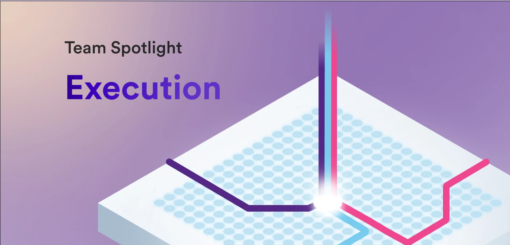

**Welcome to edition of the developer blog's team spotlight series! For this issue, we met with members from the Execution team to get insight into how the ICP's execution environment works and how it fits within the ICP technology stack. Let's start with our usual introduction, what is the purpose of the Execution team?**

*The team’s mission can be summarized as “managing the lifecycle and providing efficient execution of canisters”. We contribute to the system APIs that canisters can use to run on ICP and interact with other canisters as well as scheduling of messages and cycles accounting.*

**What is the composition of the Execution team?**

*The team consists of 5 engineers: Alexandra, Dimitris, Dragoljub, Islam, Maksym and 1 researcher: Bogdan. All team members are based in Switzerland.*

**Let's dive a bit into how execution on ICP works. On a fundamental level, what is ICP’s execution environment? What happens in it?**

*The execution environment is responsible for processing messages (either from users or canisters), keeping track of cycles for canisters and updating their state after message execution completes.*

**Could you explain how the [execution layer](https://learn.internetcomputer.org/hc/en-us/articles/34208985618836-Execution-Layer) fits into the ICP stack?**

*The execution layer is the top layer of the core ICP stack. It’s part of what we call the “replicated state machine” which additionally includes [message routing](https://learn.internetcomputer.org/hc/en-us/articles/34208241927316-Message-Routing). Messages are delivered in batches through [consensus](https://learn.internetcomputer.org/hc/en-us/articles/34207558615956-Consensus) to message routing and the execution environment is responsible for processing them.*

**What is the process of an execution round on ICP?**

*An execution round proceeds in several phases.*

*During the preparation phase, some cleanup/bookkeeping tasks are performed, including figuring out which canisters are long-running (i.e. require DTS execution) and purging expired ingress messages from canister queues.*

*In the next phase messages to the management canister are processed. Following that the main execution phase begins where the scheduling algorithm will assign canisters to different cores to execute and will start processing as many messages as possible within the round.*

*The finalization phase includes some cleanup/bookkeeping tasks, including charging canisters for resources, pruning messages from ingress history, processing stopping canisters, updating some metrics and checking various invariants about the state of the system.*

**Thank you for that description! I think that is very insightful for developers to understand what's happening behind the scenes. How do developers interact with the execution layer through canisters?**

*Developers interact with the execution environment through two sets of APIs: the first is a synchronous one, often called the system API. This is analogous to system calls on a regular operating system. The second class is the API provided by the management canister which is asynchronous and is very similar to interacting with any other canister on ICP – this API allows canisters to manage other canisters as well as get access to some of the special features of ICP, including t-ECDSA and HTTPS outcalls.*

**How does the Execution team work with other teams?**

*The Execution team works with several other teams within DFINITY. We work pretty closely with the Runtime team who contribute to the lower level Wasm execution engine of ICP, the Message Routing team who are responsible for routing of messages to the appropriate subnet for execution and state management as well as the SDK and Languages teams to expose the APIs provided by the execution environment to the developers.*

**How does the ICP execution environment differ from other forms of execution environments?**

*Two major differences of ICP’s execution environment are:*

*1. Orthogonal persistence which allows canisters to transparently persist data that lives on their heap.*

*2. Reverse gas model which makes canisters pay for the actions they take and resource usage, freeing end users from the need of dealing with cycles themselves.*

**What’s the biggest challenge the team has faced?**

*One of the biggest challenges for the team is the constant struggle to prioritize all the features and requests we receive to add or improve things on ICP. It’s a good problem to have and we’re glad that through some of the discussions with developers on the forum or ICP.Lab sessions we have managed to identify some of the most important things to tackle and adjusted our priorities to match this feedback.*

**Have there been any improvements made as a direct result of node provider or developer feedback?**

*Many of the features the team has worked on or is currently working on have come from direct feedback from developers. Latest examples include canister timers as a more efficient solution compared to heartbeats, the work on large Wasm installations which is ongoing as well as improvements to the stable structures library that allows canisters to use stable memory efficiently.*

**What is the primary project that the Execution team is working on or focused on currently?**

*The team is focusing on [scalability](https://learn.internetcomputer.org/hc/en-us/articles/34576974172692-Evolution-Scaling)/performance and developer experience at the moment. As part of that effort we are contributing to the following projects:*

- *Supporting 100k+ canisters on a subnet. This will help use cases like OpenChat and HotOrNot scale to the number of canisters they need without sacrificing on the benefits of staying in a single subnet.*

- *Improvements to stable structures, the main one being the removal of bounds on keys/values of a StableBTreeMap.*

- *Allowing to install large Wasm modules which will unblock new CDKs in Python and Azle.*

**Those projects sound extremely exciting and beneficial to the ICP dev community, especially unblocking new CDKs for Python and Azle! Where should developers look for the latest Execution updates?**

*We typically post updates of our work on the developer forum and give presentations about features/recent work in Global R&D meetings.*

**What is one feature or aspect of the ICP execution environment that the team is the most proud of?**

*We believe that Orthogonal Persistence is one of the coolest features of ICP and a key differentiator from other Web3 platforms or blockchains. It allows developers to truly focus on their business logic when writing canisters and avoid thinking about state management for the most part.*

**To wrap things up, what makes the Execution team unique compared to some of the other dev teams at DFINITY?**

*Compared to other teams, the execution team is interfacing a lot with developers given our work on the APIs that canisters have access to. In a sense, we act as a bridge between the core protocol and the user facing aspects of ICP.*

**A huge thank you to the Execution team for chatting with us today and providing a great look into what the Execution team is up to! Be sure to check in next time another team spotlight!**

-DFINITY
