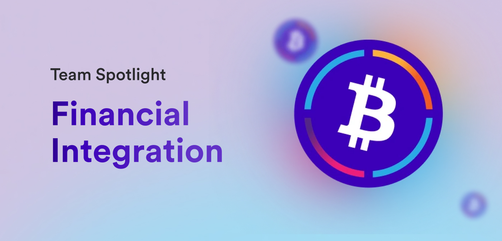

Hello ICP developers and welcome to another DFINITY team spotlight! For this spotlight showcase, we're going to dive into the financial integration team, also known as the team behind the development of ICP ledgers and token standards. With all of the recent ICRC and ckBTC developments, and the upcoming ckETH feature, now is the perfect time to get to know the FI team! Let's get started!

**To dive right in, what is the purpose of the Financial Integration team?**

*The Financial Integration team contributes to ICP as follows:*

- *The development of the Ledgers and the standards around fungible tokens.*

- *Onchain integration with other blockchains (e.g., Bitcoin and Ethereum).*

- *Off-chain integration, such as integration with Binance, Coinbase, and many other financial tools.*

**What is the composition of the Financial Integration team?**

*The team is composed of 5 developers and 1 researcher.*

**Tokens and tokenomics are are essential concepts for blockchains. On a fundamental level, what role do tokens and tokenomics play on ICP?**

*The [Internet Computer](https://learn.internetcomputer.org/hc/en-us/articles/33152818663444-What-is-ICP)'s utility token is ICP, named after the Internet Computer Protocol. This utility token is used for several functions within the network, such as staking to participate in the governance of the network, for getting cycles powering canister smart contracts, or the protocol rewards independent node providers (NPs) with newly minted ICP tokens for having their sovereign nodes contribute to the protocol.  There are various other tokens that the community has created or governance tokens that were created in the process of decentralizing dapps by means of SNSes. Similar to the ICP token, SNS communities use SNS tokens to govern their dapp in a decentralized fashion.*

**Could you explain the difference between ICP, an ICRC token, and an ICRC-1 token? When would developers use one over another?**

*The Internet Computer has two key canisters for managing tokens: the ICP Ledger and the ICRC Ledgers. The ICP Ledger primarily handles the ICP token, while the ICRC Ledgers manage various fungible tokens like ckBTC, ckEth, SNSes, etc., using the ICRC-1 fungible token standard. ICRC-1 provides a common standard for fungible tokens and addresses the need for uniformity, as various non-compatible interfaces had emerged alongside the ICP Ledger. To create this standard, a community working group was formed, resulting in the ICRC-1 Fungible Token Standard.*

*Following ICRC-1, ICRC-2 was introduced to enhance the standard by incorporating "approve" and "transfer_from" operations, akin to Ethereum's ERC-20 standard. This change makes ICRC-2 Ledgers more familiar to those coming from the Ethereum ecosystem. Looking ahead, ICRC-3 is in development and will extend ICRC-1 by allowing the download and verification of Ledger blocks.*

*The ICRC Ledger is designed to implement ICRC-1, ICRC-2, and ICRC-3, providing a comprehensive solution for token management. In contrast, the ICP Ledger supports ICRC-1 and ICRC-2 but cannot accommodate ICRC-3 due to fundamental differences in how it stores accounts. This standardization effort aims to streamline token interfaces on ICP and enhance interoperability while catering to different user needs and backgrounds.*

**Thank you for that detailed explanation, I think that's extremely insightful for our developers and community to know the history behind the different tokens and their standards. Could you talk a bit about the ICP ledger, and how is it different from the ICRC ledger?**

*There are two noteworthy differences:*

1. *Accounts vs AccountIdentifier: The main one is the way accounts are stored in the Ledgers. Accounts can hold tokens on the Ledger and they are represented by a Principal, which is the owner of the account, and an optional subaccount. Subaccounts allow a Principal to own multiple Accounts on a Ledger.*

*On the ICP Ledger, Accounts are obfuscated to prevent linking the owner with them. The obfuscated version of Account is called AccountIdentifier and is the hash of the Account together with the subaccount information.*

*On the ICRC Ledgers, Accounts are not obfuscated so the link between the principal and the accounts that it controls is in clear.*

2. *Standards supported and additional API: The ICRC Ledger will support all the ICRC fungible token standards (ICRC-1, ICRC-2 and ICRC-3) together with some utility endpoints. The ICP Ledger supports only ICRC-1 and ICRC-2 as discussed above but has a lot of legacy endpoints.*

**In addition to tokens using the ICRC standards, ICP also supports 'twin tokens', or 'ck' tokens. What are ‘ck’ tokens, like ckBTC or ckETH?**

*Chain-Key (ck) tokens are a family of twin tokens 1:1-backed by the original token on the original chain and fully automated via canisters. A twin token is “twin to” a token from another chain, e.g. ckBTC is the twin token of BTC and ckETH is the twin token of ETH.*

*Ck tokens are safer than traditional wrapped tokens (e.g., soBTC) because they are fully automated, don’t rely on any central entity or multi-sig setup, and the canisters running the code are under NNS control.*

*Ck tokens are also much faster and cheaper than the counterparts on other chains. For instance, ckBTC makes it possible to use BTC for small payments because the transaction time is a few seconds and the transaction fee is negligible. Another important point is that, by design, the fee is paid directly in the token, you don’t have to worry about having another token to pay for gas, it’s a huge improvement in terms of UX.*

**How do tokens like ckBTC or ckETH fit into the ecosystem? What makes them groundbreaking for developers?**

*Ck tokens allow using existing assets such as BTC and ETH on ICP. The conversion from the original token to the ck counterpart is easy.*

*What makes ck tokens groundbreaking is a combination of two properties:*

- *The tokens run at the speed and with the fee of tokens on ICP. Transferring ckBTC is much faster and cheaper than transferring BTC to the point where BTC can be used for daily transactions, such as paying for a coffee.*

- *Ck tokens are converted from and to the original tokens via a smart contract controlled by a DAO.*

**How do tokens on ICP differ from how other chains use or create tokens?**

*As said previously, cheap, no need to have another token to pay for gas, allows you to port your token to whole new way of using them as the Internet Computer’s capabilities are unique.*

**Let's transition to talking a bit more about the team itself. How does the Financial integration team work with other teams?**

*We collaborate with most teams at the application level, such as the NNS team and the GIX team. Our canisters are used in the NNS and SNSes; the frontend developed by the GIX team uses our canisters as backends.*

**What’s the biggest challenge the team has faced?**

*The proliferation of standards on ICP and the creation of a common fungible token standard known as ICRC-1.*

**Have there been any improvements made as a direct result of developer feedback?**

*Plenty of improvements have been made as a result of developer feedback. We also created a working group to meet with the community about improvements and feedback.*

**Let's talk about the team's current focus and road map. What is the primary project that the team is working on or focused on currently?**

*ckETH, cycles-ledger, ICRC-2 and ICRC-3.*

**What are the primary components of this project?**

*The Ledger.*

**What are the primary benefits of this project?**

- *Ck tokens for Ethereum tokens.*

- *A Ledger for cycles allowing users to hold cycles.*

- *ICRC-2 for a better flow with all Ledgers.*

- *ICRC-3 to retrieve the blocks from a Ledger.*

**When can we expect the project to be completed?**

*Sometime soon. The team is focusing on scalability, performance and developer experience at the moment.*

**Where should developers look for the latest updates from the team?**

*The [ICRC] working group and the forum.*

**What makes the Financial Integration team unique compared to some of the other dev teams at DFINITY?**

*Our focus [is] on off-chain, onchain and cross-chain integration.*

Thanks so much for tuning into this week's team spotlight, and a huge thank you to the Financial Integration team for taking the time to sit down with us for this interview!

We'll see you all next time!

-DFINITY

