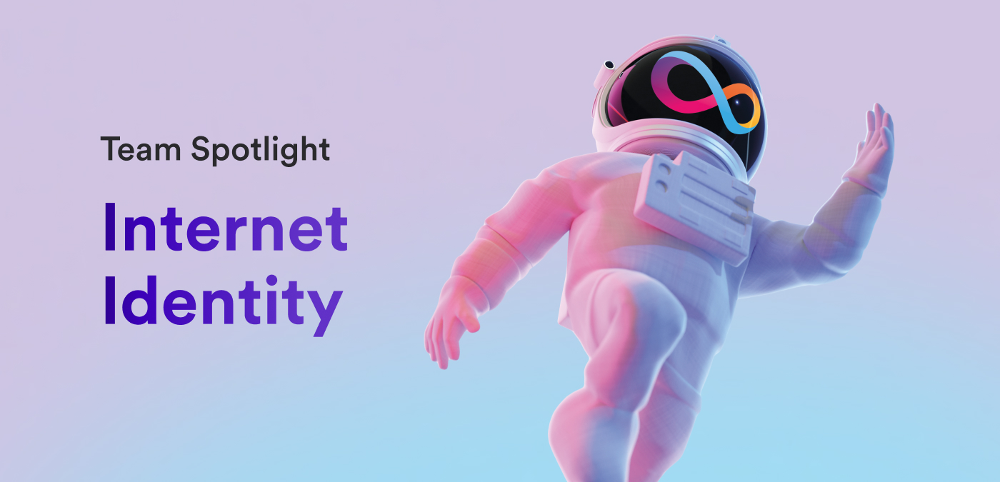

Greetings developers! Welcome to this installment of team spotlight. This week, we have a very exciting team to dive into: the Internet Identity team! As the team behind developing one of the most cutting-edge tools for digital identities, their mission and focus is a personal favorite. Without further ado, let's get started!

**To get started, what is the mission of the Internet Identity team?**

*The II team is responsible for the implementation, refinement and maintenance of the II protocol and UI. Additionally, we are also tasked with the continuous evolution of II and we work with all of the internal and external stakeholders in order to promote the use of II in the ICP ecosystem and beyond. As part of our mission, we constantly improve the core user experience by taking a standards-based approach to engage with the broader community and conduct outreach by talking to dapp teams that are heavy users of II, giving presentations, and organizing workshops.*

**What is the composition of the Internet Identity team?**

*The team consists of 4 engineers, Nicolas, Frederik and Bartosz and David, our product manager, Mary and our UI designer Artem.*

**Other than Internet Identity, are there any other products or features that the team contributes to?**

*The Internet Identity team leads the [Identity & Wallet Standards Working Group](https://github.com/dfinity/wg-identity-authentication), which works towards the development and adoption of ICRC standards related to identity and wallets on the Internet Computer. We are currently collaborating with [AirGap](https://airgap.it/) on [RFP-7](https://forum.dfinity.org/t/assigned-rfp-7-wallet-standard-reference-implementation/20024), a standardized consent message interface for wallets on ICP.*

**Those collaborations sound very exciting, I'm eager to see the result of those! How does Internet Identity compare to cryptowallets and other forms of digital identity? What makes it unique?**

*Internet Identity offers a convenient and secure way to sign into dapps, while being fully onchain. It is not a classical crypto wallet, as it does not offer a transaction signing flow (yet). It is more comparable to a classical Web 2.0 login, such as sing-in with Google, Facebook, etc. The main strengths of II are its ease of use and high security, while not burdening the user with key management and other Web 3.0 complexities.*

**I think that is a great way to describe the difference between II and other forms of digital identities. What’s the biggest challenge the team has faced with developing Internet Identity?**

*We are a small team, which enables us to release changes and respond to feedback frequently, but [that] also comes with limitations. It’s been really rewarding to be able to deliver so much with such a small team.*

**How has the team handled or responded to developer onboarding friction or difficulties using Internet Identity?**

*We have created a [special dev build](https://github.com/dfinity/internet-identity#flavors) of Internet Identity that makes working with II in a local dev environment very easy. In addition, we have created a [step-by-step example](https://github.com/dfinity/examples/tree/master/motoko/internet_identity_integration) showcasing how to use the dev build. In the future we also plan to support the `dfx deps` command.*

**It's great to hear that improvements have been made to assist with onboarding friction. Are there any improvements have been made as a direct result of developer feedback?**

- *Improved Developer Experience: After the Motoko bootcamps last year, Nicolas and Frederick gathered feedback from Seb Thuillier about the experience of setting up II locally. Using the feedback, Frederick and Nicolas updated the II developer docs so that developers could avoid rebuilding II from scratch.*

- *Connecting users to dapps that integrate with Internet Identity via the dapps explorer: When you connect to Internet Identity, you’ll see a list of integrated dapps, which provides valuable exposure to ecosystem projects and meaningful CTAs for users. If a project wants to see its dapp on the dapp explorer, it can submit a [PR here.](https://github.com/dfinity/portal#showcase-submission-guidelines)*

- *Onboarding to Internet Identity in three simple steps (was previously 10): dapps that rely on Internet Identity to onboard and authenticate new users requested that we simplify the process of creating an Internet Identity. We reduced the number of steps necessary to create an Internet Identity to three instead of 10, which should make onboarding users to dapps easier.*

**Those are some incredible improvements, and I'm sure our dev community has benefited greatly from them! What is the primary project that the Internet Identity team is working on or focused on currently?**

*Right now we are focused on the following projects:*

- *Verifiable Credentials aka Attribute Sharing: this means that through the use of cryptographic protocols, different applications running on ICP will be able to share user attributes between each other in a manner that is both secure and privacy-preserving.*

- *Non-passkey authentication: this means that for users where the use of passkeys is not an option (e.g., iPhone users without an iCloud account), we are offering an alternative authentication mechanism.*

- *Generative-based II logos for each Principal: we have redesigned the II logo and each Internet Identity Principal will now have its own individualized and generative-based logo!*

**I personally love the idea of generative-based II logos, I think that'll be a great UI update! Where should developers look for the latest Internet Identity updates?**

*Developers can look to the forum for the latest Internet Identity updates.*

**What are some of the major roadmap items planned for the future of the Internet Identity?**

- *Supporting the ICRC-21 standard: [forum post](https://forum.dfinity.org/t/assigned-rfp-7-wallet-standard-reference-implementation/20024).*
- *Integrating WalletConnect v2 standard.*

**What is one feature or aspect of Internet Identity that the team is the most proud of?**

*One of the coolest features of II is the fact that it is fully onchain while still offering secure and privacy preserving authentication that is actually easy and convenient to use. Having all these benefits combined in one single product is something we’re really proud of and that is unique to the Web 3.0 ecosystem.*

**This has been incredibly educational and insightful into the II team! To wrap this up, what makes the Internet Identity team unique compared to some of the other dev teams at DFINITY?**

*The Internet Identity team is one of the few teams at DFINITY that develops a user-facing product as well as APIs for ecosystem developers to use and build with.*

That'll finish off this week's issue of team spotlight! We got some great information about the future of Internet Identity, and I hope everyone is as excited for the roadmap items as I am!

We'll see everyone next time!

-DFINITY
