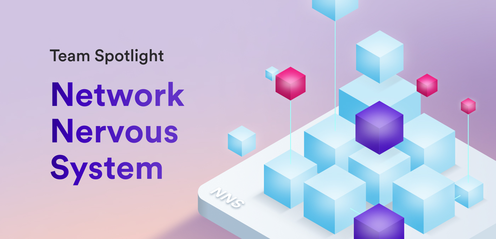

Hello devs and welcome to a new blog post series: team spotlight!

Every two weeks, we're going to be showcasing one of the DFINITY teams to learn what they're working on and dive deeper into how the team fits into the ICP ecosystem. Through this new series, developers will get updates and insight into teams other than the SDK and Motoko teams, which are regularly covered on this blog through the 'Developer weekly update' series.

For the first installment of this series, we sat down with the Network Nervous System team to learn more about the NNS, the SNS initiative, and the current goals the team is focused on.

**To get started, let's first dive into the focus and purpose of the NNS team. What would you say the mission of the NNS team is?**

*NNS stands for Network Nervous System. The NNS is the DAO (decentralized autonomous organization) that governs and coordinates the full Internet Computer Protocol. It coordinates, for example, how nodes are assigned to subnets and how the Internet Computer Protocol is updated to new versions.*
*So, as the name suggests, the main mission of the NNS team is to contribute to the design, implementation, and maintenance of the NNS DAO. In addition to this, the NNS team is a key contributor to the design and implementation of the Service Nervous System (SNS), which is a DAO framework provided by ICP that allows individual applications to decentralize their governance.*

**The NNS team has quite the responsibility to manage and contribute to, what an exciting team to be a part of! What is the composition of the NNS team?**

*The team consists of 6 engineers, 1 engineering manager, and 2 researchers spread across Switzerland and USA.*

**What products or features on ICP are the primary focus of the NNS team?**

*There are two main products that the NNS team works on:*

*- The NNS DAO*

*- The SNS DAO framework, which consists of the SNS DAO and the SNS launchpad which is used to launch an SNS.*

**Since we've gotten an overview of the NNS DAO already, so let's talk a bit more about the SNS initiative. Could you give a brief overview of what the NNS team is responsible for in regards to the SNS initiative?**

*The NNS team is one of the main contributors of the SNS initiative. We helped build and contribute to maintaining the SNS Swap canister which is responsible for collecting initial funding and decentralizing the SNS during the launch. We are also the main responsible team for maintaining:*

*- The SNS Governance canister, responsible for making the decisions in the DAO.*

*- The SNS Root canister, which is responsible for upgrading other canisters.*

*- The NNS canister called “SNS Wasm modules canister” that is responsible for deploying and involved in upgrading the SNS canisters.*

**Does the NNS DAO have a role that it plays in the SNS initiative and the launching of new SNSes?**

*The NNS DAO approves and initiates the launch of new SNSes. This means that if someone wants to hand over a dapp’s control to a new SNS, then this process needs approval from the NNS community. You can read more details about this process [here](/building-apps/governing-apps/launching/launch-summary-1proposal).*

**Let's talk about the team's roadmap. What is the primary project that the NNS team is working on or focused on currently?**

*We usually work on different projects in parallel (combining NNS and SNS features). One project that we currently work on is making the SNS launch process more user friendly. At the moment, launching an SNS includes 2 NNS proposals and quite some manual steps from the developer team that is handing over their dapp to a new SNS.*

*As the name suggests, once the  “1-proposal” feature is implemented, this full process will be done in one single NNS proposal. This means that there is one NNS proposal where the ICP community decides whether an SNS should be launched for a given dapp and if this proposal is adopted the full SNS launch is triggered and executed automatically.*

**That sounds like it will drastically improve the SNS launch process! Could you give some insight into what pieces or components are being developed to achieve this goal?**

*Changing this process requires changing multiple components, including the NNS governance to introduce the new proposal and the SNS Wasm modules canister which coordinates the deployment of the SNS canisters.*

**We briefly touched on the benefits of this project, but are there any additional benefits to introducing the "1-proposal" feature?**

*It will tremendously simplify the SNS launch flow for developers who want to hand over their dapp to an SNS. Moreover, it will simplify the process for the NNS community who now only have to understand and verify one NNS proposal to make a decision for whether an SNS should be launched.*

**Are there any other major roadmap items currently planned for the NNS team?**

*It’s hard to talk about specific features as the environment we operate in is a bit dynamic. Instead, here are the high level goals we have:*

*- On the NNS side, our focus is on increasing governance participation, new node onboarding, and growth of the Internet Computer.*

*- For SNS, the focus is on improving the project experience when launching an SNS, improving the DAO member experience once an SNS is launched, and extending the framework to support 10x projects.*

**For developers who want to stay up to date with the latest NNS team updates, where should they be looking?**

*We publish regular updates for proposals submitted for both the NNS and the SNS canisters on the official DFINITY forum. There users can stay up to date with upcoming API changes and new functionality that we are working on. [Here](https://forum.dfinity.org/t/nns-updates-june-12-2023/20670) is an example forum post.*

*We use the forum to discuss feature ideas and designs with the community. All our major features start with a forum post followed by a discussion. [Here](https://forum.dfinity.org/t/enhancement-of-the-sns-launch-process-one-proposal/19548) is the forum post for the 1-proposal feature mentioned above.*

**What are some features or aspects of the NNS DAO or the SNS initiative that the team is the most proud of?**

*The NNS is one of the most evolved DAOs that exists. A major advantage that it has compared to other DAOs is that the execution of proposals happens fully on chain and that a proposal can trigger any method on any canister - this allows for endless possibilities regarding which decisions can now be made by a whole community and executed fully automatically!*

*The NNS DAO has been running for more than a year with hundreds of proposals!*

*The SNS framework that we helped build has already allowed 2 projects to launch an SNS DAO. This is pretty exciting and we are looking forward to seeing what other projects will follow!*

**That's incredible, definitely something to be extremely proud of! To close out our spotlight interview, we've got one more question. What makes the NNS team unique compared to some of the other dev teams at DFINITY?**

*We are a pretty “new” team - many team members joined in the last year. The engineers in our team are spread pretty evenly between the US and CH.*

Thank you so much to the NNS team for sitting down with us and diving into all things NNS! We hope that you learned as much as we did. Be sure to check in later in the month for another team spotlight blog post!

-DFINITY
