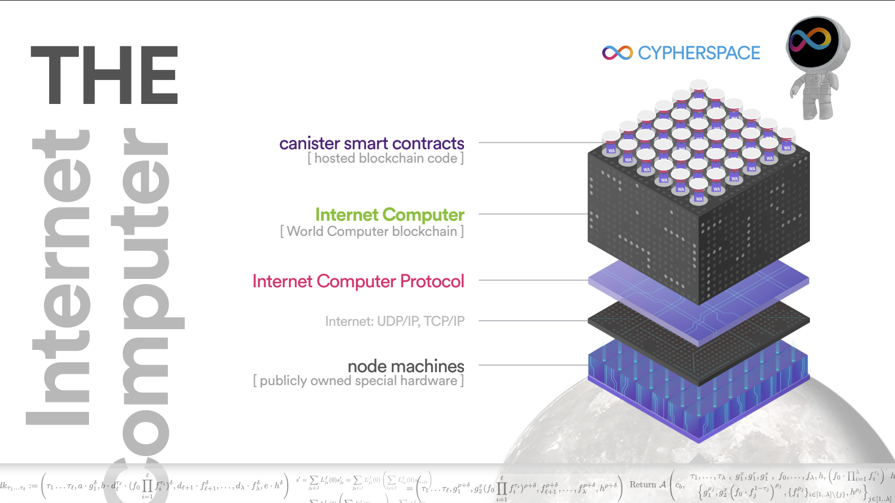

Hello everyone! It's time for another issue of team spotlight. 
For this edition, we interviewed the Node team to learn more about the core technology of the Internet Computer. 
The Node team is an extremely vital contributor to the Internet Computer, since they are responsible for the very foundation of ICP: nodes. I hope you're as excited as we are to learn more! 

**To kick things off, let's start with our usual introduction. What is the mission of the Node team?**

*Our mission is to enable the Internet Computer protocol to run on distributed, private infrastructure, all over the world. 
We define the hardware standards for the hundreds of nodes that make up the Internet Computer network. 
We build and maintain the software used in the decentralized onboarding process, enabling node providers from all over the world to onboard nodes after gaining approval via the NNS DAO. We build and maintain the software running environment for the many ICP services that run on node machines. We oversee the node lifecycle, from onboarding to self-upgrading to security.*

**It sounds like the Node team has an enormous amount of responsibilities, essentially being the foundation of ICP. What is the composition of the Node team?**

*The team consists of 4 engineers, 2 researchers, and 1 engineering manager, spread across the United States, Canada, Switzerland and Germany!*

**Could you give us a brief overview of what the IC-OS is?**

*IC-OS is an umbrella term for all [of] the operating systems within ICP, including:*

- *SetupOS (AKA the IC-OS installer), which deploys a new replica node (by installing HostOS and GuestOS).*

- *HostOS, which runs on the bare metal of a replica node machine. HostOS runs GuestOS in a virtual machine.*

- *GuestOS, which runs inside a virtual machine. The replica is executed within the GuestOS.*

- *BoundaryOSes, which includes Boundary-GuestOS, Boundary-Api-GuestOS.*

*Readers should view the IC-OS folder in the IC repo where our operating systems reside: https://github.com/dfinity/ic/tree/master/ic-os*

*Here is a high-level overview of all the services running on a replica node:*

**Within DFINITY, there is the Node team, and there is a Boundary Node team. How does the Node team differ from the Boundary Node team?**

*The node team maintains the replicaOSes (SetupOS, HostOS, GuestOS). These OSes run on replica nodes. The Boundary Node team maintains the BoundaryOSes (Boundary-GuestOS, Boundary-Api-GuestOS). These OSes run on boundary nodes.*

**Node providers are an extremely important component of ICP. How does the Node team support node providers?**

*The node team supports node providers during the onboarding procedure (IC-OS installation), but one of our team priorities is to make the Node Provider onboarding procedure as simple and decentralized as possible so that the Node Team and DFINITY are not a necessary part of the onboarding process.*

**With so many responsibilities, and such an important team initiative, I can imagine that there are several challenges that the team faces. What would you say is the biggest challenge the team has faced so far?**

*Keeping up with dozens of new features that require our assistance while managing our normal workload. There’s always more work to be done!*

**With consistent upgrades and changes to the IC-OS software, how does the Node team contribute to the lifecycle of nodes?**

*GuestOS and HostOS are both self-upgrading. Each OS has a mechanism to write to a passive partition set and reboot into its passive partition set, thereby upgrading itself (and making the passive partition set its active partition set). “Replica upgrades” are really GuestOS upgrades, as not only the replica is upgraded, but also the entire GuestOS and GuestOS binaries (including the replica).*

*Since launch, over 100 GuestOS upgrades we completed, and we are planning to submit a proposal for the first ever HostOS upgrade very soon.*

*To learn more about the upgrade procedure, see here: https://github.com/dfinity/ic/blob/master/ic-os/docs/Upgrades.adoc*

**Does the Node team interact with or make decisions regarding node hardware?**

*Yes, the Node Team is responsible for defining and validating the node machine hardware specifications. When validating hardware, the node team has three main criteria:*

*1. Performance. Node machines must be fast enough to support the high-performance apps that run on ICP.*

*2. Storage. Node machines must be sufficiently large enough to provide low-cost storage.*

*3. SEV-SNP. The latest hardware generation (gen2 hardware) requires SEV-SNP support via one of the latest AMD CPUs. To learn about the full hardware specs, see: https://wiki.internetcomputer.org/wiki/Node_Provider_Machine_Hardware_Guide*

**Have there been any improvements made as a direct result of node provider feedback?**

*Absolutely. The Node team is constantly receiving feedback from node providers about the onboarding procedure, and we use this feedback to improve our processes and documentation. All Node Providers are encouraged to join the Node Provider matrix channel to share any feedback or suggestions with DFINITY and the community: https://wiki.internetcomputer.org/wiki/Node_Provider_Matrix_channel*

**That's incredible to hear that node providers frequently help provide meaningful feedback.**

**Switching focus, what is the primary project that the Node team is working on or focused on currently?**

*SEV-SNP protected replica nodes.*

**What are the primary components required for completion of SEV-SNP protected replica nodes?**

*SEV-SNP is a hardware-based security feature built into new AMD processors. Enabling SEV-SNP protected virtual machines requires designing and implementing a great deal of new software infrastructure.*

**What are the benefits of SEV-SNP replica nodes?**

*SEV-SNP protected replica nodes will provide a much greater level of security for the entire ICP by making sure that only NNS-blessed GuestOS images are running and encrypting the memory with a tamper-proof hardware-based security feature.*

**It sounds like an extremely rewarding project! When can developers and users expect it to be completed?**

*SEV-SNP enabled replica nodes are planned to be rolled out by early 2024.*

**Where should developers look for the latest Node updates? (Forum, Discord, etc).**
 
*Updates will be posted to the developer forum!*

**What is one feature or aspect of IC-OS that the team is the most proud of?**

*In the 100+ upgrades in the history of ICP, not a single one has caused an ICP outage.*

**That is definitely something to be proud of! That really showcases the efficiency and reliability of the node team.**

**To wrap things up, what makes the Node team unique compared to some of the other dev teams at DFINITY? **

*We have to concern ourselves with the entire ICP stack: the canister smart contracts, the Internet Computer protocol and its running environment, the networking infrastructure, and the node machines themselves!*

Thank you to the DFINITY Node team for sitting down with us today and providing such educational and insightful information! I hope everyone reading has enjoyed this interview as much as we have; it was great to learn so much!

Until next time!

-DFINITY
