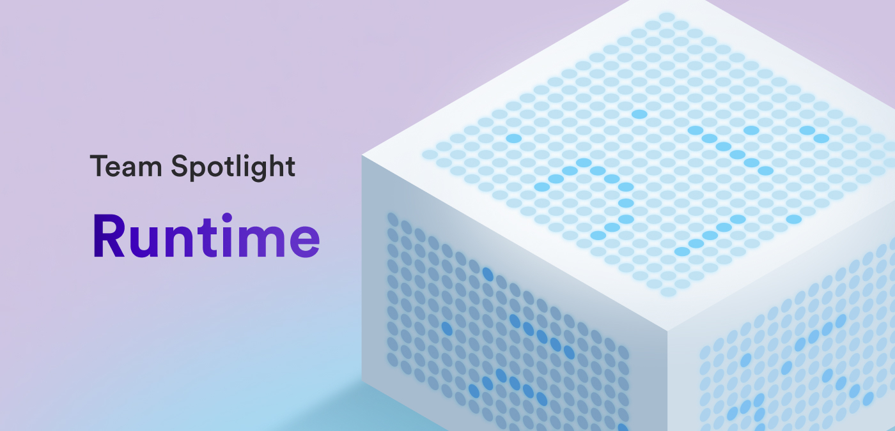

Hello developers and welcome to the second installment of the dev blog's new series team spotlight! This week, we sat down with the Runtime team to dig deeper into the team's role on ICP, their current roadmap, plus some of the features and improvements they've developed in response of direct developer feedback. 

**Let's get started. To kick things off, could you describe the mission of the Runtime team?**

*Our mission is “secure and efficient runtime for smart contracts”. In computer science, the word “runtime” refers to an environment in which programs run. The [Internet Computer](https://learn.internetcomputer.org/hc/en-us/articles/33152818663444-What-is-ICP) runs smart contracts using WebAssembly, which is one of the strengths of ICP as a blockchain because WebAssembly is an open standard that supports a wide range of programming languages. Our team strives to enhance the security and performance of WebAssembly execution and everything related to it.*

**I think that's a great way to describe the team's mission! What an insightful explanation. What is the composition of the Runtime team?**

*The team consists of four software engineers: Adam, Andriy, Maciej, Ulan and two researchers: Alex and Stefan.*

**What product or feature on ICP is the primary focus of the Runtime team?**

*The main focus is WebAssembly execution and everything around it. Most of our projects are about optimizing performance, memory usage and improving security. We also work on more developer-facing features like timers, performance counter, and composite queries.*

**Could you give a brief overview of how the ICP runtime environment is structured and how it operates?**

*The runtime environment is part of the more general execution environment of ICP. The execution environment receives messages from the [message routing](https://learn.internetcomputer.org/hc/en-us/articles/34208241927316-Message-Routing) layer of ICP. The scheduler in the execution environment decides which messages to run. Each message specifies the target WebAssembly method of the target canister that needs to be invoked in order to process the message. That information is passed to the runtime environment, whose job is to execute the requested WebAssembly method and return the result along with the state changes of the canister.*

*WebAssembly execution happens inside a canister sandbox process. This is an example of improving security, because it protects the system and other canisters against bugs in the WebAssembly runtime that may be exploited by a malicious canister.*

*There are a few interesting problems related to WebAssembly execution that the runtime environment solves:*

*- How to ensure that execution terminates?*

*- How much to charge for execution?*

*- How to keep track of changes in the canister state and memory?*

**Thank you for such a detailed summary, and I really appreciate the inclusion of some of the problems regarding WebAssembly that the runtime environment solves. I think this insight into these specific problems is very educational and beneficial to be aware of!**

**What’s the biggest challenge the team has faced with developing the ICP runtime environment?**

*One of the largest projects so far was deterministic time slicing. The idea is to suspend and resume WebAssembly execution such that canisters can do long-running computations without reducing the block rate of the blockchain.*

**Switching focus a bit, let's talk about developers and their experience with the runtime environment. Have any improvements or features been made as a direct result of developer feedback?**

*Yes, there are many such features:*

*- Canister timers allow canisters to schedule jobs.*

*- Composite queries allow canisters to call other queries while handling a query.*

*- Deterministic time slicing allows longer and more complex computations.*

*- Performance counter allows the developer to profile canister code.*

*- Wasm-native stable memory improves performance of the stable memory.*

*- Wasm compilation cache speeds up canister upgrades in dapps that have thousands of canisters such as Open Chat and Hot-or-Not.*

**What is the primary project that the Runtime team is working on or focused on currently?**

*Right now we are finishing three large projects:*

*- File-based page allocator enables doubling the number of query threads. This means that ICP canisters can handle more queries concurrently at peak loads.*

*- Wasm-native stable memory improves performance of the stable memory. This means that developers can move the data from small Wasm memory to a much larger and safer stable memory.*

*- Composite queries allow canisters to call other queries while handling a query. This simplifies development of multi-canister dapps.*

**Those sound like some incredible projects that I'm sure developers are quite excited for the release of! Where should developers look for the latest updates on these Runtime projects?**

*We announce new projects in the forum and also present at the Public Global R&D events.*

**In addition to these projects, are there any other major roadmap items planned?**

*We have the following items in our roadmap:*

*- New WebAssembly instrumentation. We expect huge performance improvements from this project in some compute heavy workloads such as interpreters and databases. Stay tuned for the forum post.*

*- Supporting large WebAssembly binaries. This feature will allow users to install larger WebAssembly binaries. Stay tuned for the forum post.*

*- Query statistics aggregation: [forum post.](https://forum.dfinity.org/t/community-consideration-explore-query-charging/19247/24?u=ulan)*

*- Configurable WebAssembly heap limit: [forum post.](https://forum.dfinity.org/t/proposal-configurable-wasm-heap-limit/17794)*

*- Canister Lifecycle hooks: [forum post.](https://forum.dfinity.org/t/canister-lifecycle-hooks/17089)*

**What is one feature or aspect of the runtime that the team is the most proud of?**

*If we have to choose one, then it is probably WebAssembly itself. It is an amazing technology that’s gaining wide adoption. WebAssembly is an open standard that was designed to be secure, safe, and fast. Right now ICP supports only two programming languages at the production level: Motoko and Rust. Folks from Demergent Labs are working on bringing TypeScript and Python to ICP. There are many more languages that compile to WebAssembly. If the community or DFINITY would provide high-quality CDKs for the most popular languages, then we would reach the full potential of WebAssembly.*

**This has been incredibly informative on the Runtime team and their developments on the runtime environment, thank you for such educational answers! To wrap things up, what would you say makes the Runtime team unique compared to some of the other dev teams at DFINITY?**

*Compared to other teams we probably work closer to the hardware. Sometimes we read and debug WebAssembly and x64 assembly code.*

Thank you to the Runtime team for sitting down with us and giving some great insight into the team! That'll wrap up this issue of team spotlight, be sure to check in again in two weeks for the next installment that'll dive into Internet Identity! 

-DFINITY
