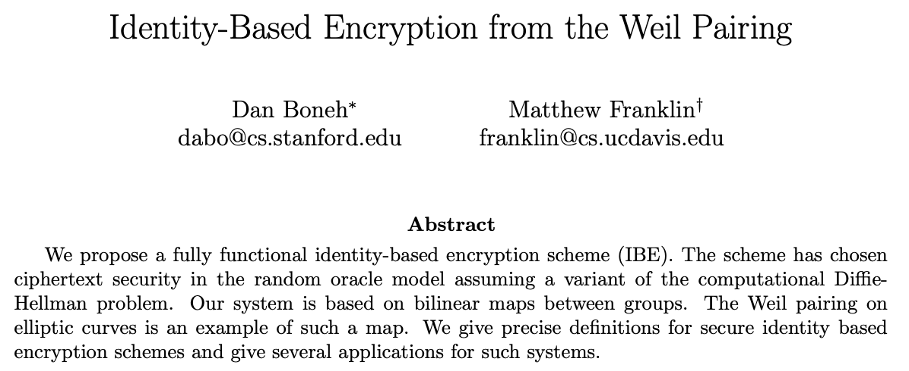
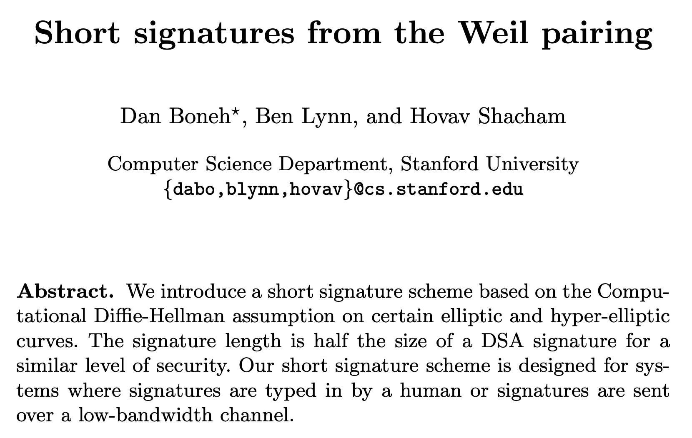

# VETKD Primer

**VETKD** is a feature in ongoing development on the Internet Computer. It stands for ‘verifiably encrypted threshold key derivation’ and we read it as ‘vet-kay-dee.’ One thing less discussed about the VETKD feature is how we got here in terms of cryptography. The goal of this post is to lay some crypto background so that you can better understand the VETKD talks, paper, and future posts. Let’s start at the start. 

## Crypto primitives
In cryptography, a ‘primitive’ is a kind of foundational building block that can be used solely for its given functionality, or to build other more complex cryptographic tools and protocols. Block ciphers, hash functions, signature schemes, encryption schemes… are all examples of primitives. VETKD is a new primitive that we are introducing. VETKD extends an earlier primitive called identity based encryption, which itself is an extension of public key encryption.

## Identity based encryption (IBE)
As many things in cryptography, IBE was introduced by Adi Shamir [Shamir84]. Providing a concrete instantiation remained an open problem from 1984 to 2001, when two were proposed, based on differnet hard problems. Here we will focus on the IBE introduced by Dan Boneh and Matthew Franklin which we will refer to as [BF01].

The standard practice in public key cryptography is to generate a secret key, and from that, derive a public key. This gives little control over how the public key ‘looks’ and results in us needing to rely on a public key infrastructure (PKI) to manage mappings between users and their public keys. This can get complicated very quickly (have you ever tried to send an encrypted email?) and discourages use of crypto in practical applications.

IBE turns the problem around. It allows to take an arbitrary string as the public key (say “alice@email.com” or “@alicetweets”) and derive the secret key from that.

Suppose Alice wants to encrypt a message to Bob using Bob’s ID. The typical scenario requires that there is a trusted Key Deriver (KD) and runs as follows

* KD runs the IBE key generation algorithm to generate a master (public and private) key pair.
* Alice runs the IBE encryption algorithm to encrypt a message to Bob using Bob’s ID as the public key and KD’s master public key and sends the resulting ciphertext to Bob.
* Bob authenticates Bob’s ID to KD and requests a corresponding decryption (private) key. 
* KD derives Bob’s decryption key from Bob’s ID using KD’s master secret key and then sends it to Bob.
* Bob uses Bob’s decryption key and Bob’s ID to decrypt the ciphertext from Alice to retrieve the message.

There are two key points about IBE schemes that are interesting to consider.
1. A central authority derives (decryption) keys. As we find ourselves in the blockchain world, naturally we are not keen to work with a trusted third party, so one core goal is to decentralise the key derivation procedure of IBE.
2. IBE implies signatures. An observation buried in [BF01] from Moni Naor notes that an IBE scheme can be directly converted into a signature scheme. Considering a conversion of BF IBE specifically, the resulting signature scheme happens to be BLS.

## The threshold setting
To deal with the first point we need to move into the distributed setting. Note that we care most about decryption here as we want to protect against one (potentially untrusted, unauthorised, or compromised) party having access to secrets. Assuming there is no one trusted party, we distribute trust amongst multiple parties, and require that some threshold of them collaborate on shares of the secret key to decrypt.

How do parties get shares of a secret key? This is done by leveraging a distributed key generation (DKG) protocol, where a threshold of parties (or nodes) collaborate to obtain a set of master key shares. Assuming no collusion between nodes, at no point does any one node hold the full private key.
You can learn more about [threshold cryptography]( https://en.wikipedia.org/wiki/Threshold_cryptosystem) and [DKG](https://en.wikipedia.org/wiki/Distributed_key_generation) and chapter 22 in the [Boneh Shoup book](http://toc.cryptobook.us/).

## BLS signatures
Digital signatures are used everywhere in cryptography, and in the blockchain world, to attest to the authenticity of a message, transaction, or other pieces of information. As they are so prevalent, it’s really worth spending time getting to know them. You can get a high level view on wikipedia ([Digital Signatures](https://en.wikipedia.org/wiki/Digital_signature) and [BLS](https://en.wikipedia.org/wiki/BLS_digital_signature)), and dive into the [Boneh Shoup book](http://toc.cryptobook.us/) when you want more formal details.

BLS signatures are a particular type of digital signature introduced in by Dan Boneh, Ben Lynn, and Hovav Shacham in 2001. 

The main feature of BLS signatures is that they’re very short, fast to compute, aggregatable, and easy to port to the distributed setting (relative to other signature schemes at least..). This makes them a great candidate signature scheme for the blockchain setting. 
As with any signature scheme, BLS comprises three algorithms; a (potentially distributed) key generation algorithm ((D)KG), a signing algorithm (Sign) and a verification algorithm (Verify). In the threshold setting, this is extended to include a fourth combination algorithm (Combine).
Threshold BLS signatures are used a lot on the Internet Computer, so let’s used that as the motivating example for the scenario. Suppose nodes in a subnet want to convince Alice that a particular message is being sent from the IC. At a very high level, the scenario will run as follows:
* Nodes in the network participate in the DKG process and obtain (private) key shares.
* Each node computes a signature share on a message m using its share of the signing key. 
* Nodes participate in the Combine process to combine signature shares and produce a single signature which is then sent to Alice.
* Alice uses Verify to check whether the signature sent from the nodes verifies under the public key of the Internet Computer.
We’ve seen IBE, and (threshold) BLS, how does all they fit together, and why is it useful?

## VETKD
Considering that blockchains are very public places where transparency has been a crucial factor in gaining integrity and availability, it has not immediately obvious how one would achieve confidentiality or privacy in a non-competing way. This is the mission of VETKD.

We noted above that IBE implies signatures. From the [BF01] paper the intuitive construction is to set the private key for the signature scheme to be the master key of the IBE. Then set the public key for the signature scheme to be the system parameters of the IBE. Then the signature on a message M is the IBE Decryption key for ID = M. This is described more in the [VETKD community conversation](https://youtu.be/baM6jHnmMq8). 

It’s clear from above that we don't want a centralised key derivation process and this is why we need the **T** for the KD process, but we haven’t mentioned yet anything about **V** and **E**. Perhaps this is best highlighted by a scenario too. 

Suppose Alice wants to send an encrypted message (across a public blockchain) to Bob. We know that key management is hard, especially in the Web3 setting, so it’s desirable to be able to derive keys on demand. The scenario runs as follows:

* Nodes in the network participate in the DKG protocol to obtain shares of a master secret key (MSK) and a master public key (MPK)
* Alice encrypts a message to Bob under Bob’s ID and under MPK and sends the resulting ciphertext to Bob.
* Bob wants to decrypt and authenticates Bob’s ID to the IC and requests to derive a decryption key. Stop! 

Note that if we continue in this scenario, the nodes will derive a decryption key and send the shares to Bob.. but, in a public network, those shares can be seen and can be combined by an observer. We require that derived key shares are encrypted for transport so that any observer or malicious nodes cannot combine them to obtain Bob’s decryption key. So let’s continue.

* Bob wants to decrypt and authenticates Bob’s ID to the IC. He uses a TKG algorithm to generate and send a transport public key TPK and requests to derive a decryption key.
* If Bob’s authentication to Bob’s ID passes (likely performed in a dapp), nodes in the network use an EKDerive algorithm derive decryption key shares using MPK and Bob’s ID and encrypt them under Bob’s TPK. Note, this is the E requirement in VETKD.

In a threshold system, sufficiently many key shares are required to produce a valid key. In this case it is useful to know when or if we have sufficiently many valid key shares so that the process can stop.

* Anyone can use an EKSVerify algorithm to verify that the encrypted keys shares do indeed contain a legitimate decryption key share encrypted. This explains the V requirement in VETKD.
* Nodes can also combine encrypted shares to produce the full encrypted derived key EK using a Combine algorithm. 
* An EKVerify algorithm allows anyone to verify that EK does indeed contain a legitimate derived key for Bob’s ID under MPK encrypted under Bob’s TPK. 
* Finally, a recovery algorithm Recovery enables Bob to decrypt the derived key corresponding to Bob’s ID under MSK using Bob’s TSK.
* Bob can now decrypt.

All algorithms mentioned (DKG, TKG, EKDerive, EKSVerify, Combine, EKVerify, Recover) form the syntax that describes the VETKD primitive. To describe a primitive fully, it's needed to also note the correctness (a description of the primitive's intended behavior), security (under what kinds of attacks from which kinds of adversaries will the primitive remain secure), and a construction (a description of how we can construct a protocol that captures the desired syntax, correctness and security). For now, we leave you with the above introduction as it should serve as a basis for the paper (where you can find the rest in great detail) and the talks. Let us know if you want to go into more detail.

## References
* [BS23](http://toc.cryptobook.us/) - The Boneh Shoup Book.
* [BF01](https://crypto.stanford.edu/~dabo/papers/bfibe.pdf) - The IBE paper.
* [BLS01](https://www.iacr.org/archive/asiacrypt2001/22480516.pdf) - The BLS paper.
* [VETKD Youtube](https://youtu.be/baM6jHnmMq8) - The VETKD Community Conversation intro.

## Participate
There is only so much we can do in terms of producing nice crypto tools. It’s up to you to pick them up and use them to address real world privacy issues faced in Web3. The best way to succeed in this industry is to engage. So! Let us know what you’re building and if you think VETKD could be useful for your project. We’re happy to hear feedback and to explain more things if you need them. Currently the easiest way to engage is to join the discussion on the [forum](https://forum.dfinity.org/t/threshold-key-derivation-privacy-on-the-ic/16560). Also, like, share, subscribe, and all the rest.