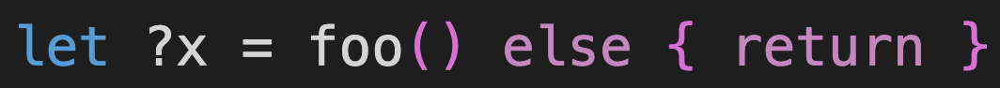

# Motoko update: March 6, 2023


<head>
  <meta property="og:image" content={require('../_assets/motoko_dash.jpeg').default}/>
  <meta property="twitter:image" content={require('../_assets/motoko_dash.jpeg').default}/>
</head>

Hi Motoko devs!

Welcome to the latest Motoko update post.

If you missed the last update post from the Motoko team, check it out [here](https://forum.dfinity.org/t/generational-gc-and-vscode-performance-improvement-motoko-updates/18617)! Last time we talked about a generational GC [demo](https://youtu.be/hJyFmX__ZGw?t=3765) and performance optimizations for our VSCode Extension.

Today we'll be talking about a new `let-else` binding and improved deserialization in Candid!



## New language feature: `let-else` binding!

There is a new `let` binding known as the `let-else` binding! `let-else` works similarly to the usual `let` binding, except there is an `else` block that gets executed in case of a pattern match failure.

E.g. assuming foo() returns type `?Nat`

```
let ?x = foo() else { Debug.print "foo failed"; return };
```

If foo() returns `null`, `null` doesn't match the pattern `?x`, and so "foo failed" is printed and execution returns out of the current function. Otherwise, the `Nat` is bound to `x` and execution continues forward.

This can be really useful to avoid deeply nested `switch` statements, such as the following:

```
switch (foo()) {
  case (?x) {
    switch (bar()) {
      case (?y) {
        switch (baz()) {
          case (?z) {
            return #ok x + y + z;
          }
          case null {
            return #err "baz failed";
          }
        } 
      };
      case null {
        return #err "bar failed";
      }
    }
  };
  case null {
    return #err "foo failed with";
  }
}
```

With `let-else` bindings, you get the following:

```
let ?x = foo() else { return #err "foo failed" };
let ?y = bar() else { return #err "bar failed" };
let ?z = baz() else { return #err "baz failed" };

return #ok x + y + x
```

This feature was inspired by the same feature in [rust](https://rust-lang.github.io/rfcs/3137-let-else.html).

See the PR and more details [here](https://github.com/dfinity/motoko/pull/3817). You can find this feature in version `0.8.3` of `moc`.

Please let us know your experience working with this binding!


## Improved Candid serialization and deserialization

Before, it was possible that you could serialize a Motoko value to Candid, but deserializing that encoded value back to Motoko would fail with a trap. It turns out that this was due to the stack consumption of Candid decoding being greater than the stack consumption of Candid encoding, especially when decoding deeply nested, recursive values such as lists. Although Candid related, the problem could also prevent upgrades, since the current stable variable format is based on Candid. Luckily, we managed to diagnose and fix the issue (a premature stack overflow) by putting the Candid decoder on a stack diet. While not a cure-all, our fix should prevent other surprising failures in the future.

See details for this [here](https://github.com/dfinity/motoko/pull/3809).

## Till next time!

– DFINITY Languages team