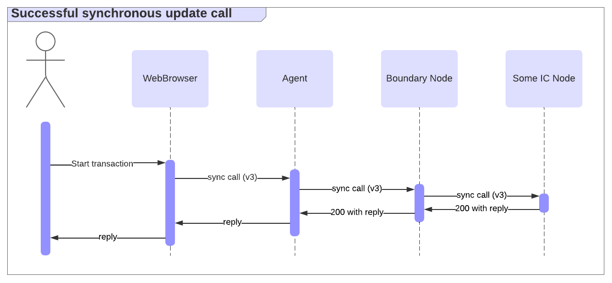
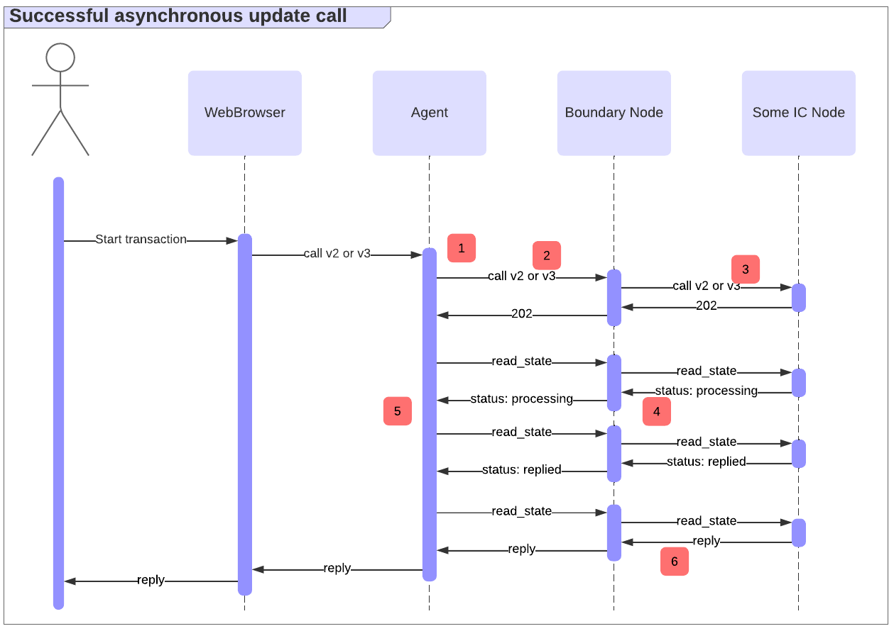

import { MarkdownChipRow } from "/src/components/Chip/MarkdownChipRow";
import { GlossaryTooltip } from "/src/components/Tooltip/GlossaryTooltip";

# Message execution

<MarkdownChipRow labels={["Beginner", "Concept"]} />

Ingress messages are requests to ICP <GlossaryTooltip>canisters</GlossaryTooltip> that are sent by external entities, such as users, usually through an [agent](/docs/building-apps/developer-tools/dev-tools-overview/#agents), like the [ICP JavaScript agent](https://github.com/dfinity/agent-js/tree/main) that runs within a web application, or the [ICP Rust agent](https://github.com/dfinity/agent-rs/tree/main) in a Rust application.

For example, you can browse what ingress messages can be sent to the ckBTC ledger by browsing through its [API using the dashboard](https://dashboard.internetcomputer.org/canister/mxzaz-hqaaa-aaaar-qaada-cai). The tool also allows you to send messages, using agent-js behind the scenes.

This page discusses ICP's ingress message APIs. While these APIs are defined in detail within the [HTTPS interface specification](/docs/references/ic-interface-spec#http-interface), this page provides a more high-level and intuitive  with a special focus on error handling. That aspect is particularly important, as it can be tricky to determine if an ingress message has actually been successfully executed. Misinterpreting errors could lead to bugs such as double spending.

ICP supports several types of calls, as defined in the [HTTPS interface specification](/docs/references/ic-interface-spec#http-interface). These include query and update calls.

Learn more about [query](/docs/building-apps/interact-with-canisters/query-calls), [update](/docs/building-apps/interact-with-canisters/update-calls), and [advanced types of calls](/docs/building-apps/interact-with-canisters/advanced-calls) for more information.

## Query calls

Queries don't modify a canister's state and are answered and signed by a single replica. Responses can be obtained within milliseconds, but they are typically not signed by the subnet, meaning a malicious replica or boundary node could arbitrarily modify the response.

Some applications may have higher authenticity requirements for query responses. For example, if a dapp queries a proposal description that the user then votes on, it may not be acceptable that the result could be tampered with, as it could trick users to vote in the attacker's favor. As an alternative, you can issue query calls as update calls instead. While that's easy to implement, it makes the calls significantly slower.

Another alternative approach is to sign the data beforehand and provide [*certified variables*](/docs/tutorials/developer-liftoff/level-3/3.3-certified-data/) in query responses. While this approach has better performance than sending query calls as update calls, it can be complex to implement depending on the specific use case. An example where certified variables are used is within the [HTTP asset certification](/docs/building-apps/security/data-integrity-and-authenticity#use-http-asset-certification-and-avoid-serving-your-dapp-through-rawicp0io). It is also recommended to view the [security best practices](/docs/building-apps/security/data-integrity-and-authenticity#certified-variables) for certified variables.

Error handling for queries is typically simple: on error, one can simply retry until a successful response is received.

[Learn more about query calls](/docs/building-apps/interact-with-canisters/query-calls).

### Update calls

Updates can modify a canister's state and thus must go through consensus, typically taking 1-3 seconds. They return certified responses (signed by the subnet), providing authenticity within the subnet's corruption bounds.

Update calls can be [synchronous](/docs/references/ic-interface-spec#http-sync-call-overview) or [asynchronous](/docs/references/ic-interface-spec#http-async-call-overview).

A [synchronous `call`](/docs/references/ic-interface-spec#http-call) follows the "call and await" pattern. In the success case, it maintains the HTTPS connection until a certified response is produced, as illustrated below.

Compared to the [asynchronous `call`](/docs/references/ic-interface-spec#http-async-call) endpoint, where the [`read_state`](/docs/references/ic-interface-spec#http-read-state) endpoint is used to poll for the request status and obtain the reply, the synchronous endpoint removes the need to poll for the response in the success case.

However, a response may not be produced until some implementation-specific timeout is reached. In that case, the synchronous endpoint behaves like the asynchronous one: it returns a `202` response, and the client must poll [`read_state`](/docs/references/ic-interface-spec#http-read-state) to get the request status and eventually obtain the reply, as illustrated below.

[Learn more about update calls](/docs/building-apps/interact-with-canisters/update-calls).