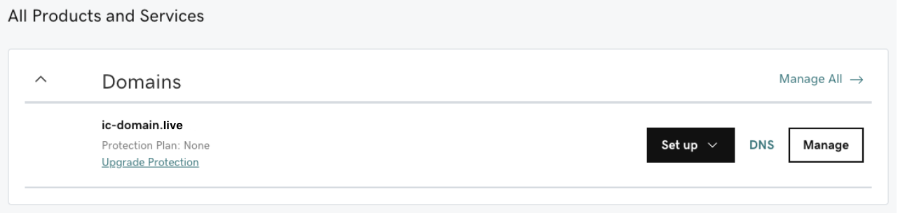
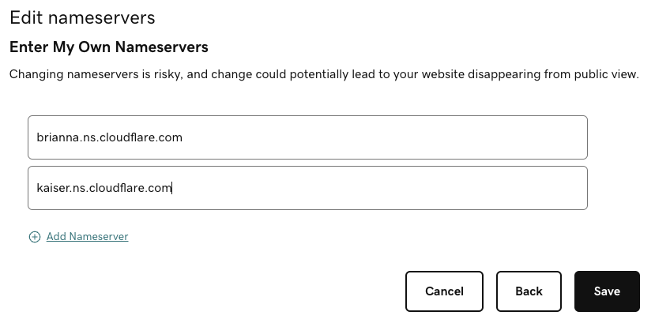
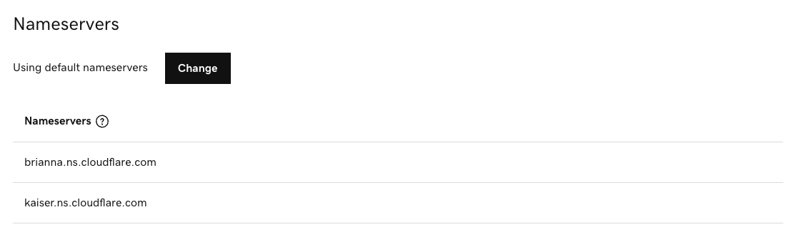

import { MarkdownChipRow } from "/src/components/Chip/MarkdownChipRow";

# DNS configuration guide

<MarkdownChipRow labels={["Intermediate", "Tutorial"]} />

This guide explains how to configure the DNS records of your domain for three popular
registrars: [Namecheap](#namecheap), [GoDaddy](#godaddy), and [Amazon Route 53](#amazon-route-53).

:::caution
The steps in this guide are prerequisites to using a custom domain. You must complete this DNS configuration before following the ["using custom domains" guide](using-custom-domains.mdx).
:::

:::info
To illustrate these required configurations, the apex domain `ic-domain.live` and the subdomain `example.ic-domain.live` are used.

Replace `ic-domain.live` with your own domain, such as `my-website.com`.
:::

## Namecheap

Below are the steps to configure the apex of a domain and a subdomain on Namecheap to be used as a custom domain for a canister deployed on ICP.

- #### Step 1: After purchasing your domain on Namecheap, open the management panel of your domain in the Namecheap dashboard.

- #### Step 2: Open the **Advanced DNS** tab.

### Apex
To configure the apex of the domain (e.g., `ic-domain.live`), add the following records by clicking on **Add new record**:

* Create an `ALIAS` record for which you set the host field to `@` and the target field to `ic-domain.live.icp1.io`.

* Create a `CNAME` record for which you set the host field to `_acme-challenge` and the target field to `_acme-challenge.ic-domain.live.icp2.io`.

* Create a `TXT` record for which you set the host field to `_canister-id` and the value field to the canister ID `y5jqt-wqaaa-aaaam-abcoq-cai`.

The resulting configuration should look similar to the following screenshot:

### Subdomain
To configure a subdomain (e.g., `example.ic-domain.live`), add the following records by clicking on **Add new record**:

* Create an `ALIAS` record for which you set the host field to `example` and the target field to `example.ic-domain.live.icp1.io`.

* Create a `CNAME` record for which you set the host field to `_acme-challenge.example` and the target field to `_acme-challenge.example.ic-domain.live.icp2.io`.

* Create a `TXT` record for which you set the host field to `_canister-id.example` and the value field to the canister ID `y5jqt-wqaaa-aaaam-abcoq-cai`.

The resulting configuration should look similar to the following screenshot:

Now, you are all set to register your custom domain with the HTTP gateways, and you can continue with step 2 of the [general custom domains instructions](./using-custom-domains#custom-domains-on-the-boundary-nodes).

## GoDaddy

Below are the steps to configure the apex of a domain and a subdomain on GoDaddy to be used as a custom domain for a canister deployed on ICP.

- #### Step 1: After purchasing your domain on GoDaddy, open your account and navigate to **My Products**.

- #### Step 2: Click on the **DNS** button next to the domain.

### Apex

Unfortunately, GoDaddy does not support configuring a `CNAME` record (or one of its alternatives, `ALIAS` or `ANAME`) for the apex of the domain; you need to make use of a workaround.

There are two options:

- [**Recommended**: Relying on a different DNS provider (e.g., Cloudflare).](#rely-on-an-alternative-dns-provider-recommended)

- [Directly configuring the IP addresses of the HTTP gateways.](#directly-configure-the-ip-addresses-not-recommended-use-at-your-own-risk)

Directly configuring the IP addresses is simpler compared to relying on another
DNS provider, but is less resilient and performant. Therefore, it is advised to use
a different DNS provider (e.g., Cloudflare or Route 53).

#### Rely on an alternative DNS provider (_recommended_)

It is explained in this approach using Cloudflare as a DNS provider. It works similarly with any other DNS provider that supports `CNAME`, `ALIAS`, or `ANAME` records for the apex of a domain.

- #### Step 1: Create a free account with Cloudflare; click on **Add site** in the top bar of the dashboard.

- #### Step 2: Enter your domain (e.g., `ic-domain.live`) and click **Add site**.

- #### Step 3: Choose the free plan and continue.

- #### Step 4: In the next step, Cloudflare lists two nameservers that you should configure GoDaddy to use.
Take note of the two nameservers (e.g., `brianna.ns.cloudflare.com` and `kaiser.ns.cloudflare.com`) provided by Cloudflare.

- #### Step 5: In the **DNS Management** panel of GoDaddy, remove all DNS entries on GoDaddy.
Go back to your DNS settings on GoDaddy and make sure to remove all the DNS entries that GoDaddy created.

- #### Step 6: Click on the **Change** button in the **Nameservers** section.

- #### Step 7: In the dialog that opened, click on **Enter my own nameservers (advanced)** and fill in the nameservers from Cloudflare in the provided fields.

To finish, click on **Save**.

- #### Step 8: Confirm in the dialog that you indeed intend to change the nameservers.
The resulting configuration should look similar to the following screenshot:

- #### Step 9: Back in the Cloudflare management portal, click on **Done, check nameservers**.

This step can take several hours, and you will be notified by email once it succeeded.

- #### Step 10: On Cloudflare, add the following records to configure your domain:

    * Create a `CNAME` record for which you set the name field to `@` and the target field to `ic-domain.live.icp1.io`.

    * Create a `CNAME` record for which you set the host field to `_acme-challenge` and the target field to `_acme-challenge.ic-domain.live.icp2.io`.

    * Create a `TXT` record for which you set the name field to `_canister-id` and the content field to the canister ID `y5jqt-wqaaa-aaaam-abcoq-cai`.

The resulting configuration should look similar to the following screenshot:

#### Directly configure the IP addresses (not recommended; use at your own risk).

:::caution
By directly configuring the IP addresses of the HTTP gateways, you always need to make sure to keep your DNS records up-to-date. If a [HTTP gateway](https://learn.internetcomputer.org/hc/en-us/articles/34212818609684-ICP-Edge-Infrastructure) is retired or changes its IP addresses, you need to remove or update your DNS records. Otherwise, you risk that your dapp becomes inaccessible.
:::

- #### Step 1: First, you need to look up the IP addresses of the HTTP gateways (`icp1.io`).
To this end, use an online DNS lookup service (e.g., [nslookup.io](https://nslookup.io)) and take a note of the IPv4- and IPv6-addresses, the `A` and `AAAA` records, respectively.

- #### Step 2: In the **DNS Management** panel in your GoDaddy account, add the following DNS records:

    * Create an `A` record for each IPv4 address by setting the name field to "@" and the value field to the IPv4 address (e.g., `193.118.63.173`).

    * Create an `AAAA` record for each IPv6 address by setting the name field to "@" and the value field to the IPv6 address (e.g., `2a0b:21c0:b002:2:5000:59ff:fead:c233`).

    * Create a `CNAME` record for which you set the name field to `_acme-challenge` and the value field to `_acme-challenge.ic-domain.live.icp2.io`.

    * Create a `TXT` record for which you set the name field to `_canister-id` and the value field to the canister ID `y5jqt-wqaaa-aaaam-abcoq-cai`.

The resulting configuration should look similar to the following screenshot:

### Subdomain
To configure a subdomain (e.g., `example.ic-domain.live`), add the following records by clicking on **Add new record**:

* Create a `CNAME` record for which you set the host field to `example` and the target field to `example.ic-domain.live.icp1.io`.

* Create a `CNAME` record for which you set the host field to `_acme-challenge.example` and the target field to `_acme-challenge.example.ic-domain.live.icp2.io`.

* Create a `TXT` record for which you set the host field to `_canister-id.example` and the value field to the canister ID `y5jqt-wqaaa-aaaam-abcoq-cai`.

The resulting configuration should look similar to the following screenshot:

Now, you are all set to register your custom domain with the HTTP gateways, and you can continue with step 2 of the [general custom domains instructions](./using-custom-domains#custom-domains-on-the-boundary-nodes).

## Amazon Route 53

Below are the steps to configure the apex of a domain and a subdomain on Amazon Route 53 to be used as a custom domain for a canister deployed on ICP.

### Apex

Unfortunately, Amazon Route 53 does not support configuring a `CNAME` record (or one of its alternatives, `ALIAS` or `ANAME`) for the apex of the domain. You need to make use of a workaround.
For instructions, take a look at the steps outlined for GoDaddy under ["Rely on an alternative DNS provider"](#rely-on-an-alternative-dns-provider-recommended).

### Subdomain

- #### Step 1: After purchasing your domain on Route 53, navigate to **Hosted zones** and click on your domain.

- #### Step 2: Click on the domain to open the DNS settings.

- #### Step 3: Configure your DNS records.
To configure a subdomain (e.g., `example.ic-domain.live`), add the following records by clicking on **Create record**:

* Create a `CNAME` record for which you set the host field to `example` and the target field to `example.ic-domain.live.icp1.io`.

* Create a `CNAME` record for which you set the host field to `_acme-challenge.example` and the target field to `_acme-challenge.example.ic-domain.live.icp2.io`.

* Create a `TXT` record for which you set the host field to `_canister-id.example` and the value field to the canister ID `y5jqt-wqaaa-aaaam-abcoq-cai`.

The resulting configuration should look similar to the following screenshot:

Now, you are all set to register your custom domain with the HTTP gateways, and you can continue with step 2 of the [general custom domains instructions](./using-custom-domains#custom-domains-on-the-boundary-nodes).
