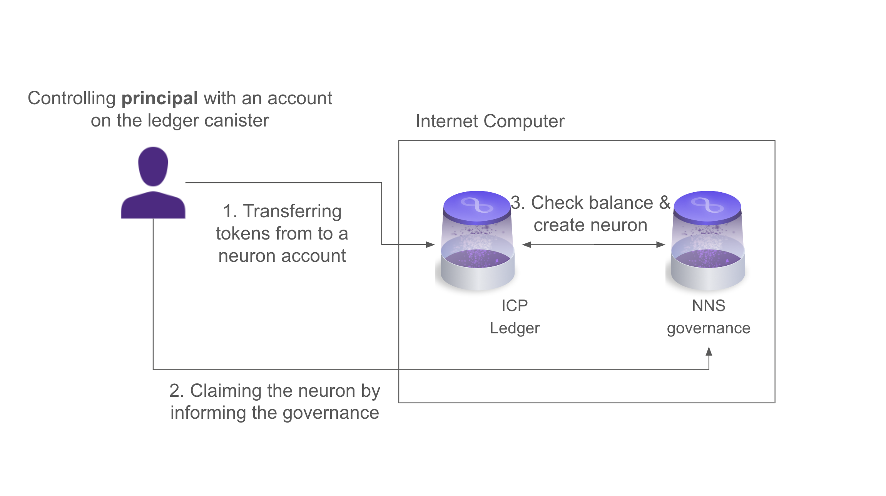

import { MarkdownChipRow } from "/src/components/Chip/MarkdownChipRow";

# Neuron management

<MarkdownChipRow labels={["Advanced", "Governance", "Concept"]} />

## Who should read this page
This page describes all of the operations that you can perform on a neuron and their associated APIs.

This page is for you if you want to learn the technical details about neuron operations, or if you want to integrate with the NNS, for example, if you build a project that offers neuron staking or custody support.

Tutorials for users who want to interact with the NNS using the [NNS dapp](https://nns.ic0.app) frontend are available in the [NNS dapp quickguide](/docs/building-apps/governing-apps/nns/using-the-nns-dapp/nns-app-quickstart).


View the most up-to-date [`candid` definition for the NNS governance canister](https://github.com/dfinity/ic/blob/master/rs/nns/governance/canister/governance.did).
This page will explain some of the relevant definitions from this Candid file.
To keep up to date with new NNS release proposals from DFINITY, you can subscribe to [this forum thread](https://forum.dfinity.org/t/nns-updates-aggregation-thread/23551).

## Neuron and NeuronInfo

Find a high level overview of the most important neuron concepts in the [Neuron overview](/docs/building-apps/governing-apps/nns/concepts/neurons/neuron-overview).
Below are details about the [`Neuron` record](https://github.com/dfinity/ic/blob/173d06185f77265d97bc363d266ce79410f6b914/rs/nns/governance/canister/governance.did#L363C1-L386C3)
including all neuron attributes. This represents a full neuron with all details.

* `id : opt NeuronId;`: A unique ID identifying the neuron. This is a number that is randomly chosen by the governance canister when a neuron is created.

* `account : blob;`: The neuron's account on the ledger. This corresponds to a subaccount of the NNS governance canister so that the tokens are locked and can only be transferred by dissolving the neuron.

* `controller : opt principal;`: The principal controlling the neuron. This principal has the permissions to read the neuron and perform any operations on the neuron.

* `hot_keys : vec principal;`: A list of principals that have limited permissions on the neuron. This can be used for example to use more accessible but less secure keys for everyday operations. Hotkey principals can read the neuron as well as vote with it, which includes both direct voting and changing following.

* `cached_neuron_stake_e8s : nat64;`: The amount of staked ICP tokens, measured in fractions of 10E-8 of an ICP token.

* `neuron_fees_e8s : nat64;`: The amount of ICP that this neuron has forfeited due to making proposals that were rejected or from using the 'manage neurons through proposals' functionality. This value must be smaller than `neuron_stake_e8s`. When a neuron is disbursed, these ICP are burned.

* `created_timestamp_seconds : nat64;`: The timestamp, in seconds from the Unix epoch, when the neuron was created.

* `dissolve_state : opt DissolveState; type DissolveState = variant { DissolveDelaySeconds : nat64; WhenDissolvedTimestampSeconds : nat64; };`: The timer that defines how long the tokens in this neuron are locked for. When the neuron is dissolving, i.e., the timer is running down, this this stores the timestamp at which the neuron becomes dissolved `WhenDissolvedTimestampSeconds`. When the neuron is non-dissolving, `DissolveDelaySeconds` stores how much time, in seconds, is left until the neuron is dissolved when the dissolve timer is turned on again.
A neuron is dissolved if `WhenDissolvedTimestampSeconds` is in the past or if `DissolveDelaySeconds` is zero.

* `aging_since_timestamp_seconds : nat64;`: The timestamp, in seconds from the Unix epoch, when this neuron last entered the non-dissolving state and has started aging. This value is
meaningless when the neuron is dissolving and has age zero. The canonical value of this field for a dissolving neuron is `u64::MAX`.

* `followees : vec record { int32; Followees }; type Followees = record { followees : vec NeuronId };`: The followees of a neuron, that is the group of neurons that this neuron follows. They are expressed as maps from proposal topics (expressed by integers) to a list of followees for this particular topic.

* `recent_ballots : vec BallotInfo;`: Information about how this neuron voted in the recent past.

* `maturity_e8s_equivalent : nat64;`: The accumulated unstaked maturity of the neuron, in e8s equivalent.

* `staked_maturity_e8s_equivalent : opt nat64;`: The accumulated staked maturity of the neuron, in e8s equivalent. Staked maturity becomes unstaked maturity once the neuron is dissolved.

* `auto_stake_maturity : opt bool;`: If set and true the maturity rewarded to this neuron for voting will be automatically staked and will contribute to the neuron's voting power.

* `spawn_at_timestamp_seconds : opt nat64;`: This is used if for neurons that were created to spawn maturity into a neuron. It denotes the timestamp, in seconds from the Unix epoch, at which this
 neuron's maturity is replaced by newly minted ICP.

* `visibility : opt int32;`: The visibility defines how much information about this neuron is publicly accessible, i.e., visible to those who are neither the controller nor
 have hot-key privileges to this neuron. Visibility can be public, private, or undefined.
 For public neurons, the full neuron is accessible to everyone, for private neurons only a part of the `NeuronInfo` (see below) is visible, excluding the `recent_ballots`
  and `joined_community_fund_timestamp_seconds`.

* `known_neuron_data : opt KnownNeuronData; message KnownNeuronData { string name = 1; optional string description = 2; }`: A neuron can be registered as a **known neuron** via proposal so that it can be followed by others.
Known neurons have extra information, a name and optionally a description.

* `joined_community_fund_timestamp_seconds : opt nat64;`: Timestamp when this neuron joined the community fund.

* `transfer : opt NeuronStakeTransfer;`: The record of the transfer that was made to create this neuron.

* `kyc_verified : bool;`: This is a field indicating whether genesis neurons have been KYC verified. `false` if this is a genesis neurons that has not been KYC verified.

*  `not_for_profit : bool;`: Whether this neuron is "Not for profit", making it dissolvable by voting on a manage neuron proposal.

* `neuron_type : opt int32;`: The type of a neuron, identifying seed neurons and Early Contributor Token (ECT) neurons.


In addition to this neuron record, `NeuronInfo` provides the most important information about a neuron.
Refer to the `candid` file for the [`NeuronInfo` record](https://github.com/dfinity/ic/blob/173d06185f77265d97bc363d266ce79410f6b914/rs/nns/governance/canister/governance.did#L408).


## Getting information about a neuron
Before diving deeper into how a neuron can be created and modified, let's first understand how to get information about a user's existing neurons.

### Neuron visibility
A neuron can be private or public.
* For public neurons, everyone can view the full neuron. This includes the full `NeuronInfo` which can be viewed as a summary of the most important information.
* For private neurons:
    * Everyone can view the fields in `NeuronInfo`, except for `recent_ballots` and `joined_community_fund_timestamp_seconds`.
    * Principals who control the neuron or are a hotkey of the neuron can view the full neuron. This includes the full `NeuronInfo`.

### APIs
A user can request information about a list of neurons using this API:
```
list_neurons : (ListNeurons) -> (ListNeuronsResponse) query;

type ListNeurons = record {
  include_public_neurons_in_full_neurons : opt bool;
  neuron_ids : vec nat64;
  include_empty_neurons_readable_by_caller : opt bool;
  include_neurons_readable_by_caller : bool;
};

type ListNeuronsResponse = record {
  neuron_infos : vec record { nat64; NeuronInfo };
  full_neurons : vec Neuron;
};
```
The user can define which neurons to get information from by defining a list of neuron IDs in the argument `neuron_ids`.
Additionally:
* If the argument `include_neurons_readable_by_caller` is set to true, the neurons who the user is authorized to read are also included (i.e., the neurons for which the user is a controller or hotkey).
* If the argument `include_empty_neurons_readable_by_caller` is set to true, the empty neurons readable by the caller are also included. Neurons are empty if they have 0 stake, 0 maturity, and 0 staked maturity. This field only has an effect when `include_neurons_readable_by_caller` is true. If a neuron is explicitly requested to be returned by including it in the `neuron_ids` field, then the neuron will be included in the response regardless of this value. If this fields is not provided, it defaults to true for backwards compatibility.

The answer to such a query is defined by `ListNeuronsResponse`:
* First, it contains a map that points for each neuron that was requested to the corresponding `NeuronInfo` (assuming the neuron exists). For neurons that are public or for which the calling user is the controller or a hotkey, this includes the full `NeuronInfo`. For other private neurons `recent_ballots` and `joined_community_fund_timestamp_seconds` are redacted.
* For each requested neuron that exists and for which the calling user is a controller or hotkey, the full neuron is returned.
* If the argument `include_public_neurons_in_full_neurons` is set to true, for each requested public neuron, the full neuron is returned.

## Interacting with neurons
All neuron modifications go through the following API on the NNS governance canister. This includes everything in a neuron's lifetime such as the neuron's creation, modifications and voting, and unstaking the ICP tokens.
```
type ManageNeuron = record {
  id : opt NeuronId;
  command : opt Command;
  neuron_id_or_subaccount : opt NeuronIdOrSubaccount;
};
```
:::info
For most of the workflows detailed below, you can also use the [ICP Rosetta API](/docs/defi/rosetta/icp_rosetta/construction_api/staking/).

:::

### Creating a neuron and topping it up

Each neuron's stake is stored on a subaccount of the governance canister on the ICP ledger.
The following diagram provides a simplified view of the workflow for creating a neuron and the relationship between the neuron and its ledger account.



Staking ICP utility tokens in a neuron involves three steps:
1. Compute the neuron's address on the ledger, where the staked tokens will be held. This corresponds to a subaccount of the NNS governance canister.
2. Send ICP utility tokens to the neuron's address computed in (1).
3. Claim the neuron on the NNS governance canister, which tells the governance canister that the transfer in (2) happened, upon which the NNS governance will create a new neuron.

Let us go through these steps in more detail.

#### Step 1: Compute the neuron's address

To compute the neuron's address in the first step, proceed as follows.

1. Learn the principal that should control the neuron and choose a nonce. The nonce is used to allow the same principal to control multiple neurons and does not need to be kept secret.

2. Compute the subaccount based on the two inputs from (1). View for example the method
[`compute_neuron_staking_subaccount_bytes`](https://github.com/dfinity/ic/blob/master/rs/nervous_system/common/src/ledger.rs) which computes the subaccount given a controller principal and a nonce.

3. Compute the final account identifier on the ledger (that gives you the address) using the computed subaccount from (2) and the principal ID of the NNS governance canister. View for example the method [`neuron_subaccount`](https://github.com/dfinity/ic/blob/master/rs/nns/governance/src/governance.rs) which computes the account based on a given subaccount and with the NNS governance principal ID `GOVERNANCE_CANISTER_ID`.


For the above steps, make sure you are using an up-to-date version of this code in your application.

:::caution
It is of utmost importance to ensure that the address is computed correctly in the first step and remembered so that it can be reused in the second step.
If this fails, funds could be sent to a dead account and be unrecoverable.
It is recommended to test the corresponding code thoroughly.

:::

#### Step 2: Send ICP to the neuron's account

After having computed the neuron's address, make a transfer to this address. For this, view the [relevant `candid` interface of the ICP ledger](https://github.com/dfinity/ic/blob/aba60ffbc46acfc8990bf4d5685c1360bd7026b9/rs/ledger_suite/icp/ledger.did#L488C5-L488C13) which contains the following details for a transfer.
```
service: (LedgerCanisterPayload) -> {
  transfer : (TransferArgs) -> (TransferResult);
  ...
}
type TransferArgs = record {
  memo: Memo;
  amount: Tokens;
  fee: Tokens;
  from_subaccount: opt SubAccount;
  to: AccountIdentifier;
  created_at_time: opt TimeStamp;
};
```
To make a transfer to the correct account, choose the `memo` equal to your chosen nonce (from Step (1a)).
To stake a neuron, the `amount` must be at least 1 ICP. Set the `fee` to the standard fee of the ICP ledger canister, which is 10000 e8s.
You can make the transfer from any `from_subaccount` account that you control. For the `to` account, use the account that you have computed in Step (1).

#### Step 3: Claim the neuron

As a third step, claim the neuron using the following `ManageNeuron` command.
```
type ClaimOrRefreshNeuronFromAccount = record {
  controller : opt principal;
  memo : nat64;
};
```
The `controller` is the principal controller chosen in Step (1a) that will control the neuron and the `memo` is again the chosen nonce.

_Required permissions:_ Anyone can make this call and claim a neuron for the specified controller.

**Topping up a neuron**

Topping up an existing neuron with more tokens is called _refreshing_ a neuron and works similarly to claiming a neuron.
1. Send additional ICP utility tokens to the (existing) neuron's address.
2. Refresh the neuron on the NNS governance canister, which tells the governance canister that the transfer in (1) happened, upon which the NNS governance will update the neuron's stake.

:::info
Note that refreshing of a neuron will also reduce the neuron's age to account for the fact that the newly added tokens have no age.

:::

These steps happen analogously to the claiming of neurons above.
Again, care is advised to makes sure that the right account is computed and used.
When `ClaimOrRefreshNeuronFromAccount` is used, the NNS governance canister will automatically either claim the neuron if it doesn't exist yet or top it up if it exists.

_Required permissions:_ Anyone can make this call and top up a neuron, even if they do not have any permissions on the neuron. No matter who makes the call to the governance canister, its controller is set by the arguments as mentioned above.

### Managing permissions of a neuron
Every neuron has a controller that cannot be changed and may have hot keys. Hot keys are defined by a list of principal ID and can be used to perform actions with limited privileges, namely voting and following.
To manage these permissions, a neuron's controller can add and remove hot keys using the neuron command `Configure` with the `Operation` `AddHotKey` and `RemoveHotKey`, respectively.

```
type Configure = record { operation : opt Operation };
type Operation = variant {
  RemoveHotKey : RemoveHotKey;
  AddHotKey : AddHotKey;
  ...
};
type AddHotKey = record {
  new_hot_key : opt principal
};
type RemoveHotKey = record {
  hot_key_to_remove : opt principal
};
```
For adding a hot key, the principal `new_hot_key` to add needs to be provided and for removing an existing hot key principal, the principal `hot_key_to_remove` to be removed from the hot key list needs to be provided.

_Required permissions:_
Only a neuron's controller can add and remove hot keys.

### Set a neuron's visibility
To set a neuron's visibility, use the following configuration:
```
type SetVisibility = record { visibility : opt int32 };
```
The input determines the new visibility that the neuron should have, which can either be private (encoded as 1) or public (encoded as 2).

_Required permissions:_
Only a neuron's controller can set the visibility.

### Modifying a neuron's state
Recall from the section _Neuron attributes_, that a neuron has a dissolve delay and can be non-dissolving, dissolving, or dissolved.
To switch between the different dissolve states or to increase the dissolve delay, use the `ManageNeuron` command `Configure`.
```
type Configure = record { operation : opt Operation };
type Operation = variant {
  ...
  StopDissolving : record {};
  StartDissolving : record {};
  IncreaseDissolveDelay : IncreaseDissolveDelay;
  ...
  SetDissolveTimestamp : SetDissolveTimestamp;
};
type IncreaseDissolveDelay = record {
  additional_dissolve_delay_seconds : nat32;
};
type SetDissolveTimestamp = record { dissolve_timestamp_seconds : nat64 };
```

To move a neuron from non-dissolving into dissolving state, and start the timer, use `StartDissolving`. No additional argument are required.

To move a neuron from dissolving into non-dissolving state, and stop the timer at the dissolve state that the neuron has, use `StopDissolving`.

No matter in which dissolve state a neuron is, its dissolve delay can be increased up to a maximum of eight years. If two neurons are merged, the resulting dissolve delay will be the greater of the two neurons. The dissolve state of the target neuron remains unchanged.

To do so, there are two options.
You can use `IncreaseDissolveDelay` and specify by the argument `additional_dissolve_delay_seconds` by how many seconds the current remaining dissolve delay should be increased. For example, if a neuron has 6 months dissolve delay, choosing the argument 2 months (in seconds) for `IncreaseDissolveDelay`, would result in a neuron with 8 months dissolve delay.
Alternatively, you can specify how much dissolve delay a neuron should have after the operation by using `SetDissolveTimestamp` and setting a target time stamp `dissolve_timestamp_seconds` in seconds from the Unix epoch.
To achieve the same as above, compute the timestamp of now plus 8 months and provide this as the input `dissolve_timestamp_seconds`.
In both cases, the dissolve delay can only be increased but never decreased.

_Required permissions:_
Only a neuron's controller can start or stop dissolving a neuron or increase its dissolve delay.


### Voting and following with a neuron
A neuron represents a participant of the NNS DAO and can participate in governance. Concretely, a neuron can submit proposals or vote on them if its dissolve delay is at least 6 months.
A neuron can either directly vote to adopt or reject a given proposal or it can _follow_ other neurons for certain decisions - which will automatically cast a ballot for the neuron if enough of the followees voted.

**Vote directly**

To vote directly, first find out what proposals can be voted on and then find the ID of the proposal you want to vote on.
The following are the relevant NNS governance API and record that can also be found in the candid file.
```
service : (Governance) -> {
  get_pending_proposals : () -> (vec ProposalInfo) query;
};
type ProposalInfo = record {
  id : opt NeuronId;
  ...
};
 ```
First use the `get_pending_proposals` API to get the `ProposalInfo` of all proposals that are still pending.
Then, as part of this proposal information you can find a proposal's id `id`.

Using this, you can now vote on a proposal using the following neuron command.
```
type RegisterVote = record {
  vote : int32;
  proposal : opt NeuronId
};
```
The `vote` represents if the neuron should adopt or reject the proposal.
As can be found [here](https://github.com/dfinity/ic/blob/720c78843f20246bf4e5c15f703923bd316c19de/rs/nns/governance/proto/ic_nns_governance/pb/v1/governance.proto#L427), 1 corresponds to a yes-vote and hence to adopt the proposal and 2 corresponds to a no-vote and thus to reject the proposal.
`proposal` is the proposal ID of the proposal that the neuron votes on.

**Set a neuron's following**

In case that a neuron's owner lacks the time or expertise to vote on some proposals, a neuron can be configured to vote automatically by following other neurons on a topic-by-topic basis.
For any valid topic, a list of followees can be specified, and the neuron will follow the vote of a majority of the followers on a proposal with a type belonging to that topic. If a null topic is specified, this acts as a catch-all that enables the neuron to follow the vote of followees for all topics where no explicit rule has been specified.
There are two topics that are excluded from the catch-all: `Governance` and `SNS & Neuron's Fund`.

:::info
It is important to understand that a neuron's vote is only cast if the majority of the followed neurons agree on a decision. [View more information](/docs/building-apps/governing-apps/nns/using-the-nns-dapp/nns-app-quickstart#neuron-following) and examples regarding the following rules.

:::

To define a follow rule, use the following neuron command
 ```
type Follow = record {
  topic : int32;
  followees : vec NeuronId
};
```
The argument `topic` defines for which proposal topic this following rule should be applied.
Each topic is defined by a number which you can find [here](https://github.com/dfinity/ic/blob/7184d168d44f3ba27f750285a0fba43a0c56190a/rs/nns/governance/src/gen/ic_nns_governance.pb.v1.rs#L3142).
If the topic is `null`, then this rule is applied for the catch-all and will be applied for all topics where no other explicit rule is defined except for`Governance` and `SNS & Neuron's Fund`.
The second argument `followees` defines a list of neuron IDs whose decision will be followed. There can be up to 15 followees for each topic (but more followees is not necessarily better - see the rules linked above).

_Required permissions:_
Voting and setting following can be done by a neuron's controller or a neuron's hot key.

### Handling a neuron's maturity
Recall from the [neuron overview](/docs/building-apps/governing-apps/nns/concepts/neurons/neuron-overview) that when a neuron votes it gets rewards in the form of maturity.
The maturity can either be unstaked, meaning that it can be spawned and converted into ICP at any point, or it can be staked,
meaning that it is viewed as part of the neuron's stake and contributes to the voting power, but it is locked until the neuron is dissolved.

#### Spawn a neuron

When a neuron's maturity has risen above a threshold, one can spawn a portion of the maturity. In a first step, this creates a new neuron in a special spawning state containing the spawned maturity. After 7 days, the maturity is replaced with newly minted ICP, taking some [maturity modulation function](https://wiki.internetcomputer.org/wiki/Maturity_modulation#:~:text=The%20maturity%20modulation%20function%20introduces,NNS%20neurons%20and%20SNS%20neurons.) into account. In the end, the new neuron will be dissolved and have these ICP as stake, which can then be disbursed to any account.
The new neuron can remain controlled by the same principal as the parent neuron, or be assigned to a new principal.

The following command spawns a neuron:
```
type Spawn = record {
  percentage_to_spawn : opt nat32;
  new_controller : opt principal;
  nonce : opt nat64;
};
```
Specify by `percentage_to_spawn` the portion of the maturity that should be spawn into a neuron in percentage. This should be a value between 1 and 100 (inclusive).
If the spawned neurons should have a different controller than the parent neuron (from which you spawn the maturity), you can optionally define a different controlling principal by `new_controller`. Otherwise, the spawned neuron will have the same controller as the parent neuron.
Similarly to claiming a neuron (see above), you need to specify the new neuron's ledger address and choose a nonce for this in the last argument `nonce`.
Based on this nonce and the controlling principal, the neuron's address is uniquely defined (see section _Compute the neuron's address_).
If no nonce is provided, the governance canister chooses a random one.

_Required permissions:_
Only a neuron's controller can spawn maturity from a neuron.

#### Merge maturity

This method allows a neuron controller to merge the (unstaked) maturity of a neuron into the neuron's stake.
The caller can choose a percentage of maturity to merge.

```
type MergeMaturity = record {
 percentage_to_merge : nat32
};
```

_Required permissions:_
Only a neuron's controller can merge maturity.

#### Stake maturity

This method allows a neuron controller to stake some of the currently existing (unstaked) maturity of a neuron, moving some of it to the staked maturity. The caller can choose a percentage of maturity to merge.
```
type StakeMaturity = record {
 percentage_to_stake : opt nat32
};
```
_Required permissions:_
Only a neuron's controller can stake maturity.

#### Change auto-stake maturity

This method allows a neuron controller to change the auto-stake maturity setting for a neuron.
```
type ChangeAutoStakeMaturity = record {
  requested_setting_for_auto_stake_maturity : bool;
};
```
The input provides the boolean value to which the auto-stake flag will be set to.
If set to `true`, auto-stake maturity causes all the maturity generated by voting rewards to be automatically moved to staked maturity.

_Required permissions:_
Only a neuron's controller can change the auto-stake settings.

### Disbursing / unstaking a neuron
When a neuron is dissolved, i.e., its dissolve delay is zero, the neuron's controlling principal can instruct it to _disburse_ the neuron’s stake. This means that the staked ICP balance is transferred to a specified ledger account and is liquid again.

The following command can be used to disburse a neuron:

```
type Disburse = record {
  to_account : opt AccountIdentifier;
  amount : opt Amount;
};
```
The command takes as argument for the ledger account `to_account` to which the ICP tokens should be transferred to and the amount `amount` that should be disbursed. The latter allows only a portion of a neuron's stake to be disbursed.

_Required permissions:_
Only a neuron's controller can disburse a neuron.

### Splitting and merging neurons
If you have multiple neurons, you can split and merge them for reorganization.

#### Split a neuron

A neuron can be split in two neurons, for example to set different dissolve delays.
A user can choose how much of the neuron's stake should be split into a new neuron.
The staked and unstaked maturity also split proportionally.
The new neuron will inherit the parent neuron's settings, such as the hotkeys and followees.


```
type Split = record {
    amount_e8s : nat64
};
```
The command takes as argument the amount of tokens `amount_e8s` that are split from the parent neuron into a
new neuron.

_Required permissions:_
Only a neuron's controller can split a neuron.

#### Merge two neurons

If you have two neurons, you can merge one, called the source neuron, into another, called the target neuron.

The source neuron's stake, maturity, and age are moved into the target. Any fees for the source neuron are burned before the transfer occurs. The dissolve delay of the target neuron is the greater of the dissolve delay of the two, while the source remains unchanged.

Two neurons can only be merged if they are both non-dissolving. If you wish to merge other neurons, you can first use `stop_dissolving`, increase their dissolve delay, and then merge them.

The neuron for which you make this call is the target neuron and you provide the source neuron as an argument of your call.

```
type Merge = record {
    source_neuron_id : opt NeuronId
};
```

_Required permissions:_
Only a neuron's controller can split a neuron.
