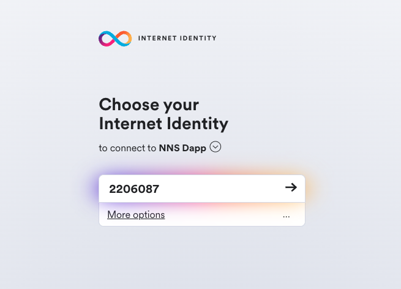

import { MarkdownChipRow } from "/src/components/Chip/MarkdownChipRow";
import '/src/components/CenterImages/center.scss';

# Authentication

<MarkdownChipRow labels={["Beginner", "Governance", "Tutorial"]} />

There are different ways to interact with the NNS DAO to participate in governance.

This guide will demonstrate how to interface with the NNS through the [NNS dapp](https://nns.ic0.app).
You can interact with the NNS through other tools, such as [quill](https://github.com/dfinity/quill)
and [ic-js](https://github.com/dfinity/ic-js/tree/main/packages/nns).

This section starts with a tutorial on how to connect and log in to the NNS dapp.
In the following pages, you will see how to use the NNS dapp to
[transfer tokens](/docs/building-apps/governing-apps/nns/using-the-nns-dapp/nns-dapp-send-and-receive-tokens),
[stake tokens and set up a neuron](/docs/building-apps/governing-apps/nns/using-the-nns-dapp/nns-dapp-staking-a-neuron),
and how to participate in voting either by [voting manually](/docs/building-apps/governing-apps/nns/using-the-nns-dapp/nns-dapp-voting-on-proposals)
 or by [following other neurons](/docs/building-apps/governing-apps/nns/using-the-nns-dapp/nns-dapp-following-other-neurons).

## Connect to the NNS DAO using the NNS dapp

To connect to the NNS using the Network Nervous System (NNS) dapp, follow these steps which are also explained in the first minutes of this video.

 

<iframe width="660" height="415" src="https://www.youtube.com/embed/XU54fbCzFmE?si=NU3rq9Pz7GlGW3ar" title="YouTube video player" frameborder="0" allow="accelerometer; autoplay; clipboard-write; encrypted-media; gyroscope; picture-in-picture; web-share" referrerpolicy="strict-origin-when-cross-origin" allowfullscreen></iframe> 

- #### Step 1:  Open a browser and navigate to the [Network Nervous System (NNS)](https://nns.ic0.app) dapp.

- #### Step 2:  Click **Login** to connect to [Internet Identity](https://identity.internetcomputer.org/).

If you haven’t previously registered, you can click **Register with Internet Identity** to register.

:::info
We strongly recommend you add multiple devices and authentication methods to your Internet Identity. For example, register multiple physical devices like your computer and phone with a security key and using the authentication options that those devices—and browsers running on them—support.
:::

For more information about creating an Internet Identity, see [how to use Internet Identity](https://internetidentity.zendesk.com/hc/en-us/articles/15430677359124-How-Do-I-Create-an-Internet-Identity-on-My-Mobile-Device-).

After you have registered, you can click **Login** to authenticate using your anchor and the authentication method—for example, a security key or fingerprint—you have registered.

- #### Step 3:  Click **Proceed** to access to the Network Nervous System (NNS) dapp.

## Add an account

Logging on using an Internet Identity creates a main account for you in the Internet Computer ledger. If your ICP utility tokens are associated with your developer identity; that is, the identity created by the SDK `dfx` command-line interface. Your main account displays 0.00 for your ICP utility token balance. For example:

Before transferring any tokens, you can create one or more linked subaccounts or attach a hardware wallet to your account.

To add an account for managing ICP utility tokens:

- #### Step 1:  On the default 'Tokens' tab, click 'ICP', then **Add Account**.

- #### Step 2:  Select the type of account to add.

    -   **New Account** creates a new subaccount linked to your Main account address in the ledger.

    -   **New Account (Hardware Wallet)** adds a hardware wallet to your main account address in the ledger.

- #### Step 3:  Click **New Account**, type an Account Name, then click **Create**.

