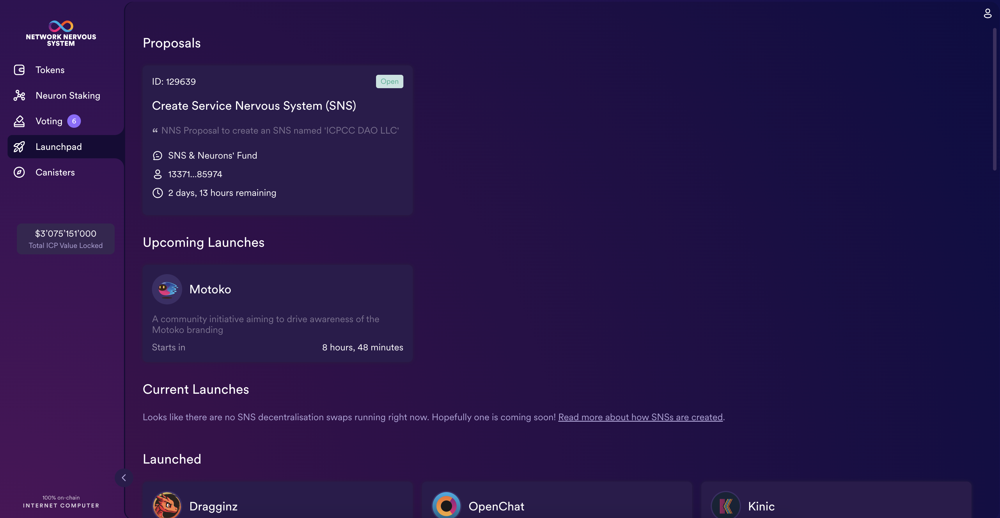
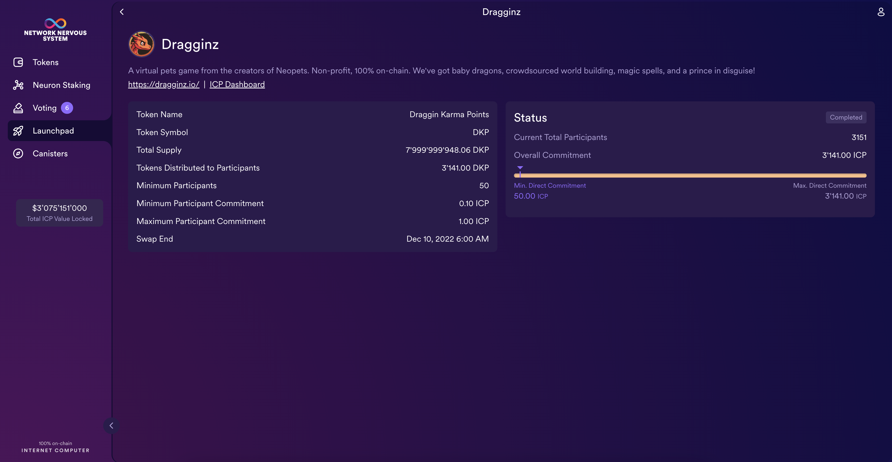
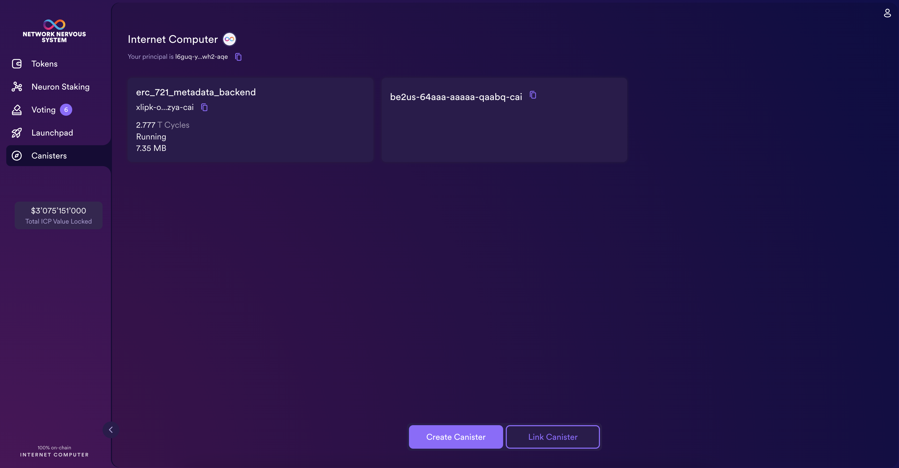
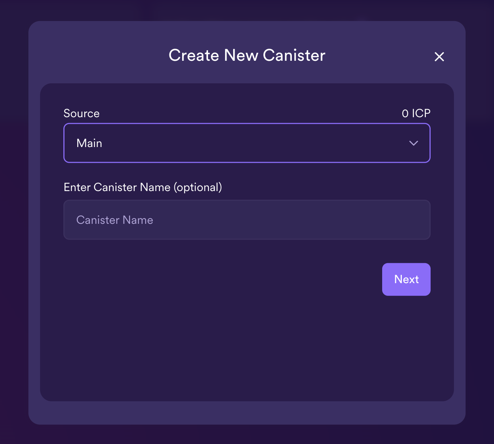
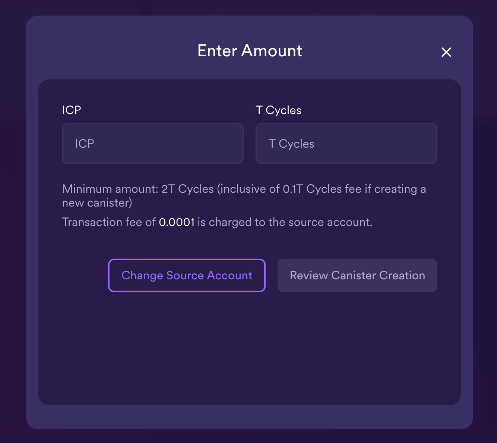
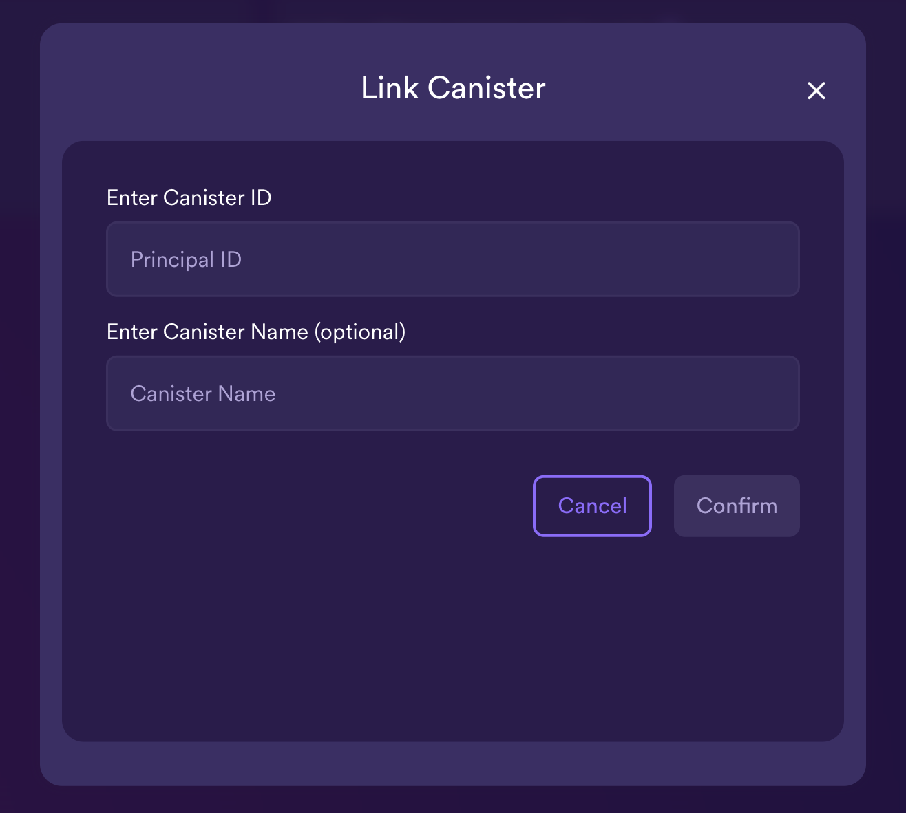

import { MarkdownChipRow } from "/src/components/Chip/MarkdownChipRow";
import '/src/components/CenterImages/center.scss';
import { GlossaryTooltip } from "/src/components/Tooltip/GlossaryTooltip";

# Additional features

<MarkdownChipRow labels={["Intermediate", "Governance", "Tutorial"]} />

In addition to being the portal for interacting with the NNS DAO, the NNS dapp also provides access to the SNS DAOs, their launches, and allows users to manage canisters that they control.
This is a brief guide to some of these additional functionalities.

## SNS decentralization swaps

You can participate in SNS decentralization swaps from the NNS dapp using the 'Launchpad' tab. An SNS is an advanced version of a decentralized autonomous organization, where the participants of the SNS can vote on proposals, such as a new feature, roadmap item, or allocation of SNS funds.

[Learn more about SNSes](https://internetcomputer.org/sns).

To view current and past SNS decentralization swaps from the NNS dapp:

- #### Step 1:  From the NNS dapp, click **Launchpad** from the left navigation bar.

- #### Step 2: Select any SNS swap to view the details, such as the status, total participants, token supply, and when the swap ended.

## Deploying and managing canisters from the NNS dapp

You must have **cycles** available to create and manage [<GlossaryTooltip>canisters</GlossaryTooltip>](/references/glossary#c).
The [NNS dapp](https://nns.ic0.app) provides a convenient way for you to create and manage canisters by enabling you to convert ICP utility tokens into cycles and attach cycles to specific canister identifiers.

To create a new canister:

- #### Step 1:  From the NNS dapp, click **Canisters**, then click **Create Canister** or **Link Canister**.

- #### Step 2: If you select **Create Canister**, select the source account you'd like to use to create the canister.

- #### Step 3: Then, enter the amount of ICP tokens and cycles to create the canister with. Then select **Review Canister Creation**.

- #### Step 4:  Review the ICP utility tokens to cycles details, then click **Confirm** to continue.

After you click Confirm, you can review:
- The new canister identifier.
- The number of cycles available for the canister to use.
- The controlling principal that currently has full management rights for the new canister.

:::info
To change the principal used as the controller of the canister, click **Change Controllers**.

To add cycles to the canister, click **Add Cycles**.
:::

- #### Step 5: To link a canister, input the canister's ID, then select **Confirm**.

- #### Step 6: Return to the **Canisters** tab to see the canisters you have created.

For example:

