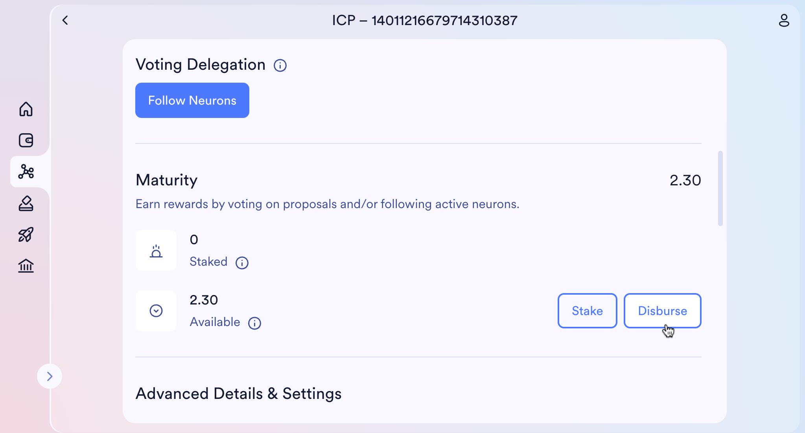
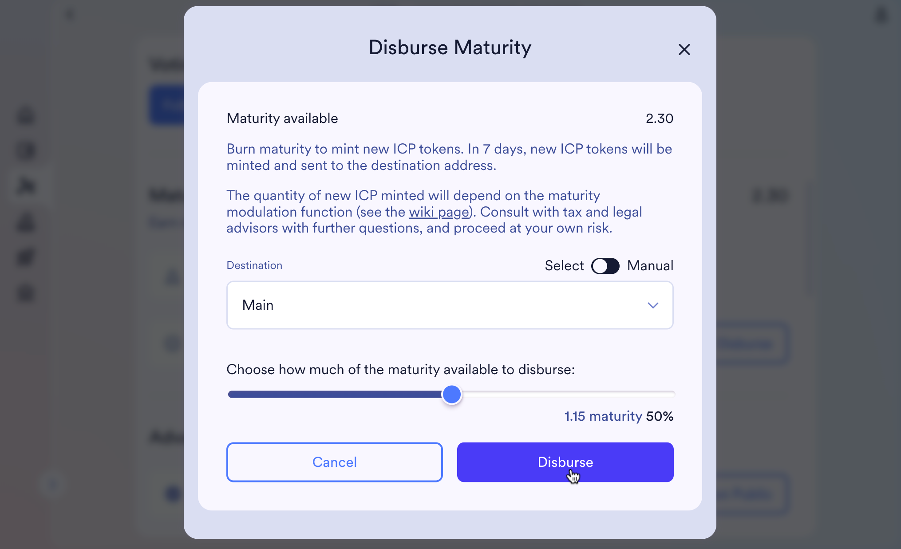
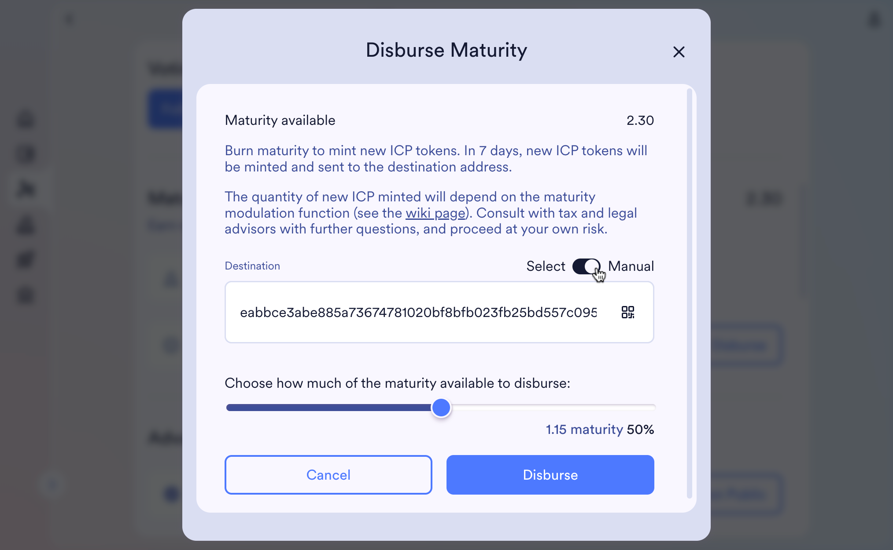
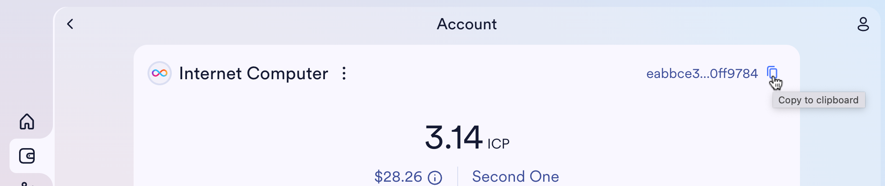
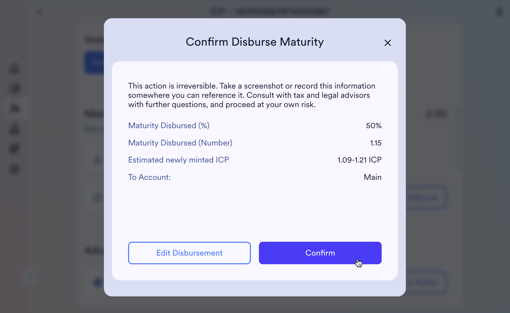
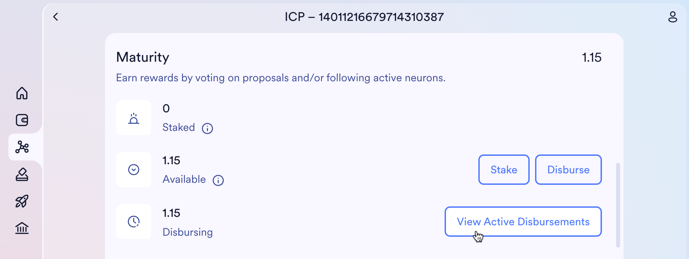
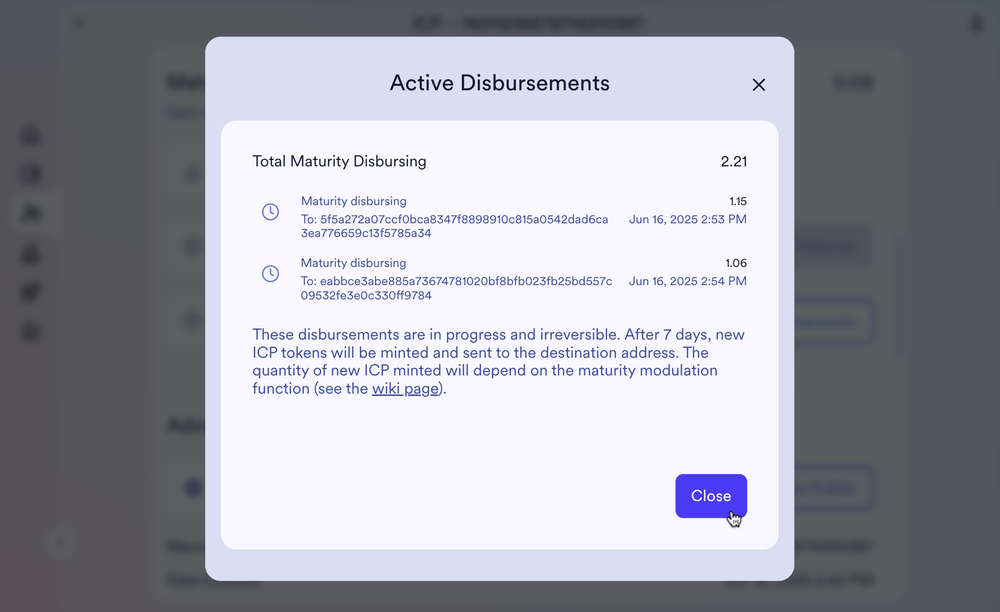

import { MarkdownChipRow } from "/src/components/Chip/MarkdownChipRow";
import "/src/components/CenterImages/center.scss";

# Advanced neuron operations

<MarkdownChipRow labels={["Intermediate", "Governance", "Tutorial"]} />

Once you're more familiar with the NNS, you might want to explore additional
neuron operations using the NNS dapp.

For more background on neurons, including voting rewards and detailed explanations of available operations, refer to the [neurons overview](https://learn.internetcomputer.org/hc/en-us/articles/34084120668692-NNS-Neurons).

## Maturity Disbursement

As you vote on proposals (either directly or by following other neurons), your
neuron's maturity increases. This maturity represents your accumulated
governance rewards.

When you have at least 1.05 of maturity that is not staked, you can disburse it.
This operation burns the maturity and schedules the minting of new ICP tokens.
After 7 days, new ICP will be minted to the selected destination
address.

> **Note:** For Ledger devices, [Spawn Neuron](#spawn-new-neurons) is available.
> Support for **Disburse Maturity** will be added later.

### Disburse Maturity

- #### Step 1: In the [staking page](https://nns.ic0.app/neurons/?u=qoctq-giaaa-aaaaa-aaaea-cai) of the NNS dapp, navigate to the neuron whose maturity you want to disburse. Click **Disburse** in the **Maturity** section.

- #### Step 2: In the form that opens, select both the percentage of maturity to disburse and the destination account.

You can choose one of your associated accounts or enter any NNS account
identifier manually. Manual input is available either as plain text or via QR
code (found by clicking the **Receive** button on the wallet page).

You can copy the account identifier from the account page.

- #### Step 3: After clicking **Disburse**, you'll be taken to an overview step where you can review and confirm the disbursement parameters.

- #### Step 4: When a disbursement is in progress, a **View Active Disbursements** button appears in the **Maturity** section.

This opens the **Active Disbursements** modal, which shows all disbursements in
progress—including their start time, destination address, and the amount of
maturity being disbursed.

> Note that you cannot have more than 10 ongoing disbursements. If you have 10,
> you need to wait for at least one disbursement to finish before adding another
> one.

---

## Spawn New Neurons

### Spawn your voting rewards into a new neuron

The old way of converting maturity into ICP utility tokens is via spawning the
newly minted ICP into a neuron from where you can extract the ICP after 7 days.

> **Info:** It is recommended to only use spawn maturity for neurons controlled
> by Ledger devices. For all other cases, it is recommended to use disburse
> maturity (not yet supported by the Ledger device). Going forward, spawning
> neurons might be deprecated.

### How to spawn a new neuron

- #### Step 1: In the NNS dapp, open the **Neuron Staking** section, then select the neuron that has reached the required maturity.

- #### Step 2: Click **Spawn Neuron**, then follow the prompts to complete the process.
