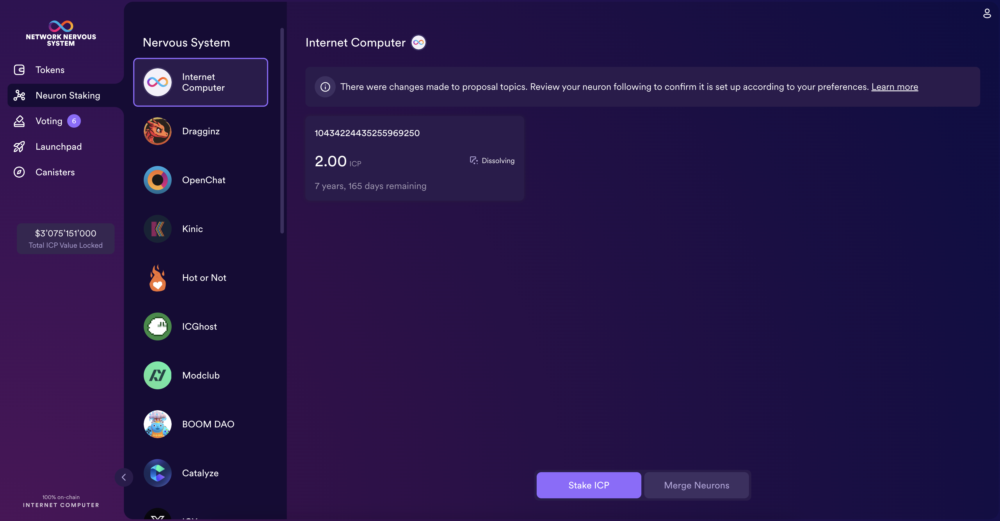
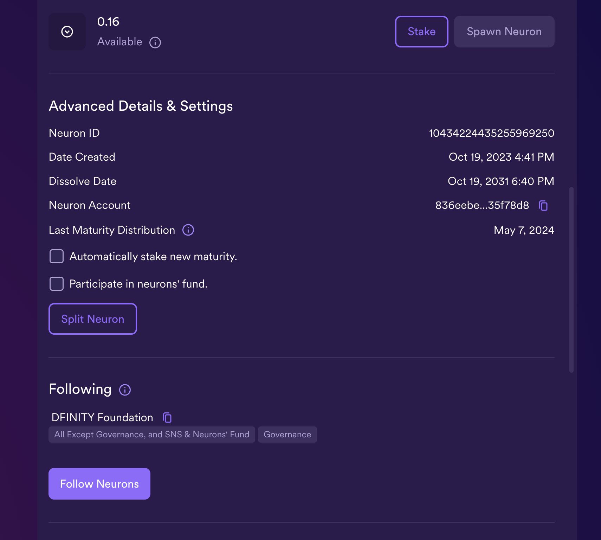
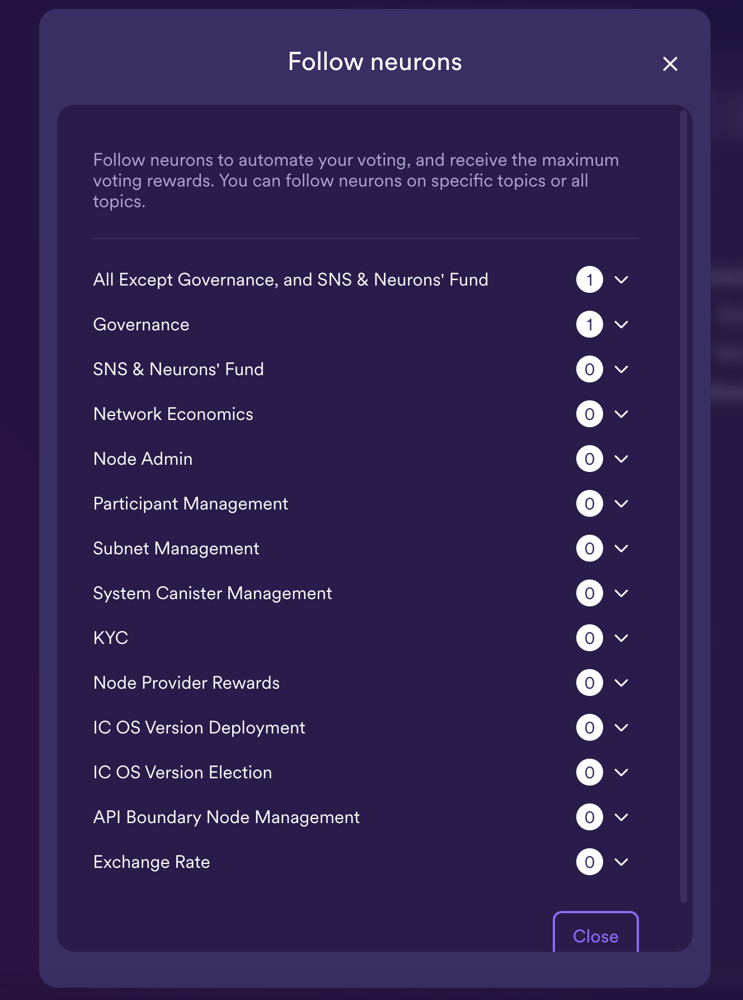
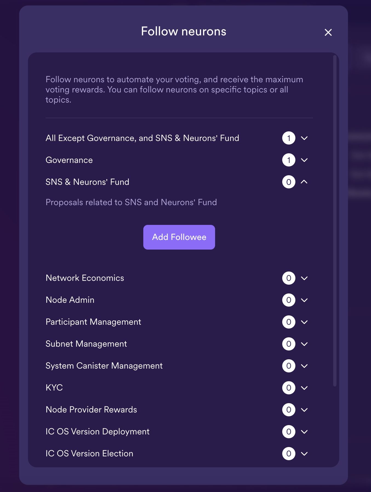
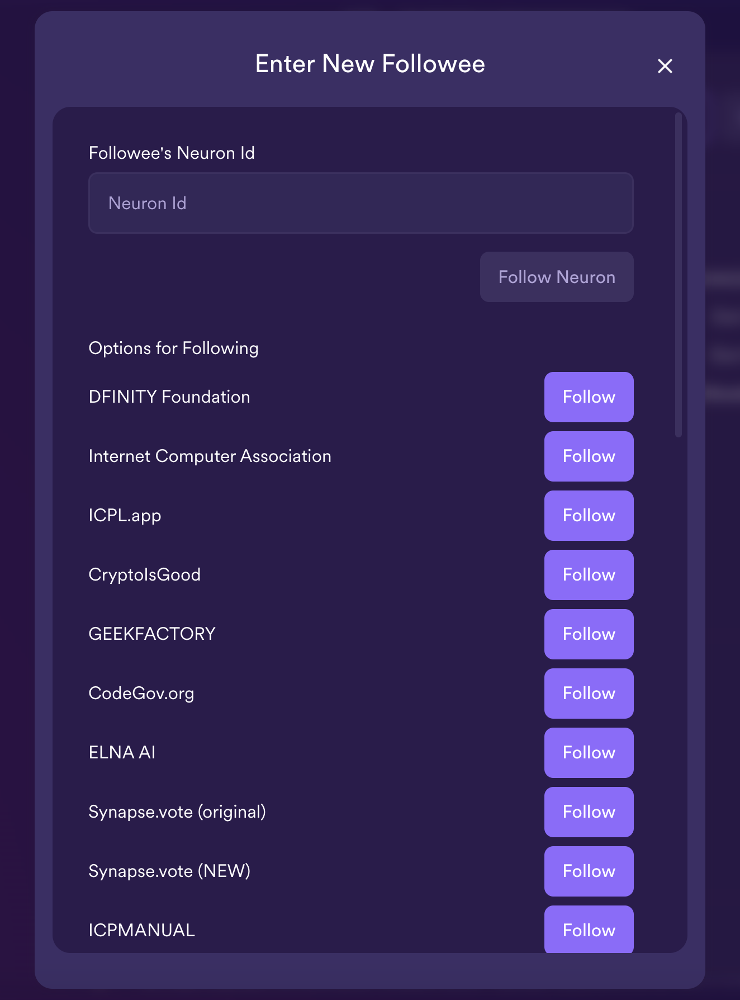
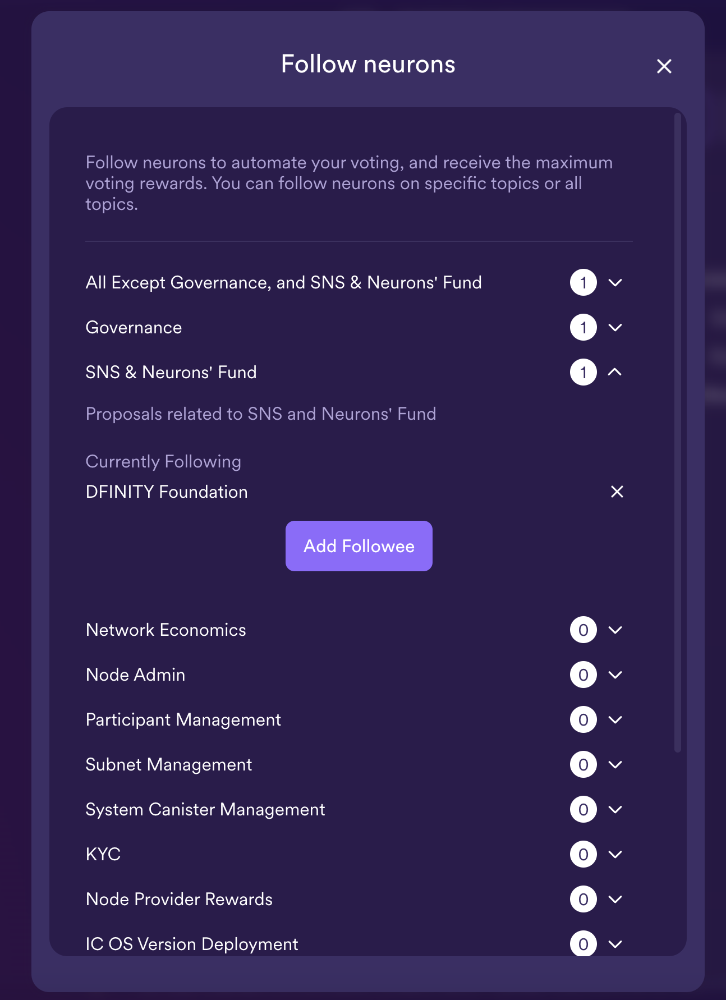
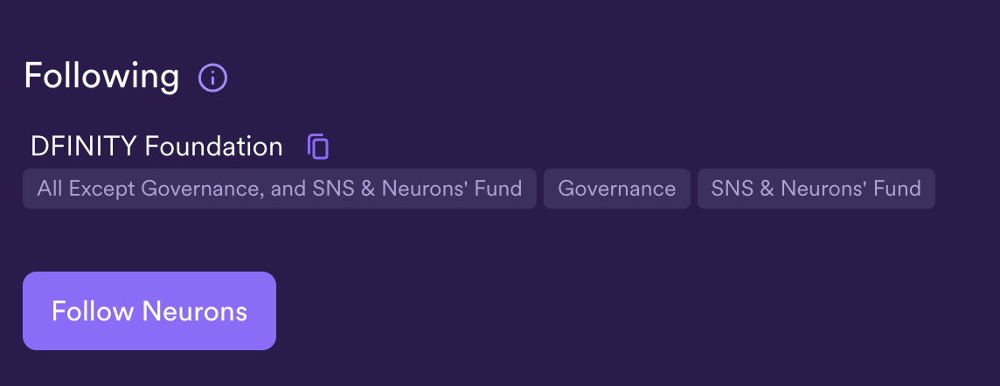

import { MarkdownChipRow } from "/src/components/Chip/MarkdownChipRow";
import '/src/components/CenterImages/center.scss';

# Configuring neuron following

<MarkdownChipRow labels={["Beginner", "Governance", "Tutorial"]} />

 

<iframe width="660" height="415" src="https://www.youtube.com/embed/6BznC9p3w8w?si=m7nc7xTGq5YUtXa3" title="YouTube video player" frameborder="0" allow="accelerometer; autoplay; clipboard-write; encrypted-media; gyroscope; picture-in-picture; web-share" referrerpolicy="strict-origin-when-cross-origin" allowfullscreen></iframe> 

Neuron owners may find it hard to manually vote on every proposal submitted to the NNS.
For example, they may not have the time or necessary expertise to evaluate each individual proposal.
The NNS uses a form of liquid democracy to address these challenges called **following**.

As it is in each neuron's interest to follow other neurons that support the best interests of the network and their
own, we recommend to study the precise rules of following as well as how you can find neurons to follow on
[Following](/docs/building-apps/governing-apps/nns/concepts/neurons/neuron-following). For information about how you
can become a neuron that can be followed, we refer to [Registering a known neuron](/docs/building-apps/governing-apps/nns/concepts/neurons/becoming-a-known-neuron).

## Setting your neurons' following in the NNS dapp

To configure your neuron to follow a group of another neurons:

- #### Step 1: From the NNS dapp, select 'Neuron Staking', then select the neuron that you'd like to set a following rule for.

- #### Step 2: In the neuron's details, scroll down to the 'Following' section and select 'Follow Neurons'.

- #### Step 3: Next, select a topic to follow.

The topic refers to the different types of proposals; for example, the 'Governance' topic defines a following role for governance-related proposals, while the 'Subnet Management' topic defines a following role for subnet management proposals. There is also a 'catch-all' rule that can be followed for all proposal types except for governance, SNS, and neurons' fund.

For this example, select 'SNS & Neurons' Fund'.

- #### Step 4: Select 'Add Followee'.

- #### Step 5: Enter a Neuron ID to follow, or select a group of neurons from the menu provided.

In this example, select 'DFINITY Foundation'.

- #### Step 6: The window will now reflect the following configuration:

The configuration will also now be shown in the neuron's details:

