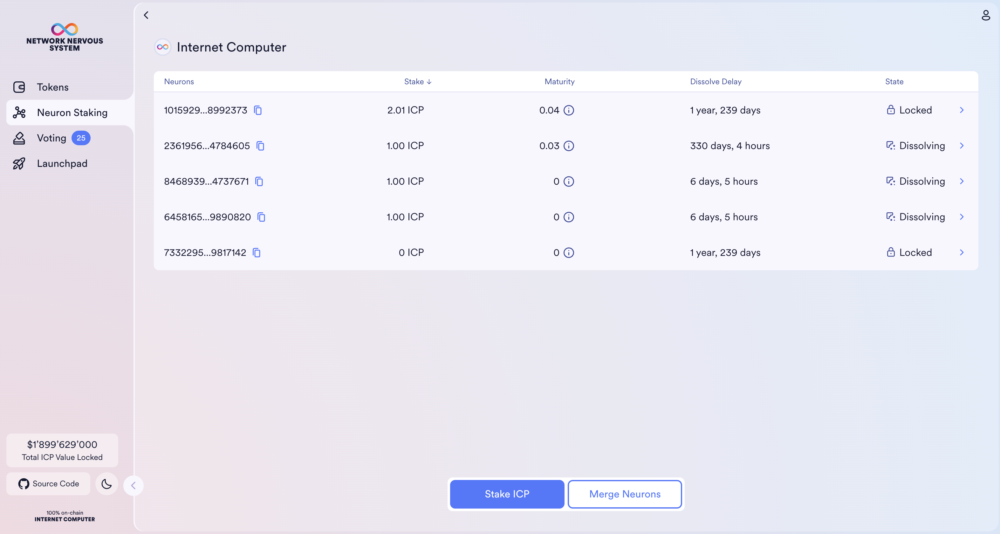
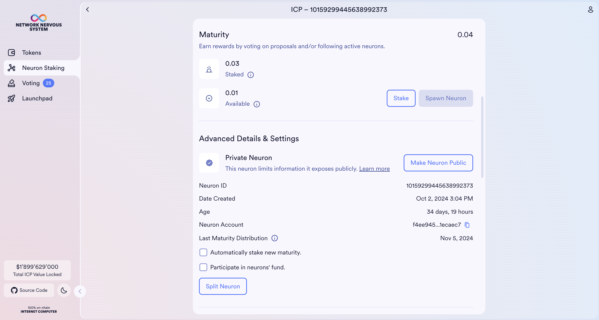
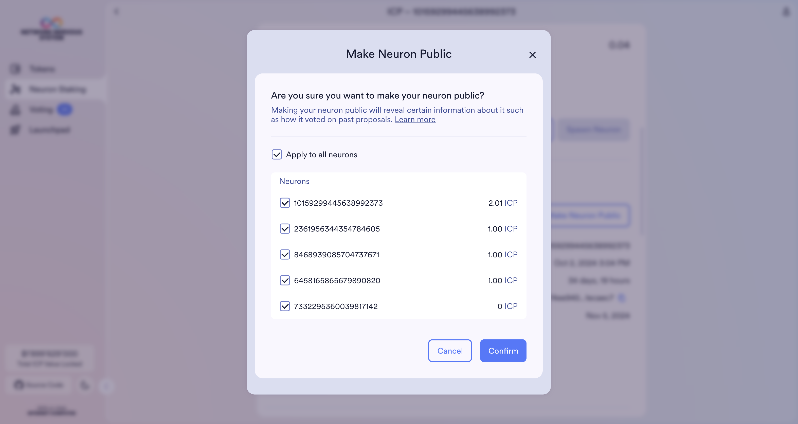
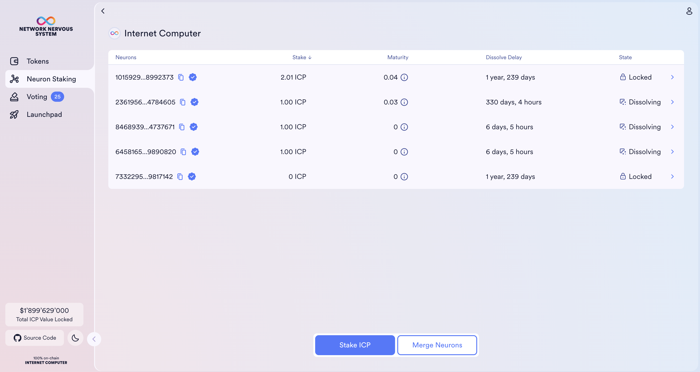

import { MarkdownChipRow } from "/src/components/Chip/MarkdownChipRow";
import '/src/components/CenterImages/center.scss';

# Making neurons public

<MarkdownChipRow labels={["Beginner", "Governance", "Tutorial"]} />

Neuron visibility settings are available in order to support a [neuron index](https://dashboard.internetcomputer.org/proposal/48491) while respecting neuron holders' privacy. A neuron can be private or public. For public neurons, anyone who knows the neuron's ID can see the full neuron's details, including how they vote on proposals. [Learn more about the differences between private and public neurons](https://learn.internetcomputer.org/hc/en-us/articles/34084120668692-NNS-Neurons#neuron-visibility).

## How to change your neuron's visibility

- **Step 1:** Go to the [NNS dapp](https://nns.ic0.app/) and sign in with your [Internet Identity](/docs/building-apps/authentication/overview).

- **Step 2:** Navigate to **Neuron Staking**, and click on the neuron you would like to make public.

- **Step 3**: Scroll down and click on **Make Neuron Public**.

- **Step 4**: Select all neurons you wish to make public and click **Confirm**.

From the neurons table, you should now see a checkmark next to neurons that are public.

