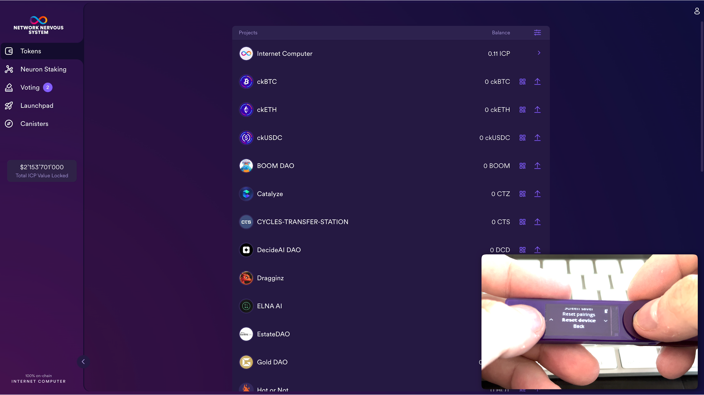
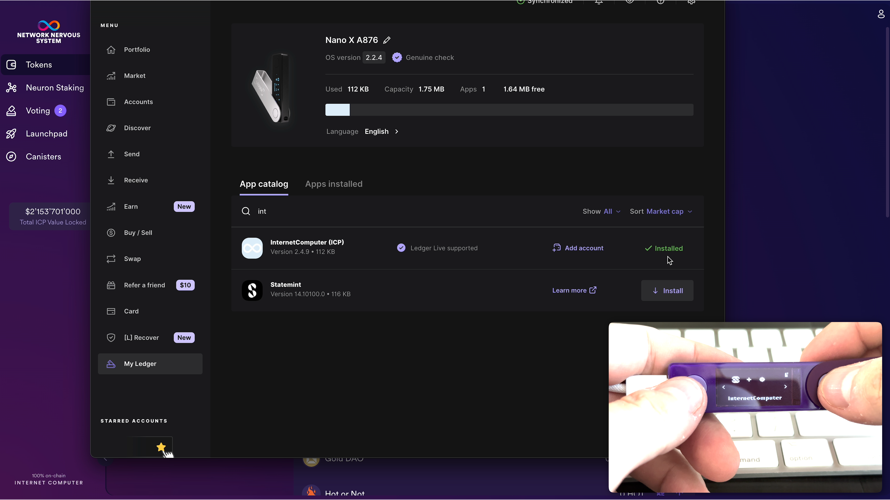
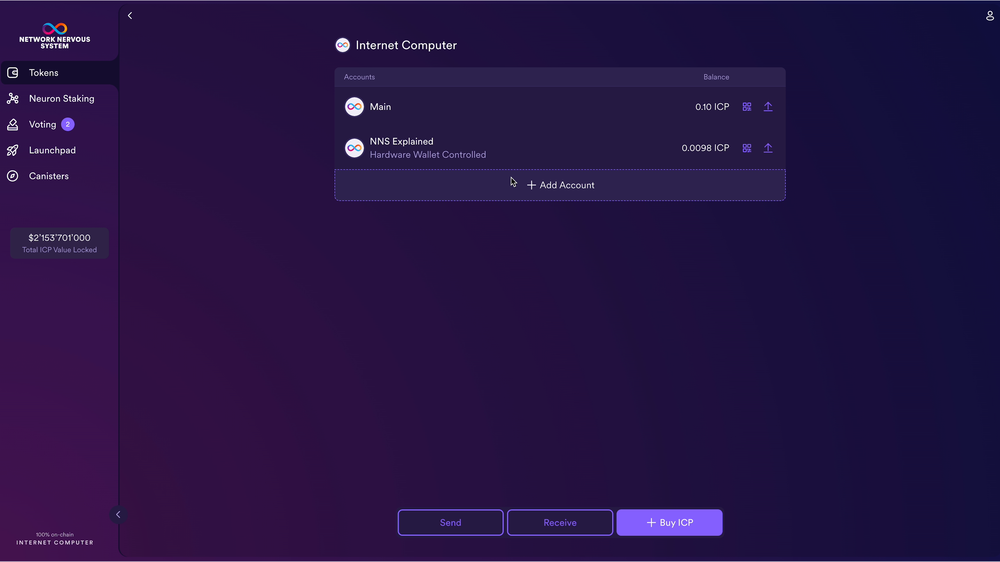
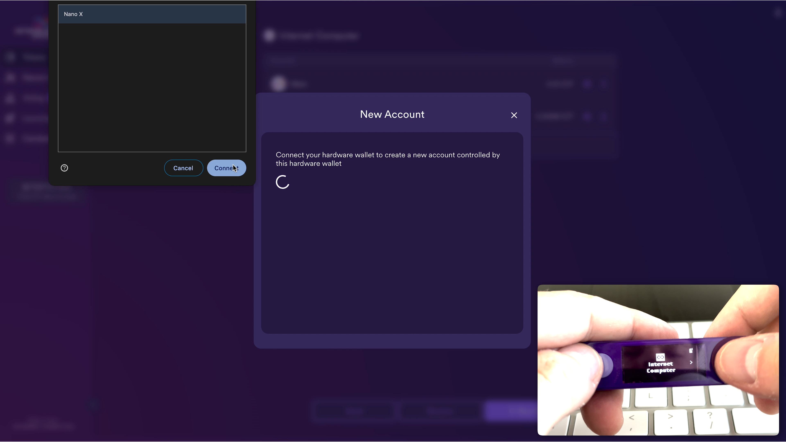
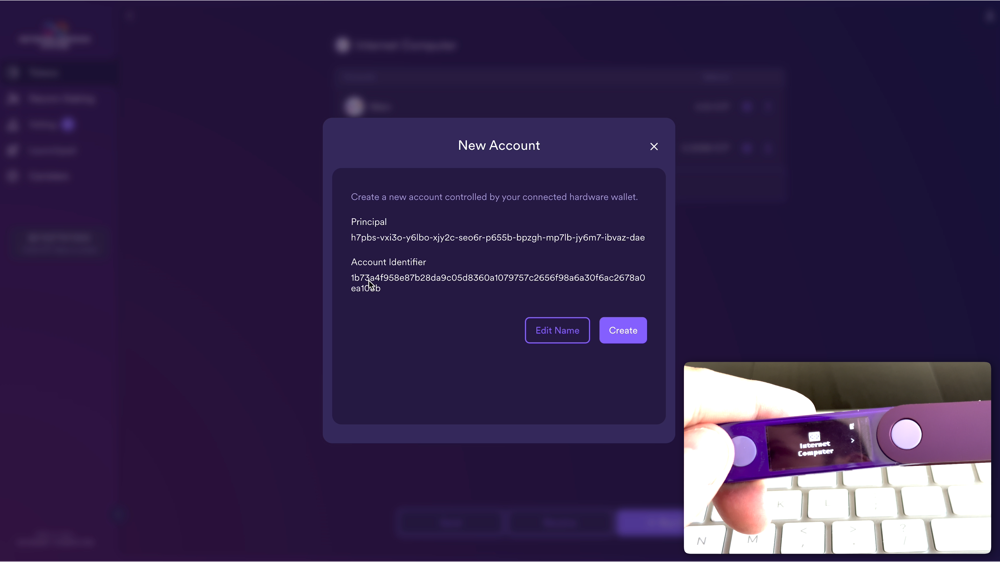

import { MarkdownChipRow } from "/src/components/Chip/MarkdownChipRow";
import '/src/components/CenterImages/center.scss';

# Accessing neurons created with quill

<MarkdownChipRow labels={["Intermediate", "Governance", "Tutorial"]} />

 

<iframe width="660" height="415" src="https://www.youtube.com/embed/lKbYUmqF7J4?si=jIvx5rEza7BnMchE" title="YouTube video player" frameborder="0" allow="accelerometer; autoplay; clipboard-write; encrypted-media; gyroscope; picture-in-picture; web-share" referrerpolicy="strict-origin-when-cross-origin" allowfullscreen></iframe> 

You may have neurons controlled by a principal ID that was created using [quill](https://github.com/dfinity/quill/). In this case, it may be inconvenient to manage your neurons through the terminal. If you know the seed phrase of this principal ID, you can use a Ledger hardware wallet to manage your neurons through the [NNS dapp](https://nns.ic0.app/).

## How to access neurons controlled by a principal ID created with quill

To follow this process, you may want to set up a new Ledger device. If you do, skip **step 1** and **step 2**. See warning message below for more information.

- **Step 1**: Unlock your Ledger device and navigate to **Settings Manage device** > **Security** > **Reset device**

- **Step 2**: Type in your PIN to reset your Ledger device.

:::caution
**Warning**: This process will reset the private key of your Ledger device. **You will no longer have access to digital assets you hold on this device.**

While you can always regain access by resetting the device with its current seed phrase, you may want to use a new Ledger device to continue. In general, it is advised to securely store your seed phrase.
:::

- **Step 3**: After your Ledger device has been successfully reset, navigate to **Restore from Recovery phrase**.

- **Step 4**: Select the number of words in your seed phrase, and enter the seed phrase of the principal ID that controls the neurons you would like to access.

- **Step 5**: Install the **Internet Computer** app on your Ledger device.

- **Step 6**: Go to the [NNS dapp](https://nns.ic0.app/) and Sign in with **Internet Identity**.

- **Step 7**: Go to **Tokens** > **Internet Computer** > **+ Add Account** and select **New Account (Hardware Wallet)**.

- **Step 8**: While your Ledger device is connected to your computer, select your device from the popup to connect.

- **Step 9**: You can verify the principal ID and account ID, then click **Create**.

- **Step 10**: Select the ICP account you just created

- **Step 11**: Click **Show Neurons** and approve the transaction on your Ledger device

- **Step 12**: Click **Add to NNS Dapp** to add your NNS Dapp principal ID as a hotkey to the neurons. This allows you to see and manage your neurons using the NNS Dapp. For all actions outside of voting and changing following, you will need to have your Ledger device connected and approve the action.
