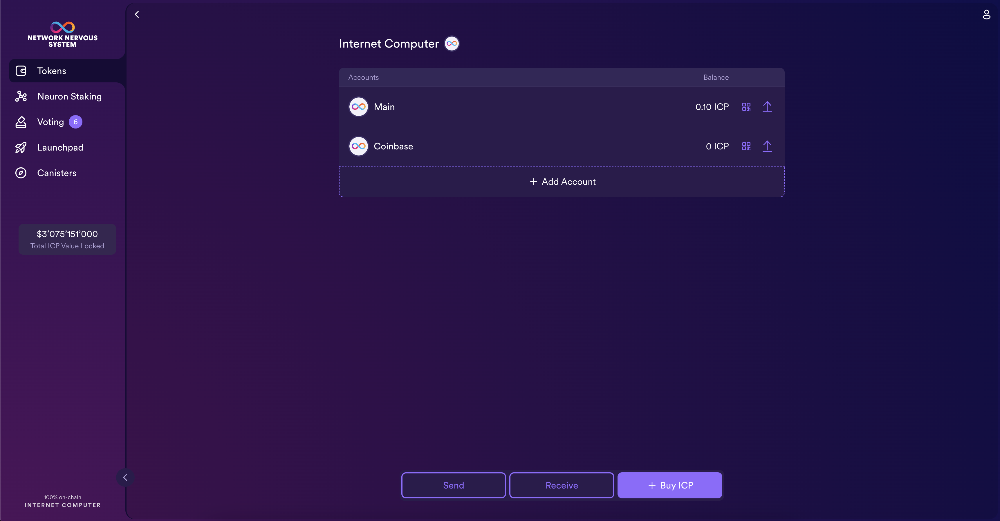

import { MarkdownChipRow } from "/src/components/Chip/MarkdownChipRow";
import '/src/components/CenterImages/center.scss';

# Receiving ICP tokens

<MarkdownChipRow labels={["Beginner", "Governance", "Tutorial"]} />


When you log into the NNS dapp for the first time you will not yet have any ICP tokens in your wallet.
Therefore, you first might want transfer some tokens to the NNS dapp wallet.
This also the first step required for staking a neuron with the NNS dapp.

## Get tokens from an exchange
If you already have ICP tokens on an exchange, you can transfer some of them to your NNS dapp account as explained in this video:
<div class="text--center">
<p> </p>
</div>
<div class="text--center">
<iframe width="660" height="415" src="https://www.youtube.com/embed/XU54fbCzFmE?si=NU3rq9Pz7GlGW3ar" title="YouTube video player" frameborder="0" allow="accelerometer; autoplay; clipboard-write; encrypted-media; gyroscope; picture-in-picture; web-share" referrerpolicy="strict-origin-when-cross-origin" allowfullscreen></iframe> </div>

- #### Step 1: Open one of your accounts in the ICP wallet.


- #### Step 2: Find the address to send the tokens to in the top right corner and can copy it by clicking on the symbol next to the number.

- #### Step 3: Go to your exchange and send tokens to the address you just copied.

Using this, you can send tokens from any exchange that supports sending ICP.
The tokens should be visible in your wallet within a few seconds or minutes.

:::info
Not all exchanges support all features. It is advised to check with the exchange to be sure it supports the workflow described above.
:::

## Get tokens from a developer identity using the CLI

If you have selected self-custody for holding your ICP utility tokens, and the tokens are associated with your developer identity instead of your registered Internet Identity, you need to transfer the ICP utility tokens to your NNS account if you want to manage them using the [NNS dapp](https://nns.ic0.app).

To transfer ICP utility tokens controlled by your developer identity:

- #### Step 1:  Open a terminal shell on your local computer.

- #### Step 2:  Check that you are using an identity with control over the ledger account by running the following command:

``` bash
dfx identity whoami
```

In most cases, you should see that you are currently using your `default` developer identity. For example:

```
default
```

- #### Step 3:  View the textual representation of the principal for your current identity by running the following command:

``` bash
dfx identity get-principal
```

This command displays output similar to the following:

```
tsqwz-udeik-5migd-ehrev-pvoqv-szx2g-akh5s-fkyqc-zy6q7-snav6-uqe
```

- #### Step 4:  Check the current balance in the ledger account associated with your identity by running the following command:

``` bash
dfx ledger --network ic balance
```

- #### Step 5:  Transfer ICP utility tokens to your Main account or a linked subaccount you create by running a command similar to the following:

``` bash
dfx ledger --network ic transfer <destination-account-id> --icp <ICP-amount> --memo <numeric-memo>
```

To find your account on the NNS dapp wallet, proceed as explained above.
For example, assume your account is `0dff47055d84fd0d89cc55ff477c24026b5c2c9175f8fd36bcb66bb68cac81be`

If you want to transfer 1 ICP utility token to this account, you can run the following command:

```
dfx ledger --network ic transfer 0dff47055d84fd0d89cc55ff477c24026b5c2c9175f8fd36bcb66bb68cac81be --memo 12345 --icp 1
```

:::info
This example illustrates how to transfer ICP utility tokens using a whole number with the `--icp` command line option.
-   You can also specify fractional units of ICP utility tokens—called **e8s**—using the `--e8s` option, either on its own or in conjunction with the `--icp` option.
-   Alternatively, you can use the `--amount` to specify the number of ICP utility tokens to transfer with fractional units up to 8 decimal places, for example, as `5.00000025`.
:::

The destination address can be any address in the ledger canister which might correspond to:

- A wallet that is owned by a developer principal.
- An account you have added using the NNS dapp.
- An address for a wallet you have on an exchange.

If you transfer the ICP utility tokens to an account in the [NNS dapp](https://nns.ic0.app), you might need to refresh the browser to see the transaction reflected.

For more information about using the `dfx ledger` command line options, see [dfx ledger](/building-apps/developer-tools/dfx/dfx-ledger).


## Send ICP tokens with your NNS dapp account
Once you have ICP tokens in your NNS dapp account, you can send them to other accounts by following these steps.

- #### Step 1: On the default 'Tokens' tab, assure that the Internet Computer token has been selected, then click **Send** on the bottom of the window.



- #### Step 2: In the 'Send' window, select your linked account or wallet for the source, then input the destination address and the amount of ICP to send.

Transactions are charged a ledger fee, which is independent from the NNS dapp and applies to any transaction. For ICP tokens, this fee is 0.0001 ICP.

The maximum amount you can send is your token balance minus the ledger fee. The minimum amount you can send is 0.00000001 ICP.


- #### Step 3: Then select **Continue** to send the transaction.

Similarly to the CLI transfer above, the destination address can be any address in the ledger canister.