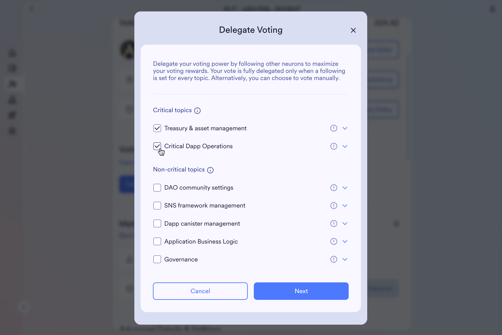

# SNS vote delegation

Through the NNS dapp you can delegate your voting power in an SNS DAO by _following_ other SNS neurons.  
It is important to be aware of the rules of vote delegation such as what effect it has to delegate to multiple other neurons. [Learn more about following and vote delegation.](https://learn.internetcomputer.org/hc/en-us/articles/34084687583252-Neurons).

Each SNS can categorize their proposals into **proposal topics** and vote delegation is done on a per-topic basis.  
However, prior to April 2025, SNS vote delegation was based on each individual proposal type. Therefore, before users set the delegations based on topics for the first time, their old legacy following is still applied and visible in the NNS dapp. 

You might also find [the video tutorial on NNS vote delegation](https://www.youtube.com/watch?v=6BznC9p3w8w&list=PLuhDt1vhGcrclxfmztDd6OKE80dnrFmG6&index=5) helpful, as most of the concepts are very similar.

## Set or change vote delegation in an SNS DAO

- #### Step 1: To change the vote delegations of an SNS neuron, first go to "Neuron Staking" and choose the SNS DAO where you want to perform this action. 

- #### Step 2: Select a neuron for which you would like to set following and scroll to the "Voting Delegation" section.

- #### Step 3 [optional]: View topic descriptions.

As each SNS DAO has different kinds of proposals, it is up to each SNS DAO to group the proposals into topics. If you are a more advanced user and would like to learn the details of which proposals are in which topic, you can do so by clicking on "View topic definitions." This will lead you to view the topic definition list that defines all proposal types that have been categorized into each topic by a particular SNS DAO.

- #### Step 4: Close the "Topic Definition List" modal (if open), then click on "Follow Neuron" to set or change your vote delegation. 

You will see a new view, "Delegate Voting," where you will see your current settings. The proposal topics are divided into two sections showing the critical and non-critical topics. Critical proposals follow stricter rules on what criteria need to be met for a proposal to be adopted, and because they are usually about more fundamental DAO decisions, you might want to consider different aspects when setting following on these topics. 

You can find more details about the difference between critical and non-critical proposals in [Decision rules for critical and non-critical proposals](https://learn.internetcomputer.org/hc/en-us/articles/34146571133204-Proposals#h_01JJ75Z3FKG8Q9TE470AFBJ4VC).

For each topic where you have set a vote delegation to one or more neurons, you will see a green tick at the end of the line.

- #### Step 5: To either change a setting or choose one for a topic that you haven't covered, first choose the topics for which you would like to delegate your voting power. 

You can choose one or more topics by selecting them.

- #### Step 6: You will be led to a new page where you can enter the neuron ID of the neuron that you would like to delegate your voting to. 

Enter the neuron's ID and select "Follow Neuron."

You should now see that the topics you just updated have a green tick. 

To add additional delegates (also called "followees") to the same neuron, you can repeat the process. By selecting the arrow next to a topic, you can see the list of neuron IDs to whom you are currently delegating your voting power in this topic.

## Legacy vote delegation (based on proposal types)

Prior to April 2025, SNS following (or vote delegation) was based on individual proposal types, not topics. Therefore you may have following set for all proposal types, but not yet for topics.

- #### Step 1: Follow steps 1–4 above to reach the "Delegate Voting" page for an SNS neuron for which you would like to update the vote delegation.

You will not see any green ticks; however this does not mean that vote delegation is not active. It means that you haven't set up topic-based vote delegation for any of the topics. Indeed, if you have legacy following (based on proposal types), the SNS governance will still apply those rules if you haven't covered the proposal type by any topic.

- #### Step 3: To see your legacy following, you can select the arrow next to a topic. 

You will see all underlying types for which you have vote delegations set.

- #### Step 4: Remove legacy voting.

To remove the legacy following, you have two options:

1. You can use the cross icon next to the delegate, which will remove the particular choice for this proposal type.  

2. You can delegate voting power based on the topic. This will automatically overwrite/remove all choices for the proposal types that fall under the chosen topic in this SNS DAO. 

## Legacy vote delegation: special case "Catch-All"

In the legacy vote delegation (based on proposal types), there was a special case called "Catch-All". If you followed a neuron on the catch-all, this would include following the neuron on all non-critical proposal types. 

* To see the legacy catch-all following, follow steps 1–5 above. If you have legacy catch-all following, this is also shown when you expand the information for a given topic.

- **Step 6:** To remove the legacy following, you again have two options:
  a) Since you cannot remove the catch-all in just one topic, there is an option to remove it for all topics, called "Deactivate catch-all". You can find it next to the non-critical topics, as the catch-all is only applied to non-critical proposals.  
  b) You can set following for all topics. As soon as you cover all non-critical topics, the catch-all is removed, as it is not relevant anymore (all proposals are covered with an explicit choice already).  