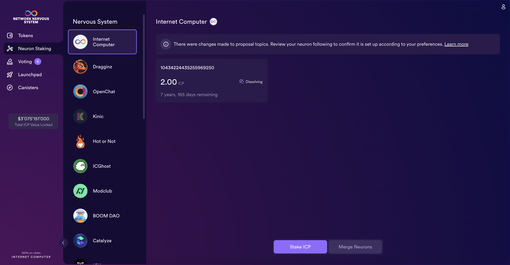

import { MarkdownChipRow } from "/src/components/Chip/MarkdownChipRow";
import '/src/components/CenterImages/center.scss';

# Staking a neuron

<MarkdownChipRow labels={["Beginner", "Governance", "Tutorial"]} />

When a person or organization has ICP utility tokens locked up in a neuron, they can propose and vote on governance proposals.
To encourage participation, neuron holders are also rewarded for voting in proportion to the number of ICP utility tokens they have locked up,
the length of the lock-up period, called the *dissolve delay*, and the age of their neuron.

After network participants create a neuron, the locked balance of ICP utility tokens can only be unlocked by fully **dissolving** the neuron.
It's **dissolve delay** determines the time it takes for a neuron to be unlocked once it is in the dissolving state.
A dissolving neuron can always be put back into the non-dissolving state.
When the dissolve timer reaches zero, the neuron owner can dissolve the neuron and unlock the neuron's balance of ICP.

## Stake ICP utility tokens in a neuron

After you transfer ICP utility tokens to the NNS dapp, you can use it to create and manage neurons,
vote on proposals, and create canisters on the Internet Computer.

Neurons are required to participate in governance to earn rewards. To create a neuron, you must lock up some number of ICP utility tokens for a period of time.
The minimum stake required to create a neuron is 1 ICP utility token. You can configure the period of time the stake is locked from 6 months up to a maximum of 8 years.

 

<iframe width="660" height="415" src="https://www.youtube.com/embed/3o0eBOaHP_4?si=k7vR9eulGzK_iLiY" title="YouTube video player" frameborder="0" allow="accelerometer; autoplay; clipboard-write; encrypted-media; gyroscope; picture-in-picture; web-share" referrerpolicy="strict-origin-when-cross-origin" allowfullscreen></iframe> 

To stake ICP utility tokens:

- #### Step 1:  In the NNS dapp, select **Neuron Staking** from the left navigation bar, then click **Stake Neurons** in the bottom of the window.

- #### Step 2 :  Select which wallet you'd like to use as the source, then type the number of ICP utility tokens to stake, then click **Create**.

- #### Step 3:  Set the dissolve delay for the neuron to control the length of time the stake is locked, then click **Update Delay**.

For example:

- #### Step 4:  Click **Confirm and Set Delay** to confirm the lock up period.

## What you can do after creating a neuron
After you have locked the stake and created a neuron, you can set it up and modify it.
These are some of the things you can modify:

-   Start the dissolve delay timer by clicking **Start Unlock**.
-   Increase the dissolve delay period by clicking **Increase Dissolve Delay**.
-   Stop the dissolve delay after starting the unlock countdown by clicking **Lockup**.
-   Increase the number of ICP utility tokens you have staked.

For more tutorials on what you can do with your neuron, we refer to
[Advanced neuron operations](/docs/building-apps/governing-apps/nns/using-the-nns-dapp/nns-dapp-advanced-neuron-operations).

### Start and stop dissolving the neuron

Creating a new neuron does not automatically start the dissolve delay timer. You must explicitly start the timer countdown by clicking **Start Unlock**.

For example, if you set a dissolve delay of 1 year and want to immediately begin the countdown, you should click **Start Unlock** as part of the process of creating the neuron. If you change your mind and want to stop a current countdown in progress, you can click **Lockup**.

After you click **Lockup** to stop the dissolve delay, you can click **Start Unlock** to resume the countdown without changing the existing dissolve delay period. If you want to continue a countdown already in progress but extend the lock up period, you can click **Increase Dissolve Delay** then select a longer dissolve delay.

### Top up an existing neuron with additional ICP utility tokens

After you create a neuron, you can increase the number of ICP utility tokens you have staked in that neuron to increase your voting power and rewards. For example, if you initially stake a small number of ICP utility tokens, then decide to purchase additional tokens, you have the option to create a new neuron or "top-up" your existing neuron.

To increase the stake in an existing neuron:

- #### Step 1:  Follow the steps in [stake ICP utility tokens in a neuron](#stake-icp) to stake the original neuron using the [Network Nervous System (NNS)](https://nns.ic0.app) dapp.

- #### Step 2:  Look up the transaction in the Internet Computer Association [transaction dashboard](https://dashboard.internetcomputer.org/transactions) to get the neuron address.

You can use the account identifier for your main ICP ledger account to search for your transactions.

- #### Step 3:  Return to the [Network Nervous System (NNS)](https://nns.ic0.app) dapp, then from the 'My Neuron Staking' window, click **New Transaction**.

- #### Step 4:  Paste the neuron address from the transaction dashboard into the **Destination** address field, then click **Continue**.

- #### Step 5:  Type the amount of ICP utility tokens you want to add to the specified neuron, then click **Continue**.

- #### Step 6:  Verify the transaction details, then click **Send Now**.

- #### Step 7:  Once the transaction has completed, you will see the increased stake value.

### Disburse a dissolved neuron into an account

When the dissolve delay timer for a neuron reaches zero, you can disburse the neuron’s stake and transfer its locked ICP utility token balance to the ledger account you specify.

To disburse a neuron and return its ICP utility tokens:

- #### Step 1:  From the NNS dapp, select 'My Neuron Staking', then click on an unlocked neuron that has reach the ended of its dissolve delay period.

- #### Step 2:  Click **Disburse**:

- #### Step 3:  Type an address or select an account to receive the ICP utility tokens.

- #### Step 4:  Verify the transaction information, then click **Confirm and Send**.

