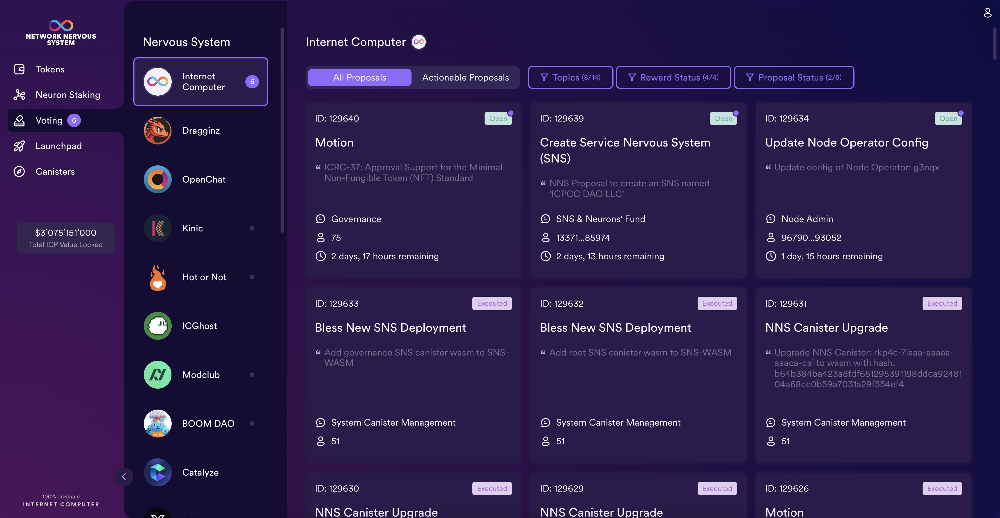
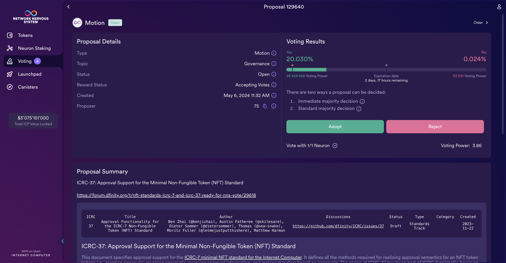

import { MarkdownChipRow } from "/src/components/Chip/MarkdownChipRow";
import '/src/components/CenterImages/center.scss';

# Voting on proposals

<MarkdownChipRow labels={["Beginner", "Governance", "Tutorial"]} />

 

<iframe width="660" height="415" src="https://www.youtube.com/embed/TGY6AF110e8?si=D3xFV1fq9bzUO4is" title="YouTube video player" frameborder="0" allow="accelerometer; autoplay; clipboard-write; encrypted-media; gyroscope; picture-in-picture; web-share" referrerpolicy="strict-origin-when-cross-origin" allowfullscreen></iframe> 

Active participation in governance is an important factor in the long-term health of the Internet Computer and participants receive voting rewards.

To maximize your rewards, you should vote on as many proposals as possible.
This can be done by voting manually or by delegating your voting power to other neurons using [following](/building-apps/governing-apps/nns/using-the-nns-dapp/nns-dapp-voting-on-proposals).

To manually vote on proposals:

- #### Step 1:  From the NNS dapp, select 'Voting' from the left navigation bar.

- #### Step 2: Then, select which Nervous System you'd like to view proposals for.

By default, the Internet Computer NNS proposals are shown, but other proposals for SNSes like OpenChat and Kinic are also available.

- #### Step 3:  Click on any proposals to view more information on it, such as the proposals summary, the type of proposals, the topic, and when the proposal's voting ends.

By default, the NNS dapp will show you all **actionable proposals** where you have neurons that are eligible to vote. This includes the proposals of all DAOs, NNS and SNSes, where you have neurons.

If you would like to look only at proposals of one DAO, for example the NNS, you can select the respective "Nervous System" on the left.
You can also use the selection on top to see all proposals, including the ones where you cannot take any action, for example because you do not have a neuorn that is eligible to vote or because you already voted.
Moreover, you can use the filter on the top right to only see proposals of a specific topic or in a specific status.

:::info
For more information about voting and voting rewards, see the following articles:

-   [Earn substantial voting rewards by staking in the Network Nervous System](https://medium.com/dfinity/earn-substantial-voting-rewards-by-staking-in-the-network-nervous-system-7eb5cf988182)

-   [Understanding the Internet Computer’s Network Nervous System, neurons, and ICP utility tokens](https://medium.com/dfinity/understanding-the-internet-computers-network-nervous-system-neurons-and-icp-utility-tokens-730dab65cae8)

-   [Getting started on the Internet Computer’s Network Nervous System app and wallet](https://medium.com/dfinity/getting-started-on-the-internet-computers-network-nervous-system-app-wallet-61ecf111ea11)

For more advanced information about proposals' lifecycle and how to verify proposals in depth when voting,
refer to [Proposals](https://learn.internetcomputer.org/hc/en-us/articles/34084113508500-Proposals)
and [Verify proposals](/building-apps/governing-apps/nns/concepts/proposals/verify-proposals).
:::
