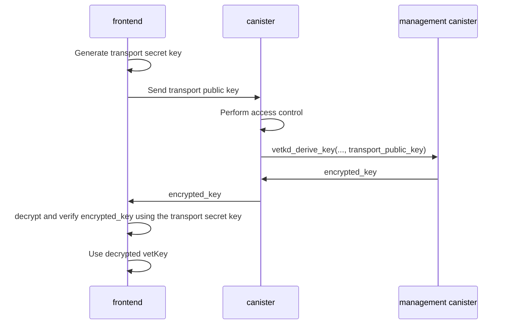

import TabItem from "@theme/TabItem";
import { AdornedTabs } from "/src/components/Tabs/AdornedTabs";

# vetKD API

As described in the [previous section](/docs/building-apps/network-features/vetkeys/introduction), vetKD is the protocol for deriving vetKeys.
The management canister provides the following low-level APIs for the vetKD protocol.

```candid
  vetkd_public_key : (record {
    canister_id : opt canister_id;
    context : blob;
    key_id : record { curve : vetkd_curve; name : text };
  }) -> (record { public_key : blob; });
  vetkd_derive_key : (record {
    input : blob;
    context : blob;
    transport_public_key : blob;
    key_id : record { curve : vetkd_curve; name : text };
  }) -> (record { encrypted_key : blob; });
```

The following key names are supported:

- `dfx_test_key`: Only available on the local development environment started by dfx.

- `test_key_1`: Test key available on the ICP mainnet.

- `key_1`:  Production key that will soon be available on the ICP mainnet.

## How to obtain a vetKey?

Deriving a vetKey involves both the frontend and backend components of the dapp.



### Step 1: Implement canister endpoints
<AdornedTabs groupId="languages">
<TabItem value="rust" label="Rust" default>

```rust
use ic_cdk::management_canister::{VetKDCurve, VetKDDeriveKeyArgs, VetKDKeyId, VetKDPublicKeyArgs};
use ic_cdk::update;

const DOMAIN_SEPARATOR: &[u8] = b"example-vetkd-dapp".as_slice();

/// Derive encrypted vetKey for caller's principal.
#[update]
fn vetkd_derive_key(transport_public_key: Vec<u8>) -> Vec<u8> {
    let caller = ic_cdk::caller();
    let request = VetKDDeriveKeyArgs {
        canister_id: None,
        input: caller.as_slice().to_vec(),
        context: DOMAIN_SEPARATOR.to_vec(),
        key_id: bls12_381_g2_test_key(),
    };
    let reply = vetkd_derive_key(&request).expect("failed to derive key");
    reply.encrypted_key
}

#[update]
fn vetkd_public_key() -> Vec<u8> {
    let request = VetKDPublicKeyArgs {
        canister_id: None,
        context: DOMAIN_SEPARATOR.to_vec(),
        key_id: bls12_381_g2_test_key(),
    };

    let reply =
        ic_cdk::management_canister::vetkd_public_key(&request).expect("failed to derive key");
    reply.encrypted_key.into()
}

fn bls12_381_g2_test_key() -> VetKDKeyId {
    VetKDKeyId {
        curve: VetKDCurve::Bls12_381_G2,
        name: "test_key_1".to_string(),
    }
}
```

</TabItem>
</AdornedTabs>


### Step 2: Generate a transport key pair and pass the transport public key to the canister

<AdornedTabs groupId="languages">
<TabItem value="ts" label="Typescript" default>

```ts
import { DerivedPublicKey, TransportSecretKey } from "@dfinity/vetkeys";

const transportSecretKey = TransportSecretKey.random();
const canisterClient = // get canister client, usually auto-generated code from canister's candid interface
const encryptedVetKeyBytes = await canisterClient.vetkd_derive_key(transportSecretKey.publicKeyBytes());
const encryptedVetKey = EncryptedVetKey.deserialize(encryptedVetKeyBytes);
```

</TabItem>
</AdornedTabs>

### Step 3: Retrieve the vetKD public key from the canister, then decrypt and verify the received encrypted vetKey

<AdornedTabs groupId="languages">
<TabItem value="ts" label="Typescript" default>

```ts
const publicKeyBytes = await canisterClient.vetkd_public_key();
const publicKey = DerivedPublicKey.deserialize(publicKeyBytes);
const myPrincipalBytes = // serialize caller's principal as `Uint8Array`
const vetKey = encryptedVetKey.decryptAndVerify(transportSecretKey, publicKey, myPrincipalBytes);
```

</TabItem>
</AdornedTabs>

The full specification of the vetKD APIs can be found in the [vetKD specification PR](https://github.com/dfinity/portal/pull/3763) (soon to be merged to the [ICP specification](https://internetcomputer.org/docs/references/ic-interface-spec#ic-vetkd_derive_key)).

## API fees

The fees for the vetKD APIs are as defined below. The threshold vetKD test key resides on a regular-sized (13-node) application subnet, while the threshold vetKD production key resides on a 34-node-sized fiduciary subnet. The subnet size of the subnet where the vetKD key resides and the vetKeys are computed defines the resulting cost. The size of the subnet of the calling canister does not matter for the fees. For costs in USD, the USD/XDR exchange rate as of November 23, 2022, has been used.

:::note
If a canister using this feature is intended to be blackholed, but also for other canisters, it is recommended to send more cycles with the call than the advertised cost of the call so that if the subnet size of the signing subnet increases in the future, the higher costs per signature are still covered. Any cycles not charged in a call are refunded.
:::

Fees for deriving one vetKey using the `vetkd_derive_key` API of the management canister:

| Key type                             | Cycles                      | USD                         |
|--------------------------------------|-----------------------------|-----------------------------|
| Test key (`test_key_1`)              | 10_000_000_000              | $0.0132551                  |
| Production key (`key_1`)             | 26_153_846_153              | $0.0346672                  |
