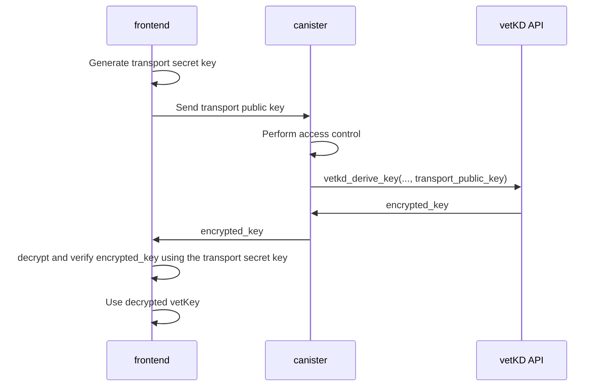

import TabItem from "@theme/TabItem";
import { AdornedTabs } from "/src/components/Tabs/AdornedTabs";

# vetKD API

Verifiably encrypted threshold key derivation (vetKD) is a distributed protocol for securely deriving cryptographic keys, referred to as  _vetKeys_. 
The vetKD API allows canisters to request vetKeys derived using this protocol. Since the key derivation is deterministic, the same inputs will produce the same key, allowing canisters to retrieve keys reliably. Canisters can generate an unlimited number of unique keys by providing different inputs. 

The API provides two methods:

- `vetkd_derive_key`: Derive keys based on the provided inputs.

- `vetkd_public_key`: Returns a public key that can be used to verify keys derived using `vetkd_derive_key`.

Both methods share the following input parameters:

- `context` (`blob`): Serves as a domain separator to ensure that keys are derived within a specific context, preventing collisions between different applications or use cases.

- `key_id` (`record { curve : vetkd_curve; name : text }`): Identifies the master key from which the derived key is created.

Each method also includes method-specific parameters:

- `vetkd_public_key`
  - `canister_id` (`opt canister_id`): Optional. If provided, the method returns the public key associated with the specified `canister_id`. If omitted (`null`), the public key for the calling canister is returned.

- `vetkd_derive_key`
  - `input` (`blob`): Arbitrary data used to derive keys. This acts as a key identifier &mdash; different inputs will result in different derived keys. Note that input does not need to be random.
  - `transport_public_key` (`blob`): The recipient’s public key. This is used to encrypt the derived key for secure transport.

Below is a summary of the vetKD API methods and their parameters.

```candid
  vetkd_public_key : (record {
    context : blob;
    canister_id : opt canister_id;
    key_id : record { curve : vetkd_curve; name : text };
  }) -> (record { public_key : blob; });
  vetkd_derive_key : (record {
    input : blob;
    context : blob;
    transport_public_key : blob;
    key_id : record { curve : vetkd_curve; name : text };
  }) -> (record { encrypted_key : blob; });
```

The following key names are supported:

- `dfx_test_key`: Only available on the local development environment started by `dfx`.

- `test_key_1`: Test key available on the ICP mainnet.

- `key_1`:  Production key that will soon be available on the ICP mainnet.

## Obtaining a vetKey

Deriving a vetKey typically involves both the frontend and backend components of a dapp, as the transport key is usually provided by the user.



### Step 1: Implement canister endpoints

Expose the vetKD endpoints in the backend canister API so that the frontend can retrieve and verify vetKeys.

<AdornedTabs groupId="languages">
<TabItem value="rust" label="Rust" default>

```rust
use ic_cdk::management_canister::{VetKDCurve, VetKDDeriveKeyArgs, VetKDKeyId, VetKDPublicKeyArgs};
use ic_cdk::update;

const DOMAIN_SEPARATOR: &[u8] = b"example-vetkd-dapp".as_slice();

/// Derive encrypted vetKey for caller's principal.
#[update]
async fn vetkd_derive_key(transport_public_key: Vec<u8>) -> Vec<u8> {
    let caller = ic_cdk::api::msg_caller();
    let request = VetKDDeriveKeyArgs {
        input: caller.as_slice().to_vec(),
        context: DOMAIN_SEPARATOR.to_vec(),
        transport_public_key,
        key_id: bls12_381_g2_test_key(),
    };
    let reply = ic_cdk::management_canister::vetkd_derive_key(&request)
        .await
        .expect("failed to derive key");
    reply.encrypted_key
}

#[update]
async fn vetkd_public_key() -> Vec<u8> {
    let request = VetKDPublicKeyArgs {
        canister_id: None,
        context: DOMAIN_SEPARATOR.to_vec(),
        key_id: bls12_381_g2_test_key(),
    };

    let reply = ic_cdk::management_canister::vetkd_public_key(&request)
        .await
        .expect("failed to derive key");
    reply.public_key
}

fn bls12_381_g2_test_key() -> VetKDKeyId {
    VetKDKeyId {
        curve: VetKDCurve::Bls12_381_G2,
        name: "test_key_1".to_string(),
    }
}
```

</TabItem>
</AdornedTabs>


### Step 2: Generate a transport key pair and pass the transport public key to the canister

In this step, the frontend generates a transport private key and passes the corresponding transport public key to the canister in order to obtain the encrypted vetKeys that can only be decrypted by the frontend.

<AdornedTabs groupId="languages">
<TabItem value="ts" label="Typescript" default>

```ts
import { DerivedPublicKey, TransportSecretKey, EncryptedVetKey } from "@dfinity/vetkeys";

const transportSecretKey = TransportSecretKey.random();
const canisterClient = // get canister client, usually auto-generated code from canister's candid interface
// the canisterClient uses the caller's principal as `input` when calling the managent canisters `vetkd_derive_key` endpoint under the hood (see code in Step 1)
const encryptedVetKeyBytes = await canisterClient.vetkd_derive_key(transportSecretKey.publicKeyBytes());
const encryptedVetKey = EncryptedVetKey(encryptedVetKeyBytes);
```

</TabItem>
</AdornedTabs>

### Step 3: Retrieve the vetKD public key from the backend canister

Once retrieved, you must decrypt and verify the received encrypted vetKey.

<AdornedTabs groupId="languages">
<TabItem value="ts" label="Typescript" default>

```ts
const publicKeyBytes = await canisterClient.vetkd_public_key();
const publicKey = DerivedPublicKey.deserialize(publicKeyBytes);
const myPrincipalBytes = // serialize caller's principal as `Uint8Array`, as this is what the canisterClient used as `input` when calling the managent canisters `vetkd_derive_key` endpoint under the hood (see code in Step 1)
const vetKey = encryptedVetKey.decryptAndVerify(transportSecretKey, publicKey, myPrincipalBytes);
```

</TabItem>
</AdornedTabs>

The full specification of the vetKD APIs can be found in the [vetKD specification PR](https://github.com/dfinity/portal/pull/3763).

## API fees

The fees for the vetKD APIs are defined below. The threshold vetKD test key resides on a 13-node application subnet, while the threshold vetKD production key resides on a 34-node-sized fiduciary subnet. The subnet size where the vetKD key resides and the vetKeys are computed defines the resulting cost. The size of the subnet of the calling canister does not matter for the fees. For costs in USD, the USD/XDR exchange rate as of May 22, 2025, has been used.

:::note
If a canister using this feature is intended to be blackholed or used by other canisters, it's recommended to send more cycles with each call than the currently advertised cost. This ensures that, if the subnet's size increases in the future (leading to higher signature costs), the call will still succeed. Any unused cycles are automatically refunded.
:::

Fees for deriving one vetKey using the `vetkd_derive_key` API of the management canister:

| Key type                             | Cycles                      | USD                         |
|--------------------------------------|-----------------------------|-----------------------------|
| Test key (`test_key_1`)              | 10_000_000_000              | $0.0135482                  |
| Production key (`key_1`)             | 26_153_846_153              | $0.0354325                  |
