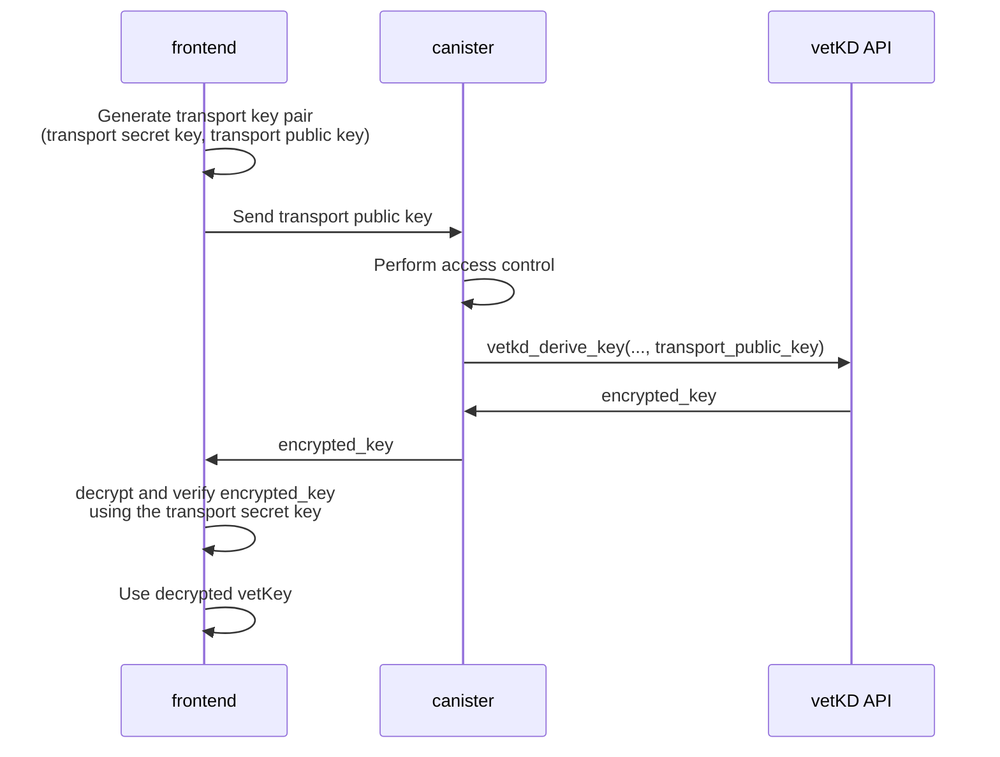

import TabItem from "@theme/TabItem";
import { AdornedTabs } from "/src/components/Tabs/AdornedTabs";

# vetKD API

Verifiably encrypted threshold key derivation (vetKD) is a distributed protocol for securely deriving cryptographic keys, referred to as  _vetKeys_. 
The vetKD API allows canisters to request vetKeys derived using this protocol. Since the key derivation is deterministic, the same inputs will produce the same key, allowing canisters to retrieve keys reliably. Canisters can generate an unlimited number of unique keys by providing different inputs. 

Below is a summary of the vetKD API methods and their parameters described in [Candid notation](/docs/building-apps/interact-with-canisters/candid/candid-concepts).

```candid
  // Derives keys based on the provided inputs.
  vetkd_derive_key : (record {
    // Arbitrary data used to derive keys. This acts as a key identifier - different
    // inputs will result in different derived keys. The input does not need to be random.
    input : blob;
    // A domain separator to ensure that keys are derived within a specific context,
    // preventing collisions between different applications or use cases.
    context : blob;
    // The recipient’s public key, used to encrypt the derived key for secure transport.
    transport_public_key : blob;
    // The master key from which the derived key is created.
    key_id : record { curve : vetkd_curve; name : text };
  }) -> (record { encrypted_key : blob; });

  // Returns a public key that can be used to verify keys derived using `vetkd_derive_key`.
  vetkd_public_key : (record {
    // Optional. If provided, the method returns the public key associated with
    // the specified `canister_id`. If omitted (`null`), the public key for
    // the calling canister is returned.
    canister_id : opt canister_id;
    // Same as in `vetkd_derive_key`.
    context : blob;
    // Same as in `vetkd_derive_key`.
    key_id : record { curve : vetkd_curve; name : text };
  }) -> (record { public_key : blob; });
```

## Available master keys

The following key names are supported for curve `bls12_381_g2`:

- `key_1`:  Production key available on the ICP mainnet on subnet [`pzp6e`](https://dashboard.internetcomputer.org/network/subnets/pzp6e-ekpqk-3c5x7-2h6so-njoeq-mt45d-h3h6c-q3mxf-vpeq5-fk5o7-yae) (backed up on [`uzr34`](https://dashboard.internetcomputer.org/network/subnets/uzr34-akd3s-xrdag-3ql62-ocgoh-ld2ao-tamcv-54e7j-krwgb-2gm4z-oqe)).

- `test_key_1`: Test key available on the ICP mainnet on subnet [`fuqsr`](https://dashboard.internetcomputer.org/network/subnets/fuqsr-in2lc-zbcjj-ydmcw-pzq7h-4xm2z-pto4i-dcyee-5z4rz-x63ji-nae) (backed up on [`2fq7c`](https://dashboard.internetcomputer.org/network/subnets/2fq7c-slacv-26cgz-vzbx2-2jrcs-5edph-i5s2j-tck77-c3rlz-iobzx-mqe)).

- `dfx_test_key`: Only available on the local development environment started by `dfx`.

## Obtaining a vetKey

Deriving a vetKey typically involves both the frontend and backend components of a dapp, as the transport key is usually provided by the user.



### Step 1: Implement canister endpoints

Expose the vetKD endpoints in the backend canister API so that the frontend can retrieve and verify vetKeys.

In this example, an encoding of the caller's identity is used as the `input` parameter to `VetKDDeriveKeyArgs`.
Since the caller of a canister is authenticated using II and public key cryptography, the dapp is sure that
the key returned is both unique to that caller, and that caller is the only party which can retrieve that
particular key.

<AdornedTabs groupId="languages">

<TabItem value="motoko" label="Motoko" default>

```motoko no-repl
import Debug "mo:base/Debug";
import ManagementCanister "mo:ic-vetkeys/ManagementCanister";
import Principal "mo:base/Principal";
import Text "mo:base/Text";

actor class () {
  let DOMAIN_SEPARATOR : Blob = Text.encodeUtf8("example-vetkd-dapp");

  /// Derive encrypted vetKey for caller's principal.
  public shared ({ caller }) func vetkd_derive_key(transportKey : Blob) : async Blob {
    let input = Principal.toBlob(caller);
    await ManagementCanister.vetKdDeriveKey(input, DOMAIN_SEPARATOR, testKeyId(), transportKey);
  };

  public shared func publicKey() : async Blob {
    await ManagementCanister.vetKdPublicKey(null, DOMAIN_SEPARATOR, testKeyId());
  };

  private func testKeyId() : ManagementCanister.VetKdKeyid {
    { curve = #bls12_381_g2; name = "test_key_1" };
  };
};

```

</TabItem>

<TabItem value="rust" label="Rust">

```rust
use ic_cdk::management_canister::{VetKDCurve, VetKDDeriveKeyArgs, VetKDKeyId, VetKDPublicKeyArgs};
use ic_cdk::update;

const DOMAIN_SEPARATOR: &[u8] = b"example-vetkd-dapp".as_slice();

/// Derive encrypted vetKey for caller's principal.
#[update]
async fn vetkd_derive_key(transport_public_key: Vec<u8>) -> Vec<u8> {
    let caller = ic_cdk::api::msg_caller();
    let request = VetKDDeriveKeyArgs {
        input: caller.as_slice().to_vec(),
        context: DOMAIN_SEPARATOR.to_vec(),
        transport_public_key,
        key_id: bls12_381_g2_test_key(),
    };
    let reply = ic_cdk::management_canister::vetkd_derive_key(&request)
        .await
        .expect("failed to derive key");
    reply.encrypted_key
}

#[update]
async fn vetkd_public_key() -> Vec<u8> {
    let request = VetKDPublicKeyArgs {
        canister_id: None,
        context: DOMAIN_SEPARATOR.to_vec(),
        key_id: bls12_381_g2_test_key(),
    };

    let reply = ic_cdk::management_canister::vetkd_public_key(&request)
        .await
        .expect("failed to derive key");
    reply.public_key
}

fn bls12_381_g2_test_key() -> VetKDKeyId {
    VetKDKeyId {
        curve: VetKDCurve::Bls12_381_G2,
        name: "test_key_1".to_string(),
    }
}
```

</TabItem>
</AdornedTabs>

### Step 2: Generate a transport key pair and pass the transport public key to the canister

In this step, the frontend generates a transport private key and passes the corresponding transport public key to the canister in order to obtain the encrypted vetKeys that can only be decrypted by the frontend.

<AdornedTabs groupId="languages">
<TabItem value="ts" label="Typescript" default>

```ts
import { DerivedPublicKey, TransportSecretKey, EncryptedVetKey } from "@dfinity/vetkeys";

const transportSecretKey = TransportSecretKey.random();
const canisterClient = // get canister client, usually auto-generated code from canister's candid interface
// the `canisterClient` uses the caller's principal as `input` when calling the management canisters `vetkd_derive_key` endpoint under the hood (see code in Step 1)
const encryptedVetKeyBytes = await canisterClient.vetkd_derive_key(transportSecretKey.publicKeyBytes());
const encryptedVetKey = EncryptedVetKey(encryptedVetKeyBytes);
```

</TabItem>
</AdornedTabs>

### Step 3: Retrieve the vetKD public key from the backend canister

Once retrieved, you must decrypt and verify the received encrypted vetKey.

<AdornedTabs groupId="languages">
<TabItem value="ts" label="Typescript" default>

```ts
const publicKeyBytes = await canisterClient.vetkd_public_key();
const publicKey = DerivedPublicKey.deserialize(publicKeyBytes);
const myPrincipalBytes = // serialize caller's principal as `Uint8Array`
// the `canisterClient` uses the caller's principal as `input` when calling the management canisters `vetkd_derive_key` endpoint under the hood (see code in Step 1)
const vetKey = encryptedVetKey.decryptAndVerify(transportSecretKey, publicKey, myPrincipalBytes);
```

</TabItem>
</AdornedTabs>

The full specification of the vetKD APIs can be found in the [IC interface specification](https://internetcomputer.org/docs/references/ic-interface-spec#ic-vetkd_public_key).

## API fees

The fees for the vetKD APIs are defined below. The threshold vetKD test key resides on the 13-node application subnet [`fuqsr`](https://dashboard.internetcomputer.org/network/subnets/fuqsr-in2lc-zbcjj-ydmcw-pzq7h-4xm2z-pto4i-dcyee-5z4rz-x63ji-nae), while the threshold vetKD production key resides on the 34-node-sized fiduciary subnet [`pzp6e`](https://dashboard.internetcomputer.org/network/subnets/pzp6e-ekpqk-3c5x7-2h6so-njoeq-mt45d-h3h6c-q3mxf-vpeq5-fk5o7-yae). The subnet size where the vetKD key resides and the vetKeys are computed defines the resulting cost. The size of the subnet of the calling canister does not matter for the fees. For costs in USD, the USD/XDR exchange rate as of May 22, 2025, has been used.

:::note
If a canister using this feature is intended to be blackholed or used by other canisters, it's recommended to send more cycles with each call than the currently advertised cost. This ensures that, if the subnet's size increases in the future (leading to higher signature costs), the call will still succeed. Any unused cycles are automatically refunded.
:::

Fees for deriving one vetKey using the `vetkd_derive_key` API of the management canister:

| Key type (key name)                  | Cycles                      | USD                         | Signing subnet (size) |
|--------------------------------------|-----------------------------|-----------------------------|--------------|
| Production key (`key_1`)             | 26_153_846_153              | $0.0354325                  | [`pzp6e`](https://dashboard.internetcomputer.org/network/subnets/pzp6e-ekpqk-3c5x7-2h6so-njoeq-mt45d-h3h6c-q3mxf-vpeq5-fk5o7-yae) (34) |
| Test key (`test_key_1`)              | 10_000_000_000              | $0.0135482                  | [`fuqsr`](https://dashboard.internetcomputer.org/network/subnets/fuqsr-in2lc-zbcjj-ydmcw-pzq7h-4xm2z-pto4i-dcyee-5z4rz-x63ji-nae) (13) |
