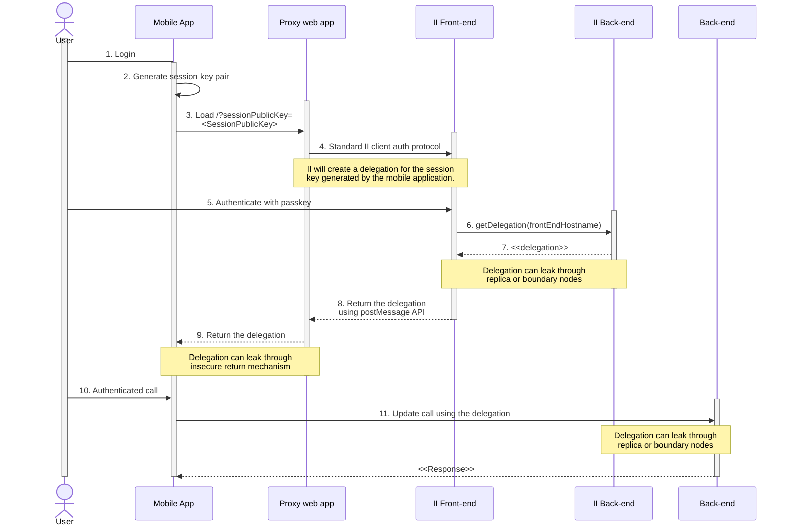
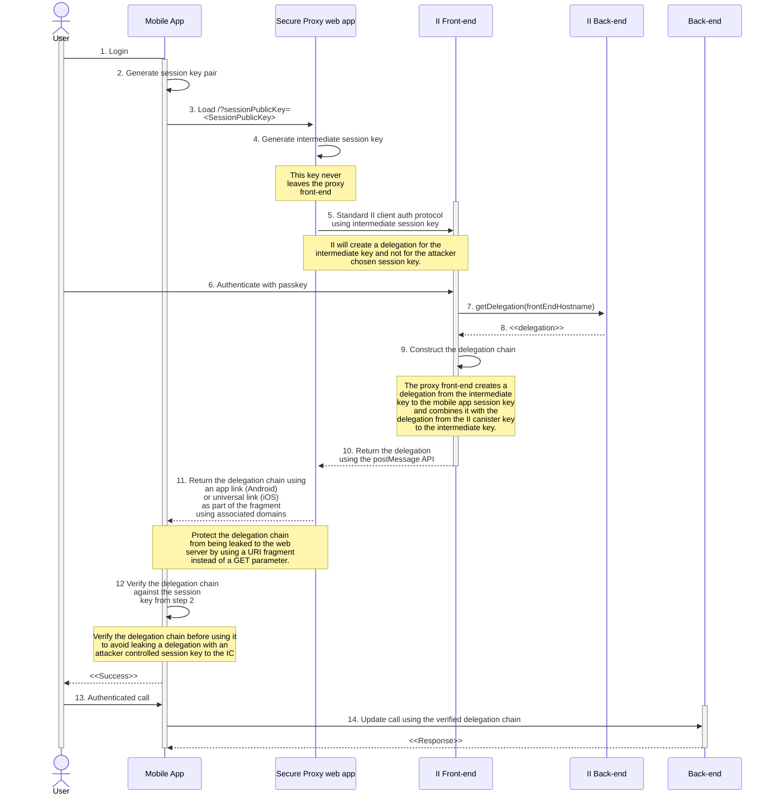

import { MarkdownChipRow } from "/src/components/Chip/MarkdownChipRow";

# Security best practices: Identity and access management

<MarkdownChipRow labels={["Security", "Best practices"]} />

## Make sure specific user actions require authentication

### Security concern

If this is not the case, an attacker may be able to perform sensitive actions on behalf of a user, compromising their account.

### Recommendation

- The caller of every canister call the caller can be identified. The calling [principal](/docs/references/ic-interface-spec#principal) can be accessed using the system API’s methods [`ic0.msg_caller_size` and `ic0.msg_caller_copy`](/docs/references/ic-interface-spec#system-api-imports). If an identity provider such as Internet Identity is used, [the principal is the user identity for this specific origin](/docs/references/ii-spec#identity-design-and-data-model). If some actions (e.g., access to user’s account data or account-specific operations) should be restricted to a principal or a set of principals, then this must be explicitly checked in the canister call. An example in Rust can be found below:

```rust
// Let pk be the public key of a principal that is allowed to perform
// this operation. This pk could be stored in the canister's state.
if caller() != Principal::self_authenticating(pk) {  ic_cdk::trap(...) }

// Alternatively, if the canister keeps data for different principals
// in e.g., a map such as BTreeMap<Principal, UserData>, then the canister
// must ensure that each caller can only access and perform operations
// on their own data:
if let Some(user_data) = user_data_store.get_mut(&caller()) {
    // perform operations on the user's data
}
```
- In Rust, the `ic_cdk` crate can be used to authenticate the caller using `ic_cdk::api::caller`. Make sure the returned principal is of type `Principal::self_authenticating` and identify the user’s account using the public key of that principal. See the example code above.

- Do authentication as early as possible in the call to avoid unauthenticated actions and potentially expensive operations before authentication. It is also a good idea to [deny service to anonymous users](#disallow-the-anonymous-principal-in-authenticated-calls).

- Do not rely on authentication performed during [ingress message inspection](#do-not-rely-on-ingress-message-inspection).

## Disallow the anonymous principal in authenticated calls

### Security concern

The caller from the system API (e.g., `ic0::api::caller` in Rust) may also return `Principal::anonymous()`. In authenticated calls, this is probably undesired and could have security implications since this would behave like a shared account for anyone that does unauthenticated calls.

### Recommendation

In authenticated calls, make sure the caller is not anonymous and return an error or trap if it is. This could be done centrally by using a helper method. An example in Rust can be found below:
```rust
fn caller() -> Result<Principal, String> {
    let caller = ic0::api::caller();
    // The anonymous principal is not allowed to interact with the canister.
    if caller == Principal::anonymous() {
        Err(String::from(
            "Anonymous principal not allowed to make calls.",
        ))
    } else {
        Ok(caller)
    }
}
```

## Do not rely on ingress message inspection

### Security concern

The correct execution of [`canister_inspect_message`](/docs/references/ic-interface-spec#system-api-inspect-message) is not guaranteed because it is executed by a single node, and if that node is malicious, it can simply skip this check. In that case the update call would be executed without any message inspection checks.

Also note that for inter-canister calls, `canister_inspect_message` is not invoked.

### Recommendation

Your canisters should not rely on the correct execution of `canister_inspect_message`. This in particular means that no security-critical code, such as [access control checks](#make-sure-any-action-that-only-a-specific-user-should-be-able-to-do-requires-authentication), should be solely performed in that method. Such checks **must** be performed as part of an update method to guarantee reliable execution. Ideally, they are executed both in the `canister_inspect_message` function and a guard function.

## Use a well-audited authentication service and client-side ICP libraries

### Security concern

Implementing user authentication and canister calls yourself in your web app is error-prone and risky. For example, if canister calls are implemented from scratch, there may be bugs around signature creation or verification.

### Recommendation

-   Consider using an identity provider such as [Internet Identity](https://github.com/dfinity/internet-identity) for authentication, use [the ICP JavaScript agent](https://github.com/dfinity/agent-js) for making canister calls, and the [auth-client](https://github.com/dfinity/agent-js/tree/main/packages/auth-client) for interacting with Internet Identity from your dapp.

-   You may consider alternative authentication frameworks on ICP for authentication.

## Set an appropriate session timeout

### Security concern

Currently, Internet Identity issues delegations with an expiry time. This expiry time can be set in the [auth-client](https://github.com/dfinity/agent-js/tree/main/packages/auth-client). After a delegation expires, the user has to re-authenticate. Setting a good value is a trade-off between security and usability.

### Recommendation

See the [OWASP recommendations](https://cheatsheetseries.owasp.org/cheatsheets/Session_Management_Cheat_Sheet.html#session-expiration). A timeout of 30 minutes should be set for security-sensitive applications.

The [auth-client](https://github.com/dfinity/agent-js/tree/main/packages/auth-client) supports [idle timeouts](https://github.com/dfinity/agent-js/tree/main/packages/auth-client#idle-management).

## Don’t use fetchRootKey in the ICP JavaScript agent in production

### Security concern

`agent.fetchRootKey()` can be used in the [ICP JavaScript agent](https://github.com/dfinity/agent-js) to fetch the root subnet threshold public key from a status call in test environments. This key is used to verify threshold signatures on certified data received through canister update calls. Using this method in a production web app gives an attacker the option to supply their own public key, invalidating all authenticity guarantees of update responses.

### Recommendation

Never use `agent.fetchRootKey()` in production builds, only in test builds. Not calling this method will result in the hardcoded root subnet public key of the mainnet being used for signature verification, which is the desired behavior in production.

## Integrating Internet Identity on mobile devices

A [short presentation](https://www.youtube.com/watch?v=iRmpCkzC6iI&t=1863s) can be found as part of the November 2024 global R&D.

### Security concern

Internet Identity has a standardized way for web applications to request authentication of a user. This [client authentication protocol](/docs/references/ic-interface-spec#client-authentication-protocol) allows a client dapp frontend to obtain a delegation signed by the Internet Identity for a locally generated session key pair. Using this delegation in combination with the session key allows the dapp frontend to make authenticated calls towards the backend canister. Such calls need to be digitally signed by the session private key. The IC will verify the signature and verify if there is a delegation (or chain of delegations) from the II key to the session public key.

The II client authentication protocol leverages the browser’s `postMessage` API to communicate between the client origin and the II origin. This protocol allows II to authenticate the origin of the authorization request using the hostname.

:::info
Note that as part of the client authentication protocol, a dapp can specify an alternative origin by following the [alternative frontend origins](/docs/references/ii-spec#alternative-frontend-origins) requirements.
:::

Upon successful authentication, II will return a delegation for the principal derived from the users’ II for the specific frontend origin. This serves two purposes. First, a client dapp can’t use this delegation on other dapps to impersonate the user. Second, multiple client dapps can’t correlate user behavior across dapps, thereby reducing privacy. A dapp with a different frontend origin won’t be able to request authentication for your dapp, which provides protection against certain phishing attacks.

When integrating a mobile application with II, the implementation is not straightforward since a mobile app can’t call the `postMessage` API. It is tempting to create a simple “proxy” web frontend served by the dapp as shown in the sequence diagram below. The mobile application can load this proxy to complete the normal II authorization flow. Upon completion, this proxy web app provides the delegation back to the mobile app.

**Naive implementation sequence diagram:**


However, without any precautions, this proxy would happily accept malicious requests to authenticate the user and might return the delegation back to an attacker.

Such an attack would start by phishing the user by means of a malicious mobile or web application. The user is asked to authenticate through II. However, instead of using II directly, the attacker abuses the open proxy to authenticate the user for the dapp, under which the vulnerable proxy is running. The attacker would generate a session key and ask the proxy to use the session public key in the II authentication protocol. Through this method, II issues a signed delegation for the user's II derived for the frontend origin of the proxy. This delegation could leak to the attacker, who can use it to impersonate the user. For example, if the attacker can trick the proxy to redirect to the malicious application (e.g., by registering Android deep links or iOS custom schemes), it could directly obtain the delegation. Furthermore, the delegation could leak through an insecure communication channel between the proxy and the mobile app or through observation of the IC state.

The attack requires four conditions:
1. An attacker can provide a session key to be used in the II client authentication protocol.
2. The client authentication protocol is initiated for a target frontend hostname.
3. The user completes the II authentication protocol.
4. The attacker can obtain the delegation, which is signed by the II canister.

Conditions 1, 2, and 3 can be satisfied by convincing the user to initiate an authentication flow with a session public key that is chosen by the attacker by loading the proxy from an attacker-controlled mobile or web application. Concretely, an attacker would execute a phishing attack where a victim is directed to the proxy from an unsuspicious application. For example, the victim is convinced that the attacker is issuing an airdrop. The victim has to download a corresponding malicious mobile app that requires II authentication. This malicious mobile app would load the proxy (step 3) similarly to how the legitimate mobile app would. The malicious app would ask the proxy to authenticate the user for an Condition 2 is met for any dapp that exposes such an open II authentication proxy on their domain. session key. The victim might not realize they are completing an authorization flow for a different dapp origin.

Condition 4 can be satisfied by controlling a replica or boundary node that can observe the delegation in step 7. Alternatively, the delegation could leak in step 9 by using an HTTP GET parameter in a URI pointing to the IC. In such cases, if the mobile app that should receive the URI isn’t installed, the browser loads the web app by making a request to the URI. Boundary and replica nodes would again receive the delegation as part of the URI. Condition 4 can also be met if the mobile app issues a request to the IC in step 11 without verifying the delegation obtained in step 9.

Finally, condition 4 can also be satisfied if the delegation is returned insecurely from the proxy frontend to the mobile app. For example, by using Android deep links or iOS custom schemes, which can be intercepted by a malicious app.

### Recommendation

In the standard integration between a client web app and the II web frontend, the origin of the client is verified **before** starting the client authentication protocol. Unfortunately, loading the URI of the proxy app in step 3 does not provide any information about the mobile application. Therefore, the proxy frontend is unable to authenticate the client. This creates an open endpoint for attackers to use, as described in the previous section.

This risk can be addressed by adopting the following remediations shown in the sequence diagram and explained further below.

**Secure integration sequence diagram:**


* Introduce an intermediate session key that is generated and stored by the web app proxy frontend.
* Initiate the II client authentication protocol using this intermediate session key. By using a new session key that the attacker can’t control, the delegation issued by II would no longer be usable by the attacker if it were stolen in step 8, as the attacker doesn’t have access to the intermediate session private key.
* [Create a delegation chain](/docs/references/ic-interface-spec#authentication) to allow the mobile application to use their session key. The delegation chain consists of two delegations as shown in the figure below. The first one delegates from the II canister key to the intermediate key and is generated by the II canister. The second one delegates from the intermediate key to the mobile app public key and is signed by the proxy frontend’s intermediate session private key. Note, this means the intermediate key can impersonate the user. Since the proxy frontend is served from the IC, it can be trusted to handle this key properly. It is up to the developer to ensure the confidentiality of this key. For example, using the WebCrypto API to create unextractable keys as is used internally by the [ICP JavaScript agent](https://www.npmjs.com/package/@dfinity/agent). Ideally, this intermediate key is short-lived to reduce the risk of exposure.


* Return the delegation chain to the mobile app using [app links](https://developer.android.com/training/app-links) on Android and [universal links](https://developer.apple.com/documentation/xcode/allowing-apps-and-websites-to-link-to-your-content) on iOS. These mechanisms bind the domain name/hostname to the mobile app, which prevents an attacker from using a malicious mobile app to receive the delegation chain. The domain-to-mobile app binding occurs through a JSON file that has to be hosted under the `/.well-known` directory of your web application. See [iOS](https://developer.apple.com/documentation/xcode/supporting-associated-domains)
and [Android](https://developer.android.com/training/app-links/verify-android-applinks) documentation for details.
* Return the delegation chain to the mobile app using a [URI fragment](https://www.w3.org/DesignIssues/Fragment.html) (everything following the # in the URI). The browser will load the URI if the mobile app linked to the app/universal link isn't installed on the mobile device. The benefit of URI fragments is that they are not included in the request to the server if the browser were to resolve the URI. A URL parameter or path would be included in such a request, and therefore it would leak the delegation chain to the proxy app backend (most likely the IC boundary and replica nodes). A URI fragment is still available to the mobile app for extraction.
* Verify the delegation chain in the mobile application before using it in an IC message. The mobile application likely uses an agent that does not verify whether the session key generated in step 2 corresponds to the delegation found in the delegation chain returned in step 11. Using such an agent to make a signed update call would simply create a message with the provided delegation chain and sign it with a mismatching key. Obviously, the IC would reject such a message as the signature does not correspond to the delegation chain, but the delegation chain would already have leaked to the boundary and potentially replica nodes where an attacker could steal it.
* Optionally, the proxy frontend could explicitly warn the user that it is about to sign in with II for your dapp. It could include the dapp’s name and logo. This might alarm the user who is being phished since the pretense used by the attacker would likely not match with the purpose of your dapp. For example, the attacker claims the authentication is required as part of an airdrop while you are running an unrelated decentralized exchange. When the proxy dapp is opened, the user would see your dapp’s logo and abort the sign-in.

For more information, view an [example implementation in the form of a Unity app](https://github.com/dfinity/examples/tree/main/native-apps/unity_ii_deeplink). The following pieces of that codebase are most important:

* Generation of the intermediate session key [in index.js](https://github.com/dfinity/examples/blob/main/native-apps/unity_ii_deeplink/ii_integration_dapp/src/greet_frontend/src/index.js#L25).
* [Authentication using the intermediate session key](https://github.com/dfinity/examples/blob/main/native-apps/unity_ii_deeplink/ii_integration_dapp/src/greet_frontend/src/index.js#L26-L36) instead of the mobile app public key.
* [Generating the delegation chain](https://github.com/dfinity/examples/blob/main/native-apps/unity_ii_deeplink/ii_integration_dapp/src/greet_frontend/src/index.js#L48-L57) by combining the delegation obtained from II with a delegation created by the frontend.
* [Returning the delegation chain using an applink/universal link](https://github.com/dfinity/examples/blob/main/native-apps/unity_ii_deeplink/ii_integration_dapp/src/greet_frontend/src/index.js#L71)
* Returning the delegation chain [using a URI fragment](https://github.com/dfinity/examples/blob/main/native-apps/unity_ii_deeplink/ii_integration_dapp/src/greet_frontend/src/index.js#L73).
* The example is currently being improved whereby the delegation chain will also be verified in the mobile app before using it.