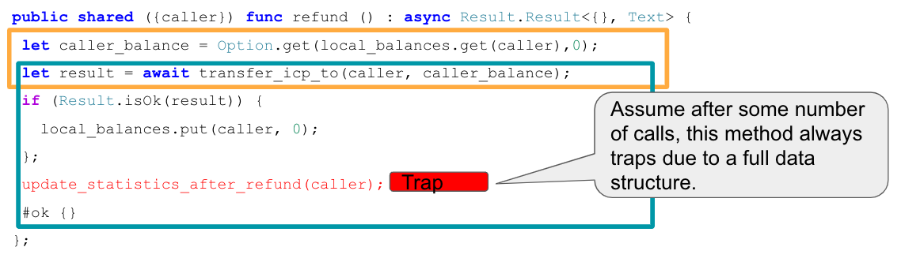

import TabItem from "@theme/TabItem";
import { AdornedTabs } from "/src/components/Tabs/AdornedTabs";
import { AdornedTab } from "/src/components/Tabs/AdornedTab";
import { BetaChip } from "/src/components/Chip/BetaChip";
import { MarkdownChipRow } from "/src/components/Chip/MarkdownChipRow";

# Security best practices: Inter-canister calls

<MarkdownChipRow labels={["Security", "Best practices"]} />

To understand the issues around async inter-canister calls, one needs to understand the [properties of message execution on ICP](/docs/references/message-execution-properties). Understanding these properties is a prerequisite for understanding the security issues discussed below.

This is also explained in the [community conversation on security best practices](https://www.youtube.com/watch?v=PneRzDmf_Xw&list=PLuhDt1vhGcrez-f3I0_hvbwGZHZzkZ7Ng&index=2&t=4s).

## Securely handle traps in callbacks

### Security concern

Traps and panics roll back the canister state, as described in [Property 5](/docs/references/message-execution-properties#message-execution-properties). So any state change followed by a trap or panic can be risky. This is an important concern when inter-canister calls are made. If a trap occurs after an await to an inter-canister call, then the state is reverted to the snapshot before the inter-canister call’s callback invocation, and not to the state before the entire call.

More precisely, suppose some state changes are applied and then an inter-canister call is issued. Also, assume that these state changes leave the canister in an inconsistent state, and that state is only made consistent again in the callback. Now if there is a trap in the callback, this leaves the canister in an inconsistent state.

Here are two example security issues that can arise because of this:

- Assume an inter-canister call is issued to transfer funds. In the callback, the canister accounts for having made that transfer by updating the balances in the canister storage. However, suppose the callback also updates some usage statistics data, which eventually leads to a trap when some data structure becomes full. As soon as that is the case, the canister ends up in an inconsistent state because the state changes in the callback are no longer applied, and thus the transfers are not correctly accounted for.
  
  This example is also discussed in this [community conversation](https://www.youtube.com/watch?v=PneRzDmf_Xw&list=PLuhDt1vhGcrez-f3I0_hvbwGZHZzkZ7Ng&index=2&t=4s).

- Suppose part of the canister state is locked before an inter-canister call and released in the callback. Then the lock may never be released if the callback traps.
  Note that in canisters implemented in Rust with Rust CDK version `0.5.1`, any local variables still go out of scope if a callback traps. The CDK actually calls into the `ic0.call_on_cleanup` API to release these resources. This helps to prevent issues with locks not being released, as it is possible to use Rust's Drop implementation to release locked resources, as we discuss in [Be aware that there is no reliable message ordering](/docs/building-apps/security/inter-canister-calls#be-aware-that-there-is-no-reliable-message-ordering).

### Recommendation

Recall that the responses to inter-canister calls are processed in the corresponding callback. If the callback traps, the cleanup (ic0.call_on_cleanup) is executed. When making an inter-canister call, ICP reserves sufficiently many cycles to execute the response callback or cleanup, up to the instruction limit. A fixed fraction of the reservation is set aside for the cleanup. Thus, a response or cleanup execution can never “run out of cycles,” but they can run into the instruction limit and trap.

The naïve recommendation to address the security concern described above would be to avoid traps. However, that can be very difficult to achieve due to the following reasons:

- The implementation can be involved and could panic due to bugs, such as index out-of-bounds errors or panics (expect, unwrap) that should supposedly never happen.

- It is hard to make sure the callback or cleanup doesn’t run into the instruction limit and thus traps, because the number of instructions required can in general not be predicted and may depend on the data being processed.

Due to these reasons, while it is easy to recommend “avoiding traps”, this is actually hard to achieve in practice. Therefore, code should be written so that it can deal even with unexpected traps due to bugs or hitting the instruction limits. There are two approaches:

1. Perform simple cleanups
1. Utilize “journaling.”.

In the first approach, the cleanup callback is used to recover from unexpected panics. This can work, but it has several drawbacks:
- The cleanup itself could panic, in which case one is in the initial problematic situation again. The risk may be acceptable for simple cleanups, but as discussed above, it is hard to write code that never panics, especially if it is somewhat complex.
- As of version 0.12.0, Motoko provides the `try`/`finally` feature to clean up temporary resource allocations in a structured way. Cleanup is used (as formerly) internally by Motoko to perform some state manipulations and now allows inserting programmer-written code also. If an execution path after `await` traps, all `finally` blocks in (dynamic) scope will be executed as a last-resort measure. Be aware that `finally` is not a magical construct to end all trap worries, as trapping in the `finally` blocks themselves can still leave your canister in an inconsistent state. Thus we recommend keeping your `finally` code clear and concise and paying special attention to reviewing it well.
- As discussed above, the Rust CDK has a feature that automatically releases local variables in cleanup, which [can be used to release locks](/docs/building-apps/security/inter-canister-calls#recommendation-1). Since only one cleanup callback can be defined, any custom cleanup would currently have to implement that feature itself if needed, making this currently hard to use and understand.

Instead, “journaling” is the recommended way of addressing the problem at hand.

### Journaling

Journaling can be used for ensuring that tasks are completed correctly in an asynchronous context, where any instruction or async task can fail. Journaling is generally useful in any security-critical application canister on ICP. The journaling concept we describe here is inspired and adapted from journaling in file systems.

Conceptually, a journal is a chronological list of records kept in a canister’s storage. It keeps track of tasks before they begin and when they are completed. Before each failable task, the journal records the intent to execute the task, and after the task, the journal records the result. The journal supports idempotent task flows by providing the necessary information for the canister to resume flows that failed to complete, report progress for ongoing flows, and report results for completed flows. Retries can be initiated by calls, automatically on a [heartbeat](/docs/building-apps/network-features/periodic-tasks-timers#heartbeats) or using [timers](/docs/building-apps/network-features/periodic-tasks-timers#timers). If the task flow was completed in a heartbeat or a timer, a user can take advantage of idempotency to check the result.

Creating a record in the journal is called “journaling.” For example, to make an unreliable async call to a ledger:

1. Check the journal to ensure the transfer is not already in progress. If it is already in progress, go into recovery (see the [Recovery](#recovery) section below). Otherwise, journal the intent to call a ledger to transfer 1 token from A to B. The journaled intent should contain sufficient context to later identify what happened to the call.

    - An “in progress” transfer would show in the journal as an entry containing intent to do the transfer without an entry containing the result of the transfer call.

1. Call the ledger to transfer 1 token from A to B.

1. Journal the result of the transfer.

    - On failure, record the error.

    - On success, record success. In order to commit the record, an inter-canister call can be made to an endpoint on the same canister that does nothing. Otherwise, a trap could erase the journaled result, complicating recovery.

1. Continue onto the next blocked task.

    - “Blocked tasks” are those that require step 3 to be completed before execution.

    - A blocked task may depend on the success or failure recorded in step 3.

    - Examples of blocked tasks:

    - On failure, log the failure in a user-visible log, and if less than 5 failures have occurred, make a new transfer outcall with the same parameters.

        - On success, update the internal accounting of assets to conform to the result of the transfer.

    - Note that any independent task does not need to wait for any part of this flow.

The critical property of the journal is that at any point, if there is a failure, the journal is sufficient to determine what the next safe step should be. If, after step 1 (journal the intent),
there is a failure in step 2 or 3, and step 3 has not been completed, then the application should complete step 3 by finding out what happened to the call in step 2. If finding out what happened to the call is too difficult to automate, it can be done manually. The journal can indicate whether a manual intervention is necessary and the type of intervention that is necessary.
The fact that the intent has been journaled and the app knows not to reenter the flow until the result has been recorded means the journal acts as a lock on the critical section containing
the ledger outcall. The lock will not get stuck, assuming the application can always find out what happened to a call. Enough context about the call should be recorded in the intent to ensure
that this is the case. For the ICP ledger, an ID can be generated and recorded in the journaled intent, and the ledger can be called with the ID included in the memo so that the result of the
call can be queried later.

### Journaling is robust to panics

Continuing the above example, consider a panic at any point.
1. If there is panic before the async outcall, then the journaled intent will be lost. No state change occurred internally, and no outcalls were made, so the app is in a safe state. The next step is to record a new intent.
1. If there is a panic after the async outcall and no self-call was used to commit the journal, the journaled result (step 3) will be lost. This means the app will need to determine the result and journal it before continuing to step 4. As long as it is possible to determine the result, the app can be brought back to a consistent state.

### Journaling and audit events

The journal can be used to augment the audit trail for recent events. However, it is probably too detailed for long-term storage. After a while, journal entries could be compressed and incorporated into long-term audit events. The process for creating audit events could itself be journaled.

### Recovery

The journal ensures the application knows that recovery from an error is needed and aids in making recovery decisions. In order to support the recovery process, the journal should support querying all unresolved tasks of a certain type and tasks of a certain type that resulted in an error. Given an intent, the journal should also be able to return the result if it exists and indicate if it does not exist.

Note that recovery can often be complex to automate. In such cases, the journal can support a manual recovery process.
Extending the ledger example above, a recovery process could look as follows:

1. There is a panic, and the status of the ledger call is unknown. However, the journal has recorded that a call to transfer with particular parameters and a memo has been made, including the deduplication timestamp of the transfer.
1. The app calls the ledger to determine whether a transaction with the journaled parameters has succeeded on the ledger. Due to the guarantee that any pair of messages that are both executed are always executed in the order issued, if the ledger indicates that the transaction has not occurred, then the transaction will never occur.
1. The app journals the result of the transfer call.
1. The app journals the intention to update internal state according to the result of the transfer call, then updates the internal state, and finally journals the result of the attempt to update the internal state. Journaling this step is still useful even if it does not contain outcalls, because outcalls may be introduced later, and the step could conflict with other processes that are not atomic.

Note that querying the ICP ledger or an ICRC ledger to determine whether a transaction has succeeded is not straightforward to automate, so it could be done manually.

### Example implementation of journaling

GoldDAO's GLDT-swap has an implementation of journaling. In their case, the journal entries are recorded in the "registry." Note that in GLDT-swap there is also a separate concept of "record," which is a permanent audit trail and is not used for journaling. Some error paths require manual recovery. See the following reference points:

- Registry (journal) structure:
    - https://github.com/GoldDAO/gldt-swap/blob/ledger-v1.0.0/canister/gldt_core/src/registry.rs#L18
    - https://github.com/GoldDAO/gldt-swap/blob/ledger-v1.0.0/canister/gldt_core/src/lib.rs#L654
- The registry is used in `notify_sale_nft_origyn` to record progress and enforce correctness of the flow.
    - https://github.com/GoldDAO/gldt-swap/blob/ledger-v1.0.0/canister/gldt_core/src/lib.rs#L910
    - Note that not all details of the flow appear in the registry. The amount of detail to include depends on one's goals for recovery.

## Be aware that there is no reliable message ordering

### Security concern

As described in the [properties of message executions on ICP](/docs/references/message-execution-properties), messages (but not entire calls) are processed atomically. In particular, as described in Property 4 in that document, messages from interleaving calls do not have a reliable execution ordering. Thus, the state of the canister (and other canisters) may change between the time an inter-canister call is started and the time when it returns, which may lead to issues if not handled correctly. These issues are generally called 'reentrancy bugs' (see the [Ethereum best practices on reentrancy](https://consensysdiligence.github.io/smart-contract-best-practices/attacks/reentrancy/). Note, however, that the messaging guarantees, and thus the bugs, on ICP are different from Ethereum.

Here are two concrete and somewhat similar types of bugs to illustrate potential reentrancy security issues:

- **Time-of-check time-of-use issues:** These occur when some condition on global state is checked before an inter-canister call and then wrongly assuming the condition still holds when the call returns. For example, one might check if there is sufficient balance on some account, then issue an inter-canister call, and finally make a transfer as part of the callback message. When the second inter-canister call starts, it is possible that the condition that was checked initially no longer holds, because other ledger transfers may have happened before the callback of the first call is executed (see also Property 4 above).

- **Double-spending issues**: Such issues occur when a transfer is issued twice, often because of unfavorable message scheduling. For example, suppose you check if a caller is eligible for a refund, and if so, transfer some refund amount to them. When the refund ledger call returns successfully, you set a flag in the canister storage indicating that the caller has been refunded. This is vulnerable to double-spending because the refund method can be called twice by the caller in parallel, in which case it is possible that the messages before issuing the transfer (including the eligibility check) are scheduled before both callbacks. A detailed explanation of this issue can be found in the [community conversation on security best practices](https://www.youtube.com/watch?v=PneRzDmf_Xw&list=PLuhDt1vhGcrez-f3I0_hvbwGZHZzkZ7Ng&index=2&t=4s).

### Recommendation

It is highly recommended to carefully review any canister code that makes async inter-canister calls (`await`). If two messages read or write the same state, review if there is a possible scheduling of these messages that leads to illegal transactions or an inconsistent state.

See also: "Inter-canister calls" section in [how to audit an ICP canister](https://www.joachim-breitner.de/blog/788-How_to_audit_an_Internet_Computer_canister).

To address issues around message ordering that can lead to bugs, one usually employs locking mechanisms to ensure that a caller or anyone can only execute an entire call, which involves several messages, once at a time. A simple example is also given in the [community conversation](https://www.youtube.com/watch?v=PneRzDmf_Xw&list=PLuhDt1vhGcrez-f3I0_hvbwGZHZzkZ7Ng&index=2&t=4s) mentioned above.

The locks would usually be released in the callback. That bears the risk that the lock may never be released in case the callback traps, as we discussed in [securely handle traps in callbacks](#securely-handle-traps-in-callbacks). The code examples below show how one can securely implement a lock per caller.
- In Rust, one can use the drop pattern where each caller lock (`CallerGuard` struct) implements the `Drop` trait to release the lock. From Rust CDK version `0.5.1`, any local variables still go out of scope if the callback traps, so the lock on the caller is released even in that case. Technically, the CDK calls into the `ic0.call_on_cleanup` API to release these resources. Recall that `ic0.call_on_cleanup` is executed if the `reply` or the `reject` callback executed and trapped.
- In Motoko, one can use the [`try`/`finally`](/docs/motoko/main/reference/language-manual/#try) control flow construct. This construct guarantees that the lock is released in the `finally` block regardless of any errors or traps in the `try` or `catch` blocks.

<AdornedTabs groupId="language">

<TabItem value="motoko" label="Motoko">

```motoko
import Result "mo:base/Result";
import Map "mo:base/HashMap";
import Error "mo:base/Error";
import Principal "mo:base/Principal";

actor {

  let pending_requests = Map.HashMap<Principal, Bool>(10, Principal.equal, Principal.hash);

  private func errResult(e : Error.Error) : { #err : (Error.ErrorCode, Text) } = #err (Error.code e, Error.message e);

  private func guard(principal : Principal) : Result.Result<(), Error> {
    if (pending_requests.get(principal) != null) {
      #err (Error.reject("Already processing a request for principal " # Principal.toText(principal)));
    } else {
      pending_requests.put(principal, true);
      #ok;
    };
  };

  private func drop_guard(principal : Principal) {
    ignore pending_requests.remove(principal);
  };

  public shared ({ caller }) func example_call_with_locking_per_caller() : async Result.Result<(), (Error.ErrorCode, Text)> {
    var guard_acquired = false;
    try {
      // Try to create a lock for `caller`, return an error immediately if there is already a call in progress for `caller`
      switch (guard caller) {
        case (#ok) guard_acquired := true;
        case (#err e) return (errResult e);
      };
      // do anything, call other canisters
      #ok
    } catch e {
      errResult e;
    } finally {
      // Release the guard (only request's callbacks that have created a block)
      if guard_acquired {
        drop_guard caller;
      };
    };
  };
};
```

</TabItem>
<TabItem value="rust" label="Rust" default>

```rust
pub struct State {
    pending_requests: BTreeSet<Principal>,
}

thread_local! {
    static STATE: RefCell<State> = RefCell::new(State{pending_requests: BTreeSet::new()});
}

pub struct CallerGuard {
    principal: Principal,
}

impl CallerGuard {
    pub fn new(principal: Principal) -> Result<Self, String> {
        STATE.with(|state| {
            let pending_requests = &mut state.borrow_mut().pending_requests;
            if pending_requests.contains(&principal){
                return Err(format!("Already processing a request for principal {:?}", &principal));
            }
            pending_requests.insert(principal);
            Ok(Self { principal })
        })
    }
}

impl Drop for CallerGuard {
    fn drop(&mut self) {
        STATE.with(|state| {
            state.borrow_mut().pending_requests.remove(&self.principal);
        })
    }
}

#[update]
#[candid_method(update)]
async fn example_call_with_locking_per_caller() -> Result<(), String> {
    let caller = ic_cdk::caller();
    // using `?`, return an error immediately if there is already a call in progress for `caller`
    // warning: never use `let _ = CallerGuard::new(caller)?`, because this will drop the guard immediately
    // and locking would not be effective
    let _guard = CallerGuard::new(caller)?;
    // do anything, call other canisters
    Ok(())
} // here the guard goes out of scope and is dropped

mod test {
    use super::*;

    #[test]
    fn should_obtain_guard_for_different_principals() {
        let principal_1 = Principal::anonymous();
        let principal_2 = Principal::management_canister();
        let caller_guard = CallerGuard::new(principal_1);
        assert!(caller_guard.is_ok());
        assert!(CallerGuard::new(principal_2).is_ok());
    }

    #[test]
    fn should_not_obtain_guard_twice_for_same_principal() {
        let principal = Principal::anonymous();
        let caller_guard = CallerGuard::new(principal);
        assert!(caller_guard.is_ok());
        assert!(CallerGuard::new(principal).is_err());
    }

    #[test]
    fn should_release_guard_on_drop() {
        let principal = Principal::anonymous();
        {
            let caller_guard = CallerGuard::new(principal);
            assert!(caller_guard.is_ok());
        } // drop caller_guard as it goes out of scope here
        // it is possible to get a guard again:
        assert!(CallerGuard::new(principal).is_ok());
    }
}
```

</TabItem>
</AdornedTabs>

This pattern can be extended to work for the following use cases:

- A global lock that does not only lock per caller. For this, set a boolean flag in the canister state instead of using a `BTreeSet<Principal>` (Rust) or `Map.HashMap<Principal, Bool>` (Motoko).
- A guard that makes sure that only a limited number of principals are allowed to execute a method at the same time.
  - Rust: Return an error in `CallerGuard::new()` in case `pending_requests.len() >= MAX_NUM_CONCURRENT_REQUESTS`.
  - Motoko: Return an error in `guard` in case `pending_requests.size() >= MAX_NUM_CONCURRENT_REQUESTS`.
- A guard that limits the number of times a method can be called in parallel.
  - Rust: Use a counter in the canister state that is checked and increased in `CallerGuard::new()` and decreased in `Drop`.
  - Motoko: Increase a counter in the `guard` function and decrease it in the `drop` function.
- A guard that makes sure that every task from a set of tasks can only be processed once, independent of the caller who triggered the processing. [View example project](https://github.com/dfinity/examples/tree/master/rust/guards).
- A lock that uses a different type than `Principal` to grant access to the resource. [View an implementation using generic types](./_attachments/lock.rs).

Finally, note that the same guard can be used in several methods to restrict parallel execution of them.

## Handle rejected inter-canister calls correctly

### Security concern

As stated by the [Property 6](/docs/references/message-execution-properties#message-execution-properties), inter-canister calls can fail in which case they result in a **reject**. See [reject codes](/docs/references/ic-interface-spec#reject-codes) for more detail. The caller must correctly deal with the reject cases, as they can happen in normal operation, because of insufficient cycles on the sender or receiver side, or because some data structures like message queues are full.

1. The call was issued as a bounded-wait (best-effort response) call, and the system responded with a `SYS_UNKNOWN` reject code. In this case, the caller cannot be a priori sure whether the call took effect or not.
2. The system responded with a `CANISTER_ERROR` reject code. This indicates a bug in the ledger canister. In this case, it is still possible that the call had a partial effect on the ledger canister.
3. The system responded with a `CANISTER_REJECT` reject code. This means that the call was explicitly rejected by the ledger canister. Normally, this indicates that the transfer didn't happen, but this depends on the ledger canister. The ICP ledger canister for example never rejects calls explicitly.

### Recommendation

When making inter-canister calls, always handle the error cases (rejects) correctly. Other than the `SYS_UNKNOWN` error code, these errors imply that the message has not been successfully executed. For  `SYS_UNKNOWN`, follow the guidelines in the [safe retries & idempotency](/docs/building-apps/best-practices/idempotency) document to handle this scenario correctly.

## Be aware of the risks involved in calling untrustworthy canisters

### Security concern

- If inter-canister calls are made to potentially malicious canisters, this can lead to DoS issues, or there could be issues related to candid decoding. Also, the data returned from a canister call could be assumed to be trustworthy when it is not.

- When a canister `C1` calls a canister `C2` using an unbounded-wait (guaranteed-response) inter-canister call, and `C2` stalls the response indefinitely by not responding, the result would be a DoS on `C1`. Additionally, since the call registers a callback on `C1`, `C1` can no longer be stopped because of the outstanding callback, and thus can no longer be cleanly upgraded. Recovery would require wiping the state of the canister by reinstalling it. Note that even if `C2` was trustworthy it could still stall indefinitely. This could happen due to a bug in`C2` (which may be unlikely to occur). But other causes could be a stall of the subnet hosting `C2` (assuming that `C1` and `C2` are on different subnets), or `C2` making a downstream call to an untrusted canister `C3`.

- In summary, this can DoS a canister, consume an excessive amount of resources, or lead to logic bugs if the behavior of the canister depends on the inter-canister call response.

### Recommendation

- Making inter-canister calls to trustworthy canisters is safe, except for the (possibly unlikely) case that there is a bug in the callee or its subnet that makes it stall for a long time.

- Interacting with untrustworthy canisters is still possible by using a state-free proxy canister which could easily be re-installed if it is attacked as described above and is stuck. When the proxy is reinstalled, the caller obtains an error response to the open calls.

- Sanitize data returned from inter-canister calls.

- See the "Talking to malicious canisters" section in [how to audit an ICP canister](https://www.joachim-breitner.de/blog/788-How_to_audit_an_Internet_Computer_canister).

- See [current limitations of the Internet Computer](https://wiki.internetcomputer.org/wiki/Current_limitations_of_the_Internet_Computer), section "Calling potentially malicious or buggy canisters can prevent canisters from upgrading."


## Make sure there are no loops in call graphs

### Security concern

Loops in the call graph (e.g., canister A calling B, B calling C, C calling A) may lead to canister deadlocks.

### Recommendation

- Avoid such loops, or rely on bounded-wait calls instead, since these provide timeouts.

- For more information, see [current limitations of the Internet Computer](https://wiki.internetcomputer.org/wiki/Current_limitations_of_the_Internet_Computer), section "Loops in call graphs."
