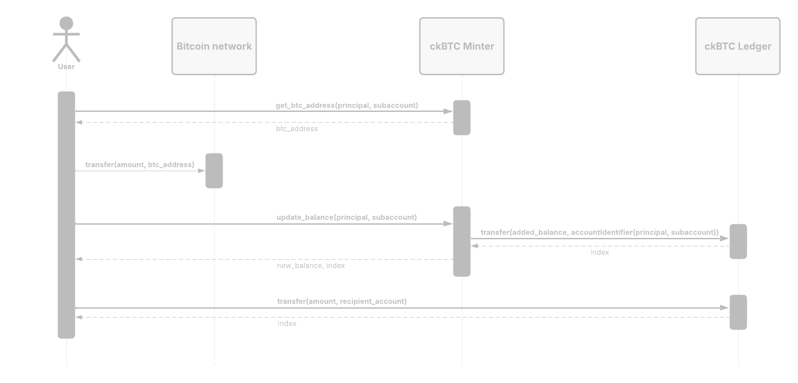

import { MarkdownChipRow } from "/src/components/Chip/MarkdownChipRow";

# ckBTC

<MarkdownChipRow labels={["Advanced", "Bitcoin", "Chain-key tokens" ]} />

## What is ckBTC?

Chain-key Bitcoin (ckBTC) is an [ICRC-2](https://github.com/dfinity/ICRC-1/blob/main/standards/ICRC-2/README.md)-compliant token that is backed 1:1 by BTC held 100% on the mainnet.

ckBTC does not rely on a centralized bridge to facilitate the conversion between BTC and ckBTC, which makes it substantially more secure when compared to other traditional 'wrapped' tokens.

ckBTC and BTC have the same value and can be swapped for one another seamlessly; however, ckBTC has several advantages. ckBTC has faster transactions that are finalized within a few seconds, and ckBTC transactions on ICP are significantly cheaper than those on the Bitcoin network.

## Why you should use ckBTC

Choosing ckBTC for your dapp or product can provide several advantages:

- Trustless commerce: Bitcoin-based commerce can run natively in an ICP smart contract, allowing for custodial solutions without mitigated third-party risks.

- Security: ckBTC is decentralized, reducing the risk of compromise or rug pulls.

- Low fees: A set fee of 0.0000001 ckBTC, which is equivalent to less than a cent or 10 satoshis.

- Fast transactions: ckBTC facilitates fast transactions using a local ledger, only settling transactions on the Bitcoin network when necessary.

- Easy integration: ckBTC is compatible with the ICRC-1 and ICRC-2 token standards.

- Verifiable: All ckBTC activity is verifiable onchain, and ckBTC transactions go through checks to ensure that no tainted bitcoin is used on ICP or transferred to tainted Bitcoin addresses.

## How it works

The ckBTC functionality is provided through an interplay of two canisters:
- The **ckBTC minter**.
- The **ckBTC ledger**.

| Canister source code                                                                | ckBTC (Bitcoin mainnet) deployment                                                                         | ckTESTBTC (Bitcoin testnet4) deployment                                                                    |
| ----------------------------------------------------------------------------------  | ---------------------------------------------------------------------------------------------------------- | ---------------------------------------------------------------------------------------------------------- |
| [Minter](https://github.com/dfinity/ic/tree/master/rs/bitcoin/ckbtc/minter)         | [mqygn-kiaaa-aaaar-qaadq-cai](https://dashboard.internetcomputer.org/canister/mqygn-kiaaa-aaaar-qaadq-cai) | [ml52i-qqaaa-aaaar-qaaba-cai](https://dashboard.internetcomputer.org/canister/ml52i-qqaaa-aaaar-qaaba-cai) |
| [Ledger](https://github.com/dfinity/ic/tree/master/rs/ledger_suite/icrc1/ledger)    | [mxzaz-hqaaa-aaaar-qaada-cai](https://dashboard.internetcomputer.org/canister/mxzaz-hqaaa-aaaar-qaada-cai) | [mc6ru-gyaaa-aaaar-qaaaq-cai](https://dashboard.internetcomputer.org/canister/mc6ru-gyaaa-aaaar-qaaaq-cai) |
| [Index](https://github.com/dfinity/ic/tree/master/rs/ledger_suite/icrc1/index-ng)   | [n5wcd-faaaa-aaaar-qaaea-cai](https://dashboard.internetcomputer.org/canister/n5wcd-faaaa-aaaar-qaaea-cai) | [mm444-5iaaa-aaaar-qaabq-cai](https://dashboard.internetcomputer.org/canister/mm444-5iaaa-aaaar-qaabq-cai) |

The **ckBTC ledger** is responsible for keeping account balances and for transferring ckBTC between accounts. To simplify access to the transaction history of the ledger, a dedicated [index canister](/docs/defi/token-indexes) is deployed.

The **ckBTC minter** is responsible for minting and burning ckBTC tokens. It uses the following workflow:

- Tokens are minted when a user transfers bitcoins to a specific Bitcoin address under the ckBTC minter's control. The Bitcoin address uniquely identifies the owner of the sent bitcoins.

- The ckBTC minter waits for confirmations of all Bitcoin transactions that affect the total supply of ckBTC (because of the lack of finality in Bitcoin).

- For Bitcoin retrieval requests, the ckBTC minter burns ckBTC before transferring the corresponding BTC amount (minus fees) using a regular Bitcoin transaction.

The ckBTC minter exposes a dashboard where you can find all the information about the minter's current state, the available UTXOs, outgoing transactions, current parameters, and the logs:

- [ckBTC minter dashboard](https://mqygn-kiaaa-aaaar-qaadq-cai.raw.icp0.io/dashboard)
- [ckTESTBTC minter dashboard](https://ml52i-qqaaa-aaaar-qaaba-cai.raw.icp0.io/dashboard)

A detailed description of ckBTC can be found in the [Wiki](https://wiki.internetcomputer.org/wiki/Chain-key_Bitcoin).

A simplified overview of the process to mint and transfer ckBTC is depicted in the following figure.

## Resources

- [ckBTC API reference](/docs/references/ckbtc-reference).

- [Bitcoin integration: technology overview](/docs/references/bitcoin-how-it-works).

- [Chain-key tokens](https://learn.internetcomputer.org/hc/en-us/articles/34211397080980-Chain-Key-Tokens).

- [GitHub repository](https://github.com/dfinity/ic/tree/master/rs/bitcoin/ckbtc/minter).

- [ckBTC overview](https://dashboard.internetcomputer.org/bitcoin) on the ICP Dashboard.

- [ckTESTBTC overview](https://dashboard.internetcomputer.org/testbtc) on the ICP Dashboard.

- [ckbtc](https://github.com/dfinity/ic-js/tree/main/packages/ckbtc) JavaScript library for interfacing with the ckBTC minter.

- [ledger-icrc](https://github.com/dfinity/ic-js/tree/main/packages/ledger-icrc) JavaScript library for interfacing with the ckBTC ledger.

- [icrc-ledger-agent](https://crates.io/crates/icrc-ledger-agent)

- [Developer Liftoff: ckBTC and Bitcoin integration](/docs/tutorials/developer-liftoff/level-4/4.3-ckbtc-and-bitcoin).

- [Deploying your first Bitcoin dapp](https://github.com/dfinity/examples/tree/master/motoko/basic_bitcoin).

- [Creating a ckBTC point of sale dapp](https://github.com/dfinity/examples/tree/master/motoko/ic-pos).

- [All about ckBTC](https://www.youtube.com/watch?v=cBZlTX818L8) DFINITY Twitter Space from February 2023.