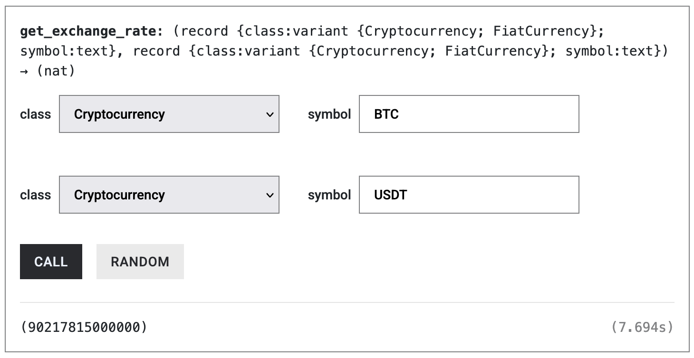
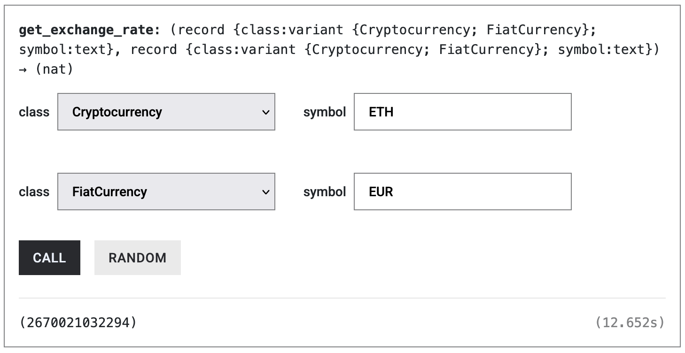

import { MarkdownChipRow } from "/src/components/Chip/MarkdownChipRow";
import { GlossaryTooltip } from "/src/components/Tooltip/GlossaryTooltip";
import TabItem from "@theme/TabItem";
import Tabs from "@theme/Tabs";

# Fetching Exchange Rates

<MarkdownChipRow labels={["Intermediate", "Tutorial"]} />

In this tutorial, you'll learn how to fetch exchange rates of various crypto and fiat currencies from within a <GlossaryTooltip>canister</GlossaryTooltip>.
Fetching exchange rates is useful in various financial applications, such as decentralized exchanges (DEXs) or points of sale.

Exchange rates can be fetched via the exchange rate canister.
It is a system canister that fetches and aggregates real-time and historical exchange rate data from major cryptocurrency exchanges and forex data providers.
It supports both cryptocurrency and fiat currency assets.
For detailed information about the exchange rate canister's API, supported assets, and advanced features, see the [reference documentation](/docs/references/system-canisters/xrc.mdx).

## Quickstart

### 1. Deploy the example project

- Clone the [Fetching Exchange Rates](https://icp.ninja/projects/xxx) project from ICP Ninja.
- Click on "Run" in the upper right corner to deploy the canister.

Once the canister is deployed on ICP Ninja, you should be able to see a window on the right containing all the canister's endpoints.

:::info
[ICP Ninja](https://icp.ninja) allows you to quickly test the deployment of canisters on the Internet Computer.
It's free and allows you to deploy canisters for 30 minutes.
:::

### 2. Fetch a crypto/crypto exchange rate (e.g. BTC/USDT)

Let's fetch the exchange rate of BTC/USDT.

Call the `get_exchange_rate()` endpoint with the following arguments:

- `base` asset: `symbol = "BTC"`, `class = "Cryptocurrency"`
- `quote` asset: `symbol = "USDT"`, `class = "Cryptocurrency"`

In a few seconds you should see the current price of BTC in USDT.

:::info
In trading pairs, the **base asset** is what you're buying or selling (the first asset in the pair), while the **quote asset** is what the price is denominated in (the second asset).
For example, in BTC/USDT, you're finding out how much USDT (quote) is needed to buy 1 BTC (base).
:::

### 3. Fetch a crypto/fiat exchange rate (ETH/EUR)

Let's fetch the exchange rate of ETH quoted in EUR (Euro).

Call the `get_exchange_rate()` endpoint with the following arguments:

- `base` asset: `symbol = "ETH"`, `class = "Cryptocurrency"`
- `quote` asset: `symbol = "EUR"`, `class = "FiatCurrency"`

:::tip
Try experimenting with different trading pairs such as BTC/USD, ICP/USD, or EUR/GBP to see what exchange rates are available.
:::

## Conclusion

The exchange rate canister enables you to fetch reliable, real-time exchange rates directly from within your canister without relying on external oracles.
By using this system canister, you can build financial applications like decentralized exchanges, payment systems, or asset management tools that always have access to accurate, aggregated market data from multiple sources.

For detailed information about the exchange rate canister's API, supported assets, and advanced features, see the [reference documentation](/docs/references/system-canisters/xrc.mdx).

