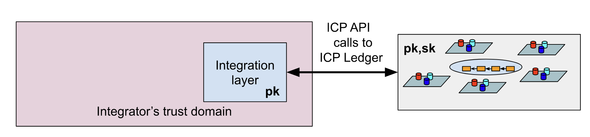
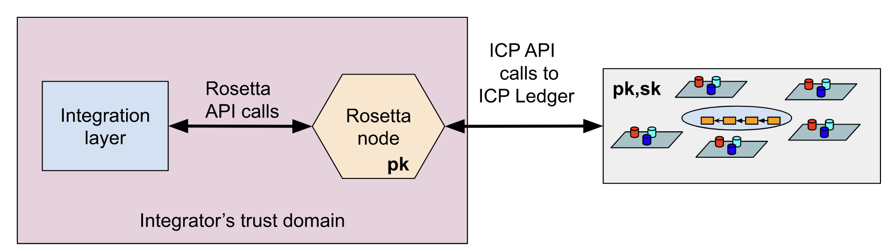

import { MarkdownChipRow } from "/src/components/Chip/MarkdownChipRow";
import '/src/components/CenterImages/center.scss';
import { GlossaryTooltip } from "/src/components/Tooltip/GlossaryTooltip";

# Ledger integration options

<MarkdownChipRow labels={["Intermediate", "Concept"  ]} />

Developers can integrate with the ICP or ICRC-1 ledgers using either the ICRC Rosetta or ICP Rosetta implementations, which are commonly recommended; however certain workflows may prefer to directly integrate with these ledgers.

:::info
Tokens other than ICP, e.g., ckBTC or CHAT, follow the ICRC suite of standards (ICRC-1, ICRC-2, etc.) and can be integrated in a similar manner as the main ICP token. For differences in detail, see below.
:::

- **Direct integration**: For a direct integration, one needs to provide an integration layer that interacts with ICP canisters via the ICP API. To support tokens on ICP, the integration layer needs to call into the individual ledger canisters corresponding to each token, to issue and retrieve transactions. On ICP, submitting messages does not require running a node, as all of the communication uses publicly available URLs and can be validated using the network's public key and chain-key cryptography. This type of integration requires familiarity with the ICP API and the ICP ledger API. There are API libraries for JavaScript/TypeScript, Rust, Java, C, C++, and Go.

- **Rosetta integration**: Requires running an instance of a Rosetta node within the trust domain of an integrator. This is an abstraction layer that hides the ICP network and ledger canister APIs. Interaction with the Rosetta node follows the [Rosetta API standard](https://docs.cdp.coinbase.com/mesh/docs/welcome) proposed and maintained by Coinbase.

The Rosetta node fetches and verifies the ICP token transaction chain and makes it available through the Rosetta API. In addition, it permanently syncs with the ICP ledger by downloading and verifying the ICP token transaction ledger. It offers endpoints for searching for transactions and blocks in the downloaded chain.

The Rosetta node can be run in a Docker container. It requires IPv6 connectivity and minimal compute, RAM, and disk requirements (10 GiB disk space currently).

## Direct integration
Direct integration is supported by libraries for Rust and TypeScript, but proficient use of these tools requires familiarity with the following concepts:

- The distinction between update calls and query calls.
- Reading the result of update calls.
- Deduplication guarantees of ICP.
- Ingress message lifecycle.
- How to verify the result of calls to canisters.
- API of the token canister(s) and their semantics.
- Deduplication guarantees by the ledger.
- How to fetch the token ledger and verify it is genuine.
- CBOR (Concise Binary Object Representation).
- Candid (ICP’s interface description language).

To implement a direct integration, you will need to:

- Make a call to a canister: To interact with a canister on the Internet Computer, an ingress message is constructed. This message specifies the target canister, the method to be invoked, and the call's payload. Additional parameters include an ingress expiration time, an optional nonce, and the caller's <GlossaryTooltip>principal</GlossaryTooltip> identifier. The API of most canisters, including token ledgers, is defined using a [Candid Interface Definition Language (IDL)](/docs/building-apps/interact-with-canisters/candid/candid-concepts). Calls can be executed as either replicated or non-replicated, depending on the endpoint where they are submitted.

- Read the result of a replicated call: The outcome of a replicated call's execution is temporarily stored in the public ingress history of the respective <GlossaryTooltip>subnet</GlossaryTooltip>. To access the result, a read state request is submitted, including the previously generated request ID. Given the asynchronous nature of this execution, results must be actively polled. Results are maintained in the ingress history for a brief period (5 minutes post-execution). Therefore, canisters may provide alternative methods for result retrieval that access the canister's internal state directly, such as ledger canisters offering transaction history and balance book access.

Canisters can be interacted with using official JavaScript/TypeScript ([ICP JavaScript agent](https://www.npmjs.com/package/@dfinity/agent)) and Rust ([ICP Rust agent](https://docs.rs/ic-agent/latest/ic_agent/)) libraries. Additionally, third-party libraries exist for other languages like Java, C, C++, and Go.

### Ledger canister API
The API for ledger canisters is generally standardized, following the [ICRC-1 standard](https://github.com/dfinity/ICRC-1/blob/main/standards/ICRC-1/README.md) for basic token transfers. All tokens adhering to this standard implement it. The [ICRC-3 standard](https://github.com/dfinity/ICRC-1/blob/main/standards/ICRC-3/README.md) further elaborates on how to fetch and verify the authenticity of the transaction chain maintained by canisters, ensuring integrity and trustworthiness in transactions.

## Rosetta node integration

The ICP Rosetta node consists of two main parts: integration with the ICP Ledger, compliant with the Coinbase API, and [governance](https://learn.internetcomputer.org/hc/en-us/articles/34574082263700-Tokenomics-Governance) integration. It operates in two modes:

- Online mode: Interacts with the ICP for real-time operations like checking account balances and submitting transactions.

- Offline mode: Used for transaction signing without an internet connection, suitable for securely signing transactions with private keys from cold storage.

The Rosetta node acts as a bridge between the Rosetta API specification by Coinbase and ICP, translating API calls to ICP requests. It can be deployed locally (Docker), offering an HTTP REST API interface. This node also fetches and verifies ICP transaction chains, storing data in an SQL database that's accessible both through the Rosetta API and directly with SQL tools.

:::info
DFINITY does not operate Rosetta nodes for the ICP community, and as of now there are no known third-party providers. The Rosetta node should run within the trust domain of an integrator.
:::

