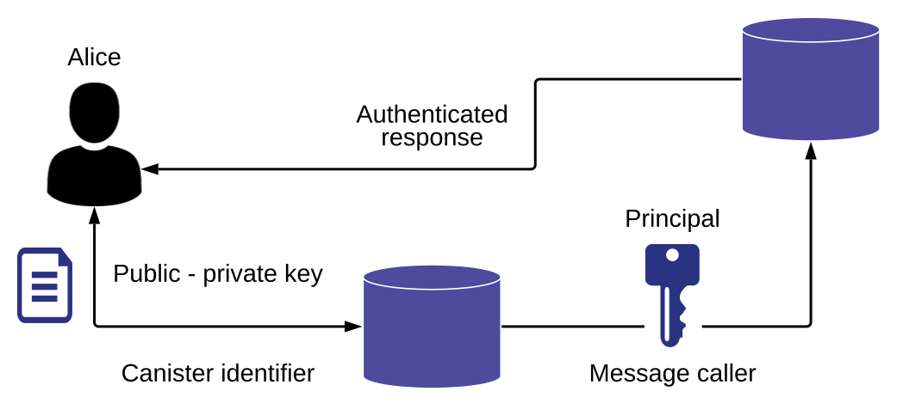

import TabItem from "@theme/TabItem";
import { AdornedTabs } from "/src/components/Tabs/AdornedTabs";
import { AdornedTab } from "/src/components/Tabs/AdornedTab";
import { BetaChip } from "/src/components/Chip/BetaChip";
import { MarkdownChipRow } from "/src/components/Chip/MarkdownChipRow";

# 16: Add access control with identities

<MarkdownChipRow labels={["Intermediate", "Motoko", "Tutorial"]} />

## Overview

Dapps often require role-based permissions to control the operations different users can perform.

To illustrate how to create and switch between user identities, this guide creates a simple dapp that displays a different greeting for users who are assigned to different roles.

In this example, there are three named roles: `owner`, `admin`, and `authorized`.

- Users who are assigned an `admin` role see a greeting that displays: `You have a role with administrative privileges`.

- Users who are assigned an `authorized` role see a greeting that displays: `Would you like to play a game?`.

- Users who are not assigned one of these roles see a greeting that displays: `Nice to meet you!`.

In addition, only the user identity that initialized the canister is assigned the `owner` role and only the `owner` and `admin` roles can assign roles to other users.

At a high-level, each user has a public/private key pair. The public key combined with the canister identifier the user accesses forms a security principal that can then be used as a message caller to authenticate function calls made to the canister running on the Internet Computer blockchain. The following diagram provides a simplified view of how user identities authenticate message callers.



## Prerequisites

Before getting started, assure you have set up your developer environment according to the instructions in the [developer environment guide](/docs/current/developer-docs/backend/motoko/dev-env).

## Create a new project

Open a terminal window on your local computer, if you don’t already have one open.

Create a new project by running the following command:

<AdornedTabs groupId="version">
  <TabItem value="0-17-0" label="dfx v0.17.0 or newer" default>

    Use `dfx new [project_name]` to create a new project:

    ```
    dfx new access_hello
    ```

    You will be prompted to select the language that your backend canister will use. Select 'Motoko:

    ```
    ? Select a backend language: ›
    ❯ Motoko
    Rust
    TypeScript (Azle)
    Python (Kybra)
    ```

    Then, select a frontend framework for your frontend canister. Select 'No frontend canister':

    ```
    ? Select a frontend framework: ›
    SvelteKit
    React
    Vue
    Vanilla JS
    No JS template
    ❯ No frontend canister
    ```

    Lastly, you can include extra features to be added to your project:

    ```
    ? Add extra features (space to select, enter to confirm) ›
    ⬚ Internet Identity
    ⬚ Bitcoin (Regtest)
    ⬚ Frontend tests
    ```

  </TabItem>

  <TabItem value="0-16-1" label="dfx v0.16.1 or older" default>

    ```bash
    dfx new access_hello --no-frontend
    cd access_hello
    npm install
    ```

    For projects created with `dfx new --no-frontend` (Motoko and Rust) the command automatically generates the project's default
    configuration and a default smart contract.

  </TabItem>
</AdornedTabs>

Navigate into your project directory by running the following command:

```
cd access_hello
```

## Modify the default dapp

For this guide, you are going to replace the template source code file with a dapp that has functions for assigning and retrieving roles.

Open the `src/access_hello_backend/main.mo` file in a text editor and delete the existing content.

Copy and paste this code into the file:

```motoko
// Import base modules
import AssocList "mo:base/AssocList";
import Error "mo:base/Error";
import List "mo:base/List";

shared({ caller = initializer }) actor class() {

    // Establish the role-based greetings to display
    public shared({ caller }) func greet(name : Text) : async Text {

        // If an identity with admin rights calls the method, display this greeting:
        if (has_permission(caller, #assign_role)) {
            return "Hello, " # name # ". You have a role with administrative privileges."

        // If an identity with the authorized user rights calls the method, display this greeting:
        } else if (has_permission(caller, #lowest)) {
            return "Welcome, " # name # ". You have an authorized account. Would you like to play a game?";

        // If the identity is not an admin or authorized user, display this greeting:
        } else {
            return "Greetings, " # name # ". Nice to meet you!";
        }
    };

    // Define the custom types used for each user type
    public type Role = {
        #owner;
        #admin;
        #authorized;
    };

    // Define the custom types for assigning the permissions
    public type Permission = {
        #assign_role;
        #lowest;
    };

    // Create two stable variables to store the roles associated with each principal
    private stable var roles: AssocList.AssocList<Principal, Role> = List.nil();
    private stable var role_requests: AssocList.AssocList<Principal, Role> = List.nil();

    // Return the caller's principal
    func principal_eq(a: Principal, b: Principal): Bool {
        return a == b;
    };

    // Get the principal's current role
    func get_role(pal: Principal) : ?Role {
        if (pal == initializer) {
            ?#owner;
        } else {
            AssocList.find<Principal, Role>(roles, pal, principal_eq);
        }
    };

    // Determine if a principal has a role with permissions
    func has_permission(pal: Principal, perm : Permission) : Bool {
        let role = get_role(pal);
        switch (role, perm) {
            case (?#owner or ?#admin, _) true;
            case (?#authorized, #lowest) true;
            case (_, _) false;
        }
    };

    // Reject unauthorized user identities
    func require_permission(pal: Principal, perm: Permission) : async () {
        if ( has_permission(pal, perm) == false ) {
            throw Error.reject( "unauthorized" );
        }
    };

    // Assign a new role to a principal
    public shared({ caller }) func assign_role( assignee: Principal, new_role: ?Role ) : async () {
        await require_permission( caller, #assign_role );

        switch new_role {
            case (?#owner) {
                throw Error.reject( "Cannot assign anyone to be the owner" );
            };
            case (_) {};
        };
        if (assignee == initializer) {
            throw Error.reject( "Cannot assign a role to the canister owner" );
        };
        roles := AssocList.replace<Principal, Role>(roles, assignee, principal_eq, new_role).0;
        role_requests := AssocList.replace<Principal, Role>(role_requests, assignee, principal_eq, null).0;
    };

    public shared({ caller }) func request_role( role: Role ) : async Principal {
        role_requests := AssocList.replace<Principal, Role>(role_requests, caller, principal_eq, ?role).0;
        return caller;
    };

    // Return the principal of the message caller/user identity
    public shared({ caller }) func callerPrincipal() : async Principal {
        return caller;
    };

    // Return the role of the message caller/user identity
    public shared({ caller }) func my_role() : async ?Role {
        return get_role(caller);
    };

    public shared({ caller }) func my_role_request() : async ?Role {
        AssocList.find<Principal, Role>(role_requests, caller, principal_eq);
    };

    public shared({ caller }) func get_role_requests() : async List.List<(Principal,Role)> {
        await require_permission( caller, #assign_role );
        return role_requests;
    };

    public shared({ caller }) func get_roles() : async List.List<(Principal,Role)> {
        await require_permission( caller, #assign_role );
        return roles;
    };
};
```

Let's take a look at a few key elements of this dapp:

- You might notice that the `greet` function is a variation on the `greet` function you have seen in previous guides. In this dapp, however, the `greet` function uses a message caller to determine the permissions that should be applied and, based on the permissions associated with the caller, which greeting to display.

- The dapp defines two custom types, one for `Roles` and one for `Permissions`.

- The `assign_roles` function enables the message caller to assign a role to the principal associated with an identity.

- The `callerPrincipal` function enables you to return the principal associated with an identity.

- The `my_role` function enables you to return the role that is associated with an identity.

Save your changes and close the `main.mo` file to continue.

## Start the local canister execution environment

Before you can build the `access_hello` project, you need to connect to the local replica running in your development environment or to the Internet Computer blockchain mainnet.

Open a new terminal window or tab on your local computer.

Start the local canister execution environment on your computer by running the following command:

```
dfx start --clean --background
```

After the local canister execution environment completes its startup operations, you can continue to the next step.

## Register, build, and deploy the dapp

After you connect to the local replica running in your development environment, you can register, build, and deploy your dapp in a single step by running the [`dfx deploy`](/docs/current/developer-docs/developer-tools/cli-tools/cli-reference/dfx-deploy) command.

You can also perform each of these steps independently using separate [`dfx canister create`](/docs/current/developer-docs/developer-tools/cli-tools/cli-reference/dfx-canister#dfx_canister_create), [`dfx build`](/docs/current/developer-docs/developer-tools/cli-tools/cli-reference/dfx-build), and [`dfx canister install`](/docs/current/developer-docs/developer-tools/cli-tools/cli-reference/dfx-canister#dfx_canister_install) commands.

Register, build, and deploy the `access_hello` backend dapp by running the following command in your project's directory:

```
dfx deploy
```

The output should resemble the following:

```
...
Committing batch.
Committing batch with 18 operations.
Deployed canisters.
URLs:
Frontend canister via browser
    access_hello_frontend: http://127.0.0.1:4943/?canisterId=cuj6u-c4aaa-aaaaa-qaajq-cai
Backend canister via Candid interface:
    access_hello_backend: http://127.0.0.1:4943/?canisterId=cbopz-duaaa-aaaaa-qaaka-cai&id=ctiya-peaaa-aaaaa-qaaja-cai
```

## Check the current identity context

Before you create any additional identities, let’s review the principal identifier associated with the `owner` identity, which was created when your canisters were deployed.

On the Internet Computer blockchain, a principal is the internal representative for a user, canister, node, or subnet. The textual representation for a principal is the external identifier you see displayed with working with the principal data type.

To review your current identity and principal, verify the currently-active identity by running the following command:

```
dfx identity whoami
```

The command displays output similar to the following:

```
owner
```

If the command displays anything other than `default`, you can switch to the `default` identity with the command:

```
dfx identity use owner
```

Check the principal for the `default` user identity by running the following command:

```
dfx identity get-principal
```

The command displays output similar to the following:

```
zen7w-sjxmx-jcslx-ey4hf-rfxdq-l4soz-7ie3o-hti3o-nyoma-nrkwa-cqe
```

Check the role associated with the `default` user identity by running the following command:

```
dfx canister call access_hello_backend my_role
```

The command displays output similar to the following:

```
(opt variant { owner })
```

## Create a new user identity

To begin testing the access controls in our dapp, let’s create some new user identities and assign those users to different roles.

To create a new user identity, create a new administrative user identity by running the following command:

```
dfx identity new ic_admin
```

The command displays output similar to the following:

```
Your seed phrase for identity 'ic_admin': void thought frown volcano reject claw weekend waste boost mouse hen genre crop real tooth tray hero perfect swarm nest demand green when fade
This can be used to reconstruct your key in case of emergency, so write it down in a safe place.
Created identity: "ic_admin".
```

Call the `my_role` function to see that your new user identity has not been assigned to any role.

```
dfx --identity ic_admin canister call access_hello_backend my_role
```

Switch your currently-active identity context to use the new `ic_admin` user identity and display the principal associated with the `ic_admin` user by running the following command:

```
dfx identity use ic_admin && dfx identity get-principal
```

The command displays output similar to the following:

```
Using identity: "ic_admin".
scc3r-hhpnt-264cn-t2ud3-sx74o-5txbl-arwi5-h7c4s-wx7zc-sl54q-dqe
```

Check the principal used to call the `access_hello_backend` canister by running the following command:

```
dfx canister call access_hello callerPrincipal
```

The command displays output similar to the following:

```
(principal "scc3r-hhpnt-264cn-t2ud3-sx74o-5txbl-arwi5-h7c4s-wx7zc-sl54q-dqe")
```

You will notice that the principal returned is the principal associated with the user context.

## Assign a role to an identity

To assign the admin role to the ic_admin identity, switch your currently-active identity context to use the `default` user identity by running the following command:

```
dfx identity use default
```

Assign the `ic_admin` principal the `admin` role by running a command similar to the following using Candid syntax:

```
dfx canister call access_hello_backend assign_role '((principal "scc3r-hhpnt-264cn-t2ud3-sx74o-5txbl-arwi5-h7c4s-wx7zc-sl54q-dqe"),opt variant{admin})'
```

Be sure to replace the `principal` hash with the one returned by the `dfx identity get-principal` command for the `ic_admin` identity.

Optionally, you can rerun the command to call the `my_role` function to verify the role assignment.

```
dfx --identity ic_admin canister call access_hello_backend my_role
```

The command displays output similar to the following:

```
(opt variant { admin })
```

Call the `greet` function using the `ic_admin` user identity that you just assigned the `admin` role by running the following command:

```
dfx --identity ic_admin canister call access_hello_backend greet "Internet Computer Admin"
```

The command displays output similar to the following:

```
(
    "Hello, Internet Computer Admin. You have a role with administrative privileges.",
)
```

## Add an authorized user identity

At this point, you have a `owner` user identity with the `owner` role and an `ic_admin` user identity with the `admin` role. Let’s add another user identity and assign it to the `authorized` role. For this example, however, we’ll use an environment variable to store the user’s principal.

To add a new authorized user identity, create a new authorized user identity by running the following command:

```
dfx identity new alice_auth
```

The command displays output similar to the following:

```
Your seed phrase for identity 'alice_auth': patch chronic blossom cup speed tape velvet coconut romance salad chicken castle refuse pepper first display jewel olive flight scene window diagram option shadow
This can be used to reconstruct your key in case of emergency, so write it down in a safe place.
Created identity: "alice_auth".
```

Switch your currently-active identity context to use the new `alice_auth` user identity by running the following command:

```
dfx identity use alice_auth
```

Store the principal for the `alice_auth` user in an environment variable by running the following command:

```
ALICE_ID=$(dfx identity get-principal)
```

You can verify the principal stored by running the following command:

```
echo $ALICE_ID
```

The command displays output similar to the following:

```
b5quc-npdph-l6qp4-kur4u-oxljq-7uddl-vfdo6-x2uo5-6y4a6-4pt6v-7qe
```

Use the `ic_admin` identity to assign the `authorized` role to `alice_auth` by running the following command:

```
dfx --identity ic_admin canister call access_hello_backend assign_role "(principal \"$ALICE_ID\", opt variant{authorized})"
```

Call the `my_role` function to verify the role assignment.

```
dfx --identity alice_auth canister call access_hello_backend my_role
```

The command displays output similar to the following:

```
(opt variant { authorized })
```

Call the `greet` function using the `alice_auth` user identity that you just assigned the `authorized` role by running the following command:

```
dfx canister call access_hello_backend greet "Alice"
```

The command displays output similar to the following:

```
(
    "Welcome, Alice. You have an authorized account. Would you like to play a game?",
)
```

## Add an unauthorized user identity

You have now seen a simple example of creating users with specific roles and permissions. The next step is to create a user identity that is not assigned to a role or given any special permissions.

Check your currently-active identity, if needed, by running the following command:

```
dfx identity whoami
```

Create a new user identity by running the following command:

```
dfx identity new bob_standard
```

The command displays output similar to the following:

```
Your seed phrase for identity 'bob_standard': sting length child airport select tube crane render march flee notable sheriff gown fitness absorb shoot cry history brisk throw rapid accident helmet coast
This can be used to reconstruct your key in case of emergency, so write it down in a safe place.
Created identity: "bob_standard".
```

Store the principal for the `bob_standard` user in an environment variable by running the following command:

```
BOB_ID=$(dfx --identity bob_standard identity get-principal)
```

Attempt to use the `bob_standard` identity to assign a role.

```
dfx --identity bob_standard canister call access_hello_backend assign_role "(principal \"$BOB_ID\", opt variant{authorized})"
```

This command returns an `unauthorized` error.

Attempt to use the `default` user identity to assign `bob_standard` the `owner` role by running the following command:

```
dfx --identity default canister call access_hello_backend assign_role "(principal \"$BOB_ID\", opt variant{owner})"
```

This command fails because users cannot be assigned the `owner` role.

Call the `greet` function using the `bob_standard` user identity by running the following command:

```
dfx --identity bob_standard canister call access_hello_backend greet "Bob"
```

The command displays output similar to the following:

```
("Greetings, Bob. Nice to meet you!")
```

## Set the user identity for multiple commands

So far, you have seen how to create and switch between user identities for individual commands. You can also specify a user identity you want to use, then run multiple commands in the context of that user identity.

List the user identities currently available by running the following command:

```
dfx identity list
```

The command displays output similar to the following with an asterisk indicating the currently-active user identity.

```
alice_auth
bob_standard
default *
ic_admin
owner
```

In this example, the `default` user identity is used unless you explicitly select a different identity.

Select a new user identity from the list and make it the active user context by running a command similar to the following:

```
dfx identity use ic_admin
```

The command displays output similar to the following:

```
Using identity: "ic_admin".
```

If you rerun the `dfx identity list` command, the `ic_admin` user identity displays an asterisk to indicate it is the currently active user context.

You can now run commands using the selected user identity without specifying `--identity` on the command-line.

## Resources

If you are looking for more information about identity and authentication, check out the following related resources:

- [dfx identity (command reference)](/docs/current/developer-docs/developer-tools/cli-tools/cli-reference/dfx-identity).

## Next steps

Next, let's dive into using the [Candid UI with canisters](.//docs/current/developer-docs/backend/motoko/candid-ui).
