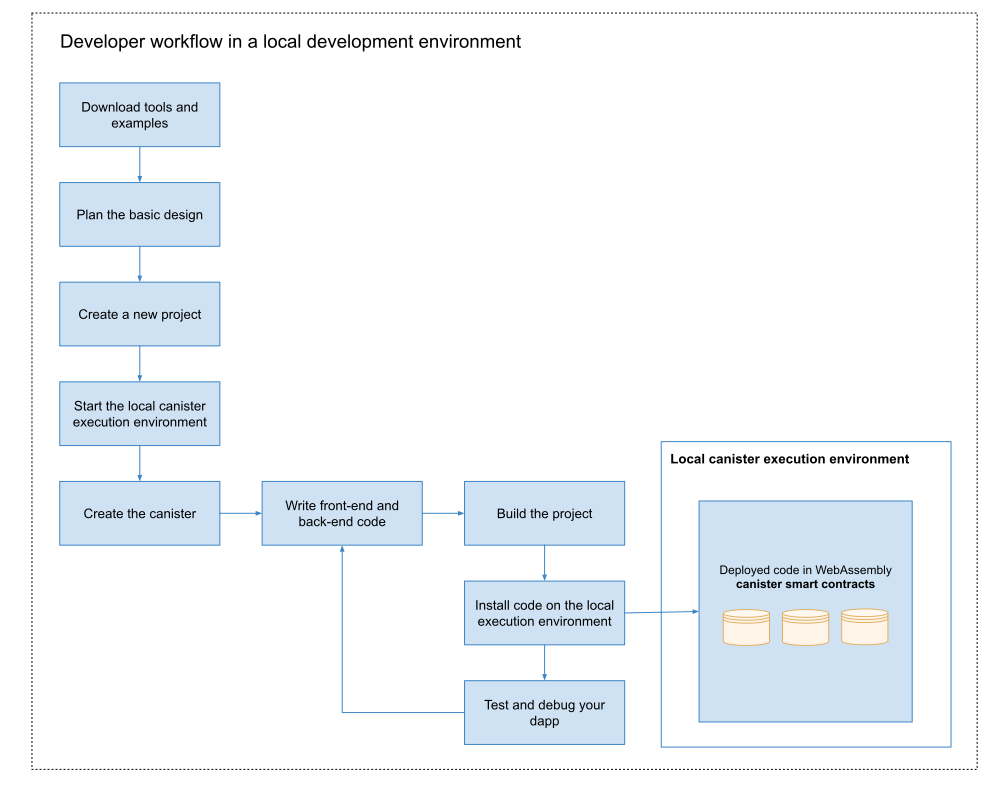

# 2: Exploring the default project

## Overview
If you started your tour of the IC SDK with the [deploy your first dapp in 5 minutes](/tutorials/deploy_sample_app.md), you have already seen the basic work flow for creating dapps that run on the Internet Computer. Now, let’s take a closer look at that work flow by exploring the default files and folders that are added to your workspace when you create a new project.

As a preview, the following diagram illustrates the development work flow when running the Internet Computer locally on you computer.



## Prerequisites

Before following this guide, assure that you have the necessary dependencies in your environment:

-   [x] Download and install the IC SDK package as described in the [download and install](/developer-docs/setup/install/index.mdx) page.

-   [x] Stop any local canister execution environments running on the computer.

-   [x] Assure you have an internet connection and access to a shell terminal on your local macOS or Linux computer.

-   [x] Install `node.js` if you want to include the default template files for frontend development in your project.

-   [x] Install the Visual Studio Code plugin for Motoko as described in [VS code extensions for IC development](/developer-docs/setup/vs-code.md) if you are using Visual Studio Code as your IDE.


## Create a new project

As discussed in the [tutorials](/tutorials/index.mdx), dapps for the Internet Computer start as **projects** that you create. You can create projects using the `dfx` executable command-line interface (CLI).

To take a closer look at the files and folders that are included in a project by default, let’s create a new project to work with.

To create a new project:

- #### Step 1:  Open a terminal shell on your local computer, if you don’t already have one open.

- #### Step 2:  Navigate to the folder you are using for your Internet Computer projects, if you are using a separate working folder.

- #### Step 3:  Create a new project by running the following command:

        dfx new explore_hello

    The `dfx new explore_hello` command creates a new `explore_hello` project, including a default project directory structure under the new project name and a new Git repository for your project. If you have `node.js` installed locally, creating a new project also adds some template frontend code and dependencies.

    To ensure that project names are valid when used in JavaScript, Motoko, and other contexts, you should only use alphanumeric characters and underscores. You cannot include dashes or any special characters.

- #### Step 4:  View the default directory structure by running the following command:

        ls -l explore_hello

    By default, the project directory structure includes at least one source subdirectory, a template `README.md` file, and a default `dfx.json` configuration file.

    Depending on whether you have `node.js` installed, your project directory might include some or all of the following files:

        explore_hello/
        ├── README.md      # default project documentation
        ├── dfx.json       # project configuration file
        ├── node_modules   # libraries for frontend development
        ├── package-lock.json
        ├── package.json
        ├── src            # source files directory
        │   ├── explore_hello_backend
        │   │   └── main.mo
        │   ├── explore_hello_frontend
        │       ├── assets
        │       │   ├── logo.png
        │       │   ├── main.css
        │       │   └── sample-asset.txt
        │       └── src
        │           ├── index.html
        │           └── index.js
        └── webpack.config.js

    At a minimum, the default project directory includes the following folders and files:

    -   A default `README` file for documenting your project in the repository.

    -   A default `dfx.json` configuration file to set configurable options for your project.

    -   A default `src` directory for all of the source files required by your dapp.

    The default `src` directory includes a template `main.mo` file that you can modify or replace to include your core programming logic.

    Because this guide focuses on the basics of getting started, you are only going to use the `main.mo` file. If you have `node.js` installed, your project directory includes additional files and directories that you can use to define the frontend interface for your dapp. Frontend development and the template files in the `assets` folder are discussed a little later.

## Review the default configuration

By default, creating a new project adds some template files to your project directory. You can edit these template files to customize the configuration settings for your project and to include your own code to speed up the development cycle.

To review the default configuration file for your project:

- #### Step 1:  Open a terminal shell on your local computer, if you don’t already have one open.

- #### Step 2:  Change to your project directory by running the following command:

        cd explore_hello

- #### Step 3:  Open the `dfx.json` configuration file in a text editor to review the default settings.

    It may look like this:

    ```
        {
        "canisters": {
            "explore_hello_backend": {
            "main": "src/explore_hello_backend/main.mo",
            "type": "motoko"
            },
            "explore_hello_frontend": {
            "dependencies": [
                "explore_hello_backend"
            ],
            "frontend": {
                "entrypoint": "src/explore_hello_frontend/src/index.html"
            },
            "source": [
                "src/explore_hello_frontend/assets",
                "dist/explore_hello_frontend/"
            ],
            "type": "assets"
            }
        },
        "defaults": {
            "build": {
            "args": "",
            "packtool": ""
            }
        },
        "output_env_file": ".env",
        "version": 1
        }
    ```

    Let’s take a look at a few of the default settings.

    -   The `settings` section specifies the name of the WebAssembly module for your `explore_hello` project is `explore_hello`.

    -   The `canisters.explore_hello` key specifies that the main program to be compiled is located in the path specified by the `main` setting, in this case, `src/explore_hello/main.mo` and the `type` setting indicates that this is a `motoko` program.

    -   The `canisters.explore_hello_assets` key specifies configuration details about frontend assets for this project. Let’s skip those for now.

    -   The `dfx` setting is used to identify the version of the software used to create the project.

    -   The `networks` section specifies information about the networks to which you connect. The default settings bind the local canister execution environment to the local host address `127.0.0.1` and port `4943`.

        If you have access to other Internet Computer network providers, the `networks` section can include network aliases and URLs for connecting to those providers.

    You can leave the default settings as they are.

- #### Step 4:  Close the `dfx.json` file to continue.

## Review the default program code

New projects always include a template `main.mo` source code file. You can edit this file to include your own code to speed up the development cycle.

Let’s take a look at the sample program in the default `main.mo` template file as a starting point for creating simple dapp using the Motoko programming language.

To review the default sample program for your project:

- #### Step 1:  Check that you are still in your project directory by running the following command:

        pwd

- #### Step 2:  Open the `src/explore_hello_backend/main.mo` file in a text editor and review the code in the template:

        actor {
            public func greet(name : Text) : async Text {
                return "Hello, " # name # "!";
            };
        };

    Let’s take a look at a few key elements of this program:

    -   You might notice that this sample code defines an `actor` instead of a `main` function, which some programming languages require. For Motoko, the `main` function is implicit in the file itself.

    -   Although the traditional "Hello, World!" program illustrates how you can print a string using a `print` or `println` function, that traditional program would not represent a typical use case for Motoko dapps that run on the Internet Computer.

    -   Instead of a print function, this sample program defines an `actor` with a public `greet` function that takes a `name` argument with a type of `Text`.

    -   The program then uses the `async` keyword to indicate that the program returns an asynchronous message consisting of a concatenated text string constructed using `"Hello, "`, the `#` operator, the `name` argument, and `"!"`.

    We’ll explore code that uses `actor` objects and asynchronous message handling more a little later. For now, you can continue to the next section.

- #### Step 3:  Close the `main.mo` file to continue.

## Start the local canister execution environment

Before you can deploy the default project, you need to connect to either the local canister execution environment, or to the Internet Computer blockchain mainnet.

Starting the local canister execution environment requires a `dfx.json` file, so you should be sure you are in your project’s root directory. For this guide, you should have two separate terminal shells, so that you can start and see network operations in one terminal and manage your project in another.

To start the local canister execution environment:

- #### Step 1:  Open a new terminal window or a new terminal tab on your local computer.

- #### Step 2:  Navigate to the root directory for your project, if necessary.

    -   You should now have **two terminals** open.

    -   You should have the **project directory** as your **current working directory**.

- #### Step 3:  Start the local canister execution environment by running the following command:

        dfx start

    Depending on your platform and local security settings, you might see a warning displayed. If you are prompted to allow or deny incoming network connections, click **Allow**.

    After you start the local canister execution environment, you have one terminal that displays messages about network operations and another for performing project-related tasks.

- #### Step 4:  Leave the terminal that displays network operations open and switch your focus to the terminal where you created your new project.

## Register canister identifiers

After you connect to the local canister execution environment, you can register with the network to generate unique, network-specific **canister identifiers** for your project.

In the [deploy your first dapp in 5 minutes](/tutorials/deploy_sample_app.md) tutorial, this step was performed as part of the `dfx deploy` command work flow. This guide demonstrates how to perform each of the operations independently.

To register canister identifiers for the local network:

- #### Step 1:  Check that you are still in your project directory, if needed.

- #### Step 2:  Register unique canister identifiers for the canisters in the project by running the following command:

        dfx canister create --all

    The command displays the network-specific canister identifiers for the canisters defined in the `dfx.json` configuration file.

        Creating canister explore_hello_backend...
        explore_hello_backend canister created with canister id: br5f7-7uaaa-aaaaa-qaaca-cai
        Creating canister explore_hello_frontend...
        explore_hello_frontend canister created with canister id: bw4dl-smaaa-aaaaa-qaacq-cai

    Because you are connected to the local canister execution environment, these canister identifiers are only valid locally and are stored for the project in the `.dfx/local/canister_ids.json` file.

    For example:

        {
        "explore_hello_backend": {
            "local": "br5f7-7uaaa-aaaaa-qaaca-cai"
        },
        "explore_hello_frontend": {
            "local": "bw4dl-smaaa-aaaaa-qaacq-cai"
        }
        }

## Build the dapp

Now that you have explored the default configuration settings and program code and have started the local canister execution environment, let’s compile the default program into an executable WebAssembly module.

To build the program executable:

- #### Step 1:  In the terminal shell on your local computer, navigate to your `explore_hello` project directory.

- #### Step 2:  Build the executable canister by running the following command:

        dfx build

    You should see output similar to the following:

        Building canisters...
        Building frontend...
        WARN: Building canisters before generate for Motoko
        Generating type declarations for canister explore_hello_frontend:
        src/declarations/explore_hello_frontend/explore_hello_frontend.did.d.ts
        src/declarations/explore_hello_frontend/explore_hello_frontend.did.js
        src/declarations/explore_hello_frontend/explore_hello_frontend.did
        Generating type declarations for canister explore_hello_backend:
        src/declarations/explore_hello_backend/explore_hello_backend.did.d.ts
        src/declarations/explore_hello_backend/explore_hello_backend.did.js
        src/declarations/explore_hello_backend/explore_hello_backend.did

    Because you are connected to the local canister execution environment, the `dfx build` command adds the `canisters` directory under the `.dfx/local/` directory for the project.

- #### Step 3:  Verify that the `.dfx/local/canisters/explore_hello_backend` directory created by the `dfx build` command contains the WebAssembly and related application files by running the following command.

        ls -l .dfx/local/canisters/explore_hello_backend/

    For example, the command returns output similar to the following:

        -rw-rw-rw-  1 pubs  staff      47 Jun 14 15:43 constructor.did
        -rw-r--r--  1 pubs  staff      47 Jun 14 15:43 explore_hello_backend.did
        -rw-r--r--  1 pubs  staff      32 Jun 14 15:43 explore_hello_backend.most
        -rw-r--r--  1 pubs  staff  134640 Jun 14 15:43 explore_hello_backend.wasm
        -rw-r--r--  1 pubs  staff    2057 Jun 14 15:43 index.js
        -rw-rw-rw-  1 pubs  staff       2 Jun 14 15:43 init_args.txt
        -rw-rw-rw-  1 pubs  staff      47 Jun 14 15:43 service.did
        -rw-r--r--  1 pubs  staff     175 Jun 14 15:43 service.did.d.ts
        -rw-r--r--  1 pubs  staff     174 Jun 14 15:43 service.did.js

    The `canisters/explore_hello_backend` directory contains the following key files:

    -   The `explore_hello_backend.did` file contains an interface description for your main dapp.

    -   The `index.js` file contains a JavaScript representation of the canister interface for the functions in your dapp.

    -   The `explore_hello_backend.wasm` file contains the compiled WebAssembly for the assets used in your project.

    The `canisters/explore_hello_frontend` directory contains similar files to describe the frontend assets associated with your project.

    In addition to the files in the `canisters/explore_hello_backend` and the `canisters/explore_hello_frontend` directories, the `dfx build` command creates an `idl` directory.

- #### Step 4:  Verify that a new folder has been created, `src/declarations`.

    This folder will include copies of the folders from `.dfx/local`, except for the wasm. They do not contain any secrets, and we recommend committing these files along with the rest of your source code.

## Deploy the project locally

You’ve seen that the `dfx build` command creates several artifacts in a `canisters` directory for your project. The WebAssembly modules and the `canister_manifest.json` file are required for your dapp to be deployed on the Internet Computer network.

To deploy to the local canister execution environment:

- #### Step 1:  In a terminal shell on your local computer, navigate to your `explore_hello` project directory.

- #### Step 2:  Deploy your `explore_hello` project on the local network by running the following command:

        dfx canister install --all

    The command displays output similar to the following:

        Installing code for canister explore_hello_backend, with canister ID br5f7-7uaaa-aaaaa-qaaca-cai
        Installing code for canister explore_hello_frontend, with canister ID bw4dl-smaaa-aaaaa-qaacq-cai
        Uploading assets to asset canister...
        Fetching properties for all assets in the canister.
        Starting batch.


- #### Step 3:  Run the `dfx canister call` command and specify the dapp and function to call by running the following command:

        dfx canister call explore_hello_backend greet '("everyone": text)'

    This command specifies:

    -   `explore_hello` as the name of the **canister** or dapp you want to call.

    -   `greet` as the specific **method** or function you want to call.

    -   `everyone` as the argument to pass to the `greet` function.

- #### Step 4:  Verify the command displays the return value of the `greet` function.

    For example:

        ("Hello, everyone!")

## View the default frontend

If you have `node.js` installed in your development environment, your project includes a simple frontend example that uses a template `index.js` JavaScript file for accessing the `explore_hello` dapp in a browser.

To explore the default frontend template:

- #### Step 1:  Open a terminal shell on your local computer, if you don’t already have one open, and navigate to your `explore_hello` project directory.

- #### Step 2:  Open the `src/explore_hello_frontend/src/index.js` file in a text editor and review the code in the template script:

        import { explore_hello } from "../../declarations/explore_hello_backend";

        document.getElementById("clickMeBtn").addEventListener("click", async () => {
          const name = document.getElementById("name").value.toString();
          // Interact with explore_hello actor, calling the greet method
          const greeting = await explore_hello_backend.greet(name);

          document.getElementById("greeting").innerText = greeting;
        });

    The template `index.js` imports an `explore_hello` agent from our newly created `declarations` directory. The agent is automatically configured to interact with the interface we created in `Main.mo`, and makes calls to our canister using an `AnonymousIdentity` when the user clicks the `greeting` button.

    This file works in conjunction with the template `index.html` file to display an HTML page with an image asset, input field, and button for the `greet` function.

- #### Step 3:  Close the `index.js` file to continue.

- #### Step 4:  View the frontend assets created for the project by running following command:

        ls -l .dfx/local/canisters/explore_hello_frontend/

    The command displays output similar to the following:

        -rw-r--r--  1 pubs  staff    6269 Dec 31  1969 assetstorage.did
        -rw-r--r--  1 pubs  staff  432762 Jun 14 15:47 assetstorage.wasm.gz
        -rw-rw-rw-  1 pubs  staff    6269 Dec 31  1969 constructor.did
        -rw-r--r--  1 pubs  staff  432762 Jun 14 15:47 explore_hello_frontend.wasm.gz
        -rw-r--r--  1 pubs  staff    2064 Jun 14 15:47 index.js
        -rw-rw-rw-  1 pubs  staff       2 Jun 14 15:47 init_args.txt
        -rw-rw-rw-  1 pubs  staff    6269 Jun 14 15:47 service.did
        -rw-r--r--  1 pubs  staff    6582 Jun 14 15:47 service.did.d.ts
        -rw-r--r--  1 pubs  staff    7918 Jun 14 15:47 service.did.js

    These files were generated automatically by the `dfx build` command using node modules and the template `index.js` file.

- #### Step 5:  Start a development server with `npm start`.

The output should resemble the following:

```
> explore_hello_frontend@0.2.0 start
> webpack serve --mode development --env development

<i> [webpack-dev-server] [HPM] Proxy created: /api  -> http://127.0.0.1:4943
<i> [webpack-dev-server] [HPM] Proxy rewrite rule created: "^/api" ~> "/api"
<i> [webpack-dev-server] Project is running at:
<i> [webpack-dev-server] Loopback: http://localhost:8083/
<i> [webpack-dev-server] On Your Network (IPv4): http://192.168.0.144:8083/
<i> [webpack-dev-server] On Your Network (IPv6): http://[fe80::1]:8083/
```

- #### Step 6:  Open a browser and navigate to the "Loopback" or "On Your Network (IPv4) address in a web browser.

- #### Step 7:  Verify that you see the HTML page for the sample application.

    For example:

    

- #### Step 8:  Type a greeting, then click **Click Me** to return the greeting.

    For example:

    

## Stop the local canister execution environment

After you finish experimenting with your dapp, you can stop the local canister execution environment so that it doesn’t continue running in the background.

To stop the local canister execution environment:

- #### Step 1:  In the terminal that displays network operations, press Control-C to interrupt the local network process.

- #### Step 2:  Stop the local canister execution environment by running the following command:

        dfx stop
