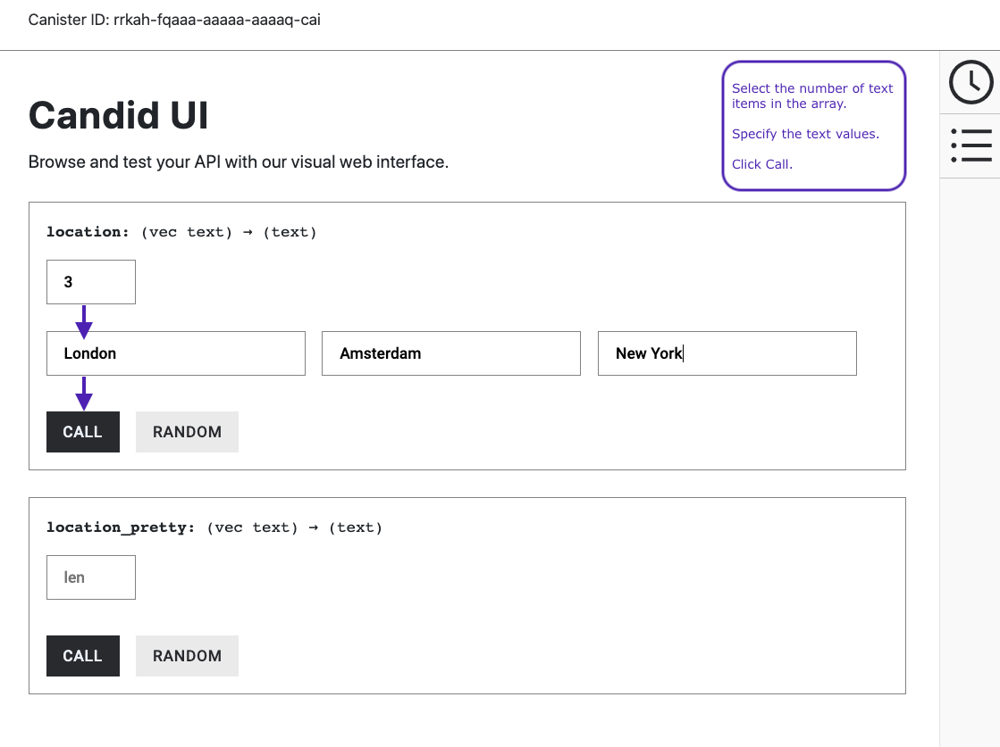

import Tabs from '@theme/Tabs';
import TabItem from '@theme/TabItem';

# 12: Passing text arguments

## Overview
This guide provides a simple variation on the default program that lets you pass a single text argument to a single actor, compile the code to create a canister, then retrieve the argument. Throughout this document, the terms canister and canister are considered synonymous.

This guide illustrates how to pass arguments on the command-line in a terminal using the Candid interface description language (IDL) and how to modify the program to allow it to accept more than one value for the text argument.

## Prerequisites

Before getting started, assure you have set up your developer environment according to the instructions in the [developer environment guide](/docs/current/developer-docs/backend/motoko/dev-env).

## Create a new project

To create a new project for this guide, open a terminal window on your local computer, if you don’t already have one open.

Then create a new project by running the following command:

<Tabs groupId="version">
<TabItem value="0-17-0" label="dfx v0.17.0 or newer" default>

Use `dfx new <project_name>` to create a new project:

```
dfx new location_hello
```

You will be prompted to select a language that your backend canister will use:

```
? Select a backend language: ›  
❯ Motoko
  Rust
  TypeScript (Azle)
  Python (Kybra)
```

Then, select a frontend framework for your frontend canister, or select 'No frontend canister':

```
  ? Select a frontend framework: ›  
❯ SvelteKit
  React
  Vue
  Vanilla JS
  No JS template
  No frontend canister
```

Lastly, you can include extra features to be added to your project:

```
  ? Add extra features (space to select, enter to confirm) ›
⬚ Internet Identity
⬚ Bitcoin (Regtest)
⬚ Frontend tests
```

</TabItem>

<TabItem value="0-16-1" label="dfx v0.16.1 or older" default>

```bash
dfx new location_hello
```

For projects created with `dfx new` (Motoko and Rust) the command automatically generates the project's default configuration and two default smart contracts. 

</TabItem>
</Tabs>

Then navigate into your project directory by running the following command:

```
cd location_hello
```

## Modify the default configuration

In the [explore the default project](explore-templates) guide, you saw that creating a new project adds a default `dfx.json` configuration file to your project directory. You should always review the default settings in the file to verify the information accurately reflects the project settings you want to use. For this guide, you’ll modify the default configuration to remove settings that aren’t used.

To modify settings in the `dfx.json` configuration file, open the `dfx.json` configuration file in a text editor.

Check the default settings for the `location_hello` project, then remove all of the unnecessary configuration settings.

:::info
Because this guide does not involve creating any frontend assets, you can remove all of the `location_hello_frontend` configuration settings from the file.
:::

Save your changes and close the file to continue.

## Modify the default program

In the [explore the default project](explore-templates) guide, you saw that creating a new project creates a default `src` directory with a template `main.mo` file.

To modify the default template source code, open the `src/location_hello_backend/main.mo` source code file in a text editor.

Modify the default source code to replace the `greet` function with a `location` function and the `name` argument with a `city` argument.

For example, you can replace the file's existing code with the following:

```motoko
actor {
public func location(city : Text) : async Text {
    return "Hello, " # city # "!";
};
};
```

Save your changes and close the file to continue.

## Start the local canister execution environment

Before you can build your project, you need to connect to a local canister execution environment or the Internet Computer blockchain mainnet.

Starting a canister execution environment locally requires a `dfx.json` file, so you should be sure you are in your project’s root directory. For this guide, you should have two separate terminal shells, so that you can start and see network operations in one terminal and manage your project in another.

To start the local canister execution environment, open a new terminal window or tab on your local computer.

:::info
-   You should now have **two terminals** open.
-   You should have the **project directory** as your **current working directory**.
:::

Start the canister execution environment on your local computer by running the following command:

```
dfx start
```

If you are prompted to allow or deny incoming network connections, click **Allow**.

Leave the terminal that displays network operations open and switch your focus to your original terminal where you created your project.

## Register, build, and deploy the dapp

After you connect to the local canister execution environment, you can register, build, and deploy your dapp locally.

Register, build, and deploy your application by running the following command:

```
dfx deploy
```

The `dfx deploy` command output displays information about the operations it performs.

## Pass a text argument

You now have a program deployed as a **canister** in your local canister execution environment and can test your program by using `dfx canister call` commands.

Call the `location` method in the program and pass your `city` argument of type `text` by running the following command:

```
dfx canister call location_hello_backend location "San Francisco"
```

Because the argument in this case includes a space between `San` and `Francisco`, you need to enclose the argument in quotes. The command displays output similar to the following:

```
("Hello, San Francisco!")
```

If the argument did not contain a space that required enclosing the text inside of quotation marks, you could allow the Candid interface description language to infer the data type like this:

```
dfx canister call location_hello_backend location Paris
```

Candid infers the data type as `Text` and returns the output from your program as text like this:

```
("Hello, Paris!")
```

Call the `location` method in the program and pass your `city` argument explicitly using the Candid interface description language syntax for Text arguments:

```
dfx canister call location_hello_backend location '("San Francisco and Paris")'
```

The command displays output similar to the following:

```
("Hello, San Francisco and Paris!")
```

Because your program only accepts a single text argument, specifying multiple strings returns only the first argument. For example, if you try this command:

```
dfx canister call location_hello_backend location '("San Francisco","Paris","Rome")'
```

Only the first argument—`("Hello, San Francisco!")`—is returned.

## Revise the source code in your program

To extend what you have learned in this guide, you might want to try modifying the source code to return different results. For example, you might want to modify the `location` function to return multiple city names.

Open the `dfx.json` configuration file in a text editor and change the default `location_hello` settings to `favorite_cities`.

For this step, you should modify both the canister name and the path to the main program for the canister to use `favorite_cities`. Your `dfx.json` file should look like this:

```json
{
"canisters": {
    "favorite_cities": {
    "main": "src/favorite_cities/main.mo",
    "type": "motoko"
    }
    },
"defaults": {
    "build": {
    "args": "",
    "packtool": ""
    }
},
"output_env_file": ".env",
"version": 1
}
```

Save your changes and close the `dfx.json` file to continue.

Copy the `location_hello` source file directory to match the name specified in the `dfx.json` configuration file by running the following command:

```
cp -r src/location_hello_backend src/favorite_cities
```

Open the `src/favorite_cities/main.mo` file in a text editor. Copy and paste the following code sample to replace the `location` function with two new functions:

```motoko
actor {

public func location(cities : [Text]) : async Text {
    return "Hello, from " # (debug_show cities) # "!";
};

public func location_pretty(cities : [Text]) : async Text {
    var str = "Hello from ";
    for (city in cities.vals()) {
    str := str # city #", ";
    };
    return str # "bon voyage!";
}
};

```

You might notice that `Text` in this code example is enclosed by square (`[ ]`) brackets. By itself, `Text` represents a collection of UTF-8 characters. The square brackets around a type indicate that it is an **array** of that type. In this context, therefore, `[Text]` indicates an array of a collection of UTF-8 characters, enabling the program to accept and return multiple text strings.

The code sample also uses the basic format of an `apply` operation for the array, which can be abstracted as:

```motoko
public func apply<A, B>(fs : [A -> B], xs : [A]) : [B] {
    var ys : [B] = [];
    for (f in fs.vals()) {
        ys := append<B>(ys, map<A, B>(f, xs));
    };
    ys;
};
```

For information about the functions that perform operations on arrays, see the description of the Array module in the Motoko base library or the **Motoko programming language reference**. For another example focused on the use of arrays, see the [quick sort](https://github.com/dfinity/examples/tree/master/motoko/quicksort) project in the [examples](https://github.com/dfinity/examples/) repository.

Register, build, and deploy the dapp by running the following command in your project's directory:

```
dfx deploy
```

Call the `location` method in the program and pass your `city` argument using the Candid interface description syntax by running the following command:

```
dfx canister call favorite_cities location '(vec {"San Francisco";"Paris";"Rome"})'
```

The command uses the Candid interface description syntax `(vec { val1; val2; val3; })` to return a vector of values. For more information about the Candid interface description language, see the [Candid](/docs/current/developer-docs/smart-contracts/candid/index) language guide.

This command displays output similar to the following:

```
("Hello, from ["San Francisco", "Paris", "Rome"]!")
```

Call the `location_pretty` method in the program and pass your `city` argument using the interface description syntax by running the following command:

```
dfx canister call favorite_cities location_pretty '(vec {"San Francisco";"Paris";"Rome"})'
```

The command displays output similar to the following:

```
("Hello from San Francisco, Paris, Rome, bon voyage!")
```

Test your code using the Candid UI.

To test your code, [follow the instructions](/docs/current/developer-docs/backend/motoko/candid-ui).
In this example, each function accepts an array of text strings. Therefore, you first select the length of the array, then set values for each item before clicking **Call**.



## Next steps

In the next guide, you'll learn about [accepting cycles from a wallet.](./simple-cycles.mdx)