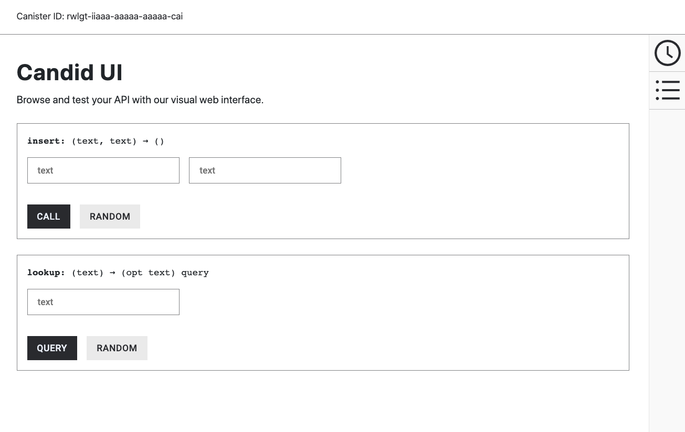

# 9: Importing library modules

## Overview

In this guide, you are going to write a simple dapp that enables you to store and look up telephone numbers. This guide illustrates how to import and use a few basic Motoko library functions.

## Package managers

While you'll be using the Motoko base library in this example, it important to mention that there are hundreds of third-party Motoko libraries that can be downloaded and imported using a package manager. A package manager is a tool used to install, upgrade, and manage libraries. For Motoko, [Mops](https://mops.one) and [Vessel](https://github.com/dfinity/vessel) are supported package managers.

### Mops

Mops can be installed with the `npm` command:

```
npm i -g ic-mops
```

Packages can then be installed with the `mops` command, such as:

```
mops add base
```

Then, configure `dfx.json` to use Mops as a `packtool`:

```json
{
  "defaults": {
    "build": {
      "packtool": "mops sources"
    }
  }
}
```

### Vessel

Vessel can be installed by downloading the Vessel binary from [the GitHub release page](https://github.com/dfinity/vessel/releases).

To install a package using Vessel, edit the `vessel.dhall` file to include what packages your project will import. 

Then, configure `dfx.json` to use Vessel as a `packtool`:

```json
"defaults": {
  "build": {
    "packtool": "vessel sources"
  }
}
```

For this guide, the Motoko base library functions are defined in the `List` and `AssocList` modules and enable you to work with lists as linked key-value pairs. In this example, the **key** is a `name` and the **value** is the `phone` text string associated with that name.

This dapp supports the following function calls:

-   The `insert` function accepts the `name` and `phone` key-value pair as input stored in the `book` variable.

-   The `lookup` function is a query that uses the specified `name` key as input to find the associated phone number.

## Prerequisites

Before getting started, assure you have set up your developer environment according to the instructions in the [developer environment guide](./dev-env.md).

## Create a new project

Open a terminal window on your local computer, if you don’t already have one open.

Then, create a new project by running the following command:

```
dfx new phonebook
```

Change into your project directory by running the following command:

```
cd phonebook
```

## Modify the default dapp

For this guide, let’s create a new `main.mo` file for the simple phone number lookup dapp.

To modify the default template, open the `src/phonebook_backend/main.mo` file in a text editor and delete the existing content.

Copy and paste the following code into the `main.mo` file:

```
// Import standard library functions for lists

import L "mo:base/List";
import A "mo:base/AssocList";

// The PhoneBook actor.
actor {

    // Type aliases make the rest of the code easier to read.
    public type Name = Text;
    public type Phone = Text;

    // The actor maps names to phone numbers.
    flexible var book: A.AssocList<Name, Phone> = L.nil<(Name, Phone)>();

    // An auxiliary function checks whether two names are equal.
    func nameEq(l: Name, r: Name): Bool {
        return l == r;
    };

    // A shared invokable function that inserts a new entry
    // into the phone book or replaces the previous one.
    public func insert(name: Name, phone: Phone): async () {
        let (newBook, _) = A.replace<Name, Phone>(book, name, nameEq, ?phone);
        book := newBook;
    };

    // A shared read-only query function that returns the (optional)
    // phone number corresponding to the person with the given name.
    public query func lookup(name: Name): async ?Phone {
        return A.find<Name, Phone>(book, name, nameEq);
    };
};
```

In looking at this sample dapp, you might notice the following key elements:

-   The code defines `Name` and `Phone` as custom text types. Creating user-defined types improves the readability of the code.

-   The `insert` function is an update call and the `lookup` function is a query call.

-   The `Phone` type is identified as an optional value by using the `?Phone` syntax.

## Start the local canister execution environment

For development purposes `dfx` provides a local canister execution environment. This requires a `dfx.json` file, so you should be sure you are in your project’s root directory. For this guide, you should have two separate terminal shells, so that you can start and see the output of the local canister execution environment in one terminal and manage your project in another.

To start the local canister execution environment, open a new terminal window or tab on your local computer.

Then navigate to the root directory for your project, if necessary.

:::info
-   You should now have **two terminals** open.
-   You should have the **project directory** as your **current working directory**.
:::

Start the local canister execution environment on your local computer by running the following command:

```
dfx start --clean
```

:::info
For this guide, we’re using the `--clean` option to start the local canister execution environment in a clean state.

This option removes any orphan background processes or canister identifiers that might disrupt normal operations. For example, if you forgot to issue a `dfx stop` when moving between projects, you might have a process running in the background or in another terminal. The `--clean` option ensures that you can start the local canister execution environment and continue to the next step without manually finding and terminating any running processes.
:::

Leave the terminal that displays the output of the local canister execution environment open and switch your focus to your original terminal where you created your new project.

## Register, build, and deploy the dapp

Once the local canister execution environment is up and running in your development environment, you can register, build, and deploy your dapp onto it.

To deploy the dapp locally, run the following command in your project's directory::

```
dfx deploy
```

The `dfx.json` file provides default settings for creating a dapp backend canister and a frontend canister.

For this guide, you can deploy just the phonebook_backend canister using the `dfx deploy phonebook_backend` command because the project doesn’t include any frontend assets and you will interact with it via the terminal.

Although this guide illustrates how to skip compiling a frontend canister, you can add a simple user interface to this dapp later by exploring the [phonebook](https://github.com/dfinity/examples/tree/master/motoko/phone-book) project in the [examples](https://github.com/dfinity/examples) repository.

## Interacting with the canister

You now have a dapp deployed as a **canister** on your local canister execution environment and can test your dapp by using `dfx canister call` commands.

To test the dapp you have deployed:

Use the `dfx canister call` command to call the canister `phonebook` using the `insert` function and pass it a name and phone number by running the following command:

```
dfx canister call phonebook_backend insert '("Chris Lynn", "01 415 792 1333")'
```

Add a second name and number pair by running the following command:

```
dfx canister call phonebook_backend insert '("Maya Garcia", "01 408 395 7276")'
```

Verify that the command returns the number associated with "Chris Lynn" using the `lookup` function by running the following command:

```
dfx canister call phonebook_backend lookup '("Chris Lynn")'
```

The command returns output similar to the following:

```
(opt "01 415 792 1333")
```

Try to call the `lookup` function with the number associated with "Maya Garcia" by running the following command:

```
dfx canister call phonebook_backend lookup '("01 408 395 7276")'
```

Note that, in this case, the command returns `(null)` because the phone number is not a key associated with the "Maya Garcia" name entry.

Try to call the `lookup` function again to return the phone numbers for both "Maya Garcia" and "Chris Lynn" by running the following command:

```
dfx canister call phonebook_backend lookup '("Maya Garcia","Chris Lynn")'
```

Because the dapp is written to return one value for one key, the command only returns information associated with the first key, in this example the phone number for `Maya Garcia`.

## Test your code using the Candid UI.

To test your code, follow the instructions [here](candid-ui.md).



## Revise the source code in your dapp

To extend what you have learned in this guide, you might want to try modifying the source code to return different results.

For example, you might want to change the source code so that instead of a dapp that inserts and looks up a current key-value (name-phone) pair to create a dapp that stores contact information similar to a database "record" in which a primary key is associated with multiple fields. In this example, your dapp might enable users or another dapp to add information, such as a home phone number, a cell phone number, an email address, and a street address—and selectively return all or specific field values.

## Next steps

Next, let's take a look at [using integers in calculator functions](calculator.md)
