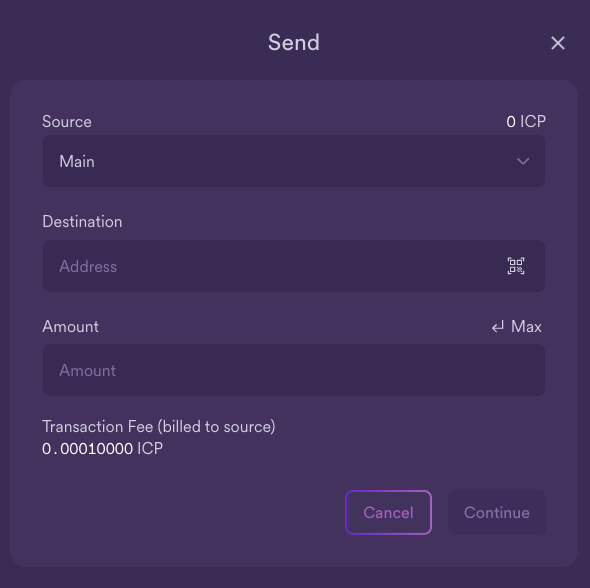

import { MarkdownChipRow } from "/src/components/Chip/MarkdownChipRow";
import '/src/components/CenterImages/center.scss';

# Participating with the NNS dapp

<MarkdownChipRow labels={["Beginner", "Governance", "Tutorial"]} />

The NNS DAO is realised as a set of canister smart contracts on the Internet Computer.
To participate in governance, there are different ways to interact with the NNS.

This guide will showcase how to interface with the NNS through the [NNS dapp](https://nns.ic0.app).
You can interact with the NNS through other tools, such as [quill](/docs/current/developer-docs/developer-tools/cli-tools/quill-cli-reference/quill-parent)
and [ic-js](https://github.com/dfinity/ic-js/tree/main/packages/nns).

We start with a tutorial on how to connect to the NNS with the [NNS dapp](https://nns.ic0.app).
In the following pages we will see how to use the NNS dapp to
[transfer tokens](/docs/current/developer-docs/daos/nns/send-and-receive-tokens),
[stake tokens in a neuron](/docs/current/developer-docs/daos/nns/nns-dapp-staking-a-neuron) and set up the neuron,
and how to participate in voting either by [voting manually](/docs/current/developer-docs/daos/nns/nns-dapp-voting-on-proposals)
 or by [following](/docs/current/developer-docs/daos/nns/nns-dapp-following-other-neurons).

## Connect to the Internet Computer

To connect to the Internet Computer using the Network Nervous System (NNS) dapp:

- #### Step 1:  Open a browser and navigate to the [Network Nervous System (NNS)](https://nns.ic0.app) dapp.

- #### Step 2:  Click **Login** to connect to [Internet Identity](https://identity.ic0.app).

If you haven’t previously registered, you can click **Register with Internet Identity** to register.

:::info
We strongly recommend you add multiple devices and authentication methods to your Internet Identity. For example, register multiple physical devices like your computer and phone with a security key and using the authentication options that those devices—and browsers running on them—support.
:::

For more information about creating an Internet Identity, see [how to use Internet Identity](https://internetidentity.zendesk.com/hc/en-us/articles/15430677359124-How-Do-I-Create-an-Internet-Identity-on-My-Mobile-Device-).

After you have registered, you can click **Login** to authenticate using your anchor and the authentication method—for example, a security key or fingerprint—you have registered.

- #### Step 3:  Click **Proceed** to access to the Network Nervous System (NNS) dapp.

### Add an account

Logging on using an Internet Identity creates a main account for you in the Internet Computer ledger. If your ICP utility tokens are associated with your developer identity; that is, the identity created by the SDK `dfx` command-line interface. Your main account displays 0.00 for your ICP utility token balance. For example:

Before transferring any tokens, you can create one or more linked subaccounts or attach a hardware wallet to your account.

To add an account for managing ICP utility tokens:

- #### Step 1:  On the default 'Tokens' tab, click 'ICP', then **Add Account**.

- #### Step 2:  Select the type of account to add.

    -   **New Account** creates a new subaccount linked to your Main account address in the ledger.

    -   **New Account (Hardware Wallet)** adds a hardware wallet to your main account address in the ledger.

- #### Step 3:  Click **New Account**, type an Account Name, then click **Create**.

============================================================================================================
# Additional functionality
In addition to being the portal for interacting with the NNS DAO, the NNS dapp also provides access to the SNS DAOs and their launches and allows users to manage the canisters that they own.
This is a brief guide to these additional functionalities.

## SNS decentralization swaps

You can participate in SNS decentralization swaps from the NNS dapp using the 'Launchpad' tab. An SNS is an advanced version of a decentralized autonomous organization, where the participants of the SNS can vote on proposals, such as a new feature, roadmap item, or allocation of SNS funds.

You can learn more about SNS [here](https://internetcomputer.org/sns)

To view current and past SNS decentralization swaps from the NNS dapp:

- #### Step 1:  From the NNS dapp, click **Launchpad** from the left navigation bar.

- #### Step 2: Select any SNS swap to view the details, such as the status, total participants, token supply, and when the swap ended.

## Deploying and managing canisters from the NNS dapp

You must have **cycles** available to create and manage [canisters](/docs/current/concepts/glossary#canister), which are similar to smart contracts. The [Network Nervous System (NNS)](https://nns.ic0.app) dapp provides a convenient way for you to create and manage canisters by enabling you to convert ICP utility tokens into cycles and attach cycles to specific canister identifiers.

To create a new canister:

- #### Step 1:  From the NNS dapp, click **Canisters**, then click **Create Canister** or **Link Canister**.

- #### Step 2: If you select **Create Canister**, select the source account you'd like to use to create the canister.

- #### Step 3: Then, enter the amount of ICP tokens and cycles to create the canister with. Then select **Review Canister Creation**.

- #### Step 4:  Review the ICP utility tokens to cycles details, then click **Confirm** to continue.

After you click Confirm, you can review:
- The new canister identifier.
- The number of cycles available for the canister to use.
- The controlling principal that currently has full management rights for the new canister.

:::info
To change the principal used as the controller of the canister, click **Change Controllers**.

To add cycles to the canister, click **Add Cycles**.
:::

- #### Step 5: To link a canister, input the canister's ID, then select **Confirm**.

- #### Step 6: Return to the **Canisters** tab to see the canisters you have created.

For example:

