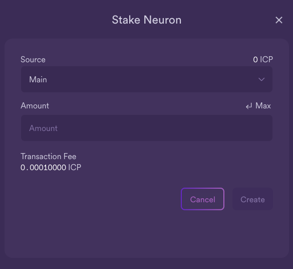

import { MarkdownChipRow } from "/src/components/Chip/MarkdownChipRow";
import '/src/components/CenterImages/center.scss';

# Following

<MarkdownChipRow labels={["Beginner", "Governance", "Tutorial"]} />
TODO

<iframe width="560" height="315" src="https://www.youtube.com/embed/6BznC9p3w8w?si=m7nc7xTGq5YUtXa3" title="YouTube video player" frameborder="0" allow="accelerometer; autoplay; clipboard-write; encrypted-media; gyroscope; picture-in-picture; web-share" referrerpolicy="strict-origin-when-cross-origin" allowfullscreen></iframe>

## Neuron following
Neuron owners may find it hard to manually vote on every proposal submitted to the NNS. For example,neuron owners may not have the time or necessary expertise to evaluate each individual proposal.
The NNS uses a form of liquid democracy to address these challenges.
To aid in this, the NNS supports **neuron following **.
A neuron can be configured to vote automatically by following the voting decision made by a group of other neurons.
Following is done on the basis of topics, and a neuron can follow up to 15 neurons on each topic.

### Following rules
A neuron can choose to follow the voting decision for different proposal topics like governance or subnet management. For example, if a neuron has been configured to follow a group's decision for governance proposals, if the group votes to adopt a governance proposal with more than half of the followees voting in favor of adoption, the neuron following that group will vote to approve the proposal as well. If the neuron has been configured to follow a group's decision for subnet management proposals and the group votes to reject a subnet management proposal with at least half of the followees voting to reject, the neuron following the group will vote to reject the proposal.

:::caution
Your neuron will follow when there are enough votes to make a call (whether it is a ADOPT or REJECT). Your neuron will only cast a "Yes"-vote if **more than half** of the neurons within the group voted Yes. Your neuron will only cast a "No"-vote if **at least half** of the neurons within the group voted No. For example, if you follow 10 neurons on a topic:

a. Your neuron only votes to adopt if at least 6 out of the 10 neurons vote to adopt.

b. Your neuron only votes to reject a proposal if at least 5 out of the 10 reject the proposal.

c. If less than 5 neurons (out of your 10 followed) vote at all, your neuron will not cast any vote.

This should be considered when choosing to follow multiple neurons on a topic.
It might be better to follow fewer neurons, and it can be more beneficial to follow an odd number of neurons than an even number.
:::

### Following "catch-all"
In addition to setting following for individual topics, neurons may also define a catch-all follow rule which is triggered for proposals with topics for which no other explicit follow rule has been defined.
However, the catch-all follow rule does not include SNS & neurons' fund or governance proposals.

:::caution
The catch-all follow rule is only applied for proposal topics with no other explicit choice. For example, let's assume neuron A follows neuron B for the catch-all and neuron C on the topic subnet management. If B votes on a subnet management proposal but C does not, no vote will be cast for A.

The catch-all follow rule does not apply for SNS & neurons' fund or governance proposals.
For example, if neuron A follows neuron B for the catch-all and B votes on a governance proposal, no vote will be cast for A. If neuron A intents to also follow B on such decisions, the user has to explicitly choose to also follow B on the governance topic.
:::

It is in each neuron's interest to follow other neurons that support the best interests of the network and their own economic interests.

To configure your neuron to follow the group of another neuron:

- #### Step 1: From the NNS dapp, select 'Neuron Staking', then select the neuron that you'd like to set a following rule for.

- #### Step 2: In the neuron's details, scroll down to the 'Following' section and select 'Follow Neurons'.

- #### Step 3: Next, select a topic to follow.

The topic refers to the different types of proposals; for example, the 'Governance' topic defines a following role for governanc-related proposals, while the 'Subnet Management' topic defines a following role for subnet management proposals. There is also a 'catch-all' rule that can be followed for all proposal types except for governance, SNS, and neurons' fund.

For this example, select 'SNS & Neurons' Fund'.

- #### Step 4: Select 'Add Followee'.

- #### Step 5: Enter a Neuron ID to follow, or select a group of neurons from the menu provided.

In this example, select 'DFINITY Foundation'.

- #### Step 6: The window will now reflect the following configuration:

The configuration will also now be shown in the neuron's details:

