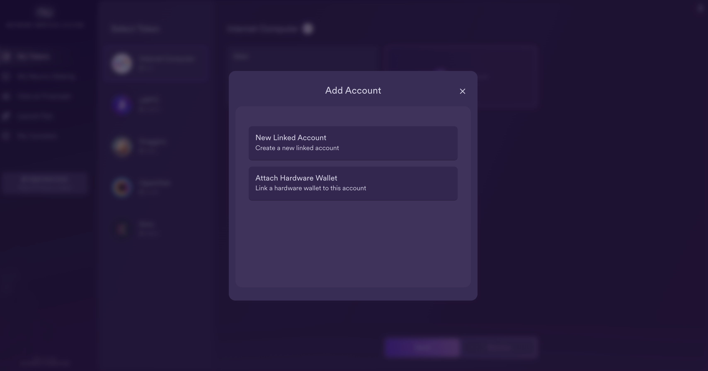
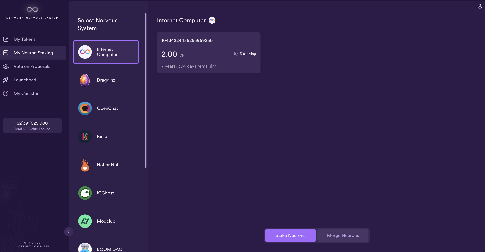

import { MarkdownChipRow } from "/src/components/Chip/MarkdownChipRow";
import '/src/components/CenterImages/center.scss';

# Get and send ICP tokens

<MarkdownChipRow labels={["Beginner", "Governance", "Tutorial"]} />


<iframe width="560" height="315" src="https://www.youtube.com/embed/XU54fbCzFmE?si=NU3rq9Pz7GlGW3ar" title="YouTube video player" frameborder="0" allow="accelerometer; autoplay; clipboard-write; encrypted-media; gyroscope; picture-in-picture; web-share" referrerpolicy="strict-origin-when-cross-origin" allowfullscreen></iframe>

## Get ICP tokens to your NNS dapp account
When you log into the NNS dapp for the first time, you can go to the wallet part but you will not yet own any tokens.
Usually, one of the first things to do is to add tokens to the NNS dapp wallet. This also the first step needed in case you want to stake a neuron later.

### Get tokens from an exchange
One of the standard ways how to get tokens is to 

### Get tokens from a developer identity

### Using the CLI

If you have selected self-custody for holding your ICP utility tokens and the tokens are associated with your developer identity instead of your registered Internet Identity, you need to transfer ICP utility tokens to your accounts if you want to manage them using the [Network Nervous System (NNS)](https://nns.ic0.app) dapp.

To transfer ICP utility tokens controlled by your developer identity:

- #### Step 1:  Open a terminal shell on your local computer.

- #### Step 2:  Check that you are using an identity with control over the ledger account by running the following command:

``` bash
dfx identity whoami
```

In most cases, you should see that you are currently using your `default` developer identity. For example:

```
default
```

- #### Step 3:  View the textual representation of the principal for your current identity by running the following command:

``` bash
dfx identity get-principal
```

This command displays output similar to the following:

```
tsqwz-udeik-5migd-ehrev-pvoqv-szx2g-akh5s-fkyqc-zy6q7-snav6-uqe
```

- #### Step 4:  Check the current balance in the ledger account associated with your identity by running the following command:

``` bash
dfx ledger --network ic balance
```

- #### Step 5:  Transfer ICP utility tokens to your Main account or a linked subaccount you create by running a command similar to the following:

``` bash
dfx ledger --network ic transfer <destination-account-id> --icp <ICP-amount> --memo <numeric-memo>
```

For example, assume you have the following accounts:



If you want to transfer one ICP utility token to the `Main` account, you can run the following command:

```
dfx ledger --network ic transfer dd81336dbfef5c5870e84b48405c7b229c07ad999fdcacb85b9b9850bd60766f --memo 12345 --icp 1
```

If you also want to transfer one ICP utility token to the `pubs` account, you can run the following command:

```
dfx ledger --network ic transfer 183a04888eb20e73766f082bae01587830bd3cd912544f63fda515e9d77a96dc --icp 1 --memo 12346
```

:::info
This example illustrates how to transfer ICP utility tokens to using a whole number with the `--icp` command-line option.
-   You can also specify fractional units of ICP utility tokens—called **e8s**—using the `--e8s` option, either on its own or in conjunction with the `--icp` option.
-   Alternatively, you can use the `--amount` to specify the number of ICP utility tokens to transfer with fractional units up to 8 decimal places, for example, as `5.00000025`.
:::

The destination address can be an address in the ledger canister running on the Internet Computer network, an account you have added using the [Network Nervous System dapp](https://nns.ic0.app), or the address for a wallet you have on an exchange.

If you transfer the ICP utility tokens to an account in the [Network Nervous System dapp](https://nns.ic0.app), you might need to refresh the browser to see the transaction reflected.

For more information about using the `dfx ledger` command-line options, see [dfx ledger](/docs/current/developer-docs/developer-tools/cli-tools/cli-reference/dfx-ledger).


## Send ICP tokens with your NNS dapp account
Once you have ICP tokens in your NNS dapp account, you can send them to other accounts by following these steps.

- #### Step 1: On the default 'Tokens' tab, assure that The Internet Computer token has been selected, then click **Send** on the bottom of the window.


- #### Step 2: In the 'Send' window, select your linked account or wallet for the source, then input the destination address and the amount of ICP to send.

Transactions are charged a ledger fee, which is independent from NNS dapp and applies to any transaction. For ICP tokens, this fee is 0.0001 ICP.

The maximum amount you can send is your token balance minus the ledger fee. The minimum amount you can send is 0.00000001 ICP.



- #### Step 3: Then select **Continue** to send the transaction.
