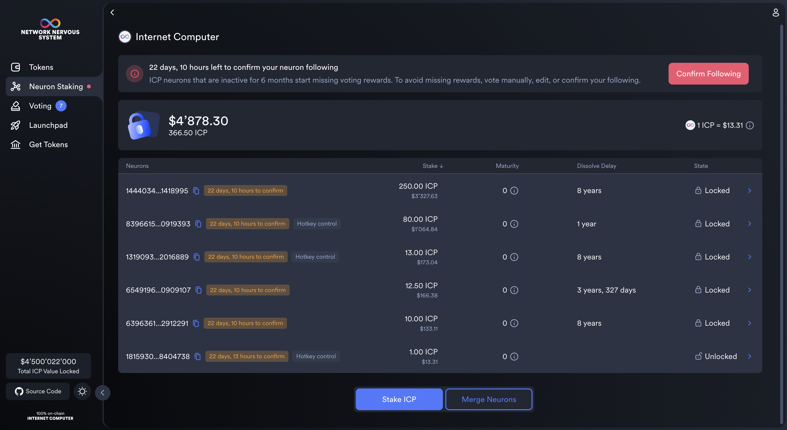
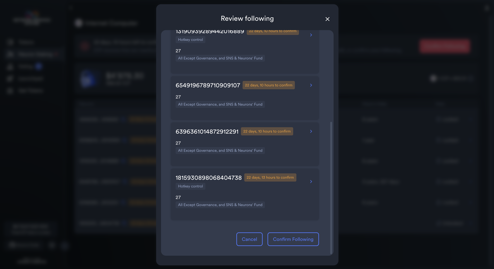
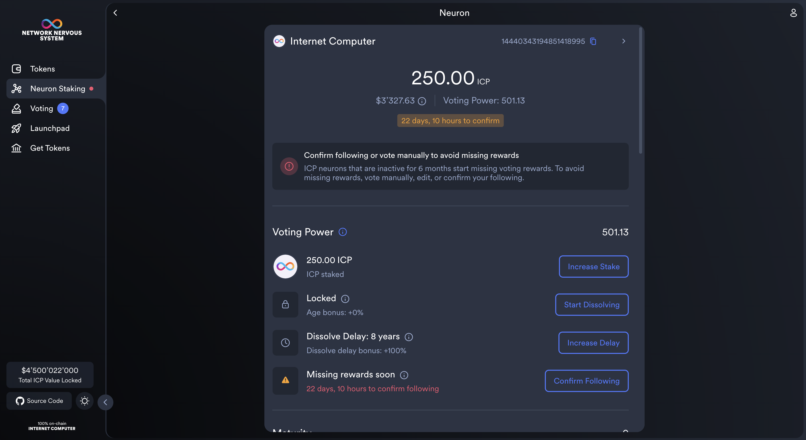
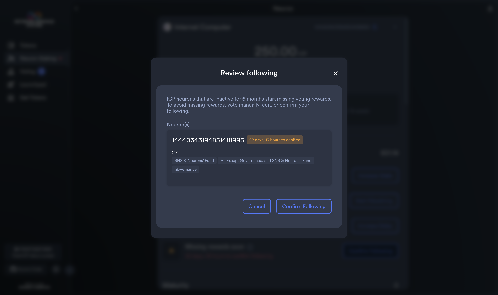

import { MarkdownChipRow } from "/src/components/Chip/MarkdownChipRow";
import '/src/components/CenterImages/center.scss';

# Periodic Neuron Following Confirmation

<MarkdownChipRow labels={["Beginner", "Governance", "Tutorial"]} />

 

The main idea of periodic confirmation of following is that in order to get rewards, governance participants have to remain active voters and regularly confirm their following settings. Neurons who set following once or were created with default following and then never interact with the NNS again get lower, adjusted voting rewards. To find more information about the feature and community discussions about it, please see the [blog post](https://medium.com/dfinity/onchain-governance-improvement-periodic-confirmation-of-following-4c8fd73f578d), [forum discussion](https://forum.dfinity.org/t/periodic-confirmation-design/34215), and the adopted [motion proposal](https://dashboard.internetcomputer.org/proposal/132411).

## Maximizing voting rewards

In order to keep your voting power and thus keep getting voting rewards, you need to take at least one of the following three actions once every 6 months for each of your neurons:
1. [Vote directly](https://internetcomputer.org/docs/current/developer-docs/daos/nns/using-the-nns-dapp/nns-dapp-voting-on-proposals)
2. [Set or edit following](https://internetcomputer.org/docs/current/developer-docs/daos/nns/using-the-nns-dapp/nns-dapp-following-other-neurons)
3. Confirm following

:::info
Note that if you're following other neurons, you will only receive the maximum voting rewards only if the neurons you follow vote on all proposals. To see how neurons vote, visit [vpGeek](https://f2djv-5aaaa-aaaah-qdbea-cai.raw.icp0.io/knownNeurons).
:::

## How to confirm neuron following

- **Step 1:** Sign into the [NNS dapp](https://nns.ic0.app/), navigate to **Neuron Staking** and click on **Internet Computer**. If you have neurons that are within 30 days of missing rewards, you should see a new banner with a warning.

- **Step 2:** Click on **Confirm Following**, and you should be prompted with a modal window. Here, you can review following for all of your neurons. Clicking any of them will bring you to the **Neuron Details** page, where you can edit (or confirm) your following.

Once you confirmed following on all of your neurons, the warning should disappear, and neuron inactivity timer should be reset to 6 months.

Alternatively, you can:

- **Step 3**: Navigate to **Neuron Staking** and click on **Internet Computer**. Select any of your neurons, which will bring you to the **Neuron Details** page.

- **Step 4**: Click on **Confirm Following**, which will open up a modal window. Here, you can review and confirm your following. Make sure you still agree with the decision you made in the past. Otherwise, you can edit your following on this page.

Note that alternatively, you can vote on a proposal, which will reset the neuron inactivity timer for all neurons that voted, or edit your following.