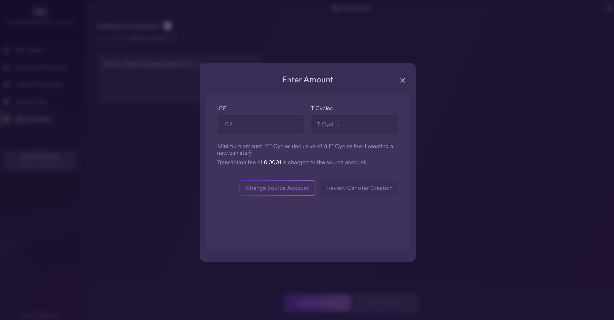
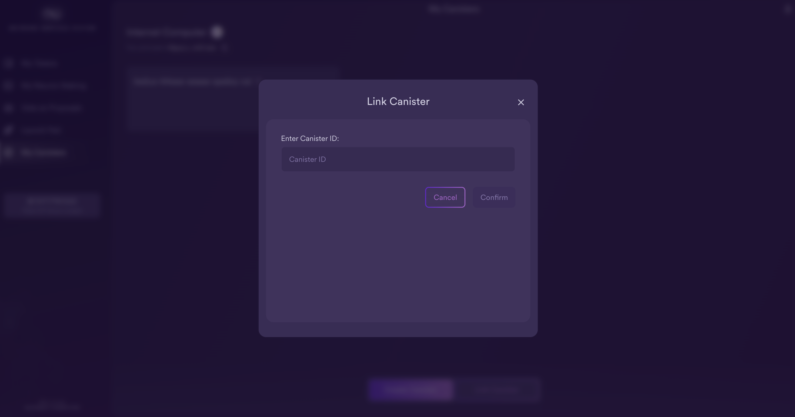
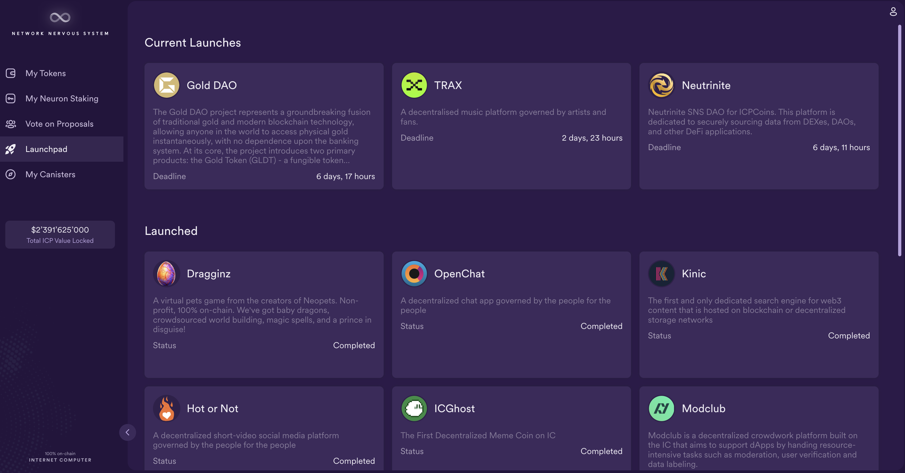

import { MarkdownChipRow } from "/src/components/Chip/MarkdownChipRow";
import '/src/components/CenterImages/center.scss';

# Configuring neuron following

<MarkdownChipRow labels={["Beginner", "Governance", "Tutorial"]} />

<iframe width="560" height="315" src="https://www.youtube.com/embed/6BznC9p3w8w?si=m7nc7xTGq5YUtXa3" title="YouTube video player" frameborder="0" allow="accelerometer; autoplay; clipboard-write; encrypted-media; gyroscope; picture-in-picture; web-share" referrerpolicy="strict-origin-when-cross-origin" allowfullscreen></iframe>
## Overview
Neuron owners may find it hard to manually vote on every proposal submitted to the NNS.
For example, they may not have the time or necessary expertise to evaluate each individual proposal.
The NNS uses a form of liquid democracy to address these challenges called **following **.
A neuron can be configured to vote automatically by following the voting decision made by a group of other neurons.
Following is done on the basis of proposal topics, and a neuron can follow up to 15 neurons on each topic.

For more information on neuron following, refer to [Following](/docs/current/developer-docs/daos/nns/voting-following).

## Following rules
A neuron can choose to follow a group of other neurons, called **followees**.
Each neuron can follow at most 15 other neurons for a topic.
A neuron will only cast a "Yes"-vote if **more than half** of the neurons within the followee-group voted Yes.
A neuron will only cast a "No"-vote if **at least half** of the neurons within the followee-group voted No.

:::caution
Your neuron will follow when there are **enough votes to make a call (whether it is a ADOPT or REJECT)**.
For example, if you follow 10 neurons on a topic:

- Your neuron only votes to adopt if at least 6 out of the 10 neurons vote to adopt.

- Your neuron only votes to reject a proposal if at least 5 out of the 10 reject the proposal.

- If less than 5 neurons (out of your 10 followed) vote at all, your neuron will not cast any vote.

This should be considered when choosing to follow multiple neurons on a topic.
It might be better to follow fewer neurons, and it can be more beneficial to follow an odd number of
 neurons than an even number.
:::

## Following "catch-all"
In addition to setting following for individual topics, neurons may also define a catch-all follow rule which is triggered for proposals with topics for which no other explicit follow rule has been defined.
However, the catch-all follow rule does not include the proposal topics **SNS & neurons' fund** and **Governance**.

:::caution
The catch-all follow rule is only applied for proposal topics with no other explicit choice. For example, let's assume neuron A follows neuron B for the catch-all and neuron C on the topic subnet management. If B votes on a subnet management proposal but C does not, no vote will be cast for A.

The catch-all follow rule does not apply for SNS & neurons' fund or governance proposals.
For example, if neuron A follows neuron B for the catch-all and B votes on a governance proposal, no vote will be cast for A. If neuron A intends to also follow B on such decisions, the user has to explicitly choose to also follow B on the governance topic.
:::

It is in each neuron's interest to follow other neurons that support the best interests of the network and their own economic interests.

## Setting your neurons' following in the NNS dapp

To configure your neuron to follow a group of another neurons:

- #### Step 1: From the NNS dapp, select 'Neuron Staking', then select the neuron that you'd like to set a following rule for.

- #### Step 2: In the neuron's details, scroll down to the 'Following' section and select 'Follow Neurons'.

- #### Step 3: Next, select a topic to follow.

The topic refers to the different types of proposals; for example, the 'Governance' topic defines a following role for governance-related proposals, while the 'Subnet Management' topic defines a following role for subnet management proposals. There is also a 'catch-all' rule that can be followed for all proposal types except for governance, SNS, and neurons' fund.

For this example, select 'SNS & Neurons' Fund'.

- #### Step 4: Select 'Add Followee'.

- #### Step 5: Enter a Neuron ID to follow, or select a group of neurons from the menu provided.

In this example, select 'DFINITY Foundation'.

- #### Step 6: The window will now reflect the following configuration:

The configuration will also now be shown in the neuron's details:

