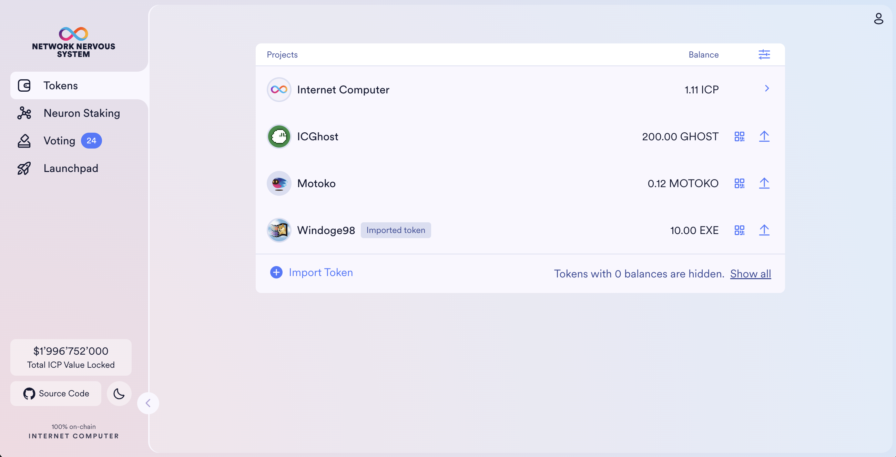
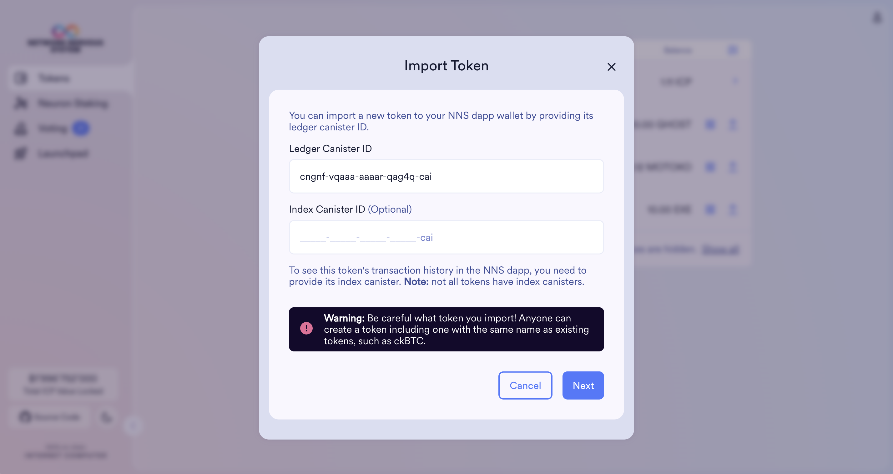
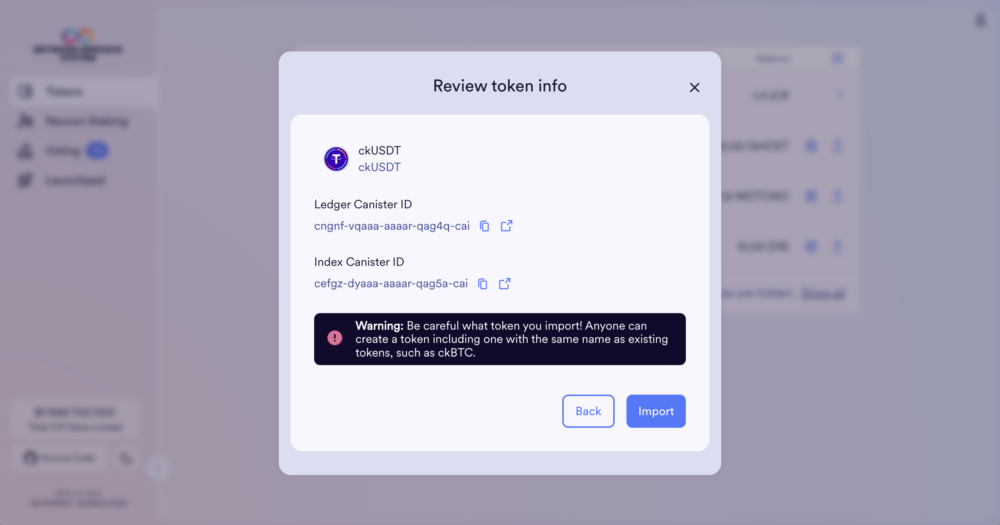
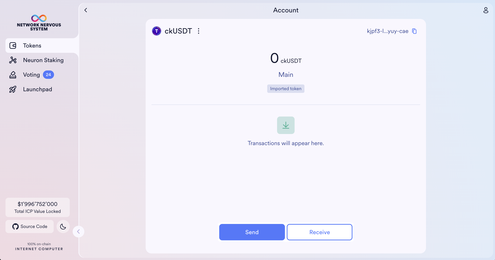
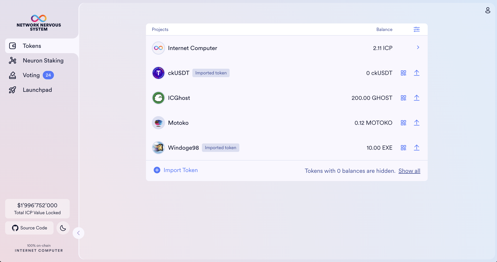
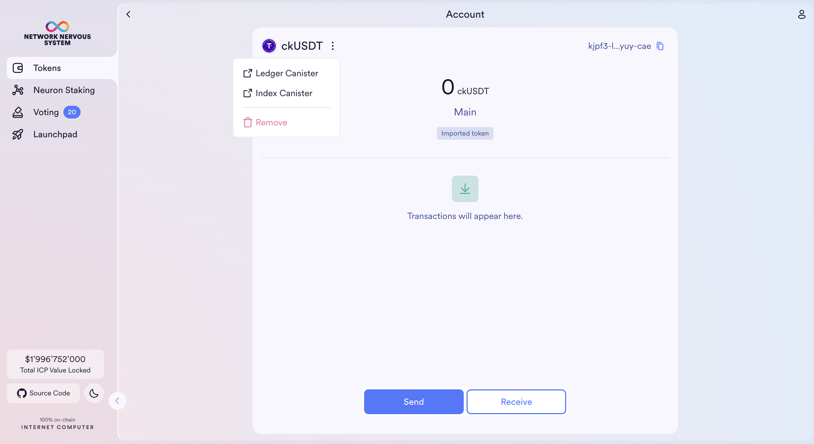

import { MarkdownChipRow } from "/src/components/Chip/MarkdownChipRow";
import '/src/components/CenterImages/center.scss';

# Import ICRC tokens

<MarkdownChipRow labels={["Beginner", "Governance", "Tutorial"]} />

 

<iframe width="660" height="415" src="https://www.youtube.com/embed/zcXmarBk2L4?si=OIxq9LwY0DLzHvE1" title="YouTube video player" frameborder="0" allow="accelerometer; autoplay; clipboard-write; encrypted-media; gyroscope; picture-in-picture; web-share" referrerpolicy="strict-origin-when-cross-origin" allowfullscreen></iframe> 

The NNS dapp focuses on providing a simple user interface where community members can interact with different on-chain governance systems deployed on the Internet Computer.

To extend wallet capabilities, users of the NNS dapp can import any token that supports ICRC-1. This includes all ICRC-2 and ICRC-3 tokens.

## How to find ledger canister IDs of tokens

If you want to hold tokens in your NNS wallet outside of the list provided by the NNS, you need to import the token using its ledger canister ID. This process simply saves a list of token ledger canister IDs on your account letting the NNS dapp know which tokens to fetch.

The NNS dapp relies on index canisters to display transaction histories. If your token has an index canister, you can import it by using its index canister ID.

:::warning
The NNS dapp accepts any token that supports the ICRC-1 standard. A token can pretend to be another token, so make sure to get the ledger canister ID from reputable places.
:::

There are several ways to find ledger canister IDs of ICRC-1 tokens. The tutorial video above mentions two. This is a more comprehensive list.

- [ICPSwap](https://info.icpswap.com/swap): Curated list of tokens traded on ICPSwap updated by the ICPSwap SNS DAO.
- [ICP Tokens](https://icptokens.net/): Curated list of tokens traded on ICP-based DEXs updated by ICP Tokens.
- [ICP Dashboard](https://dashboard.internetcomputer.org/): List of all chain-key tokens (under Chain Fusion menu option) updated automatically.
- [nftGeek](https://t5t44-naaaa-aaaah-qcutq-cai.raw.icp0.io/tokens): Curated list of tokens traded on ICP-based DEXs updated by nftGeek.
- [ICPEx](https://icpex.org/dashboard): Curated list of tokens traded on ICPEx updated by ICPEx.
- [CoinMarketCap](https://coinmarketcap.com/view/internet-computer-ecosystem/): The ICRC tokens that are listed on CoinMarketCap provide their ledger canister ID under Contract.
- [CoinGecko](https://www.coingecko.com/en/categories/internet-computer-ecosystem): The ICRC tokens that are listed on CoinGecko provide their ledger canister ID under Contract.

## How to import ICRC tokens

First, find the ledger canister ID of the token you want to import to your NNS dapp wallet. The list above covers most tokens deployed on the Internet Computer. Once you have its ledger canister ID, you may optionally look for its index canister to display the transaction history.

:::info
Importing an index canister is completely optional. Many popular tokens **do not have index canisters**.
:::

- **Step 1:**  Sign into the NNS dapp, and navigate to **Tokens**. At the bottom of the table, click **Import Token**.

:::info
If you want to hide the tokens you don't hold for better visibility, you can click the settings button at the top right corner of the table, and enable **Hide zero balances**.
:::

- **Step 2:** Paste the ledger and index canister IDs to the corresponding input fields. If you don't provide the index canister ID now, you can add it any time in the future.

- **Step 3**: Confirm that this is the token you wish to import. By clicking the link you can see the canister on the ICP dashboard.

Once your token was successfully imported, you can send tokens to your principal ID.

Going back, you should see all imported tokens in the tokens table.

You can add and remove tokens any time. **Note**: removing a token doesn't remove the asset itself. If you remove a token that has a balance above 0, you can always re-import it, and the asset will be accessible.

The NNS dapp will not remember which tokens you imported, so you will need to remember any token you intend to re-import in the future.

