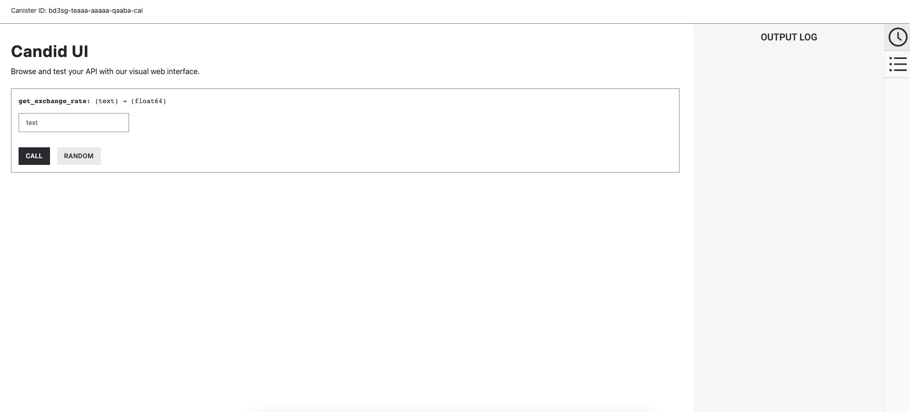

import { MarkdownChipRow } from "/src/components/Chip/MarkdownChipRow";
import { GlossaryTooltip } from "/src/components/Tooltip/GlossaryTooltip";

# Exchange rate canister

<MarkdownChipRow labels={["Intermediate" , "Tutorial"]} />

## Overview

The exchange rate canister, referred to as the XRC, is a canister that runs on the **uzr34 system subnet**. The XRC uses [HTTPS outcalls](https://internetcomputer.org/https-outcalls/) to fetch data from major cryptocurrency exchanges by using the exchange's public API to retrieve real time or historical cryptocurrency pricing information. The XRC also queries the public APIs for foreign exchange data providers around the world periodically in order to get forex rates.

The XRC canister can be used by dapps such as decentralized exchanges (DEXs) to provide functionality such as comparing exchange rates against market rates to determine the value of assets that are held in a canister smart contract. For example, the cycle minting canister of the NNS uses the XRC to obtain the current ICP/XDR exchange rates, which it requires for the conversion of ICP to cycles.

The XRC provides this data in response to requests made by other canisters. A request made by another canister is composed of a base asset, a quote asset, and an optional UNIX epoch timestamp.

An **asset** is a record consisting of a symbol (such as "ICP") and a class (either 'Cryptocurrency' or 'FiatCurrency'). The base and quote asset can be any combination of cryptocurrency and fiat currency assets, such as ICP/USD, USD/EUR, BTC/ICP, etc. The timestamp parameter enables the functionality for historic rates to be requested. If no timestamp is provided, the exchange rate for the current time is returned by default.

#### Aggregation

The XRC calculates exchange rates using a unique aggregation method that combines candlestick chart data for specific one-minute intervals from various exchanges, avoiding conventional time (TWAP) or volume-weighted (VWAP) techniques. It can further derive rates for pairs that are not traded themselves (e.g., A/B from available A/C and B/C rates). After collecting, combining, and filtering rates, the median rate is returned. This approach ensures accuracy, timeliness, and minimizes manipulation risks, providing reliable rate information for decentralized applications.

#### Exchanges

- [Coinbase](https://api.pro.coinbase.com/products/BASE_ASSET-QUOTE_ASSET/candles?granularity=60&start=START_TIME&end=END_TIME)
- [Kucoin](https://api.kucoin.com/api/v1/market/candles?symbol=BASE_ASSET-QUOTE_ASSET&type=1min&startAt=START_TIME&endAt=END_TIME)
- [Okx](https://www.okx.com/api/v5/market/history-candles?instId=BASE_ASSET-QUOTE_ASSET&bar=1m&before=START_TIME&after=END_TIME)
- [Gateio](https://api.gateio.ws/api/v4/spot/candlesticks?currency_pair=BASE_ASSET_QUOTE_ASSET&interval=1m&from=START_TIME&to=END_TIME)
- [Mexc](https://www.mexc.com/open/api/v2/market/kline?symbol=BASE_ASSET_QUOTE_ASSET&interval=1m&start_time=START_TIME&limit=1)
- [Poloniex](https://api.poloniex.com/markets/BASE_ASSET_QUOTE_ASSET/candles?interval=MINUTE_1&startTime=START_TIME&endTime=END_TIME)
- [Cryptocom](https://api.crypto.com/exchange/v1/public/get-candlestick?instrument_name=BASE_ASSET_QUOTE_ASSET&timeframe=1m&start_ts=START_TIME&count=1)
- [Bitget](https://api.bitget.com/api/v2/spot/market/candles?symbol=BASE_ASSETQUOTE_ASSET&granularity=1min&startTime=START_TIME&endTime=END_TIME)
- [Digifinex](https://openapi.digifinex.com/v3/kline?symbol=BASE_ASSET_QUOTE_ASSET&period=1&start_time=START_TIME&end_time=END_TIME)


## Usage
The canister ID of the XRC is `uf6dk-hyaaa-aaaaq-qaaaq-cai`.

The exchange rate canister offers a single endpoint:

```
"get_exchange_rate": (GetExchangeRateRequest) -> (GetExchangeRateResult)
```

To make a request to the XRC, the following request form can be used:
```
type GetExchangeRateRequest = record {
   base_asset: Asset;
   quote_asset: Asset;
   timestamp: opt nat64;
};
```

Once this form has been sent to the XRC, the following response is returned:

```
type GetExchangeRateResult = variant {
   Ok: ExchangeRate;
   Err: ExchangeRateError;
};
```

## Cycles cost
Each request to the XRC costs 10B cycles to submit the request, otherwise an `ExchangeRateError::NotEnoughCycles` error will be returned. The actual cycles cost of the request call will depend on two factors: the requested asset types and the state of the internal exchange rate cache. These parameters are as follows:

- If the request can be served from the cache, the actual cost is 20M cycles.
- If both assets are fiat currencies, the cost is 20M cycles.
- If one of the assets is a fiat currency or the cryptocurrency USDT, the cost is 260M cycles.
- If both assets are cryptocurrencies, the cost is 500M cycles.

The remaining cycles are returned to the requesting canister. Note that at least 1M cycles are charged even in case of an error in order to mitigate the risk of a denial-of-service attack.

:::info
Note: The cycles cost of these requests are expected to be decreased in the next upgrade of the XRC.
:::

## Calling the XRC directly

To call the XRC directly, you can send a request such as one to get the BTC/USD rate, with the following command:

```
dfx canister call --with-cycles 10000000000 uf6dk-hyaaa-aaaaq-qaaaq-cai get_exchange_rate '(record { base_asset = record { symbol = "BTC"; class = variant { Cryptocurrency } }; quote_asset = record { symbol = "USD"; class = variant { FiatCurrency } } })'
```

## Exchange rate canister demo

Alternatively, you can run a local XRC demo application to test the functionality locally.

:::caution
It is worth noting that this sample dapp is very simple. If there is an error, it always returns `0` because the return value is simply a float.
:::

### Prerequisites

-   [x] Download and install the IC SDK package as described in the [download and install](/docs/current/developer-docs/getting-started/install/) page.

-   [x] Download and install [Nodejs and npm](https://docs.npmjs.com/downloading-and-installing-node-js-and-npm).

-   [x] Download and install [git](https://git-scm.com/downloads).

Then, clone the sample repository, install the dependencies, and build the canisters with the following commands:

```
git clone git@github.com:THLO/xrc_demo.git
cd xrc_demo/
npm install
dfx canister create xrc_demo
```

### Deployment

To test the XRC demo locally, first start the local <GlossaryTooltip>replica</GlossaryTooltip> with the command:

```
dfx start --clean --background
```

Then, deploy the canisters with the command:

```
dfx deploy --with-cycles 10000000000
```

Note that the `--with-cycles` parameter is required since cycles must be sent with every request to the exchange rate canister. For more information on the cycles cost, review the [cycles cost](#cycles-cost) section above.

The output of this command will resemble the following:

```
Installing code for canister xrc, with canister ID br5f7-7uaaa-aaaaa-qaaca-cai
Installing code for canister xrc_demo, with canister ID be2us-64aaa-aaaaa-qaabq-cai
Deployed canisters.
URLs:
  Backend canister via Candid interface:
    xrc: http://127.0.0.1:4943/?canisterId=bw4dl-smaaa-aaaaa-qaacq-cai&id=br5f7-7uaaa-aaaaa-qaaca-cai
    xrc_demo: http://127.0.0.1:4943/?canisterId=bw4dl-smaaa-aaaaa-qaacq-cai&id=be2us-64aaa-aaaaa-qaabq-cai
```

Open the link for the `xrc_demo` canister in a web browser to view the Candid interface. You will see the following Candid UI:



Alternatively, you can send commands to the `xrc_demo` canister directly from the terminal, such as:

```
dfx canister call --network ic xrc_demo get_exchange_rate "ICP"
```

The output will resemble the following, depending asset requested and its current exchange rate. This example uses ICP.

```
(4.1865 : float64)
```

## Resources

- [Exchange rate wiki page.](https://wiki.internetcomputer.org/wiki/Exchange_rate_canister)
- [HTTPS outcalls.](https://internetcomputer.org/https-outcalls/)
- [Exchange rate canister blog post.](https://medium.com/dfinity/exchange-rate-canister-a-smart-contract-with-oracle-capabilities-f30694753c89)
- [Exchange rate canister forum post.](https://forum.dfinity.org/t/new-exchange-rate-mechanism/14543/65)
- [Exchange rate canister repository.](https://github.com/dfinity/exchange-rate-canister)
