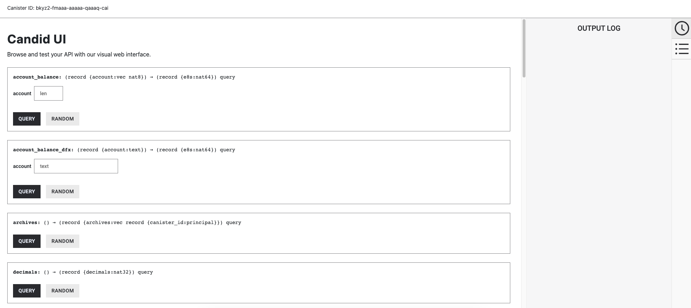

import { MarkdownChipRow } from "/src/components/Chip/MarkdownChipRow";

# ICRC-1 ledger setup

<MarkdownChipRow labels={["Intermediate" , "Tutorial"]} />

## Overview
This guide will show you how to deploy an ICRC-1 ledger locally and on the mainnet, how to interact with the ICRC-1 ledger and how to test it. ICRC-1 is a [token standard](https://github.com/dfinity/ICRC-1). Thus, deploying a new token that is ICRC-1 compatible is synonymous with deploying an ICRC-1 ledger.
The ICRC-1 ledger used in this guide is a reference implementation. This guide aims at showing you how to setup an existing ICRC-1 ledger implementation rather than how to build an ICRC-1 ledger yourself.

### Step 1:  Make sure you use a recent version of the [IC SDK](/docs/current/developer-docs/getting-started/install/).
If you don’t have the IC SDK installed, follow instructions on the [installing the IC SDK](/docs/current/developer-docs/getting-started/install/) section to install it.

### Step 2: Create a new dfx project with the command:

```
dfx new icrc1_ledger_canister
cd icrc1_ledger_canister
```

### Step 3: Determine ledger file locations.

Go to the [releases overview](https://dashboard.internetcomputer.org/releases) and copy the latest replica binary revision. At the time of writing, this is `d87954601e4b22972899e9957e800406a0a6b929`.

The URL for the ledger Wasm module is `https://download.dfinity.systems/ic/<REVISION>/canisters/ic-icrc1-ledger.wasm.gz`, so with the above revision it would be `https://download.dfinity.systems/ic/d87954601e4b22972899e9957e800406a0a6b929/canisters/ic-icrc1-ledger.wasm.gz`.

The URL for the ledger .did file is `https://raw.githubusercontent.com/dfinity/ic/<REVISION>/rs/rosetta-api/icrc1/ledger/ledger.did`, so with the above revision it would be `https://raw.githubusercontent.com/dfinity/ic/d87954601e4b22972899e9957e800406a0a6b929/rs/rosetta-api/icrc1/ledger/ledger.did`.


**OPTIONAL:**
If you want to make sure, you have the latest ICRC-1 ledger files you can run the following script.
``` sh
curl -o download_latest_icrc1_ledger.sh "https://raw.githubusercontent.com/dfinity/ic/326df23607fc8280a047daba2d8462f1dfc57466/rs/rosetta-api/scripts/download_latest_icrc1_ledger.sh"
chmod +x download_latest_icrc1_ledger.sh
./download_latest_icrc1_ledger.sh
```

### Step 4: Configure the `dfx.json` file.
Open the `dfx.json` file in your project's directory. Replace the existing content with the following:

``` json
{
  "canisters": {
    "icrc1_ledger_canister": {
      "type": "custom",
      "candid": "https://raw.githubusercontent.com/dfinity/ic/d87954601e4b22972899e9957e800406a0a6b929/rs/rosetta-api/icrc1/ledger/ledger.did",
      "wasm": "https://download.dfinity.systems/ic/d87954601e4b22972899e9957e800406a0a6b929/canisters/ic-icrc1-ledger.wasm.gz"
    }
  },
  "defaults": {
    "build": {
      "args": "",
      "packtool": ""
    }
  },
  "output_env_file": ".env",
  "version": 1
}
```

If you chose to download the ICRC-1 ledger files with the script, you need to replace the Candid and Wasm file entries:

``` json
...
"candid": icrc1_ledger.did,
"wasm" : icrc1_ledger.wasm.gz,
  ...
```

In an existing project you would only need to add the `icrc1_ledger_canister` canister to the `canisters` section.

### Step 5: Start a local replica.

``` sh
dfx start --clean --background
```

### Step 6: Create the required identities and export initialization arguments:

:::info
The initialization arguments of the ICRC-1 ledger are not specified in the [standard](https://github.com/dfinity/ICRC-1/blob/main/standards/ICRC-1/README.md). Thus, the arguments defined in this section are dependent on the reference implementation of the ICRC-1 ledger. If you build your own ICRC-1 ledger you may use different initialization arguments.
:::

``` sh
dfx identity new minter
dfx identity use minter
export MINTER=$(dfx identity get-principal)
```

Transfers from the minting account will create `Mint` transactions. Transfers to the minting account will create `Burn` transactions.

Specify the token name and symbol of your choice:

``` sh
export TOKEN_NAME="My Token"
export TOKEN_SYMBOL="XMTK"
```

Set the default identity or the identity with which you want to deploy the ledger.
``` sh
dfx identity use default
export DEFAULT=$(dfx identity get-principal)
```

:::info
[OPTIONAL]
To be able to interact and send some tokens you may want to mint some tokens when you deploy the ledger.
You will mint some tokens for the default identity.
You can also specify the transfer fee for transferring tokens.
:::

``` sh
export PRE_MINTED_TOKENS=10_000_000_000
export TRANSFER_FEE=10_000
```

The values set for archiving are the recommended values. You may change them to fit your ICRC-1 ledger's needs.
``` sh
dfx identity new archive_controller
dfx identity use archive_controller
export ARCHIVE_CONTROLLER=$(dfx identity get-principal)
export TRIGGER_THRESHOLD=2000
export NUM_OF_BLOCK_TO_ARCHIVE=1000
export CYCLE_FOR_ARCHIVE_CREATION=10000000000000
```

Specify which standards to support. If you only want to support the ICRC-1 standard then you can set:
``` sh
export FEATURE_FLAGS=false
```
If you want your ICRC-1 ledger to also support the extension standard ICRC-2 then set the flag to true:
``` sh
export FEATURE_FLAGS=true
```

Check the set variables:

For each variable, the exported environment variable will be used unless otherwise specified:
-   The `PRE_MINTED_TOKENS` is amount of tokens that are minted during deployment for a specific account (In this tutorial it will be the `DEFAULT` account).
-   The `TRANSFER_FEE` is the transfer fee that users of the ledger will have to pay anytime they want to make a transfer.
-   The `ARCHIVE_CONTROLLER` is the [controller principal](/docs/current/developer-docs/getting-started/cycles/cycles-wallet#controller-and-custodian-roles) of the archive canisters.
-   The `TRIGGER_THRESHOLD` is the number of blocks to archive when the trigger threshold is exceeded.
-   The `CYCLE_FOR_ARCHIVE_CREATION` is the amount of cycles that will be sent to the archive canister when it is created.
-   The `NUM_OF_BLOCK_TO_ARCHIVE` is the number of blocks that will be archived.
-   The `TOKEN_SYMBOL` is the ticker symbol of your new token.
-   The `MINTER` is the account of the Principal responsible for minting and burning tokens (see the [icrc-1 ledger documentation](https://github.com/dfinity/ICRC-1)).
-   The `FEATURE_FLAGS` is a flag for enabling or disabling certain extension standards to the ICRC-1 standard. In this case the reference implementation also can support ICRC-2 transactions.
-   Minting 100 tokens to the `DEFAULT` (1 token is by default equal to 10^8 e8s, hence the name).
-   Setting the transfer fee to 0.0001 tokens.


### Step 7: Deploy the ICRC-1 ledger canister locally:

``` sh
dfx deploy icrc1_ledger_canister --specified-id mxzaz-hqaaa-aaaar-qaada-cai --argument "(variant {Init =
record {
     token_symbol = \"${TOKEN_SYMBOL}\";
     token_name = \"${TOKEN_NAME}\";
     minting_account = record { owner = principal \"${MINTER}\" };
     transfer_fee = ${TRANSFER_FEE};
     metadata = vec {};
     feature_flags = opt record{icrc2 = ${FEATURE_FLAGS}};
     initial_balances = vec { record { record { owner = principal \"${DEFAULT}\"; }; ${PRE_MINTED_TOKENS}; }; };
     archive_options = record {
         num_blocks_to_archive = ${NUM_OF_BLOCK_TO_ARCHIVE};
         trigger_threshold = ${TRIGGER_THRESHOLD};
         controller_id = principal \"${ARCHIVE_CONTROLLER}\";
         cycles_for_archive_creation = opt ${CYCLE_FOR_ARCHIVE_CREATION};
     };
 }
})"
```

Specifying the canister id `mxzaz-hqaaa-aaaar-qaada-cai` is optional. It is set in this tutorial, so that we can be sure what we mean when referencing the deployed canister later in this tutorial.

:::info
If you want to deploy your ICRC-1 ledger on the mainnet you will have to complete the following steps.
-   Remove the argument `--specified-id mxzaz-hqaaa-aaaar-qaada-cai`, you will receive the canister ID upon deployment.
-   You may want to specify further the initially minted tokens by setting `initial_values = vec {<INITIAL_VALUES>}`. See the ledger.did file for the details of the argument.
-   You will have to set the network option to `ic` -> `dfx deploy --network ic ...` before specifying the rest of the dfx command. This tells dfx that you want to deploy on the mainnet.
-   Always set the `archive_options` field. If the archiving is disabled, the capacity of your ledger is limited to the memory of a single canister.
-   Make sure that the ledger canister has plenty of cycles. The canister will need cycles to spawn new instances of the archive canister on demand. The exact number of cycles attached to `create_canister` messages is controlled by the `cycles_for_archive_creation` option.
:::


### Step 8: Candid UI.

You can interact with your created ICRC-1 ledger using the Candid UI by navigating to the URL provided when the canister was deployed, such as:

```
http://127.0.0.1:4943/?canisterId=bnz7o-iuaaa-aaaaa-qaaaa-cai&id=mxzaz-hqaaa-aaaar-qaada-cai
```

After navigating to this URL in a web browser, the Candid UI will resemble the following:


A more exhaustive description of interacting with ICRC-1 ledgers can be found in [this guide](/docs/current/developer-docs/defi/icrc-1/using-icrc1-ledger).
Your local ICRC-1 ledger canister is up and running. You can now deploy other canisters that need to communicate with the ledger canister.


### Step 9: Testing your ICRC-1 implementation
There is a test suite available to test ICRC-1 ledgers. You can find the repository for it [here](https://github.com/dfinity/ICRC-1/tree/main/test). If you are building your own ICRC-1 repository, it might be helpful to run this test suite against your locally deployed ICRC-1 ledger, or import the test suite directly through a rust crate and add the tests to your repository. You can find a reference implementation of integrating the test suite to your repo [here](https://github.com/dfinity/ICRC-1/tree/main/test/ref).
