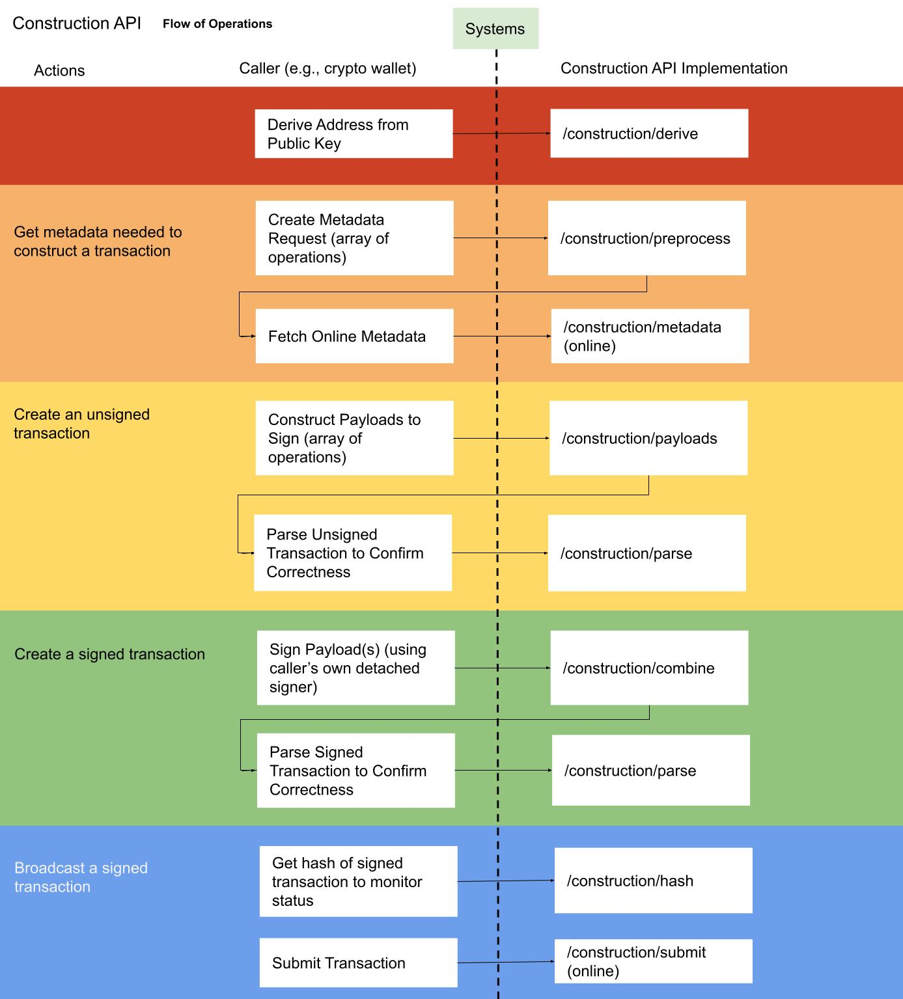
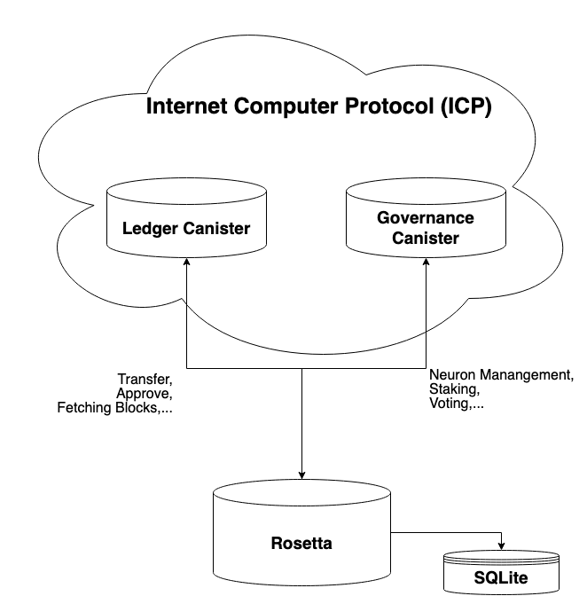

import { MarkdownChipRow } from "/src/components/Chip/MarkdownChipRow";

# Rosetta

## Overview

[Rosetta](https://www.rosetta-api.org/) is an open standard introduced by Coinbase to simplify the integration of blockchain-based tokens in exchanges, block explorers, and wallets.
This documentation might help if you want to deploy a token on ICP that aims to be tradable on CeFi exchanges or if you are working on a block explorer or wallet. 

There exist two implementations of the Rosetta-API standard. One for the [ICP Ledger](/docs/developer-docs/defi/rosetta/icp_rosetta/index.md) and the other for ledgers that implement the [ICRC-1](/docs/developer-docs/defi/rosetta/icrc_rosetta/index.mdx) standard. 

The Rosetta API standard consists of two parts: The [data API](https://www.rosetta-api.org/docs/data_api_introduction.html) is used to fetch data from the network. It is a read only endpoint and does not make any changes to the state of Rosetta. [View more details on how to use the data-api endpoints](/docs/developer-docs/defi/rosetta/icp_rosetta/data_api/index.md).

 The second part is the [construction API](https://www.rosetta-api.org/docs/construction_api_introduction.html). It is used to create transactions that require a valid signature from the user. More details on how to use the construction-api endpoints can be found [here](/docs/developer-docs/defi/rosetta/icp_rosetta/index.md) for ICP Rosetta.

## Canister communication
The Rosetta API is communicating with two separate cansiters in the background. The communication with the respective ledger canister will provide the user with account balance statements, transferring, 
burning and approving tokens as well as fetching the chain of blocks from the ledger to store locally on an SQLite database for faster data-api access. 

The communication with the governance canister will provide users with neuron management capabilities, fetching the state of neurons and proposals, as well as allowing for state changes in regards to staking and proposal voting. 
For details on how to call these endpoints, look at the guides for [ICP Rosetta](/docs/developer-docs/defi/rosetta/icp_rosetta/index.md) and [ICRC Rosetta](/docs/developer-docs/defi/rosetta/icrc_rosetta/index.mdx). 

