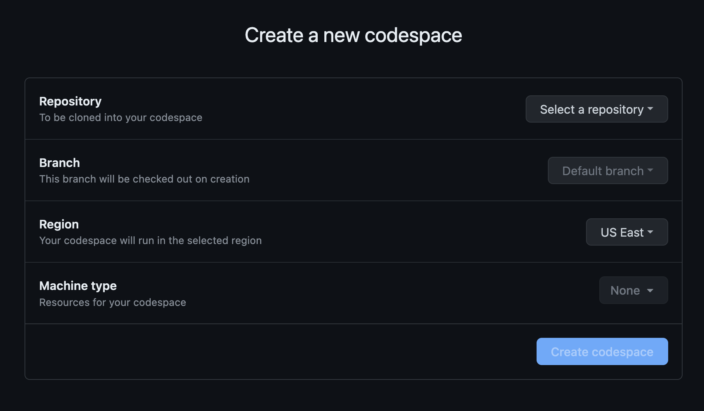
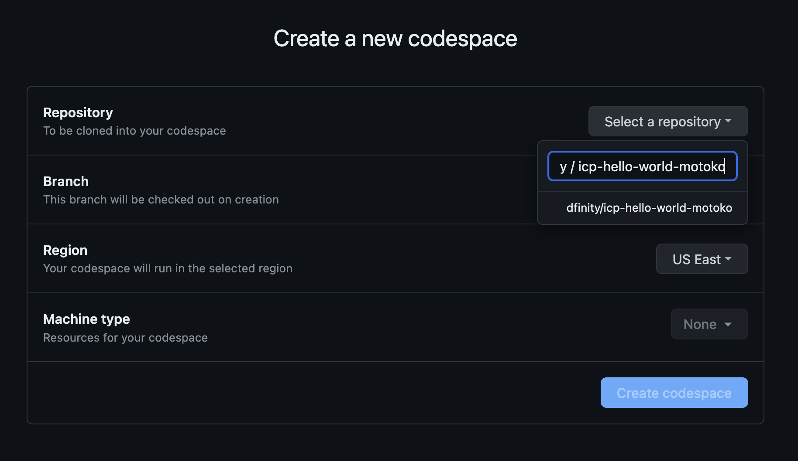
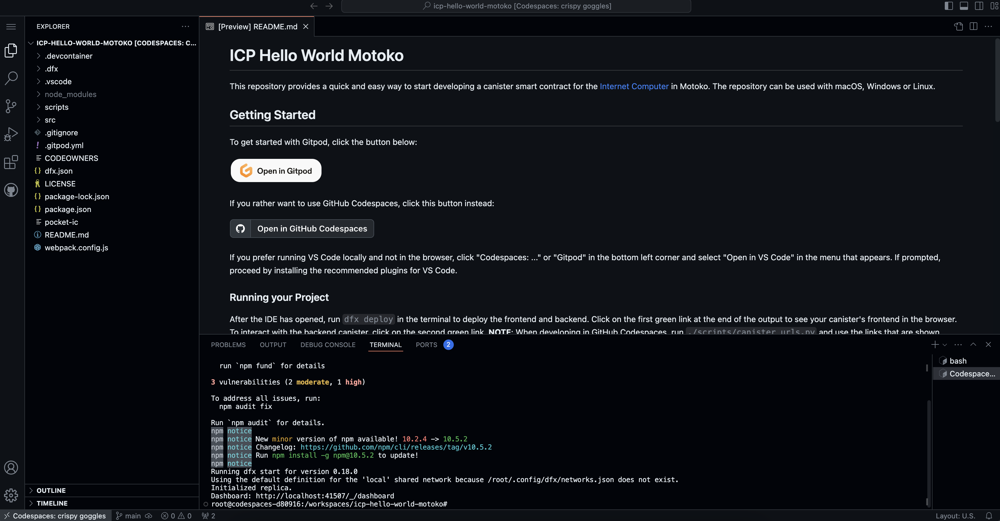

import { MarkdownChipRow } from "/src/components/Chip/MarkdownChipRow";

# Gitpod

<MarkdownChipRow labels={["Beginner", "IDE", "Tutorial"]} />

## Overview

GitHub Codespaces is a web-based cloud development environment that provides a platform for developing and deploying code without downloading any necessary tools or packages. GitHub Codespaces can be configured with a local ICP developer environment, including `dfx` and an instance of the ICP replica, to support canister development.

## Opening a project in GitHub Codespaces

If you have a GitHub repo that you're pushing your canister code to, or if there is a sample project you'd like to test, you can open the GitHub repo in Gitpod following these steps:

#### Step 1: Open the [GitHub Codespaces dashboard](https://github.com/codespaces).

Select 'New codespace'.

#### Step 2: Select 'Select a repository'. 

This will open a drop-down menu that prompts you to select a directory. 

#### Step 3: Insert the name of the GitHub repo that you'd like to open in the Codespaces. 

This example will use the `dfinity/icp-hello-world-motoko` repository. 

#### Step 4: Select 'Create codespace`.

#### Step 5: Begin developing a canister using Codespaces!

