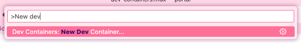
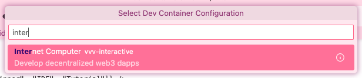

import { MarkdownChipRow } from "/src/components/Chip/MarkdownChipRow";
import '/src/components/CenterImages/center.scss';

# Developer containers

<MarkdownChipRow labels={["Beginner", "IDE", "Tutorial"]} />

## Overview

Developer containers are a local development option that uses [Docker](https://www.docker.com/get-started/) and [VS Code](https://code.visualstudio.com/) to run local containerized environments. Containers are isolated from the rest of your local environment, and files within a container cannot be used by applications outside of the container unless explicitly mounted and given access. Developer containers are a good option for developers on Windows systems, since `dfx` is not natively supported for local development on Windows.

Dev containers have additional benefits, including:

- **Replicability**: Containers make reproducing builds across teams easy since they contain the entire development environment within a portable format. Team members can interact with the same container without needing to setup their own personal developer environment and reproduce the build themselves.

- **Security**: Containers do not have access to the other files or applications on your system, making project development secure.

## Using developer containers

To use developer containers, you must download [Docker](https://www.docker.com/get-started/), [VS Code](https://code.visualstudio.com/), and the [Dev Containers extension](https://containers.dev/supporting#dev-containers).

### Creating a blank container

You can create a blank container by opening the VS Code command palette and running the command:

```
> New dev
```



Then, you'll be prompted to select a new dev container configuration. Search for and select the 'Internet Computer vvv-interactive' template.



This template includes a local version of the ledger and NNS.

If you want to use a dev container sample, check out the [Internet Computer Start repo](https://github.com/infu/internet-computer-start/tree/main) for dev container samples.

### Open a GitHub repo in a container

You can open a GitHub repo in the container using a URL such as:

```
https://vscode.dev/redirect?url=vscode://ms-vscode-remote.remote-containers/cloneInVolume?url=[GITHUB_URL]
```

For example, to open the ICP Hello World Motoko example, open the URL:

```
https://vscode.dev/redirect?url=vscode://ms-vscode-remote.remote-containers/cloneInVolume?url=https://github.com/dfinity/icp-hello-world-motoko
```

When prompted, select 'Open Visual Studio Code'.

Upon opening in VS Code, you may be prompted to install the required plugins to use the developer containers feature.

## Using Docker directly

You can also use Docker directly instead of through the VS Code dev containers extension. To use Docker directly, first [install Docker Desktop](https://www.docker.com/products/docker-desktop/) and start the Docker Daemon. Then, open a command line window, pull the DFINITY ICP developer environment Docker image and run an instance of the image:

```
docker pull ghcr.io/dfinity/icp-dev-env:latest
docker run --platform linux/x86_64 -dit ghcr.io/dfinity/icp-dev-env:latest
```


