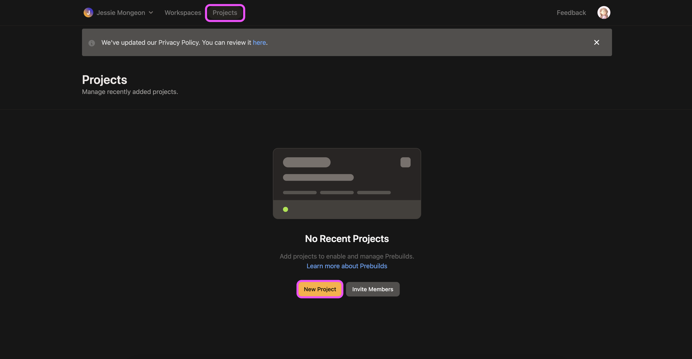
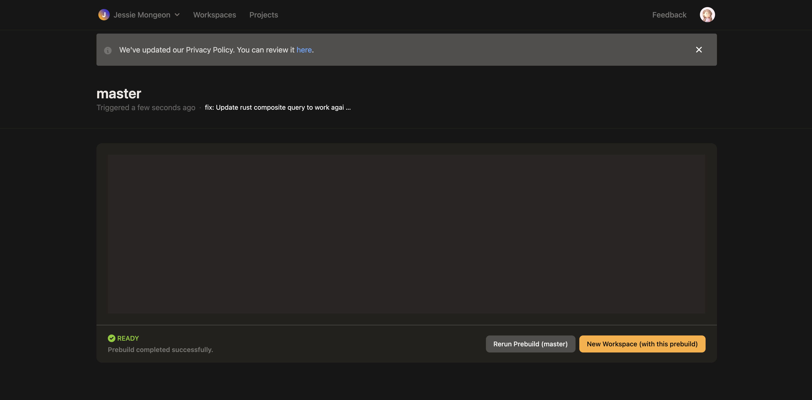
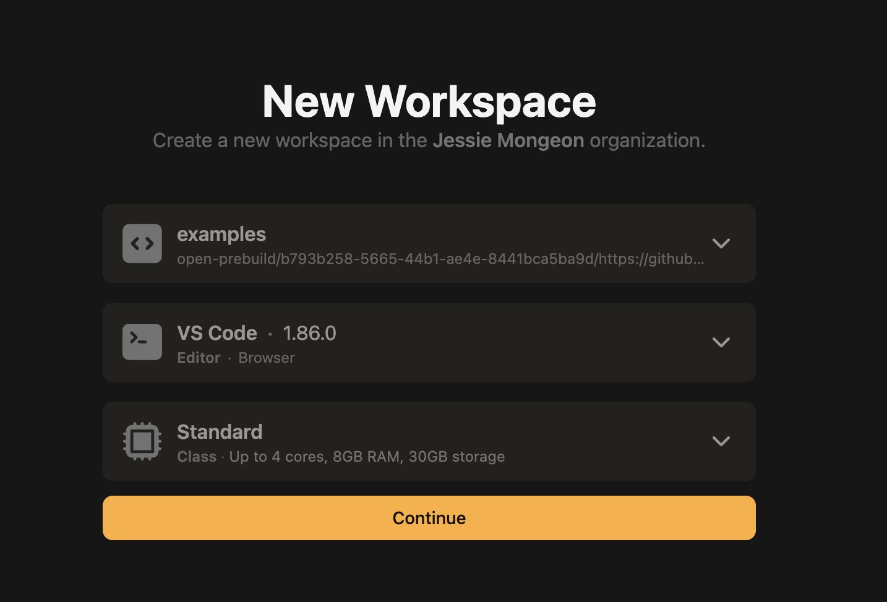
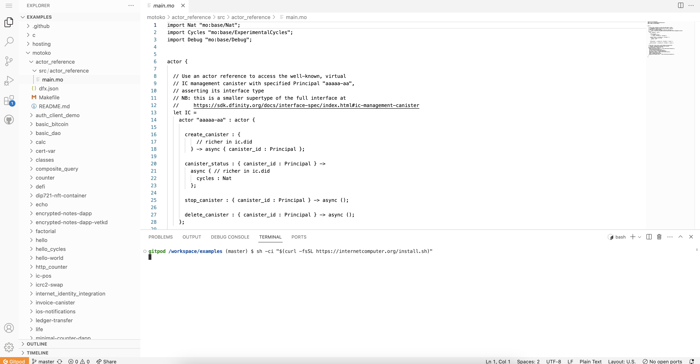
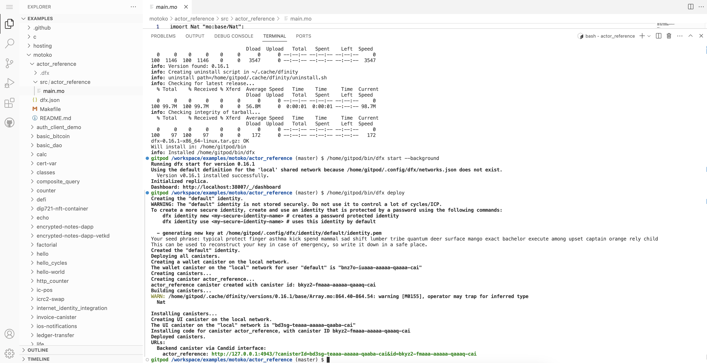

# Gitpod

## Overview

Gitpod is a web-based cloud development environment that provides a platform for developing and deploying code without downloading any necessary tools or packages. Gitpod can be configured with a local ICP developer environment, including `dfx` and an instance of the ICP replica, to support canister development. 

## Opening a project in Gitpod

If you have a GitHub repo that you're pushing your canister code to, or if there is a sample project you'd like to test, you can open the GitHub repo in Gitpod following these steps:

- #### Step 1: Open the [Gitpod dashboard](https://gitpod.io/).

Select the 'Projects' tab, then select 'New Project'. 



- #### Step 2: Enter the GitHub repo URL you'd like to use.

In this example, we'll use the [DFINITY examples repo](https://github.com/dfinity/examples/).


- #### Step 3: Select 'Run prebuild'.


- #### Step 4: Once the prebuild is labeled as 'Ready', select it to choose a workspace to deploy to.


- #### Step 5: Select 'New workspace (with this prebuild).



- #### Step 6: Configure the workspace settings as desired, then select 'Continue'.



- #### Step 7: Once the workspace has been deployed, navigate into a canister's code file to edit or develop it.


- #### Step 8: To deploy your canister, first assure that your project has a `dfx.json` file. 

[Learn more about the `dfx.json` file](/docs/current/developer-docs/setup/first-canister)


- #### Step 9: Then, download `dfx` into the workspace with the command:

```
sh -ci "$(curl -fsSL https://internetcomputer.org/install.sh)"
```




- #### Step 10: Start `dfx` and deploy your canister using the `dfx deploy` command in the 'Terminal' window.

```
/home/gitpod/bin/dfx start --background
/home/gitpod/bin/dfx deploy
```



## Example Gitpod projects 

The following projects are built with `dfx` and other dependencies already installed, making them ready to use in Gitpod:

- [Motoko 'Hello, world!'](https://gitpod.io/new/#https://github.com/dfinity/icp-hello-world-motoko).

- [Rust 'Hello, world!'](https://gitpod.io/#https://github.com/dfinity/icp-hello-world-rust).

- [Vite + Motoko + React example dapp](https://gitpod.io/#https://github.com/rvanasa/vite-react-motoko).

- [EVM RPC canister](https://gitpod.io/new/#https://github.com/rvanasa/vite-react-motoko/tree/evm-rpc).

## Resources

- [Gitpod dashboard](https://gitpod.io/).

- [Gitpod documentation](gitpod.md).