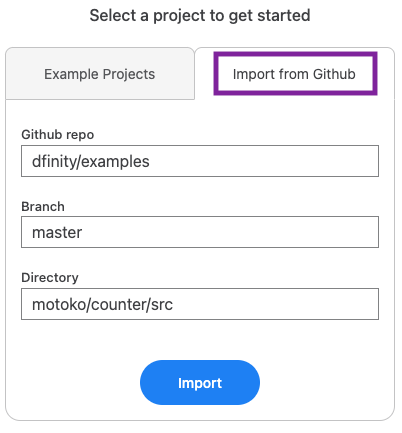
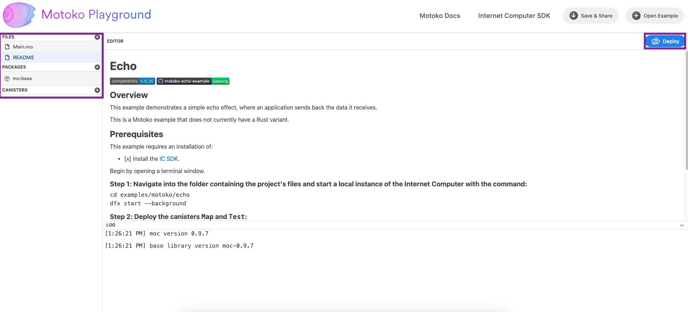
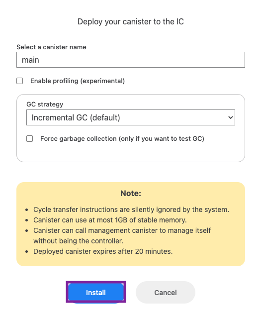
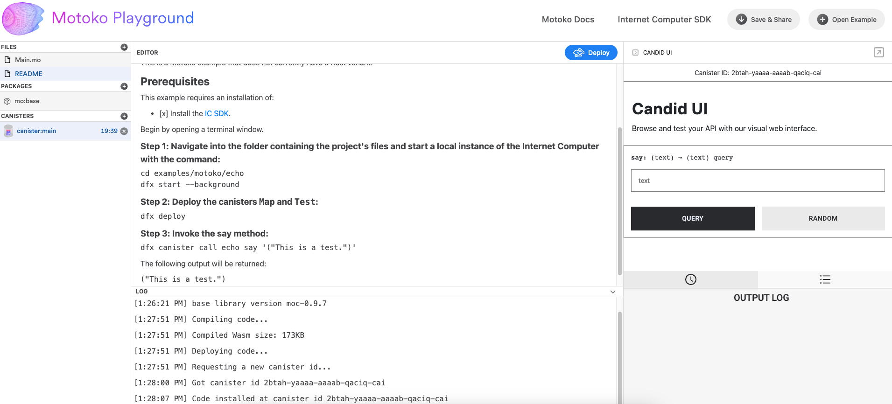
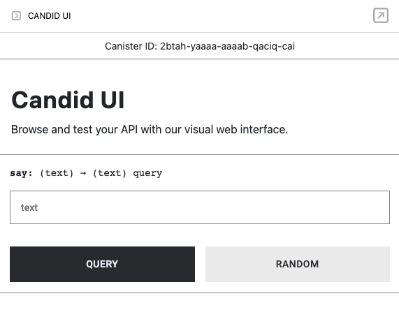
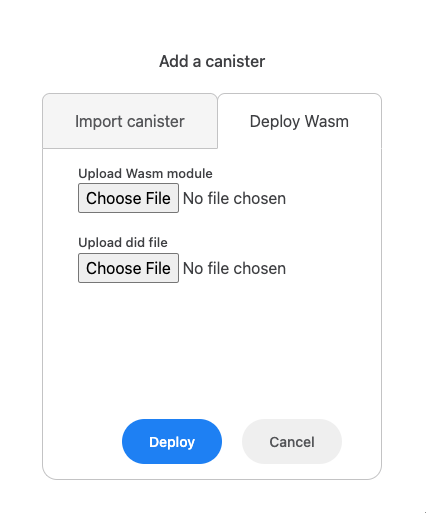
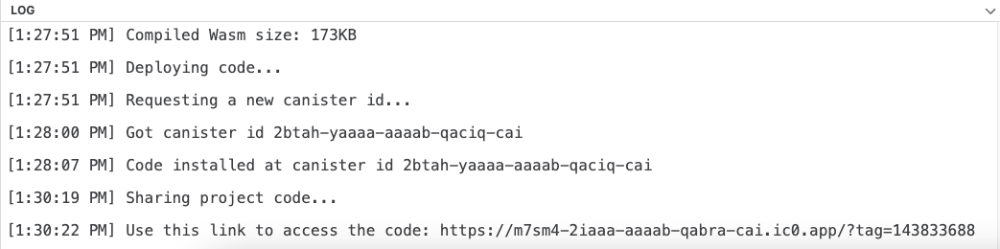

import { MarkdownChipRow } from "/src/components/Chip/MarkdownChipRow";

# Motoko playground

<MarkdownChipRow labels={["Beginner", "IDE", "Tutorial"]} />

## Overview

Motoko playground is a development environment that can be used to build and deploy Motoko canisters directly in the web browser using the Motoko playground canister. Motoko playground can also be run locally, or it can be utilized through the `dfx deploy --playground` command via the CLI. Canisters deployed to the playground use resources that are borrowed from a canister pool. All canisters deployed to the playground will time out after 20 minutes, and new canisters will need to be borrowed for further deployments past the timer. 

Motoko playground canisters provide the ability to quickly test canisters and their workflows without needing to configure additional parameters, such as having cycles.

The Motoko playground is comprised of:
- The playground's frontend asset canister, which contains:
    - A Motoko compiler produced by `js-of-ocaml`. 
    - A Monaco editor that includes support for Motoko syntax validation.
    - A Vessel package manager that loads libraries from the vessel package set.
    - A deploy module which integrates the canister's actor class, Candid UI, and upgrade process. 
- The playground's backend canister that controls all canisters deployed by users on the playground.
- A `wasm-utils` canister that performs Wasm analysis and modification to limit certain types of calls. 

Each canister has an initial amount of 0.5T cycles and can be used for 20 minutes once the canister has been deployed. To avoid wasting cycles, canisters cannot transfer cycles, and the cycles transfer instructions have been removed.

To ensure resources are used fairly by users, proof of work when a user makes a request for a canister ID is required. 

Since Motoko playground is designed for short, small-scale testing, there are limitations and restrictions imposed on canisters deployed to the playground. These limitations are:

- Cycle transfer instructions are silently ignored by the Motoko playground.
- Canisters can use at most 1GiB of memory.
- Canisters can call the management canister to manage itself without being the controller.
- Deployed canisters expire after 20 minutes. Upgrades to canisters reset this timer. When the timer runs out, the canister(s) will be uninstalled.
- Wasm files can't be gzipped.
- Wasm files will be analyzed to remove any potentially expensive/malicious operations.

## `dfx deploy --playground`

Through `dfx`, canisters can be deployed directly from the CLI to the Motoko playground using the `--playground` flag. When this flag is used, the canisters in the `dfx` project will be deployed to the mainnet using borrowed resources from the Motoko playground canister pool, and a canister URL will be returned to the developer. This enables developers to test canister functionality or workflow without needing to set up a obtain cycles or configure other parameters that are required for deployment to the mainnet.

### Prerequisites

Before you start, verify the following:

- [x] You have an internet connection and access to a shell terminal on your local macOS or Linux computer.

- [x] You have a command line interface (CLI) window open. This window is also referred to as the 'terminal' window.

- [x] You have downloaded and installed the IC SDK package as described in the [installing the IC SDK](/docs/current/developer-docs/getting-started/install/) page.


:::info
`dfx deploy --playground` is available in `dfx` versions v0.15.1 and above.
:::

To deploy a canister to the Motoko playground, first create a new `dfx` project with the command:

```
dfx new hello_world
```

This command will create a new default `dfx` project, which contains a simple 'Hello, world!' sample.

Then, to deploy this canister to the playground, run the command:

```
dfx deploy --playground
```

Once deployed, the canister can be interacted with using a command such as:

```
dfx canister --network playground call hello_world_backend greet '("everyone")'
```

This command calls the `hello_world_backend` canister that has been deployed to the playground using the `--network` flag, since the playground is classified as a deployment network. 

:::info
Any commands that intend to target a canister deployed to the playground must use the `--playground` or `--network playground` flag in order to target the borrowed canister(s). 
:::

## Creating a custom playground with separate pool creation

As an alternative to a staging environment or the Motoko mainnet playground, the Motoko playground allows for custom, private playgrounds to be deployed. Using a custom playground allows for extensive customization, such as enabling access control by restricting the playground's usage to only allow certain principals, configuring more generous canister timeouts and the amount of available cycles, and allowing some (or all) of the function calls that the mainnet Motoko playground does not allow, such as sending cycles to other canisters. 

Using a custom playground can help simplify development for teams, since the whole team can use a custom playground without needing to manage individual cycle balances.

- #### Step 1: Clone the Motoko playground repo with the command:

```
git clone https://github.com/dfinity/motoko-playground
```

- #### Step 2: To create a separate pool, first use the current Motoko playground pool and `wasm-utils` canisters as the starting point. 

These can be found [here](https://github.com/dfinity/motoko-playground/tree/main/service).

- #### Step 3: Then, edit the `pool/Main.mo` file to  change your custom playground settings, such as:

- Add access control [here](https://github.com/dfinity/motoko-playground/blob/main/service/pool/Main.mo#L134) as desired, such as creating an `whitelist` of principals that are permitted to use the custom playground.

- Configure the canister's time to live [here](https://github.com/dfinity/motoko-playground/blob/main/service/pool/Types.mo#L22).

- Change the Wasm transformation to fit your desired configuration [here](https://github.com/dfinity/motoko-playground/blob/main/service/pool/Main.mo#L150). In some cases, this may just be `wasm = args.wasm_module`, since if there is an `allowlist` in place, the principals allowed to install canisters can be trusted, such as:

```motoko
let wasm = args.wasm_module;
```

- #### Step 4: Then deploy the pool canister, and if necessary, deploy the `wasm-utils` canister:

```
dfx deploy pool
dfx deploy wasm-utils
```

- #### Step 5: Lastly, define the local playground network in your project's `dfx.json` file. In this definition, you will need to set the playground canister's ID (the `pool` canister ID) and define the amount of seconds before a canister is returned to the pool, as shown below:

```json
"<network name>": {
  "playground": {
    "playground_canister": "<canister pool id>",
    "timeout_seconds": <amount of seconds after which a canister is returned to the pool>
  },
  "providers": [
      "https://icp0.io"
  ]
}
```

If the value `<network name>` is set as `playground`, then the command `dfx deploy --playground` will deploy to your custom playground. Otherwise, the command has to use `--network <network name>`.

:::info 
This network definition can also go into `networks.json` file so it applies to every project, not just the current project, since `dfx.json` files are project-specific. To see where the `networks.json` file is located, use the command `dfx info networks-json-path`. 
:::

## Motoko playground in the web browser

Motoko playground is also available through the Motoko playground frontend canister, which can be accessed at the following public URL:

https://m7sm4-2iaaa-aaaab-qabra-cai.ic0.app/

In this portion of the guide, you'll explore the frontend canister's UI functionality and how to use it. 

When this URL is opened in a web browser, you will see the following welcome screen:


From this welcome menu, you can choose an example project from the 'Example Projects' tab, which will automatically install the required files and packages for the example, or you can import another project from a Github repo.




For this example, you'll select the 'Hello, world' example from the 'Example Projects' tab.

Once opened, you will see the following screen. Take note of the project's files in the left side bar menu under 'FILES', and the installed packages under the 'PACKAGES' menu.

To deploy the project, select the 'Deploy' button from the upper right corner of the screen.



After selecting 'Deploy', you will be prompted to give your canister a name, then enable additional options such as profiling and the canister's garbage collection strategy. You'll also be reminded of the restrictions imposed by Motoko playground, such as a time limit of 20 minutes. 



When ready, select 'Install'. Once the canister has been successfully deployed, the log at the bottom of the window will display the canister's ID. 


In addition to this log output, there will also be a new UI that opens on the right side of the window. This displays the canister's Candid UI. The Candid UI can be used to interact with canister's different defined methods, such as submitting queries to the methods.



For this 'Hello, world' canister, there is one method within the canister's code that can be used. This method is a simple 'say' method, which returns any text inputted by the user.  Other canisters may have several different methods; it will vary based on the canister's code. 



To test this method, enter the text 'Welcome to Motoko playground!' in the input box, then select the 'QUERY' button.


In the output log, you will see that the canister returns this string of text to you.


Next, let's take a closer look at the left side bar menu in the window. This menu has three categories: files, packages, and canisters.


To add new files to the Motoko playground workspace, select the `+` button next to the 'FILES' option.


Then give the new file a file name.


To add new packages to the Motoko playground workspace, select the `+` button next to the 'PACKAGES' option.


From this menu, you can select from the list of pre-imported Vessel packages, or you can input your own from Github.


Lastly, the 'CANISTERS' portion of the menu showcases your currently running canister(s) and shows the time remaining for the canister's deployment. When this timer runs out, the canister is automatically uninstalled.

To add another canister, select the `+` button next to the 'CANISTERS' option.


From the 'Add a canister' menu, you can import a canister using the canister's ID, as shown below.


Alternatively, you can deploy a canister using the canister's Wasm and .did files. 



Lastly, let's take a look at the two buttons in the top right corner of the Motoko playground UI: the 'Save and & Share' button and the 'Open Example' button.

The 'Save and Share' button can be used to save your canister's code and share it using a live canister URL. Select this button to demonstrate this workflow.


In the log, your canister's URL will be returned for you to share with others:



Then, the 'Open Example' button can be used to open another pre-configured example, or import your own from Github.


This menu will have the same examples and options that the initial welcome menu contained.


## Creating editor integrations

The Motoko playground has limited support for cross-origin communication. For developers building custom smart contract editors or similar applications, the following code snippet can open the project in Motoko playground:

```
const PLAYGROUND_ORIGIN = 'https://play.motoko.org'
const APP_ID = 'MyEditor'
// Workplace files for a project
const userFiles = {
  'Main.mo': 'actor { public func hello() : async Text { "Hello World" } }'
}
// GitHub package dependencies for a project
const userPackages = [{
  name: 'quicksort',
  repo: 'https://github.com/dfinity/examples.git',
  version: 'master',
  dir: 'motoko/quicksort/src'
}]
// Open the Motoko Playground in a new window
const playground = window.open(`${PLAYGROUND_ORIGIN}?post=${APP_ID}`, 'playground')
// Call repeatedly until loaded (interval ID used for acknowledgement)
const ack = setInterval(() => {
  const request = {
    type: 'workplace',
    acknowledge: ack,
    packages: userPackages,
    actions: [{
      type: 'loadProject',
      payload: {
        files: userFiles
      }
    }],
    deploy: true
  }
  // Concatenate APP_ID and request JSON
  const data = APP_ID + JSON.stringify(request)
  console.log('Request data:', data)
  playground.postMessage(data, PLAYGROUND_ORIGIN)
}, 1000)
// Listen for acknowledgement
const responseListener = ({source, origin, data}) => {
  if(
          typeof data === 'string' &&
          data.startsWith(APP_ID) &&
          source === playground &&
          origin === PLAYGROUND_ORIGIN
  ) {
    console.log('Response data:', data)
    // Parse JSON part of message (prefixed by APP_ID)
    const response = JSON.parse(data.substring(APP_ID.length))
    if(response.acknowledge === ack) {
      clearInterval(ack)
      window.removeEventListener('message', responseListener)
    }
  }
}
window.addEventListener('message', responseListener)
```

:::info
This example works for `localhost` out of the box. To use this feature in production, please submit a PR to the [Motoko playground](https://github.com/dfinity/motoko-playground.git) repository that adds your application's public URL to the file `src/integrations/allowedOrigins.js`.
:::


