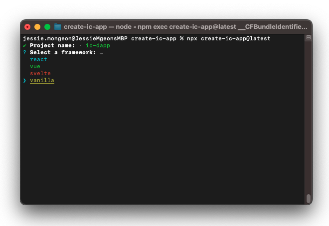
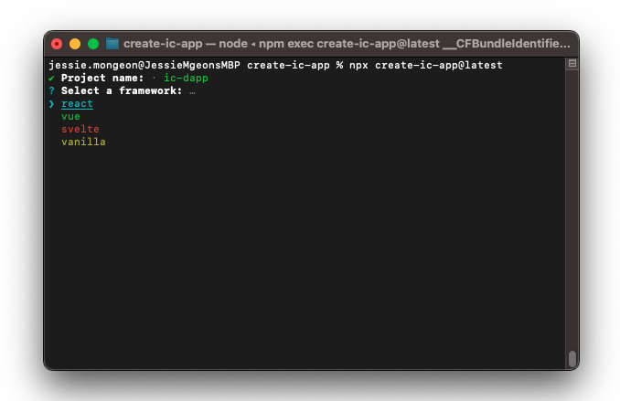
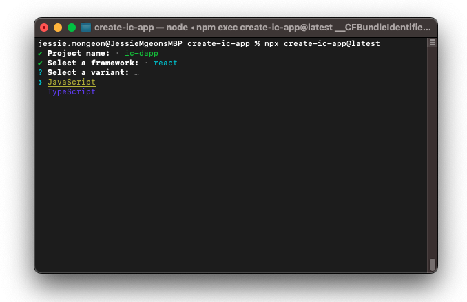
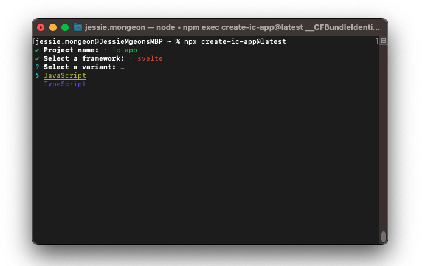
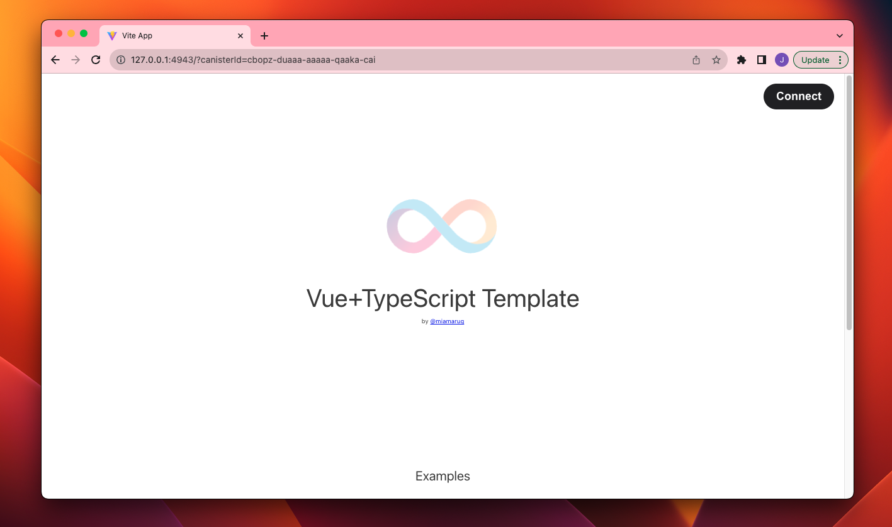

import Tabs from '@theme/Tabs';
import TabItem from '@theme/TabItem';

# Using a frontend boilerplate

## Overview

A community-developed project can be used to create a boilerplate template for creating frontend apps using JavaScript, React, Svelte, and Vue. This guide will walkthrough how to use that boilerplate template. 

## Prerequisites

Before you start your project, verify the following:

- [x] Download and install the IC SDK package as described in the [installing the IC SDK](/docs/current/developer-docs/setup/install) page.

- [x] Download and install [git](https://git-scm.com/downloads).

- [x] Download and install [Node.js](https://nodejs.org/en) <v0.12.0.

### Step 1: Clone the project repository.

<Tabs groupId="frontend-frameworks">
<TabItem value="javascript" label="JavaScript" default>

```bash
git clone https://github.com/MioQuispe/create-ic-app.git
```

</TabItem>
<TabItem value="react" label="React">

```bash
git clone https://github.com/MioQuispe/create-ic-app.git
```

</TabItem>

<TabItem value="svelte" label="Svelte">

```bash
git clone https://github.com/MioQuispe/create-ic-app.git
```

</TabItem>

<TabItem value="vue" label="Vue">

```bash
git clone https://github.com/MioQuispe/create-ic-app.git
```

</TabItem>
</Tabs>


### Step 2: Create a new app with the command:

<Tabs groupId="frontend-frameworks">
<TabItem value="javascript" label="JavaScript" default>

```bash
npx create-ic-app@latest
```

</TabItem>
<TabItem value="react" label="React">

```bash
npx create-ic-app@latest
```

</TabItem>

<TabItem value="svelte" label="Svelte">

```bash
npx create-ic-app@latest
```

</TabItem>

<TabItem value="vue" label="Vue">

```bash
npx create-ic-app@latest
```

</TabItem>
</Tabs>

This command will prompt you to provide a project name, then choose a project template. 

<Tabs groupId="frontend-frameworks">
<TabItem value="javascript" label="JavaScript" default>

Choose 'Vanilla'.



Select either 'JavaScript' or 'Typescript'.


</TabItem>
<TabItem value="react" label="React">

Choose 'React'.



Select either 'JavaScript' or 'Typescript'.



</TabItem>

<TabItem value="svelte" label="Svelte">

Choose 'Svelte'.


Select either 'JavaScript' or 'Typescript'.



</TabItem>

<TabItem value="vue" label="Vue">

Choose 'Vue'.


Select either 'JavaScript' or 'Typescript'.


</TabItem>
</Tabs>


This will create a project using the selected frontend template and a simple Motoko actor that defines a `counter` method. 

### Step 3: Once your project has been created, navigate into the project's directory:


<Tabs groupId="frontend-frameworks">
<TabItem value="javascript" label="JavaScript" default>

```
cd ic-dapp
```

Install the project's dependency packages with the command:

```
npm install
```

</TabItem>
<TabItem value="react" label="React">

```
cd ic-dapp
```

Install the project's dependency packages with the command:

```
npm install
```

</TabItem>

<TabItem value="svelte" label="Svelte">

```
cd ic-dapp
```

Install the project's dependency packages with the command:

```
npm install
```

</TabItem>

<TabItem value="vue" label="Vue">

```
cd ic-dapp
```

Install the project's dependency packages with the command:

```
npm install
```

</TabItem>
</Tabs>


### Step 4: Generate Candid definitions.

Next, generate the Candid definition for the backend canister.

<Tabs groupId="frontend-frameworks">
<TabItem value="javascript" label="JavaScript" default>

```
dfx generate
```

Then, copy the generated files into the `.dfx/local` directory:

```
cp src/declarations/counter/* .dfx/local/canisters/counter/
```

</TabItem>
<TabItem value="react" label="React">

```
dfx generate
```

Then, copy the generated files into the `.dfx/local` directory:

```
cp src/declarations/counter/* .dfx/local/canisters/counter/
```

</TabItem>

<TabItem value="svelte" label="Svelte">

```
dfx generate
```

Then, copy the generated files into the `.dfx/local` directory:

```
cp src/declarations/counter/* .dfx/local/canisters/counter/
```

</TabItem>

<TabItem value="vue" label="Vue">

```
dfx generate
```

Then, copy the generated files into the `.dfx/local` directory:

```
cp src/declarations/counter/* .dfx/local/canisters/counter/
```

</TabItem>
</Tabs>


### Step 5: Edit the `dfx.json` file.

Edit the `networks` portion of the `dfx.json` file to reflect using port `4943`:

Next, generate the Candid definition for the backend canister.

<Tabs groupId="frontend-frameworks">
<TabItem value="javascript" label="JavaScript" default>

```json
...
  "networks": {
    "local": {
      "bind": "127.0.0.1:4943",
      "type": "ephemeral"
    },
...
```

</TabItem>
<TabItem value="react" label="React">

```json
...
  "networks": {
    "local": {
      "bind": "127.0.0.1:4943",
      "type": "ephemeral"
    },
...
```

</TabItem>

<TabItem value="svelte" label="Svelte">

```json
...
  "networks": {
    "local": {
      "bind": "127.0.0.1:4943",
      "type": "ephemeral"
    },
...
```

</TabItem>

<TabItem value="vue" label="Vue">

```json
...
  "networks": {
    "local": {
      "bind": "127.0.0.1:4943",
      "type": "ephemeral"
    },
...
```

</TabItem>
</Tabs>


### Step 6: Deploy the project:

<Tabs groupId="frontend-frameworks">
<TabItem value="javascript" label="JavaScript" default>

```
dfx deploy
```

</TabItem>
<TabItem value="react" label="React">

```
dfx deploy
```

</TabItem>

<TabItem value="svelte" label="Svelte">

```
dfx deploy
```

</TabItem>

<TabItem value="vue" label="Vue">

```
dfx deploy
```

</TabItem>
</Tabs>


### Step 7: Start the local development server for the frontend:

<Tabs groupId="frontend-frameworks">
<TabItem value="javascript" label="JavaScript" default>

```
npm run dev
```

</TabItem>
<TabItem value="react" label="React">

```
npm run dev
```

</TabItem>

<TabItem value="svelte" label="Svelte">

```
npm run dev
```

</TabItem>

<TabItem value="vue" label="Vue">

```
npm run dev
```

</TabItem>
</Tabs>


### Step 8: Navigate to the frontend canister to view the frontend.

<Tabs groupId="frontend-frameworks">
<TabItem value="javascript" label="JavaScript" default>

Navigate to the frontend canister using the URL `http://127.0.0.1:4943/?canisterId=<canister-id>`, such as:

```
http://127.0.0.1:4943/?canisterId=cbopz-duaaa-aaaaa-qaaka-cai
```

The default JavaScript UI will be displayed.


This frontend is using the file stored at `./dist/index.html`, and the corresponding frontend scripts and assets are stored at `./frontend/`. 

</TabItem>
<TabItem value="react" label="React">

Navigate to the frontend canister using the URL `http://127.0.0.1:4943/?canisterId=<canister-id>`, such as:

```
http://127.0.0.1:4943/?canisterId=cbopz-duaaa-aaaaa-qaaka-cai
```

The default React UI will be displayed.


This frontend is using the file stored at `./dist/index.html`, and the corresponding frontend scripts and assets are stored at `./frontend/`. 

</TabItem>

<TabItem value="svelte" label="Svelte">

Navigate to the frontend canister using the URL `http://127.0.0.1:4943/?canisterId=<canister-id>`, such as:

```
http://127.0.0.1:4943/?canisterId=cbopz-duaaa-aaaaa-qaaka-cai
```

The default Svelte UI will be displayed.


This frontend is using the file stored at `./dist/index.html`, and the corresponding frontend scripts and assets are stored at `./frontend/`. 

</TabItem>

<TabItem value="vue" label="Vue">

Navigate to the frontend canister using the URL `http://127.0.0.1:4943/?canisterId=<canister-id>`, such as:

```
http://127.0.0.1:4943/?canisterId=cbopz-duaaa-aaaaa-qaaka-cai
```

The default Vue UI will be displayed.



This frontend is using the file stored at `./dist/index.html`, and the corresponding frontend scripts and assets are stored at `./frontend/`. 

</TabItem>
</Tabs>

