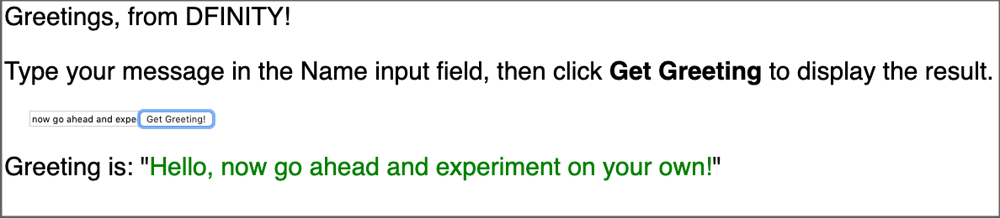

# Customize the frontend

Now that you have a basic understanding of how to create, build, and deploy a simple dapp and are familiar with the default project files and sample frontend, you might want to start experimenting with different ways to customize the frontend user experience for your project.

This tutorial illustrates using the React framework to create a new frontend for the default sample dapp and guides you through some basic modifications to customize the interface displayed. Later tutorials expand on the techniques introduced here, but if you already know how to use CSS, HTML, JavaScript, and React or other frameworks to build your user interface, you can skip this tutorial.

This tutorial illustrates using the React framework to manage the Document Object Model (DOM) for your canister. Because React has its own custom DOM syntax, you need to modify the webpack configuration to compile the frontend code, which is written in JSX. For more information about learning to use React and JSX, see [Getting started](https://reactjs.org/docs/getting-started.html) on the [React website](https://reactjs.org/).

## Before you begin

Before starting the tutorial, verify the following:

-   You have `node.js` installed for frontend development and can install packages using `npm install` in your project. For information about installing node for your local operating system and package manager, see the [Node](https://nodejs.org/en/) website.

-   You have downloaded and installed the SDK package as described in [Download and install](/developer-docs/setup/install/index.mdx).

-   You have installed the Visual Studio Code plugin for Motoko as described in [VS Code extensions for IC development](/developer-docs/setup/vs-code.md) if you are using Visual Studio Code as your IDE.

-   You have stopped any SDK processes running on the local computer.

This tutorial requires you to use the SDK version `0.8.0` or later.

This tutorial takes approximately 30 minutes to complete.

## Create a new project

To create a new project directory for your custom frontend dapp:

1.  Open a terminal shell on your local computer, if you don’t already have one open.

2.  Change to the folder you are using for your Internet Computer projects, if you are using one.

3.  Check that you have `node.js` installed locally by running the following commands:

        which node
        which npm

    If you don’t have `node.js` installed, you should download and install it before continuing to the next step. For information about installing node for your local operating system and package manager, see the [Node](https://nodejs.org/en/) website.

4.  Create a new project by running the following command:

        dfx new custom_greeting

    The `dfx new custom_greeting` command creates a new `custom_greeting` project.

5.  Change to your project directory by running the following command:

        cd custom_greeting

## Install the React framework

If you’ve never used React before, you might want to explore the [Intro to React](https://reactjs.org/tutorial/tutorial.html) tutorial or the [React website](https://reactjs.org/) before editing the frontend code.

To install required framework modules:

1.  Install the React module by running the following command:

        npm install --save react react-dom

2.  Install the required TypeScript language compiler loader by running the following command:

        npm install --save-dev typescript ts-loader

    As an alternative to installing these modules, you can edit the default `package.json` file to add dependencies for your project like [this](_attachments/custom-frontend-package.json).

## Review the default configuration

Before we make any changes to use React for this tutorial, let’s review the default frontend settings in the `dfx.json` configuration file for your project.

To review the default `dfx.json` configuration file:

1.  Open the `dfx.json` configuration file in a text editor.

2.  Notice that the `canisters` key includes settings for a `custom_greeting_assets` canister.

        {
          "canisters": {
            ...

            "custom_greeting_assets": {
              "dependencies": [
                "custom_greeting"
              ],
              "frontend": {
                "entrypoint": "src/custom_greeting_assets/src/index.html"
              },
              "source": [
                "src/custom_greeting_assets/assets",
                "dist/custom_greeting_assets/"
              ],
              "type": "assets"
            }
          }
        }

    Let’s take a look at the settings in this section.

    -   Frontend assets for your project are compiled into their own canister, in this case, a canister named `custom_greeting_assets`.

    -   The assets canister has a default dependency on the main canister for the project.

    -   The `frontend.entrypoint` setting specifies the path to a file—in this case, the `index.html` file—to use as your dapp entry point. If you had a different starting point—for example, a custom `first-page.html` file—you would modify this setting.

    -   The `source` settings specify the path to your `src` and `dist` directories. The `src` setting specifies the directory to use for static assets that will be included in your assets canister when you build your project. If you have custom cascading stylesheet (CSS) or JavaScript files, you would include them in the folder specified by this path. After building the project, the project assets are served from the directory specified by the `dist` setting.

    -   The `type` setting specifies that the `custom_greeting_assets` should use the [certified asset canister](https://github.com/dfinity/certified-assets), which comes with everything you need to host static assets on the IC.

    For this tutorial, we are going to add React JavaScript in an `index.jsx` file, but that won’t require any changes to the default settings in the `dfx.json` file.

3.  Close the `dfx.json` file to continue.

## Review the default frontend files

For this tutorial, you are going to make calls to the default `main.mo` canister through a custom frontend. Before you make any changes, though, let’s take a look at what’s in the default frontend files for a project.

To review the default frontend files:

1.  Open the `src/custom_greeting_assets/src/index.html` file in a text editor.

    This template file is the default frontend entry point for the dapp as specified by the `frontend.entrypoint` setting in the `dfx.json` file.

    This file contains standard HTML with references to a CSS file and an image that are located in the `src/custom_greeting_assets/assets` directory. The default `index.html` file also includes standard HTML syntax for displaying an input field for the `name` argument and a clickable button.

    This is the same default frontend you saw in [Viewing the default frontend](/developer-docs/backend/backend-tutorials/explore-templates.md#default-frontend).

2.  Open the `src/custom_greeting_assets/src/index.js` file in a text editor.

        import { custom_greeting } from "../../declarations/custom_greeting";

        document.getElementById("clickMeBtn").addEventListener("click", async () => {
          const name = document.getElementById("name").value.toString();
          // Interact with custom_greeting actor, calling the greet method
          const greeting = await custom_greeting.greet(name);

          document.getElementById("greeting").innerText = greeting;
        });

    -   The `import` statement points to an actor that will allow us to make calls to our `custom_greeting` canister from `"../declarations"`

    -   The declarations haven’t been created yet, but we will come back to that.

3.  Close the `index.js` file to continue.

## Modify the frontend files

You are now ready to create a new frontend for the default dapp.

To prepare the frontend files:

1.  Open the webpack configuration file (`webpack.config.js`) in a text editor.

2.  Modify the frontend entry to replace the default `index.html` with `index.jsx`.

        entry: {
          // The frontend.entrypoint points to the HTML file for this build, so we need
          // to replace the extension to `.js`.
          index: path.join(__dirname, asset_entry).replace(/\.html$/, ".jsx"),
        },

3.  Add the following `module` key above the `plugins` section:

        module: {
          rules: [
            { test: /\.(js|ts)x?$/, loader: "ts-loader" }
          ]
        },

    This setting enables the project to use the `ts-loader` compiler for a React JavaScript `index.jsx` file. Note that there’s a commented section in the default `webpack.config.js` file that you can modify to add the `module` key.

4.  Create a new file named `tsconfig.json` in the root directory for your project.

5.  Open the `tsconfig.json` file in a text editor, then copy and paste [this code](_attachments/sample-tsconfig.json) into the file.

6.  Save your changes and close the `tsconfig.json` file to continue.

7.  Open the default `src/custom_greeting_assets/src/index.js` file in a text editor and delete lines 2 to 9.

8.  Copy and paste [this code](_attachments/react-index.jsx) into the `index.js` file.

9.  Rename the modified `index.js` file as `index.jsx` by running the following command:

        mv src/custom_greeting_assets/src/index.js src/custom_greeting_assets/src/index.jsx

10. Open the default `src/custom_greeting_assets/src/index.html` file in a text editor, then replace the body contents with `

`.

    For example:

        <!doctype html>
        <html lang="en">
         <head>
            <meta charset="UTF-8">
            <meta name="viewport" content="width=device-width">
            <title>custom_greeting</title>
            <base href="/">
            <link type="text/css" rel="stylesheet" href="main.css" />
         </head>
         <body>
            

         </body>
        </html>

## Start the local canister execution environment

Before you can build the `custom_greeting` project, you need to connect to either the live IC, or a canister execution environment running locally in your development environment.

To start the environment locally:

1.  Open a new terminal window or tab on your local computer.

2.  Navigate to the root directory for your project, if necessary.

3.  Start the local canister execution environment on your local computer by running the following command:

        dfx start --background

    After the local canister execution environment completes its startup operations, you can continue to the next step.

## Register, build, and deploy the dapp

After you connect to the local canister execution environment, you can register, build, and deploy your dapp locally.

To deploy the dapp locally:

1.  Check that you are still in the root directory for your project, if needed.

2.  Register, build, and deploy your dapp by running the following command:

        dfx deploy

    The `dfx deploy` command output displays information about the operations it performs.

## View the new frontend

You can now access the new frontend for the default dapp by entering the canister identifier for the assets canister in a browser.

To view the custom frontend:

1.  Open a new tab or window of your terminal and run

        npm start

2.  Open a browser and navigate to <http://localhost:8080>.

3.  Verify that you are prompted to type a greeting.

    For example:

    

4.  Replace **Name** in the input field with the text you want to display, then click **Get Greeting** to see the result.

    For example:

    

## Revise the frontend and test your changes

After viewing the frontend, you might want to make some changes.

To modify the frontend:

1.  Open the `index.jsx` file in a text editor and modify its style settings. For example, you might want to change the font family and use a placeholder for the input field by making changes similar to [this](_attachments/react-revised-index.jsx).

2.  Save the file and view the updated page in your browser.

    For example:

    

3.  Type a new message and see your new greeting. For example:

    

## Stop the local canister execution environment

After you finish experimenting with the frontend for your dapp, you can stop the local canister execution environment so that it doesn’t continue running in the background.

To stop the local network:

1.  In the terminal that displays the webpack development server, press Control-C to interrupt the dev-server.

2.  In the terminal that displays network operations, press Control-C to interrupt the local network process.

3.  Stop the local canister execution environment by running the following command:

        dfx stop
