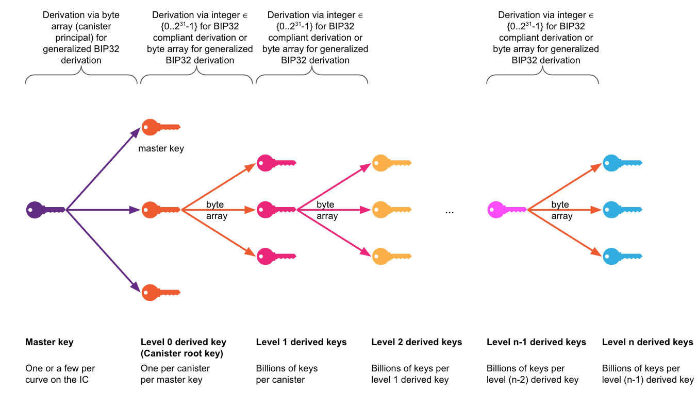

# Threshold ECDSA

The Internet Computer implements a novel threshold ECDSA protocol. In this protocol, the private ECDSA key is held in a secret-shared manner by multiple parties, namely the replicas of a threshold-ECDSA-enabled subnet on the IC, and signatures are computed using those secret shares without the private key ever being reconstructed. Each replica of such subnet holds a key share that provides no information about the key on its own. At least one third of the replicas are required to generate a threshold signature using their respective key shares.

Each canister on any subnet of the Internet Computer has control over a unique ECDSA key pair and can request signatures with the corresponding private key to be computed. A signature is only issued to the eligible canister, i.e., the legitimate holder of the ECDSA key. Each canister can obtain signatures only for its ECDSA keys. Note that canisters do not hold any private ECDSA keys or key shares themselves, but delegate this to specific threshold-ECDSA-enabled subnets of the IC. Threshold cryptography can help enable functionality in the trust model of a blockchain that would be impossible to achieve with conventional cryptography alone.

A threshold ECDSA implementation on a blockchain can be viewed as the on-chain pendant to a hardware security module (HSM) that stores private keys securely and issues signatures on request of the eligible entities, and only to those.

The availability of threshold ECDSA allows for a multitude of important use cases, as for example:
-   Canisters natively holding Bitcoin;
-   Integration with Ethereum, e.g., getting the ERC-20 tokens of Ethereum into the IC or signing Ethereum transactions;
-   Realizing a decentralized certification authority (CA), where certificates are issued using threshold ECDSA (this requires a different elliptic curve to the currently implemented curve `secp256k1`, namely `secp256r1`, for use cases such as integration with Bitcoin and Ethereum).
-   FIX: More use cases

## Technology Overview -- How It Works

We next give a high-level outline of threshold ECDSA on the IC. Some of the information in this section is not required to use the feature, but may be of interest to the technically inclined reader for obtaining background information on the technology. The IC implements the threshold ECDSA protocol by Groth and Shoup as described in their [Eurocrypt 2022 paper](https://eprint.iacr.org/2021/1330). Groth and Shoup have also published a comprehensive [design and analysis](https://eprint.iacr.org/2022/506) of this distributed signing protocol. The threshold ECDSA implementation on the IC features multiple protocols:
-   Key generation: This protocol is executed on a specified subnet; it generates a threshold ECDSA key such that the private key is secret shared over the replicas of this subnet.
-   Key re-sharing: This protocol re-shares an ECDSA key from a source subnet to a target subnet. It results in the same key being secret shared over the replicas of the target subnet using a different random secret sharing (potentially over a different number of replicas than the sharing in the source subnet uses).
-   Signing: This protocol computes a signature with the secret-shared private key. Signing is done by precomputing the vast majority of the steps of the signing protocol and storing the precomputation result as a set of quadruples. Upon a signing request, one of the precomputed quadruples is consumed to efficiently compute a signature.

It is crucial to note that the private key never exists in reconstructed, but only in secret-shared form during its whole lifetime, be it during its generation, the re-sharing of the key from one subnet to another, and computing signatures.

Various NNS proposals have been implemented to perform key management, i.e., initial key generation and key re-sharing. Those proposals are used to define on which subnet to generate an ECDSA master key, to which subnet to re-share the key to have it available for better availability, and which subnet to enable for answering signing requests.

## ECDSA Keys

ECDSA-enabled subnets hold what we call threshold ECDSA *master keys*, generated with the key generation process on selected subnets of the IC. A master ECDSA key is a key from which canister ECDSA keys can be derived. I.e., a single master key for a given elliptic curve suffices to allow for the derivation of an ECDSA key for each canister on the IC (*canister root key*) using the canister\'s principal and a BIP-32-like key derivation mechanism that is executed transparently by the protocol as part of the signing and public key retrieval APIs. See the level-0 key derivation in the below Figure for the derivation of canister root keys from a master key.

From a canister root key, an unlimited number of further ECDSA keys can be derived for the canister using a backward-compatible extension of the BIP-32 key derivation mechanism. The extension allows not only 32-bit integers, but arbitrary-length byte arrays, to be used as input for each level of the key derivation function. See the levels 1 and greater in the below figure illustrating the derivation of further canister keys based on the canister root key.

The derivation of further ECDSA keys from a canister root key can be done without involvement of the IC to facilitate certain use cases.



Threshold ECDSA master keys are always referred to through *key identifiers* in the threshold ECDSA API (as well as in the NNS proposals for managing the rollout). The key identifiers comprise an elliptic curve name and an identifier, e.g., an example key identifier is the 2-tuple `(secp256k1, key_1)`. Those key identifiers are used by the system to refer to the correct key, e.g., for selecting the key share when computing a signature or in the implementation of the XNet routing of API calls and responses to/from the ECDSA-enabled subnet holding the key with the corresponding identifier.

## Deployment

We next outline the deployment for the Chromium (Beta) release available now and the GA release coming later in 2022.

### Chromium Release

Currently, as part of the Chromium release, only a test key for curve `secp256k1` is deployed on one subnet with a replication factor of 13. This key may be deleted with an according NNS proposal some time after the GA release and therefore should not be used for anything that has value, but only for development and testing purposes. More concretely, it is, for example, strongly advised against holding real bitcoin with the test key. The test key is rather intended to facilitate development of Bitcoin smart contracts and hold Testnet bitcoin as preparation for the GA release. The test key has the id `(secp256k1, test_key_1)` for referring to it in API calls.

### General Availability Release (Coming Later in 2022)

A single threshold ECDSA production key for the `secp256k1` elliptic curve will be deployed on the IC for the upcoming GA release. The key will be maintained in secret-shared form on two different subnets with high replication factor (\>=34). The key will be initially generated on the NNS and maintained there and also re-shared to a new 34-node subnet. The latter will be activated to act as the active signing subnet for this key. The NNS will hold the key in secret-shared form for backup purposes, but will not respond to signing requests. In case of the unlikely event of one of the subnets getting destroyed beyond recoverability, the approach of key replication improves key availability by allowing for the key to be re-shared to a different subnet, should this be ever required in case of a disaster.

### Further Aspects

For both the current Chromium deployment with a test key and the future GA release with a production key, requests to the threshold ECDSA API are always XNet requests because the ECDSA-enabled subnets do not host user\'s canisters, thus some seconds of extra latency is incurred due to Xnet communications from the calling canister\'s subnet to the threshold-ECDSA-enabled subnet holding the respective key.

Support for further elliptic curves and additional corresponding master keys may be added in the future. The curve `secp256r1` is interesting for supporting use cases such as decentralized certification authorities (CAs) and is the premier candidate group to be added to facilitate use cases like the mentioned one.

## API

We next give an overview of the API for threshold ECDSA. For a detailed specification, the reader is referred to the corresponding part of the [Internet Computer Interface Specification](../../../references/ic-interface-spec.md#ic-ecdsa_public_key). The API comprises two methods, `ecdsa_public_key` for retrieving threshold ECDSA public keys, and `create_ecdsa_signature` for requesting threshold ECDSA signatures to be computed from the subnet holding the secret-shared private threshold ECDSA key.

Each API call refers to a threshold ECDSA master key by virtue of a 2-part identifier comprising a curve and a key id as outlined above. Derivation paths are used to refer to keys below a canister\'s root key in the key derivation hierarchy. The key derivation from the master key to the canister root key is implicit in the API.

-   `ecdsa_public_key`: This method returns a SEC1-encoded ECDSA public key for the given canister using the given derivation path. If the `canister_id` is unspecified, it will default to the canister id of the caller. The `derivation_path` is a vector of variable length byte strings. The `key_id` is a struct specifying both a curve and a name. The availability of a particular `key_id` depends on implementation.<br/>
For `curve secp256k1`, the public key is derived using a generalization of BIP32 (see ia.cr/2021/1330, Appendix D). To derive (non-hardened) BIP-0032-compatible public keys, each byte string (blob) in the `derivation_path` must be a 4-byte big-endian encoding of an unsigned integer less than 2<sup>31</sup>.<br/>
The return result is an extended public key consisting of an ECDSA `public_key`, encoded in SEC1 compressed form, and a `chain_code`, which can be used to deterministically derive child keys of the `public_key`.\
This call requires that the ECDSA feature is enabled, and the `canister_id` meets the requirement of a canister id. Otherwise it will be rejected.
-   `sign_with_ecdsa`: This method returns a new ECDSA signature of the given message_hash that can be separately verified against a derived ECDSA public key. This public key can be obtained by calling `ecdsa_public_key` with the caller\'s `canister_id`, and the same `derivation_path` and `key_id` used here.<br/>
The signatures are encoded as the concatenation of the SEC1 encodings of the two values `r` and `s`. For curve `secp256k1`, this corresponds to 32-byte big-endian encoding.<br/>
This call requires that the ECDSA feature is enabled, the caller is a canister, and `message_hash` is 32 bytes long. Otherwise it will be rejected.

## Environments

In order to facilitate developers throughout the canister development life cycle on the IC, the feature is available in both the SDK for local development and testing as well as on IC mainnet for pre-production testing and production operation of canisters.

### SDK

The development of canisters is typically done in the local environment of the developer, facilitated by use of the SDK. The SDK has been extended such that the management canister API for threshold ECDSA is available in the local canister execution environment. Thus, canisters using the threshold ECDSA API can be run locally for development and testing purposes. The feature is always enabled in the SDK, so no further user action is required in order to make use of the API.

When the replica of the SDK environment is first started up, a new ECDSA key is generated. This key is then stored in non-volatile memory so that it does not change with every restart of the replica.

For the technically interested readers we want to note that the SDK uses the exact same implementation of threshold ECDSA as mainnet, but only runs a single replica. Thus, the protocol is operating with the special case of a single replica, which means it degenerates to a special case and incurs only little overhead, e.g., for key generation, and can thus remain enabled by default in the SDK without noticeably affecting performance of the SDK. Also note that the signing throughput and latency in the local SDK environment is not representative for the throughput on mainnet.

### IC Mainnet

Any canister on any subnet of IC mainnet can call the threshold ECDSA API exposed by the management canister. The calls are routed via XNet communication to the ECDSA-enabled subnet that holds the key referred to in the API call (only one such signing subnet holding a test key exists for testing purposes in the initial Chromium release). Note that this test key is hosted on a subnet with a replication factor of only 13 and may be deleted in the future, thus it should not be used for anything of value, but rather solely for development and testing purposes. The main intended purpose is to facilitate the development and testing of Bitcoin-enabled dApps using Bitcoin testnet.

Later in 2022, as part of the General Availability (GA) release of the feature, a production ECDSA key on the `secp256k1` elliptic curve will be deployed to be used for integration with Bitcoin mainnet and other use cases of interest.

## Code Walkthrough

We next present a minimal example canister for showcasing the threshold ECDSA API. The canister is a signing oracle that creates signatures with keys derived from an input string. That is, a request provides a message and a key derivation string and the canister hashes the message and requests a signature from the threshold ECDSA subnet using the key derivation string for the derivation path. We attempt to give a complete overview of the development, starting with downloading of the SDK, up to the deployment and trying out of the code on mainnet.

### Getting Started

Sample project called `threshold-ecdsa` is provided in the [examples repository](??), under either `motoko` or `rust` sub-directories. It requires at least dfx version ?? for local development.

-   Download and install the SDK if you do not already have it.
-   Check out the examples repistory.
-   Change directory to `motoko/threshold_ecdsa` subdirectory.
-   Run `dfx deploy`.

### Deploying it on Mainnet

The same code used in the SDK environment for local testing works IC on mainnet. Keep in mind that the master key in the SDK environment is different to the master test key on mainnet and the future master production key.

Before deploying to mainnet, you should modify the code to use the right name of the `key_id` for the key on mainnet.

### Obtaining Public Keys

The following motoko code demonstrates how to obtain a public key by calling the `ecdsa_public_key` method of the IC management canister (`aaaaa-aa`). When the `canister_id` argument is left as unspecified (`null`), it defaults to getting the public key of the canister that makes this call.

```
  let ic : IC = actor("aaaaa-aa");

  public shared (msg) func public_key() : async { #Ok : { public_key: Blob }; #Err : Text } {
    let caller = Principal.toBlob(msg.caller);
    try {
      let { public_key } = await ic.ecdsa_public_key({
          canister_id = null;
          derivation_path = [ caller ];
          key_id = { curve = #secp256k1; name = "dfx_test_key" };
      });
      #Ok({ public_key })
    } catch (err) {
      #Err(Error.message(err))
    }
  };
```

#### Canister Root Public Key

For obtaining the canister\'s root public key, the derivation path in the API can be simply left empty.

#### Key Derivation

-   For obtaining a canister\'s public key below its root key in the BIP-32 key derivation hierarchy, a derivation path needs to be specified. As explained above, each element in the array of the derivation path is either a 32-bit integer encoded as 4 bytes in big endian or a byte array of arbitrary length. The element is used to derive the key in the corresponding level at the derivation hierarchy.

-   In the example code above, we use the bytes extracted from the `msg.caller` principal in the `derivation_path`, so that different callers of `public_key()` method of our canister will be able to get their own public keys.

### Signing

Computing threshold ECDSA signatures is the core functionality of this feature. Canisters do not hold ECDSA keys themselves, but keys are derived from a master key held by dedicated subnets. A canister can request the computation of a signature through the management canister API. The request is then routed to a subnet holding the specified key and the subnet computes the requested signature using threshold cryptography. Thereby, it derives the canister root key or a key obtained through further derivation, as part of the signature protocol, from a shared secret and the requesting canister\'s principal identifier. Thus, a canister can only request signatures to be created for their canister root key or a key derived from it. This means, canisters \"control\" their private ECDSA keys in that they decide when signatures are to be created with them, but don\'t hold them themselves.

```
  public shared (msg) func sign(message_hash: Blob) : async { #Ok : { signature: Blob };  #Err : Text } {
    assert(message_hash.size() == 32);
    let caller = Principal.toBlob(msg.caller);
    try {
      Cycles.add(10_000_000_000);
      let { signature } = await ic.sign_with_ecdsa({
          message_hash;
          derivation_path = [ caller ];
          key_id = { curve = #secp256k1; name = "dfx_test_key" };
      });
      #Ok({ signature })
    } catch (err) {
      #Err(Error.message(err))
    }
  };
```

### Signature Verification

For completeness of the example, we show that the created signatures can be verified with the public key corresponding to the same canister and derivation path.

The following shows how this verification can be done in Javascript, with the [secp256k1](https://www.npmjs.com/package/secp256k1) npm package:

```javascript
let { ecdsaVerify } = require("secp256k1")

let public_key = ... // Uint8Array type, the result of calling the above canister "public_key" function.
let hash = ...       // 32-byte Uint8Array representing a binary hash (e.g. sha256).
let signature = ...  // Uint8Array type, the result of calling the above canister "sign" function on `hash`.

let verified = ecdsaVerify(signature, hash, public_key)
```

The call to `ecdsaVerify` function should always return `true`.

Similar verifications can be done in many other languages with the help of cryptographic libraries support the secp56k1 curve.

FIX Links to detailed documentation on the Wiki and academic papers.

FIX: move out of Bitcoin as it also has standalone value and can be used also for use cases like a decentralized CA or self-contained receipts.
