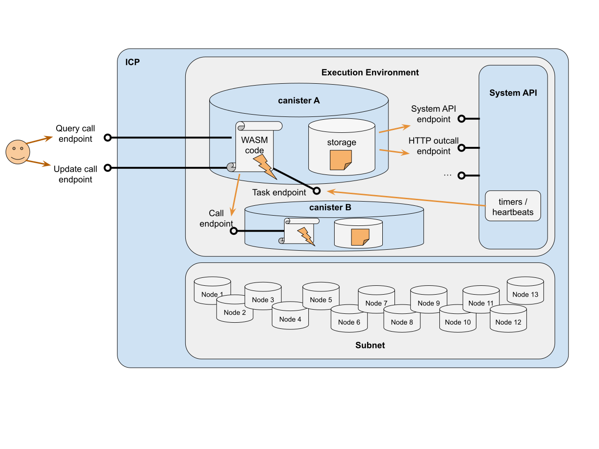

import { MarkdownChipRow } from "/src/components/Chip/MarkdownChipRow";

# Paying for resources in cycles

<MarkdownChipRow labels={["Beginner", "Concept"]} />

## Overview

Canister smart contracts pay for consumed resources (storage, messaging, execution, and special features) by burning **cycles**. Developers can obtain cycles by converting ICP tokens into cycles using [`dfx`](/docs/current/developer-docs/defi/cycles/converting_icp_tokens_into_cycles).

For pricing estimations, you can use the [pricing calculator](/docs/current/developer-docs/cost-estimations-and-examples). 

This page will provide details about how costs are calculated.

## The reverse gas model

ICP charges each canister smart contract for the resources that it consumes. It's the developer's responsibility to load each of their canisters with adequate cycles to pay for these resources. This cost model is known as ICP's **reverse gas model**.

The reverse gas model allows dapp developers to provide their users a smooth experience, since end users don't need to obtain tokens, configure wallets, or sign and approve every transaction they perform when interacting with a dapp on ICP.

You can learn more about the [reverse gas model](https://internetcomputer.org/capabilities/reverse-gas).

One downside of the ICP reverse gas model is that it requires prerequisite steps and ongoing maintenance for developers. Canisters must have their cycles balances maintained and regularly topped up as they continuously use resources. The canister will be removed from the network if it runs out of cycles.

Learn how to query a [canister's cycles balance](/docs/current/developer-docs/smart-contracts/topping-up/topping-up-canister#checking-the-cycles-balance-of-a-canister).

Learn how to [top up a canister](/docs/current/developer-docs/smart-contracts/topping-up/topping-up-canister).

A [freezing threshold](/docs/current/developer-docs/smart-contracts/maintain/settings/#freezing-threshold) can be set that pauses a canister's executions if the cycles amount is expected to fall below a certain amount. There are several community tools that have been developed to automate managing a canister's cycles, such as [CycleOps](https://cycleops.dev/).

## Units and fiat value

The price of cycles is fixed against the price of [XDR](/docs/current/references/glossary#xdr), where **1 trillion cycles equals 1 XDR**. As of December 18, 2023, the exchange rate for 1 XDR = $1.336610. The exchange rate for USD/XDR may vary. Learn more about [XDR exchange rates](https://www.imf.org/external/np/fin/data/rms_sdrv.aspx).

The following table shows units of cycles and the respective fiat values:

| Abbreviation  | Name      | In numbers   | Cycles XDR value  | Cycles USD value |
|-------------- | --------- | ------------ | ----------------- | ---------------- |
| T             | Trillion  | 1_000_000_000_000 | 1            | 1.336610         |
| B             | Billion   | 1_000_000_000| 0.001             | 0.001336610      |
| M             | Million   | 1_000_000    | 0.000001          | 0.000001336610   |
| k             | Thousand  | 1_000        | 0.000000001       | 0.000000001336610 |

## Replication

When a canister is deployed to a subnet, it is automatically replicated on every node within that subnet. The amount of cycles that a canister is charged will vary based on the amount of times the canister is replicated:

- Canisters deployed **locally** are deployed on a single node and therefore are replicated once. Cycles charged to locally deployed canisters have a cost that is `1 / 13` the cost when deployed to a 13-node subnet. In local development environments, cycles can be fabricated using `dfx`.

- Canisters deployed to a **13-node subnet** are replicated 13 times. Cycle cost amounts are based on a 13-node subnet, i.e., there is no calculation needed to determine the cost based on the subnet's replication factor.

- Canisters deployed to a **34-node subnet** are replicated 34 times. If you intend to deploy canisters on high-replication subnets (greater than 13 nodes), your canister should be prepared for an increase in cycles prices. Calls made to high-replication subnets will also require more cycles. Cycles costs on 34-node subnets can be calculated as `cost / 13 * 34`.

## Cost details: canister operations and resources

Canisters are charged for the resources they consume and any operations they perform using features such as HTTPS outcalls, threshold signatures, and the Bitcoin integration API. At a high level this can be visualized using the following diagram:

Each type of canister operation and resource has a different cycles cost associated with it. The canister responsible for paying the cycles varies based on the type of operation.

The following subsections explain the pricing for the different operation and resource types for a canister deployed on a 13 node subnet. The same operations and resources cost linearly more on subnets with more nodes.

### Canister creation

Canister creation costs 500B cycles or approximately $0.65 USD. Canisters can be created by users or other canisters.

### Messaging

A canister can receive messages from users and other canisters. In canister-to-canister messages, the sending canister pays the message transmission costs. In user-to-canister messages, the receiving canister covers the message transmission costs. User-to-canister messages are also referred to as **ingress messages**.

The current fees are:

| Message type | Base fee | Per byte fee |
|--------------|----------|--------------|
| Query call    | 0       |  0           |
| Canister-to-canister | 260K | 1K |
| User-to-canister (ingress) | 1.2M | 2K |

[View the cost calculation formula for more information about how costs are calculated](#cost-calculation-formulas).

:::info
Note that query messages are currently free, but this may change in the future.
:::

### Execution and compute allocation

To handle an incoming message or task such as a timer or heartbeat, the canister executes the function specified in the message.

ICP reserves cycles to execute the message's response callback or cleanup. The amount reserved is equivalent to the amount that would be needed for maximum execution. For example, a DTS execution of 40B instructions on a 13-node subnet would reserve 16B cycles. From this reservation, 5% is reserved for the cleanup callback. The cleanup callback can hit the 5% limit, though it is not expected.

By default, canisters are scheduled for execution in a "best-effort" manner. Canisters that require guaranteed execution can get a share of compute capacity by setting `compute_allocation` in their canister settings. Compute allocation is expressed in percents and denotes the percentage of an execution core reserved for the canister.

Setting even 1% compute allocation provides a significant advantage over canisters that use the "best-effort" scheduling:

- For 1% compute allocation, the canister will receive 1% of an execution core and is guaranteed to be scheduled every 100 rounds (assuming it executes only non-DTS messages).

- For 2% compute allocation, the canister will receive 2% of an execution core and is guaranteed to be scheduled every 50 rounds.

- For 50% compute allocation, the canister will receive 50% of an execution core and is guaranteed to be scheduled every other round.

- For 100% compute allocation, the canister will receive 100% of an execution core and is guaranteed to be scheduled every round.

The allocatable compute capacity is 299% **per subnet**. Compute allocation is guaranteed if it is configured.

Compute is a finite resource and is priced as such. The current fee for 1% compute allocation per second is 10M cycles (or $0.0000133661 USD). Therefore, a canister that requests 100% compute allocation would be charged 10M * 100 cycles per second.

[View the cost calculation formula for more information about how costs are calculated](#cost-calculation-formulas).

### Storage
Canisters pay for storage consumed by their [Wasm memory](/docs/current/developer-docs/smart-contracts/maintain/storage#heap-memory) and [stable memory](/docs/current/developer-docs/smart-contracts/maintain/storage#stable-memory) per time. Storing 1 GiB for 1 second costs 127k cycles, which amounts to ~4T cycles (or $5.35 USD) for storing 1 GiB for 1 year.

Canisters can reserve storage on a subnet through the `memory_allocation` setting. However, the canister will be charged as if the entire amount of allocated storage is being used.

#### Resource reservation mechanism

In order to encourage long-term usage and discourage spiky usage patterns, the Internet Computer uses a *resource reservation mechanism* that was adopted by the community in [NNS proposal 12604](https://dashboard.internetcomputer.org/proposal/126094).

When a canister allocates new storage bytes, the system sets aside some number of cycles from the main balance of the canister that are used to cover future payments for the newly allocated bytes. The reserved cycles are not transferable, and the number of reserved cycles depends on how full the subnet is. It may cover days, months, or even years of payments.

The operations that allocate new bytes are:

- Wasm instruction: `memory.grow`.
- System API calls: `ic0.stable_grow()` `ic0.stable64_grow()`.
- Increasing the `memory_allocation` in canister settings.

These operations reserve some cycles by moving them from the main balance of the canister to the reserved cycles balance.
The amount of reserved cycles depends on how many bytes are allocated and on the current subnet usage.

- If subnet usage is below `450GiB`, then the amount of reserved cycles per allocated byte is `0`.
- If subnet usage is above `450GiB`, then the amount of reserved cycles per allocated byte grows linearly depending on the subnet usage, from `0` to `10` years worth of storage payments at the subnet capacity (which is currently `1TiB`).

A controller of a canister can disable resource reservation by setting the `reserved_cycles_limit=0` in canister settings.
Such opted-out canisters would not be able to allocate if the subnet usage is above `450GiB`.

### Special features

Special features have different costs since they use special infrastructure to provide the feature's functionality. These special features include:

- **HTTPS outcalls**: These costs are included in the chart found below. [View the cost calculation formula for more information about how this cost is calculated](#cost-calculation-formulas).

- **Bitcoin API**: Pricing for the **Bitcoin API** is available in the [Bitcoin API documentation](/docs/current/references/bitcoin-how-it-works).

- **Chain-key signing API**: Pricing for the **threshold signatures**, such as threshold ECDSA and threshold Schnorr, is available in the [threshold signatures documentation](/docs/current/references/t-sigs-how-it-works/).

- **EVM RPC** Pricing for the **EVM RPC** canister is available in the [EVM RPC canister documentation](/docs/current/developer-docs/multi-chain/ethereum/overview).

## Who is responsible for paying cycles?

Canisters are responsible for paying cycles for their own canister creation, compute resources, storage resources, and execution resources. For certain canister calls, the canister responsible for paying the cycles may vary.

- **Ingress messages**: The receiving canister is responsible for paying.
- **Inter-canister calls**: Each canister pays for the calls that it sends.
- **Local processing**: Each canister pays for local processing.
- **Child canisters**: Responsible for paying for themselves.

## Cycles price breakdown

The table below details the cost of compute, storage transmissions and canister calls.

You can use the [pricing calculator](https://3d5wy-5aaaa-aaaag-qkhsq-cai.icp0.io/) to estimate the cost for your dapp.

| Canister transmission | Description | Who is responsible for paying the cycles fee? | 13-node subnets cycles cost | 13-node subnets USD cost | 34-node subnets | 34-node subnets USD cost |
| ----------------- | ------------------------------- | -------------------------------------------------- | ----------------------------------------------- | --------------------------------------- | ------------------------------------- | --------------------------- | ------------------------------------ |
| Query call|         | Query information from a canister. | N/A | Free |  Free | Free | Free |
| Canister creation | For creating canisters on a subnet. | Created canister | 500B | $0.668305000000 | 500B / 13 * 34 | $1.74787461538 |
| Compute percent allocated per second | For each percent of the reserved compute allocation (a scarce resource). | Canister with allocation | 10M | $0.000013366100 | 10M / 13 * 34 | $0.000034957492 |
| Update message execution | For every update message executed. | Target canister | 5M | $0.000006683050 | 5M / 13 * 34 | $0.000017478740 |
| 1B executed instructions | For every 1B instructions executed when executing update type messages. | Canister executing instructions | 1B | $0.001336610000 | 1B / 13 * 34 | $0.003495749230 |
| Xnet call | For every inter-canister call performed (includes the cost for sending the request and receiving the response). | Sending canister | 260K | $0.000000347519 | 260K / 13 * 34 | $0.000000908895 |
| Xnet byte transmission | For every byte sent in an inter-canister call (for bytes sent in the request and response). | Sending canister | 1K | $0.000000001337 | 1K / 13 * 34 | $0.000000003496 |
| Ingress message reception | For every ingress message received. | Receiving canister | 1.2M | $0.000001603932 | 1.2M / 13 * 34 | $0.000004194899 |
| Ingress byte reception | For every byte received in an ingress message. | Receiving canister | 2K | $0.000000002673 | 2K / 13 * 34 | $0.000000006991 |
| GiB storage per second | For storing a GiB of data per second. | Canister with storage | 127K | $0.000000169749 | 127K / 13 * 34 | $0.000000443960 |
| | | | | | | | |
| _HTTPS outcalls_ | | | | | | | |
| HTTPS outcall (per call) | For sending an HTTPS outcall to a server outside the IC, per message (`http_request`). | Sending canister | 49_140_000 | $0.000065681015 | 171_360_000 | $0.000229041490 |
| HTTPS outcall request message size (per byte) | For sending an HTTPS outcall to a server outside the IC, per request byte (`http_request`). | Sending canister | 5_200 | $0.000000006950 | 13_600 | $0.000000018178 |
| HTTPS outcall response message size (per byte) | For sending an HTTPS outcall to a server outside the IC, per reserved response byte (`http_request`). | Sending canister | 10_400 | $0.000000013901 | 27_200 | $0.000000036356 |

The following table shows the calculated storage cost per GiB for a 30-day month:

| | | 13-node subnets | 34-node subnets |
|----------------------|------------------------------------|-----------------------------|-----------------------------|
| GiB Storage Per Month | For storing a GiB of data per month | $0.446150495 | $1.70 |

## Cost calculation formulas

A detailed, mathematical example of how the cost of running a canister on a 13-node subnet is computed can be found [on the wiki](https://wiki.internetcomputer.org/wiki/Comparing_Canister_Cycles_vs_Performance_Counter).

Specific mathematical formulas used for different types of costs can be found below for reference.

### Message transmissions

A fixed baseline fee and per-byte-fee charged for each byte of the message: `base-fee` + `per-byte-fee` * `size-in-bytes`.

### Execution

The execution cost consists of a fixed execution fee and per-instruction fee (on application subnets (13 nodes), 10 instructions cost 4 cycles) that is charged for each executed WebAssembly instruction:

`base-fee` + `per-instruction-fee` * `number-of-instructions`

The current values of fees are `base-fee` = 5M cycles (or $0.00000668305 USD), `per-instruction-fee` = 1 cycle (or $0.01325 USD for 1B instructions).

### HTTPS outcalls

The cost for an HTTPS outcall is calculated using the formula `(3_000_000 + 60_000 * n) * n` for the base fee and `400 * n` each request byte and `800 * n` for each response byte, where `n` is the number of nodes in the subnet.

## Errors related to cycles

Common errors related to cycles include:

- [Insufficient cycles in memory grow](/docs/current/references/execution-errors#insufficient-cycles-in-memory-grow).
- [Reserved cycles limit exceeded in memory grow](/docs/current/references/execution-errors#reserved-cycles-limit-exceeded-in-memory-grow).
- [Insufficient cycles in message memory grow](/docs/current/references/execution-errors#insufficient-cycles-in-message-memory-grow).
- [Insufficient cycles in compute allocation](/docs/current/references/execution-errors#insufficient-cycles-in-compute-allocation).
- [Insufficient cycles in memory allocation](/docs/current/references/execution-errors#insufficient-cycles-in-memory-allocation).
- [Insufficient cycles in memory grow](/docs/current/references/execution-errors#insufficient-cycles-in-memory-grow-1).
- [Reserved cycles limit exceeded in memory allocation](/docs/current/references/execution-errors#reserved-cycles-limit-exceeded-in-memory-allocation).
- [Install code not enough cycles](/docs/current/references/execution-errors#install-code-not-enough-cycles).
- [Create canister not enough cycles](/docs/current/references/execution-errors#create-canister-not-enough-cycles).

## Further readings

Monitoring cycles usage
   - [Check your canister's cycles balance](/docs/current/developer-docs/defi/cycles/cycles-wallet#check-the-cycle-balance).
   - [Monitor your canister's cycles usage](/docs/current/developer-docs/smart-contracts/topping-up/cycles_management_services).
   - [Motoko cycles management library](https://github.com/CycleOperators/cycles-manager).

Getting cycles back from a canister
   - To withdraw cycles from a canister, the [canister must be deleted](/docs/current/tutorials/developer-journey/level-1/1.6-managing-canisters#getting-cycles-back-from-a-canister).

Topping up canisters
   - [Top up your canisters](docs/current/developer-docs/smart-contracts/topping-up/topping-up-canister).
   - [Cycles management services](/docs/current/developer-docs/smart-contracts/topping-up/cycles_management_services).
   - [Cycle.express](https://cycle.express/).

Counting instructions
   - [Motoko function `countInstructions`](/docs/current/motoko/main/base/ExperimentalInternetComputer#function-countinstructions).
   - [IC interface specification](/docs/current/references/ic-interface-spec#system-api-performance-counter).

